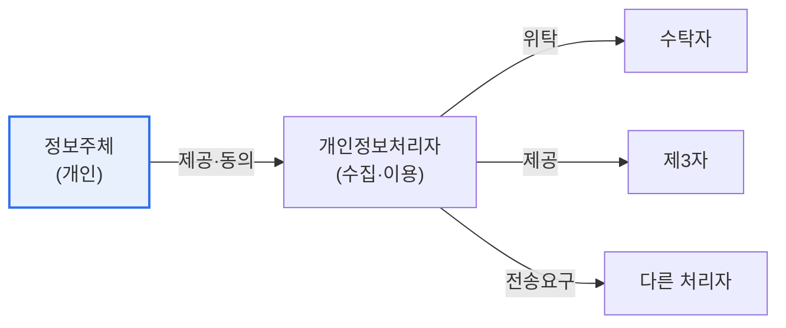

# 개인정보보호법 개정안 (2023)

## 1. 개요

### 가. 배경
> 2023년 3월 공포된 개인정보보호법 개정으로, **데이터 경제 활성화와 정보주체 권리 강화**를 동시에 도모했다. 온·오프라인 규제 일원화, 전송요구권 도입, 자동화 의사결정 대응권 신설 등이 핵심이다.

이 개정의 방향은 '**활용은 넓히되 권리는 두텁게**'이다. 마이데이터·AI 확산에 맞춰 데이터 이동·활용의 길을 열면서, 동시에 정보주체가 자기 정보에 대한 통제권을 실질적으로 행사하도록 새로운 권리를 부여했다.

## 2. 주요 내용 (1)

| 구분 | 내용 |
|---|---|
| **규제 일원화** | 온·오프라인 이원화(정보통신망법 특례) 규정을 개인정보보호법으로 통합 |
| **전송요구권** | 정보주체가 개인정보의 제3자·본인 전송을 요구(마이데이터 근거) |
| **자동화 의사결정 대응권** | AI 자동결정에 대한 거부·설명 요구권 |
| **동의 합리화** | 명확한 동의, 필수·선택 동의 구분 |
| **과징금 강화** | 매출액 기반 과징금 등 제재 강화 |

## 3. 개인정보 처리 주체와 흐름 (2)

| 주체 | 역할 |
|---|---|
| **정보주체** | 개인정보의 주인, 권리 행사 |
| **개인정보처리자** | 수집·이용·관리 주체 |
| **수탁자** | 처리 위탁받은 자 |
| **제3자** | 제공받는 자 |

## 4. 전송요구권과 자동화 의사결정 대응권 (3)

| 권리 | 내용 |
|---|---|
| **전송요구권** | 본인 개인정보를 본인·제3자에게 전송하도록 요구(데이터 이동성, 마이데이터) |
| **자동화 의사결정 대응권** | AI 등 완전 자동화 처리로 내려진 결정에 대해 **거부·설명 요구** 가능 |

## 5. 시사점
- 마이데이터 확산의 법적 기반(전송요구권) — 데이터 이동·활용 촉진
- AI 자동결정에 **인간의 개입·설명 요구**로 알고리즘 책임성 강화
- 기업은 동의·전송·자동결정 대응 체계 정비 필요

---

> **한 줄 요약**: 2023 개인정보보호법 개정은 *규제 일원화, 전송요구권(마이데이터), 자동화 의사결정 대응권, 제재 강화* 를 통해 데이터 활용과 정보주체 권리를 함께 강화했다.
