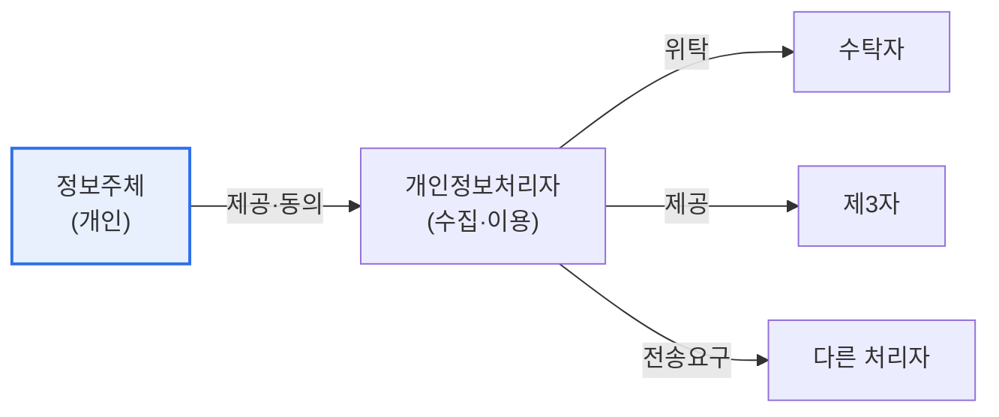

# 개인정보보호법 개정안 (2023)

## 1. 개요

### 가. 배경
> 2023년 개정된 개인정보보호법은 **데이터 경제 활성화와 정보주체 권리 강화를 동시에** 도모했다. 온·오프라인으로 이원화되어 있던 규제를 일원화하고, 전송요구권과 자동화 의사결정 대응권을 새로 도입한 것이 핵심이다.

이 개정의 방향은 '**활용은 넓히되 권리는 두텁게**'로 요약된다. 마이데이터·AI가 확산되며 데이터를 안전하게 이동·활용할 길을 열어달라는 산업적 요구와, 내 정보에 대한 통제권을 실질적으로 행사하고 싶다는 시민의 요구가 함께 커졌다. 개정법은 이 두 요구에 응해, 한편으로 데이터 전송·활용의 제도적 기반을 마련하면서 다른 한편으로 정보주체에게 전송요구권·자동화 의사결정 대응권이라는 새로운 권리를 부여했다. 특히 AI가 사람의 개입 없이 채용·대출을 결정하는 시대에, 그 결정에 이의를 제기하고 설명을 요구할 권리를 명문화한 점이 의미가 크다.

### 나. 필요성
정보통신망법에 흩어져 있던 개인정보 규정을 개인정보보호법으로 통합해 혼선을 줄이고, 급변하는 데이터·AI 환경에 맞춰 정보주체 보호 수단을 현대화할 필요가 있었다.

## 2. 주요 내용

| 구분 | 내용 |
|---|---|
| **규제 일원화** | 온·오프라인 이원화(정보통신망법 특례) 규정을 개인정보보호법으로 통합 |
| **전송요구권** | 정보주체가 개인정보를 본인·제3자에게 전송 요구(마이데이터 근거) |
| **자동화 의사결정 대응권** | AI 자동결정에 대한 거부·설명 요구권 신설 |
| **동의 합리화** | 명확한 동의, 필수·선택 동의 구분 |
| **제재 강화** | 매출액 기반 과징금 등 제재 강화 |

규제 일원화는 사업자의 혼선을 줄이고, 전송요구권은 마이데이터 산업의 법적 근거가 되며, 자동화 의사결정 대응권은 AI 시대 정보주체 보호의 핵심 장치다. 제재를 매출 기반 과징금으로 강화한 것은 개인정보 보호의 실효성을 높이려는 취지다.

## 3. 개인정보 처리 주체와 흐름

개인정보는 여러 주체 사이를 흐른다. **정보주체** 는 개인정보의 주인으로 동의·권리 행사의 주체이고, **개인정보처리자** 는 이를 수집·이용·관리한다. 처리자는 업무를 **수탁자** 에게 위탁하거나 **제3자** 에게 제공할 수 있으며, 개정법으로 정보주체의 요구에 따라 **다른 처리자에게 전송** 해야 하는 흐름이 추가되었다.

| 주체 | 역할 |
|---|---|
| **정보주체** | 개인정보의 주인, 권리 행사 |
| **개인정보처리자** | 수집·이용·관리 주체 |
| **수탁자** | 처리 위탁받은 자 |
| **제3자** | 제공받는 자 |

## 4. 전송요구권과 자동화 의사결정 대응권

두 신설 권리는 개정의 핵심이다. **전송요구권** 은 정보주체가 자기 개인정보를 본인이나 지정한 제3자(다른 기업)에게 전송하도록 요구할 수 있는 권리로, 데이터 이동성을 보장해 마이데이터 서비스를 가능케 한다. **자동화 의사결정 대응권** 은 AI 등 완전히 자동화된 처리로 내려진 결정(예: AI 신용평가 거절)에 대해 정보주체가 **거부하거나 설명을 요구** 할 수 있는 권리로, 알고리즘의 책임성과 인간 개입을 제도화한다.

| 권리 | 내용 |
|---|---|
| **전송요구권** | 본인 개인정보를 본인·제3자에게 전송 요구(마이데이터) |
| **자동화 의사결정 대응권** | 완전 자동화 결정에 대한 거부·설명 요구 |

## 5. 고려사항 및 시사점

1. **마이데이터 확산의 법적 기반**이 마련되었다. 전송요구권으로 개인이 자기 데이터를 여러 서비스로 옮길 수 있게 되어, 데이터 이동·활용 기반 신산업이 촉진된다.
2. **AI 자동결정에 인간의 개입·설명을 요구**할 수 있게 되어 알고리즘 책임성이 강화되었다. 기업은 AI 의사결정의 근거를 설명할 수 있는 체계(XAI)를 갖춰야 한다.
3. **기업의 대응 체계 정비가 필요**하다. 동의 방식, 전송요구 처리 절차, 자동화 의사결정 대응 프로세스를 새로 갖추고, 강화된 과징금에 대비해 개인정보 보호 수준을 높여야 한다.

---

> **한 줄 요약**: 2023 개인정보보호법 개정은 *규제 일원화, 전송요구권(마이데이터), 자동화 의사결정 대응권, 제재 강화* 를 통해 데이터 활용과 정보주체 권리를 함께 강화했으며, 기업은 전송·자동결정 대응 체계를 정비해야 한다.
