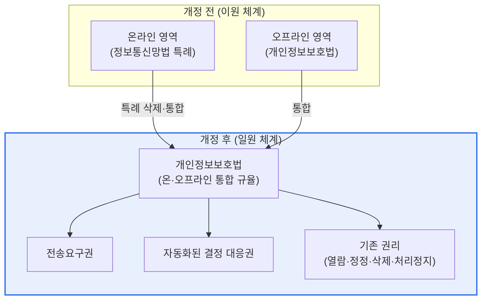
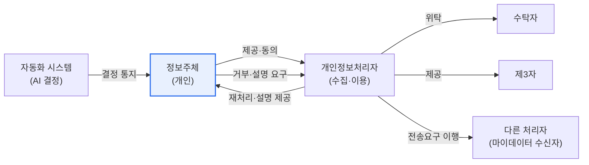

# 개인정보보호법 개정안 (2023)

## 1. 개요

### 가. 정의
> **2023년 개정 개인정보보호법**은 2023년 3월 14일 공포되어 원칙적으로 같은 해 9월 15일부터 시행된 전면 개정 법률로, 온·오프라인으로 이원화되어 있던 규제를 하나로 일원화하고 **개인정보 전송요구권**과 **자동화된 결정에 대한 정보주체의 권리**를 새로 도입하여, *데이터 경제 활성화와 정보주체 권리 강화를 동시에* 도모한 것을 핵심으로 한다.

정의만으로는 이 개정의 무게가 잘 드러나지 않는다. 2011년 제정 이후 개인정보보호법은 여러 차례 손질되었지만, 온라인 영역은 정보통신망법의 특례 규정이, 오프라인 영역은 개인정보보호법이 각각 규율하는 이원 체계가 오래 유지되었다. 같은 '개인정보 유출'이라도 온라인 사업자와 오프라인 사업자에게 적용되는 조문·과징금·절차가 달라 수범자 입장에서 혼선이 컸다. 2020년 이른바 '데이터 3법' 개정으로 정보통신망법의 개인정보 조항 상당 부분이 개인정보보호법으로 넘어왔지만 특례라는 형태로 잔존했고, 2023년 개정은 이 특례를 삭제해 **하나의 법으로 일관되게 규율**하는 체계를 완성했다.

### 나. 등장 배경 및 필요성
개정의 방향은 '**활용은 넓히되 권리는 두텁게**'로 요약된다. 배경에는 상충하는 듯 보이는 두 요구가 함께 있었다. 첫째는 **산업적 요구**다. 마이데이터·인공지능·플랫폼 경제가 확산되면서 흩어진 개인데이터를 본인의 통제 아래 안전하게 이동·결합·활용할 제도적 통로를 열어달라는 목소리가 커졌다. 데이터가 특정 기업에 갇혀 있으면 후발 사업자의 혁신이 막히고, 정보주체도 자신에게 유리한 서비스로 갈아탈 수 없다.

둘째는 **시민적 요구**다. 내 정보가 어디서 어떻게 쓰이는지 알기 어렵고, 특히 인공지능이 사람의 개입 없이 채용·대출·보험 인수를 결정하는 시대에 그 결정에 대해 아무런 이의도 제기할 수 없다는 문제의식이 커졌다. 유럽연합의 GDPR이 2018년 시행되며 전송요구권(데이터 이동권)과 자동화 처리에 대한 권리를 이미 명문화한 것도 국내 입법에 직접적인 자극이 되었다.

이 두 요구를 하나의 법에 담으려면 규율 체계 자체를 재정비할 필요가 있었다. 즉 규제를 일원화해 예측 가능성을 높이는 동시에, 정보주체에게 데이터 활용의 과실을 되돌려줄 새로운 권리를 부여하는 것이 개정의 필연적 귀결이었다. 정보주체 보호 없는 활용은 신뢰를 잃고, 활용 기반 없는 보호는 산업을 위축시키기 때문에 둘은 분리될 수 없다.

### 다. 개정의 기본 특징
개정법은 ① 규제 체계의 **통합(일원화)**, ② 정보주체 권리의 **확장(전송요구권·자동화결정 대응권)**, ③ 데이터 활용 근거의 **합리화(계약 이행 등)**, ④ 위반에 대한 **제재의 실효성 강화(전체 매출액 기반 과징금)** 라는 네 축으로 구성된다. 뒤에서 각 축을 산문으로 상술한다.

## 2. 개정 전후 규율 체계의 변화

먼저 규율 구조가 어떻게 바뀌었는지 전체 구조를 조망한다. 아래 그림은 개정 전 이원 체계가 개정 후 일원 체계로 통합되는 모습과, 정보주체에게 부여된 권리군을 함께 표현한 것이다.

```mermaid
flowchart TB
  subgraph BEFORE["개정 전 (이원 체계)"]
    ON["온라인 영역<br/>(정보통신망법 특례)"]
    OFF["오프라인 영역<br/>(개인정보보호법)"]
  end
  subgraph AFTER["개정 후 (일원 체계)"]
    PIPA["개인정보보호법<br/>(온·오프라인 통합 규율)"]
    R1["전송요구권"]
    R2["자동화된 결정 대응권"]
    R3["기존 권리<br/>(열람·정정·삭제·처리정지)"]
    PIPA --> R1
    PIPA --> R2
    PIPA --> R3
  end
  ON -->|특례 삭제·통합| PIPA
  OFF -->|통합| PIPA
  style AFTER fill:#e8f0fe,stroke:#2f6fed,stroke-width:2px
```

개정 전에는 동일한 개인정보 처리라도 사업자가 '정보통신서비스 제공자'인지 여부에 따라 근거 조문과 제재 수위가 갈렸다. 개정 후에는 개인정보보호법이라는 단일 법률이 모든 처리자를 일관되게 규율하며, 정보주체는 기존의 열람·정정·삭제·처리정지 요구권에 더해 전송요구권과 자동화된 결정에 대한 대응권까지 행사할 수 있게 되었다. 규제의 예측 가능성이 높아지는 동시에 권리의 목록이 넓어진 것이 핵심 변화다.

| 구분 | 개정 전 | 개정 후 |
|---|---|---|
| **규율 체계** | 온·오프라인 이원(망법 특례 잔존) | 개인정보보호법으로 일원화 |
| **정보주체 권리** | 열람·정정·삭제·처리정지 | + 전송요구권, 자동화결정 대응권 |
| **수집·이용 근거** | 동의 중심 | 계약 이행 등 근거 합리화·명확화 |
| **영상기기** | 고정형 CCTV 중심 | 이동형 영상기기(드론 등) 기준 신설 |
| **과징금 기준** | 위반 관련 매출액 중심 | 전체 매출액의 일정 비율(위반무관 매출 제외) |

## 3. 주요 개정 내용 상세

### 가. 온·오프라인 규제의 일원화
규제 일원화는 겉보기에는 조문 정리에 불과해 보이지만 실무적 의미가 크다. 과거에는 같은 유출 사고라도 온라인 사업자에게는 정보통신망법 특례상의 과징금·통지·신고 규정이, 오프라인 사업자에게는 개인정보보호법 규정이 각각 적용되어 형평성 논란과 해석 다툼이 잦았다. 특례 삭제로 이 경계가 사라지면서 **동일 행위·동일 규율** 원칙이 확립되었다.

수범자 관점에서는 참조해야 할 법령이 하나로 줄어 컴플라이언스 부담이 낮아진다. 다만 그동안 상대적으로 느슨하게 적용받던 오프라인 사업자에게는 온라인 수준의 강화된 기준이 확대 적용되는 효과도 있어, 실질적 규율 강도는 오히려 높아진 영역도 있다. 따라서 '일원화=완화'가 아니라 '일원화=기준의 상향 평준화'로 이해하는 것이 정확하다.

일원화는 이후 도입된 새 권리들이 온·오프라인 구분 없이 동일하게 작동하기 위한 토대이기도 하다. 전송요구권과 자동화결정 대응권이 특정 채널에만 적용된다면 실효성이 떨어지는데, 단일 법 체계가 이를 방지한다.

### 나. 개인정보 전송요구권
전송요구권(제35조의2)은 정보주체가 자신의 개인정보를 **본인 또는 본인이 지정한 제3자(다른 개인정보처리자)에게 전송하도록 요구**할 수 있는 권리다. 이는 마이데이터 서비스의 일반법적 근거로, 그동안 금융 분야에서 신용정보법에 근거해 제한적으로 시행되던 마이데이터를 전 분야로 확장하는 출발점이 된다.

이 권리의 핵심은 '데이터 이동성(portability)'이다. 정보주체가 A 사업자에 축적된 자기 정보를 B 사업자로 옮길 수 있으면, 잠금효과(lock-in)가 완화되고 사업자 간 경쟁이 촉진되며, 정보주체는 여러 곳에 흩어진 데이터를 한곳에 모아 통합 자산관리·건강관리 같은 새로운 서비스를 누릴 수 있다. 예컨대 여러 은행·카드·보험에 흩어진 금융정보를 한 앱으로 모아 맞춤형 재무 조언을 받는 서비스가 대표적이다.

다만 전송요구권은 공포와 동시에 곧바로 전면 시행되지 못했다. 전송 대상 정보의 범위, 표준 응용프로그램 인터페이스(API), 전송 중개기관, 보안 요건 등을 정하는 시행령·고시 정비가 선행되어야 하기 때문에 **분야별로 순차 시행**되는 방식을 택했다. 실제로 보건의료·통신 등 일부 분야가 먼저 시행 시점을 확정하고 에너지 등 다른 분야는 준비 기간을 두는 식으로 단계적으로 확대되고 있어(세부 시점은 시행령 개정에 따라 변동될 수 있다), 답안에서는 '일반법적 근거 신설 후 분야별 단계 시행'이라는 구조로 기술하는 것이 안전하다.

### 다. 자동화된 결정에 대한 정보주체의 권리
자동화된 결정에 대한 권리(제37조의2)는 공포 후 1년이 지난 **2024년 3월 15일부터 시행**되었다. 이는 **완전히 자동화된 시스템**(인공지능 기술을 적용한 시스템 포함)에 의한 처리만으로 정보주체의 권리·의무에 **중대한 영향**을 미치는 결정이 내려지는 경우, 정보주체가 그 결정을 **거부**하거나 그에 대한 **설명·검토를 요구**할 수 있도록 한 제도다.

이 권리는 크게 세 갈래로 작동한다. 첫째, **거부권**은 사람의 개입 없이 내려진 결정을 정보주체가 거부하고 사람에 의한 재처리를 요구할 수 있게 한다. 둘째, **설명요구권**은 결정의 기준과 처리 과정 등에 대한 설명을 요구할 수 있게 한다. 셋째, 정보주체가 자신에게 유리한 정보를 추가로 제출하고 이를 결정에 반영할지 **검토를 요구**할 수 있다. 예를 들어 인공지능 신용평가로 대출이 거절된 소비자가 그 근거 설명을 요구하고, 누락된 소득 자료를 제출해 재심사를 요청하는 장면을 떠올리면 된다.

주의할 점은 이 권리가 무제한이 아니라는 것이다. 계약 체결·이행에 필요하거나 정보주체가 별도 동의한 경우 등에는 거부권 행사가 제한될 수 있고, 그 경우에도 설명·검토 요구권은 보장하는 방식으로 이익 균형을 맞춘다. 또한 '완전히 자동화된' 처리에 한정되므로, 사람이 실질적으로 개입·검토하는 결정은 원칙적으로 대상이 아니다. 기업 입장에서는 어떤 결정이 이 조항의 적용 대상인지 스스로 분류하고, 설명 가능한 인공지능(XAI) 역량과 이의처리 절차를 갖추는 것이 과제가 된다.

### 라. 수집·이용 근거의 합리화와 이동형 영상정보처리기기
개정법은 개인정보 수집·이용의 법적 근거도 정비했다. 과거 실무는 사실상 '동의 만능주의'에 가까워, 계약 이행에 당연히 필요한 정보까지 별도 동의를 받는 관행이 형식적 동의를 양산했다. 개정법은 **계약의 체결·이행에 필요한 경우** 등 동의 이외의 처리 근거를 명확히 하여, 꼭 필요한 곳에 실질적 동의를 집중시키는 방향으로 합리화했다. 이는 '동의 피로'를 줄이고 동의의 진정성을 높이려는 취지다.

또한 드론·자율주행차·웨어러블처럼 **이동하며 영상을 촬영하는 기기**의 확산에 대응해, 고정형 CCTV 중심이던 규정을 넘어 **이동형 영상정보처리기기**의 운영 기준을 신설했다. 업무 목적의 촬영 시 불빛·소리·안내판 등으로 촬영 사실을 표시하도록 하는 등, 공개된 장소에서의 촬영과 정보주체의 인식 가능성 사이의 균형을 제도화했다. 신기술이 만들어낸 공백을 법이 뒤따라 메운 사례로, 기술 변화에 대한 입법적 대응의 전형을 보여준다.

이 두 변화는 방향이 상반되어 보이지만 실은 하나의 원리를 공유한다. 수집·이용 근거 합리화는 '형식적 동의를 줄여 실질을 살리는' 방향이고, 이동형 영상기기 규정은 '새로운 촬영 수단에도 인식 가능성을 보장하는' 방향이다. 둘 다 '동의라는 형식'이 아니라 '정보주체의 실질적 인식과 통제'를 보호의 중심에 둔다는 점에서 개정법의 일관된 철학을 드러낸다.

이러한 철학은 실무에서 '동의 관리(consent management)' 체계의 재설계로 이어진다. 무분별한 동의 요구를 줄이는 대신, 꼭 필요한 처리에 대해서는 더 명확하고 이해하기 쉬운 방식으로 동의를 받고 그 이력을 관리해야 한다. 필수·선택 동의를 구분하고, 선택 동의를 거부해도 서비스 이용에 불이익이 없도록 설계하는 것이 개정 취지에 부합한다.

### 마. 제재의 실효성 강화
개정법은 과징금 산정 기준을 **전체 매출액**을 기준으로 상향했다. 과거에는 '위반행위와 관련된 매출액'을 기준으로 삼아 실제 부과액이 위반의 중대성에 비해 작다는 비판이 있었다. 개정법은 원칙적으로 전체 매출액의 일정 비율을 상한으로 하되, **위반행위와 관련 없는 매출액은 제외**하도록 하여 과잉 제재를 방지하는 안전장치를 함께 두었다. 이 변화는 대규모 사업자가 개인정보 보호를 비용이 아닌 핵심 리스크로 인식하게 만드는 강력한 유인이 된다.

## 4. 개인정보 처리 주체와 데이터 흐름

권리가 실제로 작동하는 맥락을 이해하려면 개인정보가 주체 사이를 어떻게 흐르는지 보아야 한다. 아래는 처리 주체 간 흐름에 개정으로 추가된 전송·자동화결정 대응 흐름을 더한 세부도다.

```mermaid
flowchart LR
  S["정보주체<br/>(개인)"] -->|제공·동의| C["개인정보처리자<br/>(수집·이용)"]
  C -->|위탁| P["수탁자"]
  C -->|제공| T["제3자"]
  C -->|전송요구 이행| C2["다른 처리자<br/>(마이데이터 수신자)"]
  A["자동화 시스템<br/>(AI 결정)"] -->|결정 통지| S
  S -->|거부·설명 요구| C
  C -->|재처리·설명 제공| S
  style S fill:#e8f0fe,stroke:#2f6fed,stroke-width:2px
```

**정보주체**는 개인정보의 주인으로 동의와 권리 행사의 주체다. **개인정보처리자**는 이를 수집·이용·관리하며, 업무를 **수탁자**에게 위탁하거나 **제3자**에게 제공할 수 있다. 개정으로 두 흐름이 추가되었다. 하나는 정보주체의 전송요구에 따라 데이터가 **다른 처리자에게 이동**하는 흐름이고, 다른 하나는 자동화 시스템이 내린 결정을 정보주체가 **거부·설명 요구**하고 처리자가 이에 응답하는 순환 흐름이다. 즉 데이터가 일방향으로 흐르기만 하던 구조에서, 정보주체가 흐름의 방향과 결과에 개입할 수 있는 구조로 진화한 것이다.

| 주체 | 역할 |
|---|---|
| **정보주체** | 개인정보의 주인, 동의·권리 행사 |
| **개인정보처리자** | 수집·이용·관리, 전송·설명 의무 이행 |
| **수탁자** | 처리를 위탁받아 수행하는 자 |
| **제3자** | 제공받아 자신의 목적으로 처리하는 자 |
| **전송 수신자** | 전송요구로 데이터를 넘겨받는 다른 처리자 |

## 5. 해외 법제 비교 및 사례

개정법의 두 신설 권리는 유럽연합 GDPR의 영향을 강하게 받았다. GDPR은 제20조에서 데이터 이동권(right to data portability)을, 제22조에서 프로파일링을 포함한 자동화된 결정에 대한 권리를 규정한다. 우리 전송요구권·자동화결정 대응권은 이와 문제의식을 공유하지만, GDPR이 일반적·포괄적으로 규정한 반면 우리 법은 **분야별 시행령으로 구체화**하는 점진적 접근을 택했다는 차이가 있다.

제재의 강도도 비교할 만하다. GDPR은 심각한 위반에 대해 **전 세계 연간 총매출액의 4% 또는 2천만 유로 중 높은 금액**까지 과징금을 부과할 수 있다. 우리 개정법의 전체 매출액 기준 상향은 이러한 글로벌 기준에 보조를 맞춰 제재의 실효성을 확보하려는 흐름으로 볼 수 있다. 다만 우리 법은 '위반과 무관한 매출 제외'라는 완충 장치를 두어 비례성을 강조한 점이 특징이다.

국내 적용 사례로는, 금융권에서 신용정보법에 근거해 먼저 자리 잡은 마이데이터(본인신용정보관리업)가 전송요구권의 실증 모델 역할을 한다는 점을 들 수 있다. 수천만 명 규모의 이용자가 여러 금융기관 정보를 한 앱에서 조회·관리하는 경험이 축적되었고, 개정법은 이 모델을 의료·통신 등 비금융 분야로 확장하는 법적 발판이 된다.

한편 두 법제의 접근 차이는 시행 방식에서도 드러난다. GDPR이 회원국에 직접 적용되는 규정(Regulation) 형태로 권리를 일괄 규율하는 데 비해, 우리 법은 상위법에서 권리의 골격만 정하고 세부 요건을 하위 규범(시행령·고시)과 분야별 시행 시점에 위임하는 구조를 취한다. 이는 산업별 데이터 특성과 준비 정도를 반영해 충격을 분산할 수 있다는 장점이 있는 반면, 시행 시점과 적용 범위의 불확실성이 커져 기업이 대비 계획을 세우기 어렵다는 단점도 있다. 따라서 실무에서는 하위 규범의 입법예고·행정예고 동향을 지속적으로 추적하며 단계적으로 대응 체계를 갖추는 것이 현실적이다.

## 6. 심화: 최신 동향 및 예상 출제 방향

시행 이후 개인정보보호위원회는 하위 규범을 순차적으로 정비하고 있다. 자동화된 결정에 대해서는 시행령과 '자동화된 결정에 대한 조치 기준' 등 세부 지침이 마련되어, 어떤 결정이 '중대한 영향'에 해당하는지, 설명은 어느 수준까지 제공해야 하는지 등의 실무 기준이 구체화되고 있다. 전송요구권은 전 분야 마이데이터로 확장하기 위한 표준 API·중개기관·보안 요건을 담은 시행령 개정이 이어지며 분야별 시행 시점이 순차적으로 정해지고 있다.

출제 관점에서는 ① 전송요구권과 자동화결정 대응권의 **개념·요건·한계**를 각각 설명하게 하거나, ② GDPR과의 **비교**를 요구하거나, ③ 기업의 **대응 방안(동의 설계, 전송 처리 절차, XAI, 이의처리 체계)** 을 묻는 형태가 유력하다. 또한 인공지능 관련 법제(인공지능 기본법, ISO/IEC 42001 등)와 연계해 '알고리즘 책임성' 관점에서 통합적으로 서술하는 답안이 높은 평가를 받을 수 있다. 유사·연계 주제로는 마이데이터, 데이터 3법, 가명정보, 개인정보 영향평가(PIA), 프라이버시 중심 설계(PbD)가 있다.

답안 구성 전략으로는, 개요에서 '활용과 권리의 동시 강화'라는 개정 철학을 명확히 제시하고, 본문에서 규제 일원화·전송요구권·자동화결정 대응권·제재 강화를 각각 요건과 한계까지 서술하며, 개념도로 데이터 흐름과 권리 작동 구조를 시각화하는 흐름이 효과적이다. 결론에서는 기업의 컴플라이언스 재정비와 알고리즘 책임성, 글로벌 정합성을 함께 다뤄 기술사 관점의 통찰을 드러내는 것이 바람직하다.

## 7. 고려사항 및 시사점

1. **마이데이터 확산의 일반법적 기반 확립**: 전송요구권으로 개인이 자기 데이터를 여러 서비스로 옮길 수 있게 되어 데이터 이동 기반 신산업이 촉진된다. 다만 표준 API·중개기관·보안 요건 정비가 선행되어야 실효성이 확보되므로, 제도 설계와 인프라 구축의 속도를 맞추는 것이 관건이다.
2. **알고리즘 책임성의 제도화**: 자동화된 결정에 인간의 개입·설명을 요구할 수 있게 되어, 기업은 결정의 근거를 설명할 수 있는 설명 가능한 인공지능(XAI) 역량과 사람에 의한 재처리 절차를 갖춰야 한다. 이는 인공지능 거버넌스(ISO/IEC 42001)와 직결되는 과제다.
3. **컴플라이언스 체계의 재정비**: 동의 방식(필수·선택 구분), 전송요구 처리 프로세스, 자동화결정 대응 창구, 이동형 영상기기 운영 기준 등을 새로 정비해야 한다. 전체 매출액 기반으로 강화된 과징금은 개인정보 보호를 경영 리스크의 최상단으로 끌어올린다.
4. **활용과 보호의 균형이라는 설계 철학**: 개정법은 규제 완화나 강화 어느 한쪽이 아니라, 활용의 통로를 열면서 그 통로에 권리라는 안전장치를 붙이는 방식으로 균형을 잡았다. 기술사는 개별 조문을 넘어 '데이터 활용과 정보주체 신뢰의 선순환'이라는 정책 목표의 관점에서 시스템·프로세스를 설계할 수 있어야 한다.
5. **글로벌 정합성 확보**: GDPR 등 국제 기준과 보조를 맞춘 제재·권리 체계는 국내 기업의 해외 진출과 국가 간 데이터 이전(적정성 결정 등)에도 유리하게 작용한다. 국제 기준과의 정합성은 규제 준수 비용이자 동시에 경쟁력이다.
6. **단계적 시행에 대한 상시 모니터링**: 전송요구권처럼 하위 규범과 분야별 시행 시점이 순차적으로 확정되는 제도는, 시행 시점과 적용 범위가 변동될 수 있으므로 입법예고·고시 동향을 지속적으로 추적해야 한다. 확정되지 않은 세부 요건을 단정하기보다, 골격을 이해하고 분야별 확정에 맞춰 대응 계획을 점진적으로 구체화하는 자세가 필요하다.

## 참고자료

- 국가법령정보센터, 「개인정보 보호법」 본문 — https://www.law.go.kr/법령/개인정보보호법
- 개인정보 보호법 제37조의2(자동화된 결정에 대한 정보주체의 권리 등), CaseNote — https://casenote.kr/법령/개인정보_보호법/제37조의2
- 개인정보 보호법 일부개정법률 국회 통과(2023), Lexology — https://www.lexology.com/library/detail.aspx?g=18cd2484-6641-4305-842e-d192f33f4df0
- 개인정보 보호법상 자동화된 결정에 대한 정보주체의 대응권, 법률신문 뉴스레터 — https://www.lawtimes.co.kr/LawFirm-NewsLetter/196490

---

> **한 줄 요약**: 2023년 개정 개인정보보호법은 *온·오프라인 규제 일원화, 전송요구권(마이데이터 근거), 자동화된 결정에 대한 거부·설명요구권, 전체 매출액 기반 과징금 강화* 를 통해 데이터 활용과 정보주체 권리를 함께 끌어올렸으며, 기업은 동의 설계·전송 처리 절차·설명 가능한 AI·이의처리 체계를 정비해 활용과 보호의 균형에 대응해야 한다.
