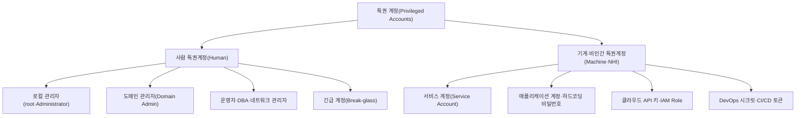
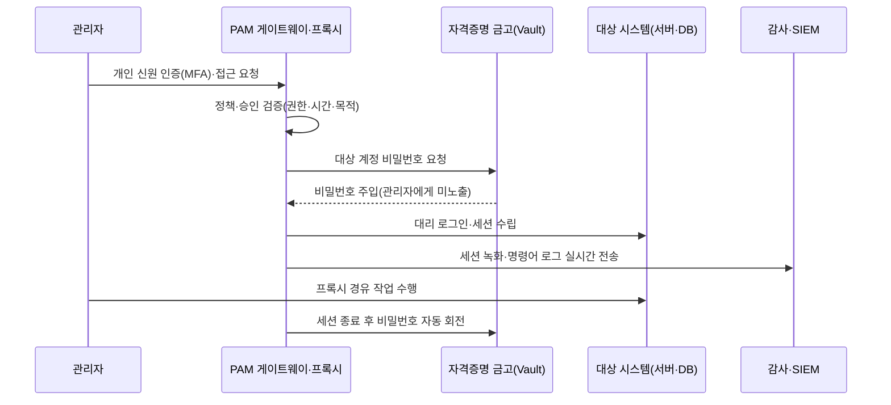

# 특권 접근 관리(PAM, Privileged Access Management)

## 1. 개요

> **특권 접근 관리(PAM, Privileged Access Management)**는 시스템·데이터·인프라에 대해 광범위한 권한을 갖는 특권 계정과 특권 세션을 식별·저장(볼팅)·통제·감시·회수하는 보안 관리 체계로, "누가 언제 어떤 특권으로 무엇을 했는가"를 통제·추적해 특권 오남용과 계정 탈취로 인한 피해를 최소화하는 것을 목적으로 한다.

일반 사용자 계정 관리와 특권 계정 관리는 위험의 크기 자체가 다르다. 일반 계정이 탈취되면 해당 사용자의 업무 범위에 한정된 피해가 발생하지만, 관리자(root·Administrator)·서비스 계정·DBA 계정 같은 특권 계정이 탈취되면 시스템 전체의 설정 변경, 로그 삭제, 대량 데이터 유출, 백업 파괴까지 가능해진다. 실제로 다수의 침해 사고가 최초 침투 이후 **특권 상승(privilege escalation)** 과 **측면 이동(lateral movement)** 을 거쳐 도메인 관리자 권한을 확보하는 경로로 확대되며, 이 과정에서 특권 계정이 핵심 공격 표적이 된다.

특권 계정이 관리되기 어려운 이유는 그 수가 많고 산재해 있으며, 사람이 아닌 계정이 대다수라는 점에 있다. 운영체제 관리자 계정뿐 아니라 애플리케이션이 DB에 접속하기 위한 서비스 계정, 스크립트에 하드코딩된 비밀번호, 스케줄러가 사용하는 배치 계정, 클라우드 API 키, DevOps 파이프라인의 시크릿까지 모두 특권을 갖는다. 이들은 담당자가 퇴사해도 남아 있거나, 여러 시스템이 동일 비밀번호를 공유하거나, 수년간 변경되지 않은 채 방치되기 쉽다. 이렇게 주인 없이 떠도는 계정을 **고아 계정·좀비 계정**이라 하며, PAM의 첫 과제가 바로 이러한 특권 계정의 전수 식별(discovery)이다.

PAM은 신원 및 접근 관리(IAM)의 하위 영역이지만 목표와 통제 강도가 다르다. IAM이 "모든 사용자에게 올바른 권한을 부여"하는 폭넓은 문제를 다룬다면, PAM은 "소수의 강력한 권한을 밀도 높게 통제"하는 데 집중한다. 제로 트러스트가 확산되면서 PAM은 단순한 계정 비밀번호 금고를 넘어, 세션 단위 검증과 최소권한·상시권한 제거(ZSP, Zero Standing Privilege)를 실현하는 핵심 축으로 재정의되고 있다.

PAM을 관통하는 핵심 특징은 세 가지로 압축된다. 첫째는 **중앙집중 통제**로, 산재한 특권 자격증명을 하나의 금고로 모아 관리 지점을 단일화한다. 둘째는 **최소권한·최소노출**로, 필요한 권한만 필요한 시간에 부여해 상시 노출을 없앤다. 셋째는 **완전한 추적성**으로, 모든 특권 행위를 개인 신원과 매핑해 기록함으로써 사후 책임 규명과 감사를 가능하게 한다. 이 세 특징은 각각 접근 표면 축소·피해 창 최소화·책임추적성 확보라는 보안 목표에 대응한다.

PAM이 별도 영역으로 발전해 온 배경도 짚어둘 필요가 있다. 초기에는 관리자들이 각자 서버 비밀번호를 엑셀·메모에 적어 관리하는 수준이었고, 이후 공용 비밀번호를 중앙 금고에 보관하는 **비밀번호 볼트(Password Vault)** 형태로 진화했다. 그러나 볼트만으로는 "비밀번호를 꺼낸 뒤 무엇을 했는가"를 통제할 수 없다는 한계가 드러나면서, 세션 자체를 프록시로 중계·녹화하는 세션 관리가 결합되었다. 최근에는 상시 부여된 권한 자체를 없애자는 문제의식이 커지면서 JIT·ZSP로 무게중심이 이동하고 있다. 즉 PAM의 발전사는 "비밀번호를 감추기"에서 "행위를 통제·기록하기"를 거쳐 "권한 자체를 상시 보유하지 않기"로 나아가는 흐름으로 요약할 수 있으며, 이는 제로 트러스트 사상과 정확히 궤를 같이한다.

## 2. 특권 계정의 유형과 PAM의 통제 대상

PAM을 설계하려면 먼저 "무엇이 특권 계정인가"를 구조적으로 파악해야 한다. 특권은 사람 계정뿐 아니라 기계·애플리케이션에도 폭넓게 존재하기 때문에, 유형을 나누지 않으면 통제 범위에 구멍이 생긴다. 아래 개념도는 특권 계정이 어떤 갈래로 존재하는지를 전체 구조로 보여준다.

첫째, **사람 특권 계정**은 실제 사람이 관리 목적으로 사용하는 계정이다. 서버의 root, 윈도우의 Administrator, 액티브 디렉터리의 Domain Admin, 데이터베이스의 DBA 계정, 네트워크 장비의 enable 계정 등이 여기 속한다. 이들은 사고 발생 시 원인 추적이 가능해야 하므로 개인 식별성이 중요한데, 여러 관리자가 공용 root 계정을 함께 쓰면 "누가 했는가"를 특정할 수 없다는 근본 문제가 생긴다. PAM은 공용 계정 사용 시에도 개인 신원으로 먼저 인증하게 하고, 그 매핑을 로그로 남겨 책임추적성(accountability)을 확보한다.

특히 도메인 관리자 계정은 조직 전체의 신뢰 기반을 장악할 수 있어 공격의 최종 목표가 된다. 액티브 디렉터리 환경에서 도메인 관리자 권한을 확보한 공격자는 Kerberos 인증 티켓을 위조하는 골든 티켓(Golden Ticket) 공격 등으로 사실상 무제한의 지속성을 확보할 수 있다. 따라서 PAM은 도메인 관리자·엔터프라이즈 관리자처럼 파급력이 큰 계정을 별도의 최고 등급으로 분류하고, 전용 관리 단말(PAW, Privileged Access Workstation)에서만 사용하도록 계층을 분리(Tiering)하는 통제를 병행한다.

둘째, **긴급 계정(Break-glass account)** 은 평상시에는 봉인해 두었다가 PAM 시스템 장애·대규모 재해 등 정상 경로로 접근이 불가능한 비상 상황에서만 개봉해 쓰는 최상위 계정이다. "유리를 깨고 꺼낸다"는 비유대로, 개봉 자체가 강력한 경보를 발생시키고 사용 후 즉시 비밀번호를 재설정하도록 설계한다. 긴급 계정을 두지 않으면 PAM 자체가 단일 장애점이 되어 오히려 가용성을 해치므로, 통제와 가용성의 균형을 잡는 안전장치로 반드시 설계해야 한다.

셋째, **기계·비인간 신원(NHI, Non-Human Identity)** 은 최근 가장 빠르게 증가하는 통제 대상이다. 마이크로서비스·컨테이너·서버리스가 확산되면서 사람보다 훨씬 많은 수의 서비스 계정과 시크릿이 자동으로 생성·소멸한다. 예를 들어 하나의 웹 애플리케이션이 DB·캐시·메시지큐·외부 API에 각각 접속하려면 다수의 자격증명이 필요하고, 이것이 소스코드나 설정파일에 평문으로 박히면 형상관리 시스템 유출 한 번으로 전체가 노출된다. PAM은 이러한 시크릿을 코드에서 분리해 금고에 보관하고, 애플리케이션이 실행 시점에 API로 동적으로 받아오게 한다.

비인간 신원은 사람 계정과 달리 명시적 소유자가 불분명하고, MFA 같은 대화형 인증을 적용하기 어렵다는 점에서 통제가 까다롭다. 서비스 계정 하나가 여러 시스템에 재사용되면 하나의 유출이 연쇄 피해로 번지고, 비밀번호를 함부로 바꾸면 연동된 배치·연계 시스템이 동시에 장애를 일으킬 수 있어 회전조차 조심스럽다. 따라서 PAM은 비인간 신원에 대해 사용처를 정확히 매핑(의존성 파악)한 뒤 회전 범위를 통제하고, 가능하다면 정적 비밀번호 자체를 짧은 수명의 동적 자격증명으로 대체해 근본적으로 유출 위험을 낮추는 전략을 택한다.

| 통제 대상 | 대표 예시 | 핵심 위험 | PAM 통제 방식 |
|-----------|-----------|-----------|----------------|
| 사람 관리자 계정 | root, Administrator, DBA | 오남용·공용계정 추적불가 | 개인인증 후 대리접속·세션기록 |
| 긴급 계정 | Break-glass | 상시 노출·오남용 | 봉인·개봉경보·사용후 회전 |
| 서비스 계정 | 배치·데몬 계정 | 비밀번호 미변경·공유 | 자동 회전·사용범위 제한 |
| 애플리케이션 시크릿 | 하드코딩 비밀번호·토큰 | 코드 유출 시 대량 노출 | 시크릿 금고·동적 조회 |
| 클라우드 자격증명 | API Key, IAM Role | 과도 권한·장기 잔존 | 단기 토큰·JIT 발급 |

## 3. PAM의 핵심 기능과 아키텍처

PAM 솔루션은 몇 개의 독립적 기능을 하나의 통제 흐름으로 엮는다. 관리자가 특권 자원에 접근하려는 순간부터 세션이 종료되고 감사가 이뤄지기까지의 처리 경로를 이해하는 것이 중요하다. 핵심 구성요소는 크게 자격증명을 보관·회전하는 **금고(Vault)**, 세션을 중계·격리·녹화하는 **프록시·게이트웨이**, 정책을 판단하는 **정책 엔진**, 그리고 이력을 축적·분석하는 **감사·분석 계층**으로 나뉜다. 이들은 물리적으로는 여러 컴포넌트지만 관리자 입장에서는 하나의 접근 관문으로 동작해야 사용성이 확보된다. 아래는 PAM의 대표적 접근 처리 아키텍처다.

**첫째, 자격증명 금고(Credential Vaulting)와 비밀번호 회전.** PAM의 출발점은 특권 계정의 비밀번호·키를 사람이 알지 못하게 하는 것이다. 모든 특권 비밀번호는 암호화된 금고에 보관되고, 관리자는 비밀번호를 직접 보지 않은 채 PAM을 통해 대상 시스템에 연결된다. 세션이 끝나면 비밀번호를 즉시 무작위로 재설정(자동 회전)하므로, 설령 화면 캡처 등으로 자격증명이 유출되어도 재사용이 불가능하다. 예컨대 금융권 차세대 시스템에서는 DBA 계정 비밀번호를 24시간 또는 1회 사용마다 회전하도록 정책을 걸어, 협력사 인력이 상주하더라도 계정을 사적으로 보관할 수 없게 만든다.

**둘째, 세션 관리와 격리(PSM, Privileged Session Management).** 관리자는 대상 서버에 직접 접속하지 않고 PAM 프록시(점프 서버)를 경유한다. 이 구조에서 PAM은 모든 세션을 영상·텍스트로 녹화하고, 위험 명령어(예: `rm -rf`, `DROP TABLE`)를 실시간으로 탐지·차단할 수 있다. 관리자 단말과 대상 시스템이 직접 연결되지 않으므로, 관리자 PC가 감염되어도 악성코드가 대상 서버로 곧바로 전파되지 않는 격리 효과가 생긴다.

**셋째, 최소권한 적용(PEDM, Privilege Elevation and Delegation Management).** 관리자에게 상시 root 권한을 부여하는 대신, 필요한 명령만 그때그때 상승시켜 실행하게 한다. 리눅스의 sudo 정책 세분화, 윈도우의 앱 단위 권한 상승, 애플리케이션 화이트리스트가 이에 해당한다. 사용자는 평소 일반 권한으로 로그인하고, 특정 관리 작업을 할 때만 승인된 범위에서 권한이 올라가므로 공격 표면이 크게 줄어든다.

**넷째, 즉시 권한 부여(JIT, Just-In-Time)와 상시권한 제거(ZSP).** 전통적 방식은 관리자에게 권한을 미리 부여해 두는데, 이 "상시 권한(Standing Privilege)"이 곧 공격 대상이 된다. JIT는 요청·승인 시점에만 한시적으로 권한을 부여하고 작업이 끝나면 회수하여, 대부분의 시간 동안 아무도 특권을 보유하지 않는 상태(ZSP)를 지향한다. 클라우드 환경에서는 영구 IAM 키 대신 수십 분 단위로 만료되는 단기 토큰을 발급하는 방식으로 구현한다. 예컨대 야간 배포 작업이 필요한 개발자에게 사전에 프로덕션 관리 권한을 상시 부여하는 대신, 변경관리 티켓 승인과 연동해 작업 예정 시간대에만 30분짜리 권한을 발급하고 자동 회수하면, 계정이 탈취되더라도 권한이 살아 있는 시간 자체가 극도로 짧아 피해 창(window)이 최소화된다.

**다섯째, 감사·행위분석(Audit·UEBA).** PAM은 모든 특권 접근·명령을 로그로 남기는 데 그치지 않고, 사용자·개체 행위분석(UEBA, User and Entity Behavior Analytics)을 결합해 평소와 다른 이상 패턴을 탐지한다. 예를 들어 특정 DBA가 평소 조회하지 않던 대량 개인정보 테이블을 새벽 시간에 조회하면, 인증은 정상이더라도 위험 점수를 높여 추가 인증을 요구하거나 세션을 차단할 수 있다. 이렇게 축적된 세션 기록은 사후 포렌식과 규제 감사의 증거로도 활용되므로, 로그의 무결성(위·변조 방지)과 보존기간 관리가 함께 설계되어야 한다.

이 다섯 기능은 결국 특권 계정의 수명주기 전 구간을 통제하는 것으로 정리된다. PAM의 통제 흐름을 수명주기로 요약하면 다음과 같다.

- **식별(Discovery):** 조직 내 모든 특권 계정·시크릿·고아 계정을 전수 조사해 통제 대상 목록을 확보한다.
- **저장(Vaulting):** 자격증명을 암호화 금고로 이관하고 코드·문서에서 평문 비밀번호를 제거한다.
- **통제(Control):** 요청·승인·최소권한(PEDM)·JIT로 접근을 제한하고 프록시 경유를 강제한다.
- **감시(Monitor):** 세션을 녹화·분석하고 이상행위를 실시간 탐지·차단한다.
- **회수(Rotate·Revoke):** 사용 후 비밀번호를 회전하고 한시 권한을 회수해 상시 노출을 없앤다.

## 4. 유사 개념 비교와 도입 사례

PAM은 IAM·IGA와 자주 혼동되지만 초점이 다르다. IAM은 조직 전체 사용자의 신원·인증·인가를 다루는 넓은 우산이고, IGA(Identity Governance and Administration)는 그중 권한 부여의 적정성·인증 주기·감사에 특화된 거버넌스 영역이다. PAM은 그 안에서도 **강력한 권한을 가진 소수 계정과 세션의 실시간 통제**에 집중한다는 점에서 통제 밀도가 가장 높다. 세 개념은 대체 관계가 아니라 계층적 보완 관계로, IGA가 "누가 어떤 권한을 가져야 하는가"를 정하면 PAM이 "그 강력한 권한이 실제로 어떻게 쓰이는가"를 통제한다.

| 구분 | IAM | IGA | PAM |
|------|-----|-----|-----|
| 대상 | 전체 사용자 | 전체 권한·역할 | 특권 계정·세션 |
| 초점 | 인증·SSO·인가 | 권한 적정성·인증·감사 | 볼팅·세션통제·최소권한 |
| 시점 | 상시 로그인 | 주기적 검토 | 접근·세션 단위 실시간 |
| 대표 통제 | MFA, 프로비저닝 | 접근 인증(Access Certification) | 비밀번호 회전, 세션녹화, JIT |

PAM을 접근제어 모델과도 구분해 이해해야 한다. DAC·MAC·RBAC 같은 접근제어 모델이 "어떤 주체가 어떤 객체에 접근할 수 있는가"의 정책 논리를 규정한다면, PAM은 그 정책이 적용되는 특권 계정에 대해 자격증명 보관·세션 중계·행위 감시라는 운영 통제를 덧입힌다. 즉 접근제어 모델이 규칙(rule)이라면 PAM은 그 규칙이 강력한 권한에 대해 실제로 지켜지도록 만드는 집행·감시 인프라에 가깝다. 두 개념은 대립하지 않고, 접근제어 정책 위에서 PAM이 특권 영역의 집행을 담당하는 관계로 결합된다.

실무 도입 사례를 보면 통제의 효과가 분명히 드러난다. 예를 들어 다수의 관리자와 협력사 인력이 공용 root로 서버에 접속하던 조직이 PAM을 도입하면, 개인 신원 인증 후 대리접속이 강제되어 "누가 무엇을 했는지"가 세션 녹화로 남는다. 이는 사고 조사 시간을 단축시킬 뿐 아니라, 감사 대응과 규제 준수(ISMS-P 접근통제·계정관리 통제항목, 개인정보의 안전성 확보조치 기준의 접근권한 관리·접속기록 보관 등)를 자동화하는 효과가 있다. 또 다른 사례로, 소스코드에 DB 비밀번호를 하드코딩하던 개발 조직이 시크릿 금고를 도입해 코드에서 자격증명을 제거하면, 형상관리 저장소 유출 시에도 실제 비밀번호는 노출되지 않는다. 통계적으로도 침해 사고의 상당수가 자격증명 오남용에서 비롯된다는 점에서, 특권 자격증명의 금고화·회전·최소권한화는 투자 대비 위험 감소 효과가 큰 통제로 평가된다.

반대로 도입 과정에서 자주 나타나는 실패 유형도 함께 이해해야 실효적 설계가 가능하다. 대표적 함정은 다음과 같다.

- **금고화만 하고 행위는 방치:** 비밀번호를 볼트에 넣었더라도 세션 녹화·명령 통제가 없으면, 권한을 꺼낸 뒤의 오남용을 막지 못한다. 볼팅과 세션 관리는 반드시 함께 가야 한다.
- **비인간 신원 누락:** 사람 관리자만 통제하고 서비스 계정·API 키를 빠뜨리면, 실제 공격 표면의 다수를 이루는 기계 신원이 그대로 노출된다.
- **과도한 통제로 우회 유발:** 승인 절차가 지나치게 느리면 현업이 PAM을 우회해 별도 계정을 만들거나 통제 밖 경로를 쓰게 되어, 오히려 사각지대가 커진다. 위험 기반으로 통제 강도를 차등화해야 한다.
- **Break-glass 미설계:** 긴급 계정 없이 PAM만 강제하면, PAM 장애 시 복구 자체가 불가능해져 가용성 위기를 초래한다.
- **로그 무결성 미확보:** 세션 로그가 위·변조 가능하면 감사 증거로서의 효력을 잃는다. 별도 저장·해시 체인·SIEM 연동으로 무결성을 보장해야 한다.

## 5. 심화 — 클라우드·DevOps 환경으로의 확장과 최신 동향

전통적 PAM은 온프레미스 서버와 사람 관리자를 전제로 발전했으나, 클라우드·컨테이너·DevOps가 확산되면서 통제 대상과 방식이 근본적으로 재편되고 있다. 첫째, **비인간 신원의 폭증**이다. 마이크로서비스·서버리스 환경에서는 사람보다 기계 신원이 수십 배 많고, 이들의 시크릿이 짧은 주기로 생성·소멸한다. 이에 따라 정적 비밀번호를 회전하는 기존 방식만으로는 한계가 있어, 실행 시점에 단기 자격증명을 동적으로 발급하는 **시크릿 관리(Secrets Management)** 와 워크로드 신원 연동이 PAM의 필수 확장 영역이 되었다.

둘째, **JIT·ZSP 중심으로의 전환**이다. 클라우드에서 장기 API 키는 유출 시 피해가 크므로, 역할 기반의 단기 토큰을 요청 시점에만 발급하는 방식이 표준으로 자리잡고 있다. 이는 "권한을 미리 주고 나중에 회수"하던 모델을 "필요할 때만 주고 즉시 회수"하는 모델로 뒤집는 것으로, 제로 트러스트의 최소권한 원칙과 정확히 맞닿는다. 이 전환은 감사 관점에서도 이점이 있는데, 상시 권한이 없으면 "지금 이 권한이 왜 부여되어 있는가"를 매번 검토할 필요 없이, 발급 이력만으로 권한 사용의 정당성을 추적할 수 있어 접근 인증(Access Certification) 부담이 줄어든다. 셋째, **CIEM(Cloud Infrastructure Entitlement Management)** 과의 결합이다. 멀티클라우드에서 과도하게 부여된 권한(Excessive Permission)과 미사용 권한을 지속적으로 분석·축소하는 CIEM은 클라우드 특권 관리의 핵심으로 부상했으며, PAM·CNAPP과 상호 보완적으로 통합되는 추세다.

넷째, 표준·프레임워크 측면에서 PAM은 제로 트러스트 아키텍처(NIST SP 800-207)의 정책 집행 지점(PEP)과 결합해 세션 단위 검증을 강화하고 있으며, 국내에서도 ISMS-P 인증 기준과 공공·금융 보안 가이드에서 특권 계정 관리·접속기록 보존·최소권한을 명시적으로 요구한다. 특히 개인정보를 대량 처리하는 시스템에서는 관리자 계정의 접속기록을 일정 기간 이상 보관하고 위·변조를 방지해야 하며, 접근권한을 최소한으로 차등 부여하도록 규정하고 있어 PAM이 이러한 컴플라이언스 요구를 자동화하는 실질적 수단이 된다. 향후에는 AI 에이전트가 자율적으로 시스템을 조작하는 **에이전틱 AI** 환경에서, 사람이 아닌 AI 에이전트에게 부여되는 특권을 어떻게 통제·감사할 것인가가 PAM의 새로운 과제로 대두될 전망이다. 예상 출제 방향으로는 ①PAM의 구성요소와 아키텍처를 설명하고 ②JIT·ZSP 개념을 최소권한 원칙과 연계해 서술하며 ③IAM·IGA·PAM의 차이와 제로 트러스트 연계를 논하는 구성이 유력하다.

## 6. 고려사항 및 시사점

기술사 관점에서 PAM은 단순 솔루션 도입이 아니라 계정·권한 거버넌스의 재설계로 접근해야 하며, 다음을 종합적으로 고려한다.

- **적용 전략(단계적 도입):** 특권 계정 전수 식별(Discovery)→금고화·비밀번호 회전→세션 통제·녹화→최소권한(PEDM)→JIT·ZSP의 순서로 성숙도를 높인다. 처음부터 모든 통제를 강제하면 운영 저항이 크므로, 위험이 높은 도메인 관리자·DBA 계정부터 우선 적용하는 리스크 기반 접근이 현실적이다. 성숙도 단계별로 통제 효과와 운영 부담을 함께 측정해, 통제가 현업 생산성을 지나치게 저해하지 않는 지점을 찾아 확산 속도를 조정하는 것이 성공의 관건이다.

- **가용성 트레이드오프(단일 장애점 회피):** PAM 프록시가 모든 특권 접근의 관문이 되므로, PAM 자체가 다운되면 운영·긴급 대응이 마비될 수 있다. 이중화·고가용성 구성과 함께 Break-glass 계정을 반드시 설계하여 통제와 가용성의 균형을 맞춰야 한다.

- **성과 측정 지표:** 도입 효과는 금고화된 특권 계정 비율, 상시권한 보유 계정 수 감소, 미변경 비밀번호(정체 자격증명) 비율, 세션 녹화 커버리지, 이상행위 탐지·대응 시간(MTTD·MTTR) 등으로 정량화해 지속 개선의 근거로 삼는다.

- **책임추적성과 규제 준수:** 공용 계정 사용 시에도 개인 신원 매핑과 세션 로그를 확보해 "누가 언제 무엇을 했는가"를 재현할 수 있어야 한다. ISMS-P의 접근통제·계정관리, 개인정보의 안전성 확보조치 기준의 접속기록 보관·접근권한 관리 요구와 정합되도록 로그 보존기간·무결성(위·변조 방지)을 설계한다.

- **비인간 신원·시크릿 확장:** 사람 계정만 통제하면 서비스 계정·API 키·CI/CD 토큰이라는 더 큰 공격 표면이 방치된다. 시크릿 금고·동적 자격증명·CIEM을 결합해 기계 신원까지 통제 범위를 넓혀야 한다.

- **연계 기술 관점:** PAM은 제로 트러스트(ZTNA)·SIEM/SOAR·IGA·CNAPP과 연계될 때 효과가 극대화된다. 세션 이상행위를 SIEM으로 상관분석하고 SOAR로 자동 대응하며, IGA의 주기적 접근 인증으로 권한 적정성을 점검하는 통합 보안 운영체계 안에서 PAM을 위치시켜야 한다.

- **조직·프로세스 관점:** PAM은 기술 도입만으로 완성되지 않으며, 특권 부여·승인·회수의 책임 주체와 절차가 변경관리·직무분리(SoD) 원칙에 맞게 재정의되어야 한다. 요청자·승인자·수행자를 분리하고, 정기적으로 특권 계정 현황을 재점검하는 거버넌스 루틴이 없으면 시간이 지나며 통제가 다시 느슨해진다.

- **전망:** 비인간 신원과 AI 에이전트의 특권이 폭증하면서, 사람 중심의 PAM은 워크로드·에이전트 신원 관리로 무게중심을 옮길 것이다. 정적 자격증명을 최소화하고 단기·동적 신원과 지속적 검증을 결합한 "상시권한 제로(ZSP)"가 특권 관리의 목표 상태로 자리잡을 전망이다.

## 참고자료
- NIST SP 800-207, Zero Trust Architecture — https://csrc.nist.gov/pubs/sp/800/207/final
- CISA, Zero Trust Maturity Model — https://www.cisa.gov/zero-trust-maturity-model
- 한국인터넷진흥원(KISA), ISMS-P 인증기준 안내 — https://isms.kisa.or.kr
- OWASP, Secrets Management Cheat Sheet — https://cheatsheetseries.owasp.org/cheatsheets/Secrets_Management_Cheat_Sheet.html

---
> **한 줄 요약**: PAM은 특권 계정·세션을 식별·금고화·최소권한화·감시·회수하는 보안 통제 체계로, 비밀번호 회전·세션 녹화·JIT/ZSP를 통해 특권 오남용과 계정 탈취 피해를 최소화하며, 클라우드·비인간 신원·제로 트러스트로 통제 범위를 확장하고 있다.
