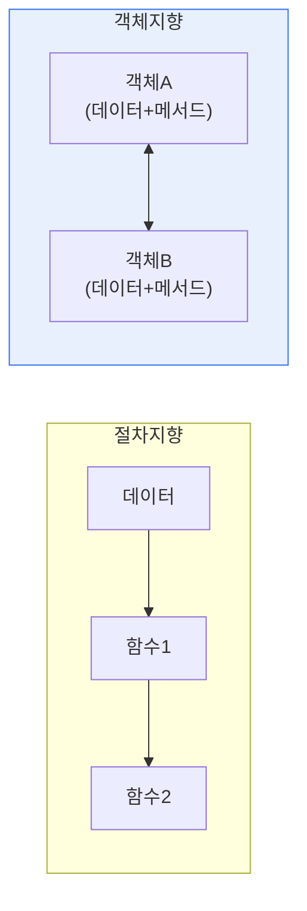

# 절차지향 프로그래밍(POP)과 객체지향 프로그래밍(OOP)

## 1. 개요

### 가. 개념
> **절차지향(POP)** 은 프로그램을 **일련의 함수(프로시저)의 순차적 실행 흐름**으로 구성하는 방식이고, **객체지향(OOP)** 은 데이터와 그 데이터를 다루는 함수를 **객체(Object)** 로 묶어, 객체 간 상호작용으로 프로그램을 구성하는 방식이다.

두 패러다임을 비교하는 근본 이유는 '**소프트웨어가 커질 때 무엇을 중심으로 구조를 잡아야 유지·관리가 쉬운가**'라는 물음에 있다. **절차지향**은 '무엇을 하는가(동작·함수)'를 중심에 둔다. 데이터가 있고, 함수들이 그 데이터를 순서대로 처리한다. 작고 단순한 프로그램에는 직관적이고 효율적이다. 그러나 규모가 커지면 문제가 생긴다. 데이터가 여러 함수에 노출되어(전역 데이터), 한 곳을 고치면 여기저기 영향이 번지고, 코드 재사용·유지보수가 어려워진다. **객체지향**은 이 문제를 '데이터 중심'으로 해결한다. 관련 데이터와 함수를 하나의 객체로 캡슐화하고, 데이터는 객체 안에 숨겨(은닉) 정해진 통로(메서드)로만 접근하게 한다. 그러면 변경의 영향이 객체 안으로 국한되고, 상속·다형성으로 코드를 재사용·확장하기 쉬워진다. 즉 절차지향이 '함수의 흐름'으로 세상을 보는 것이라면, 객체지향은 '상호작용하는 객체들'로 세상을 보는 것이다. 대규모·복잡한 소프트웨어일수록 객체지향의 구조적 장점이 커진다.

### 나. 핵심 관점
| 구분 | 중심 | 세계관 |
|---|---|---|
| **절차지향** | 함수(동작) | 순차적 처리 흐름 |
| **객체지향** | 객체(데이터+동작) | 객체 간 협력 |

## 2. 비교

| 구분 | 절차지향(POP) | 객체지향(OOP) |
|---|---|---|
| **단위** | 함수(프로시저) | 객체(클래스) |
| **데이터** | 전역·공유(노출) | 캡슐화(은닉) |
| **재사용** | 함수 단위(제한적) | 상속·다형성(용이) |
| **유지보수** | 규모 커지면 어려움 | 변경 국소화, 용이 |
| **성능** | 상대적으로 빠름·가벼움 | 추상화 오버헤드 |
| **대표 언어** | C, 파스칼 | Java, C++, 파이썬 |
| **적합** | 소규모·순차 처리 | 대규모·복잡·변경 잦음 |

## 3. 객체지향의 4대 특징

OOP의 유지보수·재사용 이점은 다음 네 특징에서 나온다.

| 특징 | 내용 |
|---|---|
| **캡슐화** | 데이터·메서드를 묶고 내부를 은닉(정보 은닉) |
| **상속** | 상위 클래스 특성을 물려받아 재사용·확장 |
| **다형성** | 같은 메시지에 객체별로 다르게 반응 |
| **추상화** | 핵심만 모델링, 복잡성 감춤 |

## 4. 고려사항 및 시사점

1. **문제·규모에 맞는 선택**이 필요하다. 작고 성능이 중요한 임베디드·시스템 프로그래밍은 절차지향(C)이, 크고 변경이 잦은 업무·서비스 시스템은 객체지향이 유리하다. 둘은 대체가 아니라 상황별 선택지다.
2. **패러다임은 공존·혼합**된다. 현대 언어(파이썬·C++)는 절차·객체·함수형을 함께 지원하며, 실무에서는 여러 패러다임을 문제에 맞게 섞어 쓴다.
3. **설계 원칙과 결합**해야 진가를 발휘한다. 객체지향도 잘못 설계하면 복잡도만 늘므로, SOLID 원칙·디자인 패턴과 결합해 응집도를 높이고 결합도를 낮춰야 유지보수 이점을 얻는다. [[module-cohesion-coupling]]

---

> **한 줄 요약**: 절차지향은 *함수의 순차 흐름 중심* 으로 소규모에 효율적이나 규모가 커지면 유지보수가 어렵고, 객체지향은 *데이터와 동작을 객체로 캡슐화* 해 상속·다형성으로 재사용·확장이 쉬워 대규모·복잡 시스템에 적합하다.
