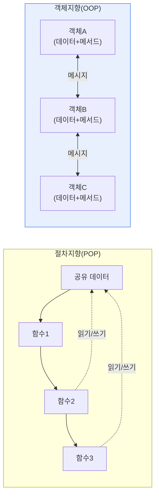
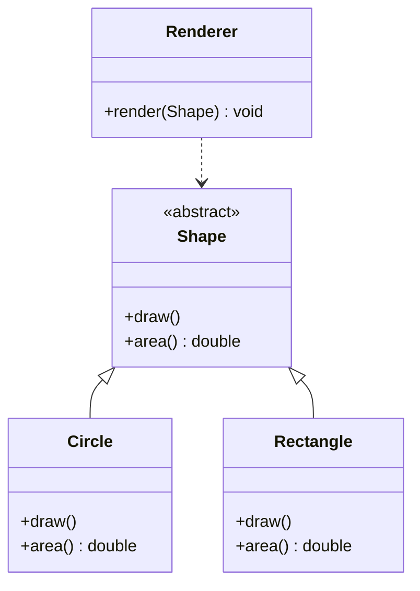

# 절차지향 프로그래밍(POP)과 객체지향 프로그래밍(OOP)

## 1. 개요

### 가. 개념

> **절차지향(Procedural-Oriented Programming, POP)** 은 프로그램을 **일련의 함수(프로시저)의 순차적 실행 흐름**으로 구성하는 방식이고, **객체지향(Object-Oriented Programming, OOP)** 은 데이터와 그 데이터를 다루는 함수를 **객체(Object)** 로 묶어, 객체 간 메시지 교환(상호작용)으로 프로그램을 구성하는 방식이다.

두 패러다임을 비교하는 근본 이유는 단순히 "문법이 다르다"가 아니라, **소프트웨어가 커지고 오래 살아남을 때 무엇을 중심으로 구조를 잡아야 유지·관리 비용이 낮아지는가**라는 소프트웨어 공학의 본질적 물음에 있다. 소프트웨어의 총비용은 최초 개발비보다 유지보수·변경에 드는 비용이 훨씬 크다는 것이 오래된 경험칙이며(전체 수명주기 비용의 60~80%가 유지보수 단계에서 발생한다는 조사가 반복적으로 보고된다), 이 비용을 좌우하는 것이 바로 **변경의 파급 범위**다. 두 패러다임은 "변경이 생겼을 때 그 영향이 어디까지 번지는가"를 서로 다른 방식으로 통제한다.

**절차지향**은 '무엇을 하는가(동작·함수)'를 프로그램의 뼈대로 삼는다. 데이터 구조가 먼저 있고, 그 데이터를 순서대로 처리하는 함수들이 위에서 아래로 흐른다. 문제를 '큰 작업 → 작은 작업'으로 쪼개는 하향식(Top-Down) 분해와 자연스럽게 맞물리며, 실행 흐름이 코드에 그대로 드러나기 때문에 작고 단순한 프로그램에서는 직관적이고 군더더기가 없다. 그러나 규모가 커지면 데이터가 여러 함수에 공유·노출되면서(특히 전역 데이터) 한 자료구조를 바꾸면 그 데이터를 만지는 모든 함수를 함께 고쳐야 하고, 수정의 영향이 어디까지 미치는지 사람이 추적하기 어려워진다. 즉 데이터와 함수가 분리되어 있어 결합이 '느슨해 보이지만 실제로는 넓게 퍼져 있는' 상태가 된다.

**객체지향**은 이 문제를 '데이터 중심'으로 뒤집어 해결한다. 서로 관련된 데이터와 그 데이터를 다루는 함수를 하나의 객체로 **캡슐화**하고, 데이터는 객체 내부에 숨겨(정보 은닉) 공개된 통로인 메서드로만 접근하게 한다. 그러면 데이터 표현이 바뀌어도 변경은 그 객체 내부로 국한되고(외부는 인터페이스만 알기 때문), 상속·다형성으로 공통 구조를 재사용하면서 차이나는 부분만 확장할 수 있다. 요약하면 절차지향이 '함수의 흐름'으로 세상을 본다면, 객체지향은 '책임을 가진 채 서로 협력하는 객체들'로 세상을 본다. 대규모·장기 운영·요구변경이 잦은 소프트웨어일수록 이 구조적 국소화(localization)의 가치가 커진다.

### 나. 등장 배경과 필요성

절차지향은 1970년대 구조적 프로그래밍(structured programming) 흐름 속에서 GOTO 남용으로 얽힌 '스파게티 코드'를 순차·선택·반복의 제어구조와 함수 분해로 정돈하려는 시도에서 자리 잡았고, C·파스칼·포트란이 대표한다. 그러나 1980년대 이후 GUI, 대규모 업무 시스템처럼 상태와 상호작용이 폭발적으로 늘어나는 소프트웨어가 등장하면서, 함수 분해만으로는 복잡성을 감당하기 어렵다는 '소프트웨어 위기(software crisis)' 인식이 확산되었다. 여기서 시뮬라(Simula)의 클래스 개념을 이어받아 스몰토크(Smalltalk)가 순수 객체지향을 구현했고, C++·자바가 산업계에 객체지향을 보급하면서 대규모 협업 개발의 표준 패러다임으로 올라섰다. 즉 OOP의 등장은 '문법의 취향' 문제가 아니라 **복잡성 관리와 팀 단위 분업**이라는 현실적 필요에서 비롯되었다.

| 구분 | 중심 관점 | 세계관 | 대표 분해 방식 |
|---|---|---|---|
| **절차지향** | 함수(동작) | 순차적 처리 흐름 | 기능 분해(Top-Down) |
| **객체지향** | 객체(데이터+동작) | 협력하는 객체들 | 책임 분할(역할·협력) |

## 2. 두 패러다임의 구조 비교

아래 개념도는 두 패러다임이 데이터와 함수를 배치하는 방식의 차이를 보여준다. 절차지향에서는 데이터가 함수들 바깥에 놓여 여러 함수에 공유되지만, 객체지향에서는 데이터가 각 객체 안으로 들어가 메시지로만 오간다.

```mermaid
flowchart LR
  subgraph POP["절차지향(POP)"]
    D1["공유 데이터"] --> F1["함수1"] --> F2["함수2"] --> F3["함수3"]
    F2 -.읽기/쓰기.-> D1
    F3 -.읽기/쓰기.-> D1
  end
  subgraph OOP["객체지향(OOP)"]
    O1["객체A<br/>(데이터+메서드)"] <-- "메시지" --> O2["객체B<br/>(데이터+메서드)"]
    O2 <-- "메시지" --> O3["객체C<br/>(데이터+메서드)"]
  end
  style OOP fill:#e8f0fe,stroke:#2f6fed
```

이 구조 차이가 실무에서 만드는 결과는 뚜렷하다. 예컨대 은행 계좌 잔액을 다루는 프로그램을 생각해 보자. 절차지향에서는 `balance`라는 데이터가 전역으로 존재하고 `deposit()`, `withdraw()`, `printStatement()` 같은 함수가 이를 직접 읽고 쓴다. 잔액이 음수가 되면 안 된다는 규칙을 강제하려면 `balance`를 만지는 모든 함수에 같은 검사를 중복해서 넣어야 하고, 새 함수를 추가하는 개발자가 검사를 빠뜨리면 규칙이 깨진다. 객체지향에서는 `balance`를 `Account` 객체 안에 `private`으로 숨기고 오직 `withdraw()` 메서드를 통해서만 감소시키므로, 잔액 불변식(invariant)을 한 곳에서 보장할 수 있다. **데이터에 대한 규칙을 데이터가 사는 곳에 붙여 둔다**는 것이 캡슐화의 실질적 이득이다.

| 구분 | 절차지향(POP) | 객체지향(OOP) |
|---|---|---|
| **기본 단위** | 함수(프로시저) | 객체(클래스) |
| **데이터 취급** | 전역·공유(노출) | 캡슐화(은닉) |
| **재사용 수단** | 함수 호출(제한적) | 상속·합성·다형성(용이) |
| **변경 영향** | 넓게 파급(추적 난이) | 객체 내부로 국소화 |
| **성능** | 상대적으로 빠름·가벼움 | 추상화·동적 디스패치 오버헤드 |
| **대표 언어** | C, 파스칼, 포트란 | Java, C++, C#, 파이썬 |
| **적합 영역** | 소규모·순차 처리·시스템·임베디드 | 대규모·복잡·변경 잦은 업무 시스템 |

성능 항목은 오해를 부르기 쉬우므로 이유까지 짚을 필요가 있다. 객체지향의 다형성은 실행 시점에 어떤 메서드를 부를지 결정하는 **동적 디스패치**(가상 함수 테이블 조회)를 수반하므로 함수 직접 호출보다 미세한 비용이 든다. 객체 단위 메모리 할당과 참조 추적, 가상 머신 환경(JVM 등)의 간접 비용도 더해진다. 그러나 이 차이는 대부분의 업무 시스템에서 무시할 만한 수준이며, 유지보수성·확장성이라는 큰 이득을 상쇄하지 못한다. 반대로 커널·디바이스 드라이버·실시간 제어처럼 사이클 단위 성능과 결정적 동작이 중요한 영역에서는 여전히 C 기반 절차지향이 지배적이다. 즉 성능은 '절대 우열'이 아니라 **적용 도메인에 따른 트레이드오프**로 이해해야 한다.

## 3. 객체지향의 4대 특징 심층

OOP의 유지보수·재사용 이점은 다음 네 특징이 서로 맞물려 나온다. 각 특징을 단순 정의가 아니라 '왜 그것이 변경 비용을 낮추는가'의 관점에서 본다.

**가. 캡슐화(Encapsulation)** 는 데이터와 그것을 다루는 메서드를 한 단위로 묶고, 내부 표현을 외부로부터 숨기는(정보 은닉) 것이다. 핵심 효과는 '변경의 방화벽'이다. 외부는 객체가 **무엇을 할 수 있는지**(공개 인터페이스)만 알고 **어떻게 하는지**(내부 구현)는 모르기 때문에, 내부 자료구조를 배열에서 해시맵으로 바꾸든, 계산식을 최적화하든 외부 코드는 영향을 받지 않는다. 앞서 든 계좌 예처럼 불변식을 한 곳에서 지킬 수 있어, 규칙이 코드 전체로 흩어지는 것을 막는다.

**나. 상속(Inheritance)** 은 상위 클래스의 속성·행위를 하위 클래스가 물려받아 재사용·확장하는 것이다. 공통 코드를 상위에 모아 중복을 줄이지만, 상위와 하위가 강하게 결합되어 상위 변경이 하위 전체로 번지는 취약성도 있다. 그래서 현대 설계에서는 "상속보다 합성(Composition over Inheritance)"을 권장하며, 상속은 '진짜 is-a 관계'에만 제한적으로 쓰는 편이다.

**다. 다형성(Polymorphism)** 은 같은 메시지에 객체마다 다르게 반응하는 성질이다. 예를 들어 `Shape` 타입의 여러 도형에 동일하게 `draw()`를 호출해도 원·사각형이 각자의 방식으로 그려진다. 호출하는 쪽은 구체 타입을 몰라도 되므로, 새 도형 클래스를 추가할 때 기존 호출 코드를 건드리지 않는다. 이는 뒤에서 다룰 OCP(개방-폐쇄 원칙)의 기술적 토대다. 아래 클래스 다이어그램은 상속·다형성이 맞물리는 전형적 구조를 보여준다. 추상 상위(`Shape`)가 `draw()`를 규정하고, 하위 구현체들이 이를 각자 재정의하며, 사용하는 쪽(`Renderer`)은 추상 타입에만 의존한다.

```mermaid
classDiagram
  class Shape {
    <<abstract>>
    +draw()
    +area() double
  }
  class Circle {
    +draw()
    +area() double
  }
  class Rectangle {
    +draw()
    +area() double
  }
  class Renderer {
    +render(Shape) void
  }
  Shape <|-- Circle
  Shape <|-- Rectangle
  Renderer ..> Shape
```

이 그림에서 새 도형(예: `Triangle`)을 추가하는 변경은 `Shape`를 상속한 클래스 하나를 더하는 것으로 끝나며, `Renderer`는 `Shape` 추상 타입에만 의존하므로 재컴파일·수정이 필요 없다. 절차지향이라면 `Renderer`에 해당하는 처리 함수 내부의 분기문을 수정해야 하는데, 이 '수정 없이 확장'의 가능 여부가 두 패러다임의 확장성 격차를 만든다.

**라. 추상화(Abstraction)** 는 문제 영역에서 본질적인 속성만 뽑아 모델링하고 불필요한 세부는 감추는 것이다. 인터페이스·추상클래스로 '무엇을 한다'만 규정하고 '어떻게'는 구현체에 맡겨, 상위 정책과 하위 세부를 분리한다.

| 특징 | 핵심 메커니즘 | 유지보수 관점의 이득 |
|---|---|---|
| **캡슐화** | 정보 은닉, public 인터페이스 | 내부 변경을 외부와 격리 |
| **상속** | 계층적 특성 물려받기 | 공통 코드 재사용(단, 결합 주의) |
| **다형성** | 동적 디스패치 | 확장 시 기존 코드 불변 |
| **추상화** | 인터페이스·추상클래스 | 정책과 구현 분리 |

## 4. 비교 사례와 실무적 함의

두 패러다임의 차이가 실제 코드 규모에서 어떻게 드러나는지 '요구사항 변경' 시나리오로 보면 명확하다. 수십 개 장비 유형을 다루는 관제 시스템에서 "새 장비 유형 추가"라는 흔한 변경을 가정해 보자. 절차지향 구현에서는 장비 종류를 `switch`/`if` 분기로 처리하는 코드가 여러 함수(등록·표시·집계·알람)에 흩어져 있어, 유형 하나를 추가하면 그 모든 분기문을 찾아 손봐야 하고 한 곳이라도 빠뜨리면 결함이 된다. 객체지향에서는 각 장비를 공통 인터페이스를 구현하는 클래스로 두면, 새 유형은 클래스 하나를 추가하는 것으로 끝나고 기존 코드는 다형성 덕분에 그대로 동작한다. 변경 지점이 'N군데'에서 '1군데'로 줄어드는 것, 이것이 대규모 시스템에서 OOP가 선호되는 정량적 이유다.

다만 "OOP가 항상 옳다"는 결론은 위험하다. 리눅스 커널은 2,000만 줄이 넘는 대규모 소프트웨어이지만 C 기반 절차지향으로 작성·유지되며(구조체와 함수 포인터로 필요한 다형성만 흉내 낸다), 이는 성능·이식성·하드웨어 밀착 제어라는 도메인 특성 때문이다. 반대로 대규모 엔터프라이즈 웹 서비스는 스프링(자바) 같은 객체지향 프레임워크 위에서 수백 명이 협업하며, 여기서는 계층 분리와 확장성이 성능보다 중요하다. 또한 함수형 프로그래밍(FP)이 부상하면서, 불변 데이터와 순수 함수로 동시성·테스트 용이성을 확보하는 '제3의 축'이 실무에 들어왔다. 결국 패러다임 선택은 우열 경쟁이 아니라 **도메인 특성(성능·변경 빈도·팀 규모·동시성 요구)에 대한 공학적 적합성 판단**이다.

## 5. 심화 — 설계 원칙·현대 언어의 다중 패러다임

객체지향은 문법만 쓴다고 이점이 저절로 생기지 않는다. 잘못 설계하면 오히려 클래스 폭발과 과도한 추상화로 복잡도만 늘어난다(이른바 '객체지향의 남용'). 그래서 OOP의 진가는 **SOLID 원칙**과 **디자인 패턴**과 결합할 때 나온다. SOLID는 ▲SRP(단일 책임) ▲OCP(개방-폐쇄: 확장에는 열리고 변경에는 닫힘) ▲LSP(리스코프 치환) ▲ISP(인터페이스 분리) ▲DIP(의존성 역전)로, 앞서 본 '새 유형은 클래스 추가만으로'라는 이득은 사실 OCP와 다형성의 결합이 만들어 내는 것이다. 디자인 패턴(전략·옵서버·팩토리 등)은 이 원칙들을 재사용 가능한 협력 구조로 정형화한 것이다. 설계 관점에서 목표는 언제나 **높은 응집도(cohesion)와 낮은 결합도(coupling)** 이며, 이는 절차지향에서도 동일하게 추구되는 보편 원칙이다. [[module-cohesion-coupling]]

현대 언어는 하나의 패러다임을 강요하지 않는다. 파이썬·C++·자바스크립트·코틀린은 절차·객체·함수형을 한 언어 안에서 함께 지원하는 **멀티패러다임(multi-paradigm)** 언어이며, 자바도 8 버전부터 람다·스트림으로 함수형 요소를 대폭 받아들였다. 실무에서는 "데이터 변환 파이프라인은 함수형으로, 도메인 모델과 상태 관리는 객체지향으로, 성능 핵심 루프는 절차형으로" 식으로 문제에 맞춰 패러다임을 섞어 쓰는 것이 자연스럽다. 따라서 기술사 관점에서 중요한 역량은 "어느 패러다임이 우월한가"를 논하는 것이 아니라, **주어진 문제의 성질에 맞는 패러다임을 선택·조합하고 그 트레이드오프를 설명**하는 것이다.

## 6. 고려사항 및 시사점

1. **문제·규모에 맞는 선택이 우선이다.** 작고 성능·결정성이 중요한 임베디드·시스템·실시간 영역은 절차지향(C)이, 크고 변경이 잦으며 팀 협업이 필요한 업무·서비스 시스템은 객체지향이 유리하다. 둘은 대체재가 아니라 도메인별 선택지이며, 잘못된 선택은 유지보수 비용으로 되돌아온다.

2. **패러다임은 공존·혼합된다.** 멀티패러다임 언어가 표준이 된 지금, 하나의 '정답 패러다임'을 고집하기보다 각 패러다임의 강점(절차형=단순·성능, 객체형=구조·확장, 함수형=불변·동시성)을 문제별로 조합하는 설계 감각이 요구된다.

3. **설계 원칙과 결합해야 진가가 난다.** 객체지향도 SOLID·디자인 패턴 없이 쓰면 복잡도만 늘어난다. 응집도를 높이고 결합도를 낮춘다는 보편 원칙 위에서만 재사용·유지보수 이점이 실현되며, 이는 패러다임을 초월하는 소프트웨어 공학의 상수다. [[module-cohesion-coupling]]

4. **전환·전망: 동시성과 대규모 데이터가 패러다임 지형을 바꾸고 있다.** 멀티코어·분산 환경에서 공유 가변 상태가 동시성 버그의 근원이 되면서, 불변성을 앞세운 함수형 요소의 비중이 커지고 있다. 향후 개발자에게 요구되는 것은 특정 패러다임 숙련을 넘어, 여러 패러다임을 상황에 맞게 오가는 **패러다임 리터러시**다. 기술사는 아키텍처 결정 시 성능·확장성·동시성·팀 역량을 함께 저울질해 패러다임과 언어를 처방할 수 있어야 한다.

## 참고자료

- Wikipedia, "Object-oriented programming" — https://en.wikipedia.org/wiki/Object-oriented_programming
- Wikipedia, "Procedural programming" — https://en.wikipedia.org/wiki/Procedural_programming
- Robert C. Martin, "The Principles of OOD (SOLID)" — https://blog.cleancoder.com/uncle-bob/2020/10/18/Solid-Relevance.html

---

> **한 줄 요약**: 절차지향은 *함수의 순차 흐름*을 중심에 두어 소규모·성능·시스템 영역에 효율적이나 규모가 커지면 변경이 넓게 파급되어 유지보수가 어렵고, 객체지향은 *데이터와 동작을 객체로 캡슐화*하고 상속·다형성으로 변경을 국소화·확장해 대규모·복잡 시스템에 적합하며, 현대 실무에서는 멀티패러다임으로 문제 성질에 맞게 조합하고 SOLID·설계원칙과 결합할 때 그 이점이 실현된다.
