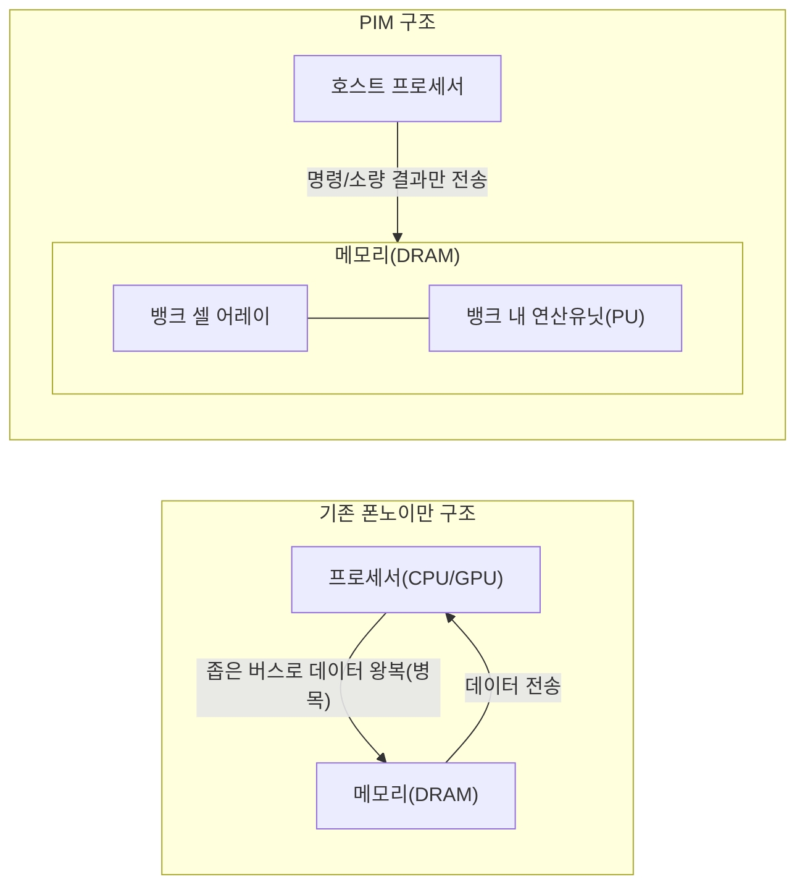
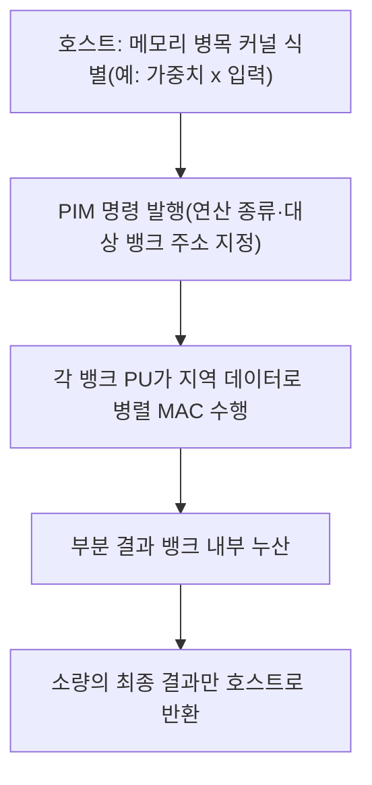

# 프로세싱 인 메모리(PIM, Processing-in-Memory)

## 1. 개요

### 가. 정의
> **프로세싱 인 메모리(PIM)** 는 데이터를 저장만 하던 메모리(DRAM 등) 내부에 **연산 유닛(간이 ALU·곱셈누산기 등)을 함께 집적**하여, 데이터를 프로세서로 옮기지 않고 **메모리가 있는 자리에서 직접 연산을 수행**하도록 만든 반도체 아키텍처이다. "연산을 데이터가 있는 곳으로 가져간다(Bring compute to data)"는 발상으로, 폰노이만 구조의 근본 병목을 완화한다.

전통적 폰노이만(Von Neumann) 구조에서 CPU·GPU 같은 연산 장치와 메모리는 물리적으로 분리되어 있고, 둘은 상대적으로 좁은 버스로 연결된다. 연산에 필요한 모든 데이터는 이 버스를 통해 메모리에서 프로세서로 오가야 하는데, 연산 성능은 수십 년간 급격히 향상된 반면 메모리 대역폭·지연은 그만큼 따라오지 못했다. 그 결과 프로세서가 데이터를 기다리며 놀게 되는 **메모리 장벽(Memory Wall)** 현상이 심화되었다. PIM은 이 장벽을 우회하기 위해, 데이터를 굳이 멀리 있는 프로세서까지 보내지 않고 메모리 뱅크 내부에서 즉시 처리한다. 삼성전자의 HBM-PIM(Aquabolt-XL), SK하이닉스의 GDDR6 기반 AiM(Accelerator-in-Memory)이 대표적 상용화 사례다.

### 나. 등장 배경 및 필요성
PIM이 부상한 배경에는 세 가지 압력이 겹쳐 있다. 첫째는 **메모리 장벽의 구조적 심화**다. 프로세서 연산량은 매년 크게 늘지만 메모리에서 데이터를 읽어오는 대역폭 증가율은 이에 못 미쳐, 데이터 이동이 전체 실행시간과 성능을 좌우하는 상황이 되었다. 특히 대규모 행렬·벡터 연산이 반복되는 AI 추론·학습에서 이 격차가 두드러진다. 둘째는 **데이터 이동의 에너지 비용**이다. 오늘날 연산 자체보다 데이터를 칩 밖으로 옮기는 데 드는 전력이 훨씬 크며, 통상 한 번의 부동소수점 연산보다 그 피연산자를 오프칩 메모리에서 가져오는 데 수십 배 이상의 에너지가 소모된다고 알려져 있다. 데이터센터 전력의 상당 부분이 이 "데이터 왕복"에 낭비되는 셈이다. 셋째는 **메모리 대역폭에 민감한(Memory-bound) 워크로드의 급증**으로, 추천시스템 임베딩 조회, LLM 추론의 가중치 읽기처럼 연산 강도(Operational Intensity)는 낮고 데이터 접근은 방대한 작업이 늘면서, 연산기를 아무리 늘려도 메모리가 발목을 잡는 국면이 일반화되었다. 이 세 압력이 맞물리며 "메모리에서 바로 계산한다"는 PIM이 현실적 대안으로 떠올랐다.

## 2. 아키텍처 구조와 동작 원리

PIM의 핵심은 **연산 유닛을 메모리 계층 어디에 두느냐**에 있다. 아래 구조도는 기존 폰노이만 구조와 PIM 구조의 데이터 흐름 차이를 보여준다.

폰노이만 구조(왼쪽)에서는 방대한 원본 데이터가 버스를 오가는 반면, PIM 구조(오른쪽)에서는 **연산이 뱅크 안에서 끝나고 호스트에는 명령과 최종 결과 같은 소량 데이터만 오간다.** 이로써 오프칩 트래픽이 대폭 줄어 대역폭 병목과 전력 소모가 함께 완화된다. 이때 성능 이득의 원천은 단순히 "가까워서 빠르다"가 아니라, **DRAM 내부의 뱅크 수준 병렬성(Bank-level Parallelism)** 을 그대로 활용한다는 데 있다. 외부 핀 수에 묶여 좁아진 오프칩 대역폭과 달리, 칩 내부에는 수많은 뱅크가 병렬로 존재하므로 각 뱅크에 붙은 연산유닛이 동시에 계산하면 **내부 실효 대역폭이 오프칩 대비 수 배로 확대**된다.

### 가. 연산유닛의 배치 위치별 유형
PIM은 연산기를 메모리의 어느 지점에 통합하느냐에 따라 성격이 크게 달라진다. **뱅크 단위 PIM(PIM-B)** 은 DRAM 각 뱅크마다 소형 연산유닛을 붙이는 방식으로, 내부 병렬성을 최대로 끌어내 대역폭 이득이 가장 크지만 다이 면적 제약이 크다. 삼성 HBM-PIM이 이 계열로, 각 뱅크에 곱셈-누산(MAC) 유닛을 배치해 AI 연산을 가속한다. **버퍼/로직 다이 PIM**은 HBM처럼 여러 DRAM 다이를 3D로 적층한 구조에서 맨 아래 **로직(베이스) 다이에 연산기를 집중**시키는 방식으로, 공정 자유도가 높고 복잡한 연산을 담기 좋으나 뱅크에서 로직 다이까지의 이동은 남는다. **PNM(Processing-Near-Memory)** 은 메모리 모듈(DIMM)이나 컨트롤러 옆에 별도 가속기를 두는 넓은 의미의 근접연산으로, 기존 시스템에 통합하기 쉬운 대신 셀에 가장 밀착한 PIM보다는 이득이 작다. 실무에서는 이들을 목적에 맞게 혼용한다.

### 나. 아날로그 방식과 디지털 방식
연산을 수행하는 회로 관점에서도 두 갈래가 있다. **디지털 PIM**은 메모리 근처에 통상적인 디지털 연산기(MAC 등)를 두어 정확한 연산을 수행하며, 정밀도와 안정성이 높아 현재 상용 제품 대부분이 채택한다. 반면 **아날로그 PIM**은 메모리 셀 어레이 자체의 물리 현상을 계산에 이용한다. 예컨대 크로스바(Crossbar) 형태의 셀 배열에 전압을 걸면 옴의 법칙(전류=전압×컨덕턴스)과 키르히호프 법칙(전류 합산)에 의해 **곱셈-누산(행렬-벡터 곱)이 물리적으로 한 번에 일어난다.** 이는 이론적으로 극도의 에너지 효율을 낼 수 있으나, 소자 편차·잡음·ADC 변환 부담으로 정밀도 확보가 어려워 아직 연구·초기상용 단계에 가깝다. 이 두 방식은 "정확성 대 효율"의 트레이드오프를 이룬다.

### 다. 오프로딩 동작 흐름
PIM이 실제로 연산을 처리하는 과정은 "호스트가 지시하고 메모리가 계산한다"로 요약된다. 아래 절차도는 행렬-벡터 곱 같은 커널을 PIM으로 위임(오프로딩)했을 때의 흐름을 나타낸다.

핵심은 3~4단계다. 방대한 원본 데이터는 뱅크 밖으로 나가지 않고, **각 뱅크의 연산유닛이 자기 뱅크에 저장된 값만으로 동시에 계산**하므로 오프칩 전송이 최소화된다. 호스트로 돌아오는 것은 누산이 끝난 소량의 결과뿐이다. 이 구조 덕에 데이터가 클수록, 그리고 같은 데이터를 재사용하지 않고 한 번 훑는 스트리밍성 작업일수록 PIM의 상대 이득이 커진다.

### 라. 유사 개념과의 비교
PIM은 데이터 중심 컴퓨팅이라는 큰 흐름 안에서 뉴로모픽·인메모리 컴퓨팅과 종종 혼동되므로 경계를 분명히 할 필요가 있다. **GPU/NPU**는 여전히 연산기와 메모리를 분리한 채 연산 병렬성을 극대화하는 접근으로, 데이터 이동 병목 자체는 남는다. **뉴로모픽 칩**은 뇌의 뉴런·시냅스를 모사해 이벤트 기반(스파이크)으로 동작하는 별도 패러다임으로, 목적은 초저전력 인지연산이며 PIM처럼 범용 메모리 병목 해소를 노리지는 않는다. 반면 PIM은 기존 DRAM 생태계를 유지한 채 "연산을 메모리로 옮긴다"는 점에서 **현행 시스템과의 호환성·즉시 적용성**이 상대적으로 높다. 즉 PIM은 급진적 대체가 아니라 메모리 병목이라는 특정 문제를 겨냥한 실용적 보완재에 가깝다.

## 3. 유형 비교와 적용 사례

메모리 유형별로 PIM이 노리는 지점이 다르다. 아래 표는 대표 방식을 비교 정리한 것이되, 각 선택의 **이유**는 뒤이어 문장으로 설명한다.

| 구분 | 기반 메모리 | 연산 위치 | 주 타깃 워크로드 | 대표 사례 |
|------|-----------|----------|----------------|----------|
| HBM-PIM | 고대역 적층 DRAM(HBM) | 뱅크 내 MAC | LLM·대규모 AI 추론 | 삼성 Aquabolt-XL |
| AiM | GDDR6 | 뱅크 근접 연산 | 생성형 AI 가속 | SK하이닉스 GDDR6-AiM |
| CXL-PIM/PNM | DDR5 + CXL | 모듈/컨트롤러 근접 | 추천·인메모리 DB | 각 사 CXL 메모리 확장 |
| 아날로그 PIM | ReRAM·SRAM 크로스바 | 셀 어레이 물리연산 | 엣지 추론(초저전력) | 연구·초기상용 |

HBM-PIM이 LLM을 노리는 이유는, 초거대 모델 추론이 방대한 가중치를 반복해 읽는 **전형적 메모리 병목 작업**이기 때문이다. 여기에 이미 대역폭이 가장 큰 HBM의 뱅크마다 연산기를 붙이면, 가중치를 오프칩으로 내보내지 않고 내부에서 곱셈-누산을 끝내 실효 대역폭과 전력효율을 동시에 끌어올릴 수 있다. 삼성은 HBM-PIM 적용 시 특정 AI 워크로드에서 성능이 크게 오르고 에너지 소모가 절반 이하로 줄어드는 효과를 제시한 바 있다. 반면 CXL 기반 PNM이 추천시스템·인메모리 DB를 겨냥하는 것은, 이들이 **용량은 크되 접근이 불규칙(임베딩 조회 등)** 하여 대용량 확장성과 표준 인터페이스 통합이 더 중요하기 때문이다. 즉 같은 PIM이라도 워크로드의 성격(대역폭 민감 vs 용량 민감)에 따라 최적 지점이 달라진다.

### 가. 표준화와 생태계 과제
PIM이 실험실을 넘어 산업 표준이 되려면 소프트웨어와 인터페이스의 표준화가 관건이다. 하드웨어가 아무리 빨라도 **개발자가 기존 프로그래밍 모델로 쉽게 쓸 수 없으면 채택되지 않는다.** 이를 위해 JEDEC은 메모리 표준에 PIM 관련 규격을 반영하는 논의를 진행해 왔고, 컴파일러·런타임이 어떤 연산을 메모리로 오프로딩할지 자동 판단하도록 돕는 소프트웨어 스택 연구가 병행된다. 표준 D2D·CXL과의 결합도 중요한데, 예컨대 CXL은 메모리 일관성과 풀링을 제공하므로 PIM/PNM 가속기를 시스템에 자연스럽게 통합하는 통로가 된다.

## 4. 고려사항 및 시사점 (기술사 관점)

- **적용 전략 — 선별적 오프로딩**: PIM은 만능이 아니라 **메모리 병목(Memory-bound) 구간에서만** 이득이 크다. 연산 강도가 높은(Compute-bound) 작업은 여전히 GPU/NPU가 유리하므로, 워크로드를 프로파일링해 대역폭 민감 커널만 PIM에 배정하는 **이기종(Heterogeneous) 분업** 설계가 핵심이다. Roofline 모델로 병목 유형을 판별한 뒤 배치 지점을 정하는 접근이 실무적이다.
- **트레이드오프 — 면적·발열·정밀도**: DRAM 다이는 저전력·고밀도에 최적화된 공정이라 연산 로직을 넣을 면적과 발열 여유가 제한적이다. 연산기를 키우면 셀 용량이 줄고, 아날로그 방식을 택하면 효율은 오르나 정밀도가 흔들린다. **"어디까지 메모리 안에서, 무엇을 밖에서"** 의 경계를 정하는 것이 설계의 본질적 난제다.
- **소프트웨어 생태계 종속성**: 하드웨어 성능이 실사용 성능으로 이어지려면 컴파일러·라이브러리·프레임워크(예: 딥러닝 프레임워크)의 지원이 필수다. 표준화가 미흡하면 벤더별 파편화로 채택이 지연되므로, JEDEC·CXL 등 **개방형 표준과의 정합**을 도입 판단의 우선 기준으로 삼아야 한다.
- **전망 — AI 반도체 메모리 중심 재편**: 메모리 장벽이 AI 성능의 최대 제약으로 부상하면서, HBM 고도화·CXL 메모리 풀링·PIM은 상호 보완적으로 발전할 가능성이 크다. 향후 AI 인프라 설계는 연산기 증설 못지않게 **데이터 이동 최소화(Data-centric Computing)** 를 축으로 재편될 전망이며, PIM은 뉴로모픽·CXL·칩렛과 결합해 이종집적 메모리-연산 플랫폼으로 진화할 것으로 보인다.

---
> **한 줄 요약**: PIM은 메모리 내부에 연산기를 두어 데이터 이동 없이 그 자리에서 계산함으로써 폰노이만 구조의 메모리 장벽과 데이터 이동 전력을 완화하는 데이터 중심 반도체 아키텍처로, 대역폭 병목형 AI 워크로드를 선별 오프로딩하는 이기종 전략과 표준·생태계 확보가 성패를 가른다.
