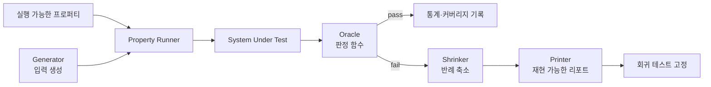
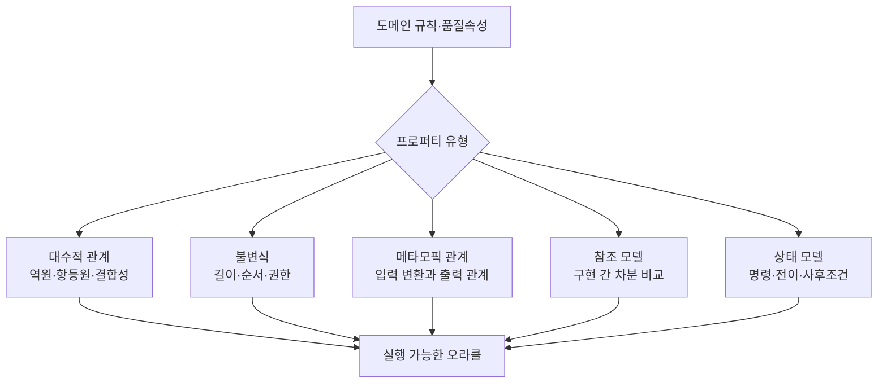

# 프로퍼티 기반 테스트(Property-Based Testing)와 생성 기반 품질검증

## 1. 개요

> 프로퍼티 기반 테스트(PBT)는 개별 입력과 기대 결과를 미리 나열하는 대신, 입력의 넓은 집합에 대해 항상 성립해야 하는 프로퍼티를 실행 가능한 명세로 작성하고 생성기가 만든 다수의 사례로 검증하는 테스트 기법이다.

소프트웨어 테스트에서 예제 기반 테스트는 사람이 선택한 대표 입력을 빠르게 검증한다. 그러나 실제 장애는 경계값, 빈 구조, 예기치 않은 조합, 긴 시퀀스처럼 테스트 작성자가 미리 열거하기 어려운 곳에서 발생한다. PBT는 이 문제를 입력 생성과 명세 검증의 문제로 바꾼다.

PBT의 핵심은 “무작위 입력을 많이 넣는다”는 단순한 개념이 아니다. 테스트 대상의 불변식, 대칭성, 전후 관계 또는 참조 모델을 먼저 정의하고, 생성기(generator)가 유효한 입력 공간을 탐색하며, 실패가 발생하면 축소기(shrinker)가 재현 가능한 최소 반례를 찾는다. 따라서 생성 품질과 프로퍼티 품질이 테스트 신뢰도를 좌우한다.

예를 들어 정렬 함수는 특정 배열 `[3, 1, 2]`의 결과만 맞추는 것보다, 모든 입력 배열에 대해 길이 보존, 결과의 비감소 순서, 원소 멀티셋 보존을 만족해야 한다고 기술하는 편이 일반화된 결함을 찾기 쉽다. 중복 제거, 음수, 빈 배열, 극단적인 정수 범위도 같은 프로퍼티 아래에서 자동으로 탐색할 수 있다.

PBT는 함수형 프로그램에서 발전했지만, 현재는 Python, Java, JavaScript, Rust, Java, Scala, C# 등 여러 언어와 API·데이터베이스·분산 시스템 검증으로 확장되었다. 다만 모든 입력을 시험하는 것은 아니므로, 생성 분포의 편향과 프로퍼티의 누락을 별도의 품질관리 대상으로 다뤄야 한다.

### 1.1 등장 배경과 필요성

첫째, 예제의 수를 늘리는 방식은 입력 공간이 커질수록 한계가 빠르게 나타난다. 문자열의 길이·문자 종류, JSON의 중첩, 권한 조합, 시간 순서까지 곱집합으로 결합되면 사람이 관리할 테스트 케이스가 폭발한다.

둘째, 실패 입력을 사람이 직접 설계하면 정상적인 분포에 치우치기 쉽다. PBT 생성기는 0, 빈 컬렉션, 최대·최소값, 중복, 특수문자 같은 경계값을 의도적으로 포함하도록 설계할 수 있다. 중요한 것은 균등 난수보다 도메인 위험에 맞춘 분포다.

셋째, 자동 생성 테스트는 실패 원인을 설명하지 못하면 개발 생산성을 떨어뜨린다. 축소와 출력(printing)을 결합하여 수백 개 원소의 입력을 몇 개 원소의 반례로 줄이면, 개발자는 실패 조건과 수정 방향을 빠르게 파악할 수 있다.

### 1.2 목표와 적용 범위

PBT의 목표는 코드 커버리지 자체가 아니라 “중요한 행위 명세를 다양한 유효 입력에서 반복 확인하는 것”이다. 따라서 단위 테스트, 계약 테스트, 회귀 테스트, 보안 검증, 모델 기반 테스트를 보완하는 방식으로 도입하는 것이 현실적이다.

산술 함수나 파서처럼 입력과 출력 관계가 명확한 대상은 도입 효과가 빠르다. 반면 시각적 레이아웃이나 주관적인 추천 품질처럼 정답 오라클이 불분명한 대상은 메타모픽 관계, 불변식, 차분 비교를 먼저 정의해야 한다.

## 2. PBT의 구성요소와 실행 구조

PBT 실행기는 프로퍼티와 생성기를 결합하여 여러 입력을 만들고 테스트 대상에 전달한다. 입력마다 오라클이 참인지 거짓인지 판단하며, 거짓이면 원래 입력을 바로 버리지 않고 축소 과정을 시작한다.

생성기는 원시값 생성기와 조합 생성기로 나뉜다. 정수·문자열·불리언 같은 원시값을 만들고, 이를 리스트·트리·레코드·도메인 객체로 결합한다. 유효한 주문, 권한, SQL 쿼리처럼 제약이 많은 값은 단순 필터보다 생성 단계에서 제약을 반영하는 편이 효율적이다.

프로퍼티는 테스트 대상의 입력을 받아 불리언 판정을 내리는 실행 가능한 명세다. 대표적인 형태는 `forall x, P(x)`이며, 실제 실행에서는 유한한 샘플을 통해 보편 명제의 반례를 찾는다. 따라서 “통과했다”는 것은 모든 입력에 대한 증명이 아니라 선택된 생성 공간에서 반례를 찾지 못했다는 의미다.

오라클은 결과를 판정하는 기준이다. 기대 결과를 직접 계산하는 참조 구현, 결과의 불변식, 두 구현의 동등성, 전후 상태의 관계를 사용할 수 있다. 오라클 자체가 같은 결함을 공유하면 테스트가 통과할 수 있으므로, 대상 코드와 독립적인 모델을 유지해야 한다.

축소기는 실패 입력을 더 작은 입력 후보로 바꾼다. 숫자는 0에 가깝게, 리스트는 원소 수를 줄이는 방향으로, 트리는 깊이와 가지 수를 줄이는 방향으로 시도한다. 축소 결과가 항상 전역 최솟값인 것은 아니지만, 사람이 이해하고 재현하기 쉬운 지역 최솟값을 얻는 것이 실무상 중요하다.

| 구성요소 | 주요 책임 | 설계 질문 |
|---|---|---|
| 프로퍼티 | 항상 성립해야 하는 행위 표현 | 무엇을 불변식으로 볼 것인가? |
| 생성기 | 입력 공간의 탐색과 분포 조절 | 유효값·경계값·희귀 조합을 얼마나 만들 것인가? |
| 실행기 | 반복, 시간 제한, 시드, 병렬화 관리 | 실패를 어떻게 재현할 것인가? |
| 오라클 | 통과·실패 판정 | 참조 모델과 독립적인가? |
| 축소기 | 최소 반례 탐색 | 도메인 제약을 보존하는가? |
| 리포터 | 입력·시드·환경 출력 | 개발자가 바로 재현할 수 있는가? |

## 3. 프로퍼티 설계 유형과 명세화

프로퍼티는 생성기보다 먼저 설계해야 한다. 생성기를 먼저 만들면 무작위 값은 많아지지만 테스트가 무엇을 보장하는지 불명확해진다. 기술사 답안에서는 “대상 행위 → 불변식 또는 관계 → 생성 공간 → 실패 처리” 순서로 설명하면 검증 논리가 명확해진다.

### 3.1 대수적 프로퍼티와 불변식

대수적 프로퍼티는 연산 사이의 관계를 표현한다. `reverse(reverse(xs)) = xs`는 리스트 뒤집기의 왕복 관계이고, `sort(sort(xs)) = sort(xs)`는 정렬의 멱등성이다. 특정 결과를 열거하지 않아도 구현의 핵심 의미를 검증할 수 있다.

불변식은 처리 전후에 보존되어야 하는 조건이다. 정렬의 경우 원소의 개수와 중복도가 보존되어야 하고 결과가 비감소 순서여야 한다. 계정 이체라면 전체 잔액 보존, 음수 잔액 금지, 한 거래의 원자성 같은 조건을 상태 불변식으로 둘 수 있다.

대수적 법칙은 프로퍼티가 간결하다는 장점이 있지만, 법칙이 도메인의 모든 의미를 포괄하지는 않는다. 정렬 결과가 순서와 멀티셋을 보존해도 안정 정렬이라는 추가 요구는 별도 프로퍼티가 필요하다. 명세의 범위를 문서화해야 과도한 합격 판정을 막을 수 있다.

### 3.2 메타모픽 프로퍼티

정답을 계산하기 어려운 시스템에서는 입력을 변환한 뒤 결과 사이의 관계를 확인한다. 예를 들어 이미지의 밝기를 일정하게 바꿔도 분류 결과가 유지되어야 한다거나, 검색 결과에 무관한 문서를 추가해도 기존 상위 결과의 순서가 부당하게 변하지 않아야 한다는 식이다.

암호화·압축·번역처럼 한 번의 정답을 만들기 어려운 기능도 메타모픽 관계를 적용할 수 있다. 압축 후 복원한 결과가 원문과 같아야 하고, 암호화 후 복호화한 결과가 평문과 같아야 한다. 단, 관계가 실제 요구사항과 맞는지 확인하지 않으면 잘못된 불변성을 강제하게 된다.

메타모픽 테스트는 AI 시스템의 편향과 강건성 점검에도 유용하지만, “변환에 불변”이 항상 바람직한 것은 아니다. 예를 들어 날짜를 바꾸면 요금이 달라져야 하는 서비스도 있다. 변환 전후에 동일해야 하는 요소와 달라져야 하는 요소를 명시적으로 구분해야 한다.

### 3.3 모델 기반·상태 기반 프로퍼티

CRUD API나 분산 상태 시스템은 단일 함수 호출보다 명령의 순서가 중요하다. 상태 모델은 추상적인 참조 상태를 두고 `create`, `update`, `delete`, `read` 명령의 전이와 사후조건을 정의한다. 생성기는 명령 시퀀스를 만들고 매 단계에서 실제 시스템 상태와 모델 상태를 비교한다.

예를 들어 장바구니 모델에서 상품 추가 후 수량 증가, 삭제, 결제 취소를 무작위 순서로 실행할 수 있다. 실제 서비스가 모델과 다른 상태를 보이면 축소기가 명령 시퀀스를 줄여 최소한의 실패 순서를 제시한다. 동시성까지 포함하면 실행 순서와 관찰 시점을 함께 기록해야 한다.

모델은 시스템 전체를 복제하는 것이 아니라 검증할 핵심 상태만 표현해야 한다. 모델이 구현과 같은 자료구조와 알고리즘을 사용하면 동일한 오류가 재현되어도 통과할 수 있다. 독립적인 단순 모델과 실제 구현을 비교하는 것이 원칙이다.

## 4. 생성기와 축소기 설계

### 4.1 입력 공간과 분포

균등 난수는 간단하지만 위험한 입력을 충분히 만들지 못할 수 있다. 문자열 파서라면 빈 문자열, 유니코드 조합, 널 문자, 매우 긴 토큰, 잘못된 인코딩을 의도적으로 가중해야 한다. 금융 계산이라면 소수점 경계, 반올림 경계, 최대 금액과 음수 부호가 핵심이다.

생성기는 원시 생성기, 조합 생성기, 제약 생성기로 나눌 수 있다. 조합 생성기는 리스트나 트리를 재귀적으로 만들고, 제약 생성기는 도메인 불변식을 만족하는 객체만 생성한다. 재귀 구조에서는 크기 매개변수와 최대 깊이를 둬 무한 생성과 실행 시간 폭증을 막는다.

유효 입력과 비유효 입력의 비율도 전략적으로 관리해야 한다. 파서의 문법 검증은 유효 문서를 많이 만들어 정상 경로를 확인하되, 오류 처리 프로퍼티를 위해 비유효 문법도 일정 비율 생성한다. 단순 `filter`로 버리면 생성 비용이 증가하므로 가능하면 생성기 자체에서 조건을 만족시킨다.

실행 통계는 생성기 품질을 판단하는 근거가 된다. 파티션별 입력 수, 최대 깊이, 빈 값 비율, 예외 유형, 코드 경로별 도달 여부를 관찰하고 지나치게 드문 영역은 생성 가중치를 조정한다. 테스트 횟수만 보고 충분하다고 결론 내리지 않는다.

### 4.2 축소와 최소 반례

축소는 실패 입력을 작게 만드는 탐색 문제다. 리스트라면 접두·접미 제거와 원소 축소를 시도하고, 정수라면 0·1·부호 경계 방향으로 줄이며, 문자열이라면 길이와 문자 복잡도를 줄인다. 도메인 객체는 유효성 제약을 깨지 않도록 축소 후보를 설계해야 한다.

외부 축소 방식은 생성 후 값에 축소 함수를 적용한다. 구현이 직관적이고 기존 생성기와 결합하기 쉽지만, 축소 중에 생성기의 불변식이 깨질 수 있다. 통합 축소 방식은 생성 과정의 선택을 줄여 유효성을 보존하기 쉽지만, 생성기 구조와 축소 로직의 결합도가 높아질 수 있다.

최소 반례는 반드시 전역 최소라는 뜻이 아니다. 실행기는 시간과 비용을 고려해 지역 최소에서 멈출 수 있다. 그러므로 리포트에는 입력뿐 아니라 생성 시드, 프레임워크 버전, 환경 설정, 실행 명령을 함께 남겨 같은 반례를 재현할 수 있게 한다.

축소 결과를 회귀 테스트로 고정할 때는 “현재 버그를 재현하는 입력”과 “요구사항을 설명하는 프로퍼티”를 함께 보존한다. 반례만 고정하면 특정 결함은 막지만 유사한 변형을 놓칠 수 있고, 프로퍼티만 유지하면 수정 전후의 구체적인 재현성이 약해질 수 있다.

## 5. 도입 절차와 CI/CD 운영

PBT 도입은 대상 선정, 프로퍼티 명세, 생성기 작성, 소규모 실행, 반례 축소, CI 편입의 순서로 진행한다. 처음부터 전체 시스템을 무작위화하기보다 계산 함수나 파서처럼 입출력 경계가 뚜렷한 모듈을 선택한다.

로컬 실행은 빠른 피드백을 위해 테스트 수와 최대 시간을 작게 두고, PR 단계에서는 결정적 시드와 제한된 실행량으로 변경 결함을 검출한다. 야간 또는 릴리스 파이프라인에서는 여러 시드, 더 큰 구조, 상태 시퀀스, 장시간 실행을 적용한다.

재현성은 난수 시드만 저장한다고 완전히 보장되지 않는다. 생성기의 버전, 의존 라이브러리, 운영체제, 시간대, 데이터베이스 초기 상태, 병렬 실행 순서가 결과에 영향을 줄 수 있다. CI 로그에 이 정보를 남기고, 실패 입력을 직렬화해 시드가 달라도 재현할 수 있게 한다.

테스트 실패 정책은 프로퍼티의 성격에 따라 구분한다. 안전성·보안·금액 계산 불변식은 단 한 번의 실패도 빌드를 차단하는 것이 적절하다. 통계적 품질이나 탐색적 메타모픽 테스트는 실패 반례를 이슈로 등록하고 원인 분석 후 차단 수준을 조정할 수 있다.

## 6. 기존 기법과 비교

예제 기반 테스트는 사람이 읽기 쉽고 실패 원인이 명확하다. PBT는 입력 공간을 넓게 탐색하고 공통 규칙을 재사용한다. 둘은 경쟁 관계가 아니라, 대표 업무 시나리오는 예제 테스트로 고정하고 경계·조합·불변식은 PBT로 보강하는 관계다.

퍼징은 비정상 입력과 취약점 탐지를 위해 바이트나 구조를 변형하고 실행 피드백을 활용하는 경우가 많다. PBT는 실행 가능한 도메인 프로퍼티와 유효 생성에 초점을 둔다. 구조 인식 퍼징과 PBT를 결합하면 문법적으로 유효한 입력을 만들면서도 커버리지와 오류 경로를 넓힐 수 있다.

뮤테이션 테스트는 테스트가 인위적인 코드 변형을 잡아내는지 확인하여 테스트 스위트의 민감도를 평가한다. PBT는 입력을 생성하는 방식이고 뮤테이션 테스트는 테스트 품질을 평가하는 방식이므로 함께 사용할 수 있다. 프로퍼티가 너무 약하면 변이 생존율이 높게 나타난다.

형식 검증은 수학적 증명이나 모델 검사를 통해 특정 가정을 만족하는 모든 상태를 다룰 수 있다. PBT는 증명보다 구현·환경·라이브러리 경계에서 실제 실행 반례를 찾는 데 강하다. 안전성이 매우 중요한 핵심 알고리즘은 형식 검증, PBT, 예제 테스트를 계층적으로 조합한다.

| 구분 | 예제 기반 테스트 | PBT | 퍼징 | 형식 검증 |
|---|---|---|---|---|
| 입력 선정 | 사람이 선택 | 생성기·전략 | 변형·피드백 | 모델·제약 기반 |
| 오라클 | 기대값 | 프로퍼티·모델 | 충돌·예외·취약점 신호 | 논리 명세 |
| 강점 | 이해와 디버깅 | 일반화·경계 탐색 | 파서·메모리 오류 탐지 | 포괄적 보장 가능 |
| 한계 | 조합 폭발 | 프로퍼티 작성 난이도 | 의미 있는 정답 부족 | 모델링·증명 비용 |
| 적합 위치 | 핵심 시나리오 | 불변식·계약 | 공격면·비정상 입력 | 고위험 알고리즘 |

## 7. 적용 사례

### 7.1 정렬 함수

정렬 함수의 프로퍼티는 결과가 비감소 순서인지, 입력과 출력의 원소 멀티셋이 같은지, 결과 길이가 같은지로 구성할 수 있다. 정렬된 결과를 다시 정렬해도 같아야 한다는 멱등성 프로퍼티도 추가한다.

생성기는 빈 배열, 단일 원소, 중복 배열, 음수와 큰 정수의 혼합을 만든다. 잘못된 구현이 중복을 제거하면 축소기는 `[0, 0]`과 같이 최소 반례를 제시할 수 있다. 이 반례는 결함 원인을 “순서”가 아니라 “멀티셋 보존 누락”으로 좁혀 준다.

### 7.2 JSON·프로토콜 파서

파서에서는 유효 문서가 AST로 변환된 뒤 다시 직렬화해도 의미가 유지되는 왕복 프로퍼티를 둘 수 있다. 또한 파서는 임의의 입력에 대해 프로세스를 비정상 종료시키지 않고, 허용된 오류 타입으로 실패해야 한다는 안전성 프로퍼티를 둔다.

생성기는 중첩 깊이, 배열 길이, 키 중복, 유니코드, escape, 숫자 경계를 조절한다. 최대 깊이를 제한하지 않으면 스택 고갈이 발생할 수 있으므로 자원 한도 자체도 테스트 요구사항으로 만든다. 실패 반례에는 원문, 파싱 단계, 환경과 시드를 함께 기록한다.

### 7.3 API와 데이터베이스 상태

API 계약은 요청을 직렬화하고 응답을 역직렬화하는 왕복 관계, HTTP 상태 코드와 본문 스키마의 일관성, 권한 없는 요청의 불변식으로 검증할 수 있다. 상태 기반 생성기는 생성·수정·삭제·재시도·중복 요청 시퀀스를 만든다.

데이터베이스에서는 트랜잭션 성공 전후의 잔액 합계, 유일성 제약, 재시도 후 중복 생성 방지를 프로퍼티로 설정한다. 외부 결제나 메시지 브로커가 포함되면 테스트 더블과 격리된 환경을 사용하고, 실제 운영 데이터가 생성기에 유입되지 않도록 개인정보와 비밀을 차단한다.

## 8. 심화: 상태·동시성·생성형 AI 검증

상태 기반 PBT는 단순 함수 테스트를 서비스 운영 행위 테스트로 확장한다. 명령 생성기, 사전조건, 실행 함수, 모델 전이, 사후조건을 분리하면 장바구니·캐시·락·워크플로의 긴 상태 시퀀스를 자동으로 탐색할 수 있다.

동시성 시스템에서는 순차 프로퍼티만으로 충분하지 않다. 동일한 자원에 대한 교차 실행, 지연, 재시도, 메시지 중복과 순서 역전을 생성하고, 선형화 가능성이나 최종 일관성처럼 시스템이 보장하는 수준을 오라클로 정의해야 한다.

커버리지 유도 PBT는 실행 경로·분기·피드백을 관찰하여 새 경로를 만드는 입력에 가중치를 줄 수 있다. 그러나 높은 코드 커버리지가 비즈니스 규칙의 완전한 검증을 뜻하지는 않는다. 커버리지 지표는 프로퍼티의 의미적 범위와 함께 해석한다.

생성형 AI 시스템은 단일 정답이 없거나 출력이 확률적이므로, 형식 일관성·금칙어·근거 존재·입력 변환에 대한 안정성·모델 간 차분을 프로퍼티로 설계할 수 있다. 출력의 창의성까지 동일성을 강제하면 정상 변형을 결함으로 오인할 수 있으므로 허용 범위와 평가 기준을 분리한다.

최신 프레임워크는 생성기 조합, 자동 축소, 상태 기계, 병렬 실행, 커버리지 피드백을 제공하는 방향으로 발전하고 있다. 다만 특정 프레임워크의 기능에 종속되기보다 프로퍼티·데이터 분포·오라클·재현성이라는 원칙을 조직의 테스트 표준으로 먼저 정하는 것이 바람직하다.

## 9. 고려사항 및 시사점

### 9.1 프로퍼티의 완전성

프로퍼티가 약하면 많은 입력을 통과해도 중요한 결함을 놓친다. 요구사항·위험 목록·장애 사례를 출발점으로 보존해야 할 불변식과 허용되는 변화를 구분한다.

프로퍼티 리뷰는 코드 리뷰와 별도로 수행한다. 도메인 전문가가 규칙의 의미를 확인하고, 개발자가 실행 가능성과 오라클 독립성을 확인해야 한다. “항상”이라는 표현이 실제 계약 범위와 맞는지도 검토한다.

### 9.2 생성기 편향과 효율

생성기가 쉬운 정상값만 만들면 테스트 수가 많아도 탐색 범위가 좁다. 경계값, 희귀 조합, 비정상 입력, 실제 장애에서 발견된 패턴을 가중치와 예시로 반영한다.

필터 기반 생성이 대부분의 후보를 버리면 실행 시간이 낭비되고 분포가 왜곡된다. 조합 생성기와 제약 생성기를 사용하고, 파티션별 생성 비율을 통계로 검증한다.

### 9.3 실패 반례와 운영 품질

재현 가능한 반례 저장은 자동화의 핵심 산출물이다. 입력, 시드, 프레임워크 버전, 환경, 명령 시퀀스를 보존하고, 개인정보나 비밀이 포함될 경우 마스킹과 접근통제를 적용한다.

축소된 반례는 회귀 테스트로 승격하되 원래 프로퍼티를 대체하지 않는다. 반례가 해결된 뒤에도 동일한 결함 계열을 찾도록 생성기와 프로퍼티를 보강한다.

### 9.4 CI 비용과 품질 게이트

PR 단계의 빠른 실행과 야간의 깊은 실행을 분리하면 개발자 피드백과 탐색 깊이를 함께 확보할 수 있다. 테스트 개수보다 최대 시간, 실패율, 신규 반례, 파티션 커버리지를 기준으로 운영한다.

무작위 실패를 flaky test로 취급해 무조건 재시도하면 결함을 숨길 수 있다. 먼저 시드와 입력을 고정해 재현하고, 비결정성의 원인을 동시성·시간·외부 의존성으로 분해한 뒤 재시도 정책을 정한다.

### 9.5 보안·개인정보·안전

생성 데이터가 실제 고객 정보와 닮았더라도 운영 개인정보를 복사하지 않는다. 합성 데이터와 비밀 탐지, 로그 마스킹, 테스트 환경 격리를 적용한다.

파서·인증·권한·암호 처리처럼 공격면이 넓은 코드는 비정상 입력과 권한 조합을 별도 위험 분류로 다룬다. 발견된 보안 반례는 재현 가능한 보안 회귀 테스트와 취약점 관리 절차에 연결한다.

### 9.6 기술사 관점의 로드맵

단계적으로는 핵심 순수 함수와 데이터 변환부터 시작하고, API 계약과 상태 모델로 확장한 뒤, 분산·동시성·AI 시스템으로 범위를 넓힌다. 각 단계에서 프로퍼티 템플릿과 조직 공통 생성기를 재사용한다.

성과는 테스트 수가 아니라 결함 조기 발견, 반례 분석 시간, 회귀 재발률, 위험 영역의 의미적 커버리지로 측정한다. 예제 테스트·PBT·퍼징·뮤테이션·형식 기법의 역할을 중복 없이 배치할 때 테스트 포트폴리오의 비용 대비 효과가 높아진다.

## 참고자료

- [Haskell QuickCheck 패키지 문서](https://hackage.haskell.org/package/QuickCheck) — 프로퍼티 명세, 생성기 조합, 무작위 사례 실행의 기본 개념.
- [Hypothesis 전략 문서](https://hypothesis.readthedocs.io/en/latest/data.html) — 전략 조합, 동적 생성, 재귀 생성과 입력 축소 관련 API.
- [Hypothesis 공식 저장소](https://github.com/HypothesisWorks/hypothesis) — Python 프로퍼티 기반 테스트 프레임워크의 개요와 실행 예.
- [Programmable Property-Based Testing](https://arxiv.org/html/2602.18545v1) — 프로퍼티, 생성기, 축소기, 프린터, 실행기의 구조와 최근 연구 방향.

---

> **한 줄 요약**: 프로퍼티 기반 테스트는 실행 가능한 불변식과 도메인 생성기로 넓은 입력 공간을 탐색하고, 축소된 반례를 회귀 테스트로 연결해 품질을 일반화하는 검증 전략이다.
