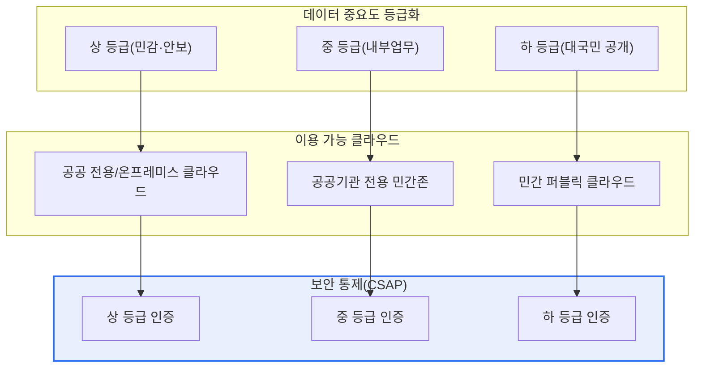

# 공공부문 민간 클라우드 활용

## 1. 개요

### 가. 정의
> **공공부문 민간 클라우드 활용**이란 정부·공공기관이 자체 전산실(온프레미스)을 구축·운영하는 대신, 상용 사업자가 제공하는 검증된 **민간 클라우드(퍼블릭·전용) 서비스를 임차**하여 정보시스템을 구축·운영하는 조달·운영 방식이다. 유연성·비용 효율이라는 클라우드 본연의 이점을 취하되, 국민의 민감정보와 국가 서비스를 다루는 공공의 특수성 때문에 **보안·데이터주권 요건을 반드시 함께 충족**해야 한다는 점에서 민간의 클라우드 도입과 결정적으로 구별된다.

공공부문의 민간 클라우드 활용이 특별한 이유는 '**효율성과 보안·주권을 동시에 만족해야 한다**'는 이중 제약에 있다. 민간 기업이 클라우드를 도입할 때의 판단 기준은 대체로 총소유비용(TCO)과 출시 속도, 확장성 같은 경제적·기술적 효용이다. 그러나 공공은 여기에 더해 국민 개인정보 보호, 국가 핵심 데이터의 국외 유출 방지, 서비스 중단 시의 사회적 파장까지 함께 저울질해야 한다. 민간 클라우드는 신속한 자원 확보, 탄력적 확장, 자본지출(CAPEX)의 운영비용(OPEX) 전환이라는 명확한 이점을 제공하지만, 공공 데이터의 상당수는 주민등록번호·건강·과세 같은 민감정보와 국가 안보 관련 정보를 포함하므로 아무 클라우드나 사용할 수 없다.

그래서 우리나라 공공은 데이터의 중요도(민감도·파급도)에 따라 이용 가능한 클라우드를 차등화하고, **CSAP(클라우드 컴퓨팅 서비스 보안인증)** 를 획득한 서비스를 우선 활용하며, 논리적 망분리·데이터의 국내 보관·암호화 같은 통제 요건을 준수한다. 즉 '민간의 혁신성과 규모의 경제를 취하되 공공의 보안 통제 프레임 아래 둔다'는 균형이 이 주제의 핵심 명제이며, 이 균형점을 어디에 두느냐가 정책·설계·감독 전 단계를 관통하는 판단 기준이 된다.

### 나. 등장 배경 및 필요성
공공부문 민간 클라우드 활용이 본격화된 배경에는 세 가지 흐름이 겹쳐 있다. 첫째, **디지털플랫폼정부(DPG)와 클라우드 네이티브 전환** 정책이다. 정부는 부처·기관별로 분절된 정보시스템을 클라우드 기반의 개방형·연계형 구조로 재편하려 하고, 이를 위해서는 마이크로서비스·컨테이너·서버리스 같은 클라우드 네이티브 기술을 담을 그릇으로서 성숙한 클라우드 인프라가 필요하다. 자체 구축한 인프라(IaaS)만으로는 이런 최신 관리형 서비스(PaaS·SaaS)를 따라잡기 어렵다.

둘째, **자체 구축의 비효율**이다. 기관마다 전산실을 짓고 서버를 사서 운영하면 초기 투자와 유지보수 부담이 크고, 자원 활용률은 낮으며, 수요 급증(재난지원금 신청, 대입 접수 등 트래픽 폭증)에 탄력적으로 대응하기 어렵다. 실제로 대규모 접속이 몰리는 공공 서비스가 개통 초기에 마비되는 사례가 반복되면서, 탄력적 확장이 가능한 클라우드의 필요성이 부각되었다.

셋째, **검증 체계의 성숙**이다. 과거에는 '클라우드가 과연 공공이 요구하는 보안 수준을 맞출 수 있는가'라는 신뢰 문제가 걸림돌이었으나, CSAP 인증 제도와 「클라우드컴퓨팅법」·「공공기관의 정보시스템 클라우드 전환·통합 계획」 등 제도적 기반이 갖춰지면서 검증된 민간 클라우드를 활용할 근거가 마련되었다. 이 세 흐름이 맞물려 '자체 구축 우선'에서 '민간 클라우드 우선 검토(Cloud First)'로 정책 기조가 이동했다.

## 2. 전체 구조와 활용 유형

공공의 민간 클라우드 활용은 단순히 서버를 빌리는 문제가 아니라, **데이터 중요도 → 이용 가능 클라우드 → 보안 통제 수준**을 하나의 사슬로 엮어 설계하는 문제다. 아래 개념도는 그 전체 구조를, 그 다음 개념도는 실제 활용 절차의 세부 흐름을 나타낸다.

이 구조가 의미하는 바를 문단으로 풀면 다음과 같다. 공공은 먼저 대상 시스템이 다루는 데이터를 **중요도에 따라 등급화**한다. 국가 안보나 국민의 민감정보처럼 유출·훼손 시 파급이 큰 '상' 등급 데이터는 통제가 가장 강한 환경(공공 전용 클라우드 또는 온프레미스)에 두고, 내부 행정업무 위주의 '중' 등급은 공공기관만 격리 수용하는 전용존에, 이미 공개된 정보 위주의 '하' 등급은 일반 민간 퍼블릭 클라우드에 둘 수 있다. 핵심은 **모든 데이터에 동일한 최고 수준 통제를 적용하지 않는다**는 점이다. 그렇게 하면 안전하지만 비용과 유연성을 모두 잃는다. 반대로 통제를 일률적으로 낮추면 민감정보가 위험에 노출된다. 그래서 '중요도에 비례한 차등 통제'가 효율성과 안전성을 동시에 살리는 유일한 현실적 해법이 된다.

이때 통제의 실질을 담보하는 장치가 **CSAP(클라우드 보안인증)** 이다. CSAP는 공공에 제공되는 클라우드 서비스가 일정 보안 기준(관리적·물리적·기술적 통제)을 충족하는지 제3자가 평가·인증하는 제도로, 서비스 유형(IaaS·PaaS·SaaS)별로 신청→평가→인증의 절차를 거친다. 인증 등급 체계가 데이터 중요도 등급과 대응되므로, 기관은 '이 데이터에는 이 등급 이상 인증을 받은 서비스만 쓴다'는 규칙으로 안전성을 담보할 수 있다. 인증된 서비스를 활용하면 기관이 매번 개별 보안성 검토를 처음부터 수행하는 부담이 줄고, 사업자 간 보안 수준을 객관적으로 비교할 수 있다.

### 가. 서비스 유형별 평가 관점과 책임공유
민간 클라우드는 IaaS·PaaS·SaaS로 계층화되며, 계층이 올라갈수록 사업자(CSP)가 책임지는 범위가 넓어지고 이용 기관이 직접 통제할 범위는 좁아진다. 이 **책임공유모델(Shared Responsibility Model)** 을 정확히 이해하지 못하면 '사업자가 알아서 다 해줄 것'이라는 착각으로 보안 공백이 생긴다.

| 서비스 유형 | 주요 평가 관점 | 이용기관 책임 | CSP 책임 |
|---|---|---|---|
| **IaaS** | 인프라 보안, 격리·망분리 | OS·미들웨어·앱·데이터 | 물리설비·하이퍼바이저·네트워크 |
| **PaaS** | 플랫폼 보안, 개발환경 통제 | 앱·데이터·계정 | OS·런타임·플랫폼 |
| **SaaS** | 응용 보안, 데이터 보호·접근통제 | 데이터·계정·설정 | 앱 전반·인프라 |

IaaS에서는 기관이 운영체제 위쪽(패치·계정·방화벽 규칙·데이터 암호화)을 직접 책임지므로 통제 자유도가 높은 대신 관리 부담이 크다. SaaS로 갈수록 사업자가 대부분을 책임지지만, 그렇다고 기관의 책임이 사라지는 것은 아니다. **계정·권한 관리와 설정, 무엇보다 데이터 자체에 대한 책임은 어떤 유형에서도 이용 기관에 남는다.** 실제 클라우드 사고의 상당수가 사업자의 인프라 결함이 아니라 이용자의 접근권한 설정 오류(예: 스토리지 버킷의 공개 설정 실수)에서 비롯된다는 점은 이 책임 경계의 중요성을 잘 보여준다.

## 3. 활용 절차와 기본 설계

민간 클라우드를 실제로 도입하는 과정은 '수요·중요도 산정 → 보안성 검토 → 기본 설계 → 구축·이행 → 운영·감독'의 생애주기로 진행되며, 각 단계는 앞 단계의 산출물을 입력으로 받아 다음 단계를 규정한다.

**수요·중요도 산정** 단계에서는 어떤 시스템을 언제 얼마나 클라우드로 옮길지, 그 시스템이 다루는 데이터의 중요도가 어느 등급인지를 평가한다. 이 산정 결과가 뒤따르는 모든 설계의 전제가 되므로, 데이터 흐름과 개인정보 처리 현황을 정밀하게 식별하는 것이 관건이다. 등급을 과대평가하면 불필요하게 비싼 통제를 부담하고, 과소평가하면 민감정보가 위험에 노출된다.

**보안성 검토** 단계에서는 대상 등급에 부합하는 CSAP 인증 서비스인지 확인하고, 개인정보 영향평가(PIA) 대상 여부, 국내 리전 보관 요건, 암호화·접근통제 요건을 점검한다. 인증 서비스 우선 원칙에 따라, 가능하면 이미 검증된 서비스 카탈로그(디지털서비스 전문계약제도의 이용지원시스템 등) 안에서 선택함으로써 조달과 검토를 동시에 효율화한다.

**기본 설계** 단계에서는 아키텍처(가용영역·리전 구성), 논리적 망분리(공공 업무망과 인터넷망의 분리), 재해복구(DR)와 백업 전략, 기존 시스템에서의 데이터 이관 방식을 확정한다. 특히 공공은 서비스 연속성이 사회적 의무이므로, 단일 리전 장애가 서비스 전면 중단으로 이어지지 않도록 다중 가용영역·다중 리전 설계를 고려한다. **구축·이행** 단계에서는 실제 마이그레이션을 수행하며 이관 전후 데이터 정합성을 검증하고, **운영·감독** 단계에서는 SLA(가용성·성능) 준수 여부, 비용, 보안 관제를 지속 점검하고 주기적으로 등급·통제를 재평가한다.

### 가. 마이그레이션 전략의 선택
기본 설계와 구축·이행 단계를 관통하는 핵심 의사결정은 '기존 시스템을 어떤 방식으로 클라우드로 옮길 것인가'이다. 통상 마이그레이션 전략은 여러 유형(이른바 6R — Rehost, Replatform, Refactor, Repurchase, Retire, Retain)으로 구분되며, 시스템 특성과 예산·기한에 따라 달리 적용한다. 노후 시스템을 큰 개조 없이 그대로 옮기는 리호스트(Lift & Shift)는 빠르고 위험이 낮지만, 클라우드의 탄력성·관리형 서비스 이점을 온전히 누리지 못한다. 반대로 애플리케이션을 컨테이너·마이크로서비스로 재설계하는 리팩터는 클라우드 네이티브 이점을 극대화하지만 시간·비용·기술 난도가 높다.

공공에서는 서비스 중단이 곧 대국민 불편으로 직결되므로, 무리한 일괄 전환보다 중요도가 낮은 시스템부터 단계적으로 이관해 경험과 운영 역량을 축적하는 접근이 안전하다. 또한 이관 과정에서 개인정보·핵심 데이터가 임시 저장소나 로그에 노출되지 않도록 암호화·접근통제를 유지하고, 이관 전후 레코드 건수·체크섬을 대조해 정합성을 검증하는 것이 필수다. 이 검증을 소홀히 하면 데이터 누락·중복이 운영 단계에서야 발견되어 훨씬 큰 비용으로 되돌아온다.

## 4. 활용구조 비교와 적용 사례

공공의 클라우드 활용구조는 '데이터를 어디에, 누구와 함께 두느냐'에 따라 크게 세 가지로 나뉘며, 각각의 선택에는 명확한 트레이드오프가 있다.

| 구조 | 특징 | 장점 | 한계 |
|---|---|---|---|
| **공공 전용 클라우드** | 공공만 이용하는 격리 인프라(예: 국가정보자원관리원 G-Cloud) | 최고 수준 보안·주권 | 확장성·최신 서비스 제약 |
| **민간 전용존(공공존)** | 민간 CSP가 공공 전용으로 물리·논리 격리 | 민간 혁신성+격리 | 비용·전용 인증 필요 |
| **민간 퍼블릭** | 일반 상용 클라우드 이용 | 최신 서비스·규모의 경제 | 상 등급 데이터 부적합 |

이 세 구조의 차이가 생기는 근본 이유는 '**격리 수준과 혁신성이 상충한다**'는 데 있다. 완전히 격리된 공공 전용 클라우드는 데이터주권과 보안 면에서 가장 안전하지만, 민간이 빠르게 내놓는 최신 관리형 AI·데이터 서비스를 곧바로 쓰기 어렵고 자원 확장에도 한계가 있다. 반대로 민간 퍼블릭은 최신 서비스와 규모의 경제를 누리지만 다른 고객과 인프라를 공유하므로 상 등급 데이터에는 부적합하다. 그래서 실무에서는 등급이 낮은 대국민 서비스는 퍼블릭에, 민감한 내부 시스템은 전용존이나 전용 클라우드에 두는 **하이브리드**가 현실적 절충으로 자리 잡는다.

구체적 사례로, 대규모 트래픽이 예측 불가능하게 몰리는 대국민 서비스(예: 국가 예방접종 예약, 재난지원금 신청)는 오토스케일링이 가능한 민간 퍼블릭 클라우드에 두어 개통 초기의 접속 폭주에 대응하는 편이 자체 구축보다 유리하다. 반면 과세·복지 수급 같은 민감정보 중심 시스템은 CSAP 상 등급 요건을 충족하는 격리 환경에 두어 유출 위험을 통제한다. 또한 여러 기관이 공통으로 쓰는 표준 업무(메일·협업·문서) SaaS는 개별 구축 대신 공동 활용함으로써 중복 투자를 줄이는 방향으로 전환이 진행되고 있다.

### 나. SLA와 운영 감독의 실제
운영·감독 단계에서 SLA(서비스수준협약)는 형식적 문서가 아니라 서비스 품질을 강제하는 계약적 장치다. 공공 서비스는 가용성(예: 월간 99.9% 이상), 장애 복구 시간, 성능 지표를 SLA로 명문화하고, 미달 시 이용료 감면 같은 배상 조항을 두어 사업자의 책임을 담보한다. 다만 SLA가 보장하는 것은 인프라 계층의 가용성일 뿐, 그 위에 얹힌 애플리케이션의 결함까지 책임지지는 않으므로, 기관은 자체 모니터링·관제 체계를 병행해 서비스 전체의 품질을 관측해야 한다. 또한 비용 측면에서 클라우드는 쓴 만큼 과금되는 특성상 방치하면 비용이 눈덩이처럼 불어날 수 있으므로, 사용량·유휴자원을 지속 점검하는 비용 거버넌스(FinOps)를 운영 감독의 일부로 포함하는 것이 바람직하다.

## 5. 심화: 최신 동향과 정책 변화

최근 공공 클라우드 정책은 몇 가지 방향으로 진화하고 있다. 첫째, **CSAP 등급제**의 정착이다. 과거 단일 기준이던 CSAP가 데이터 중요도에 따라 상·중·하 등급으로 세분화되면서, 낮은 등급 시스템에 대해서는 민간 퍼블릭 참여 문턱이 낮아졌고, 이는 국내 클라우드 시장에 글로벌 사업자의 조건부 참여 논의로 이어지고 있다. 이는 '보안'과 '산업 진흥·경쟁 촉진' 사이의 정책적 균형을 다시 조정하는 흐름으로 이해할 수 있다.

둘째, **디지털플랫폼정부와 클라우드 네이티브 전환**의 결합이다. 단순히 서버를 클라우드로 옮기는 리프트 앤 시프트(Lift & Shift)를 넘어, 컨테이너·마이크로서비스·서버리스로 애플리케이션 구조 자체를 재설계하여 클라우드의 탄력성과 개방형 연계를 온전히 활용하려는 방향으로 목표가 상향되고 있다. 셋째, **디지털서비스 전문계약제도**를 통한 조달 혁신으로, 클라우드·SaaS를 기존의 경직된 공공 조달 절차 대신 카탈로그 기반으로 신속하게 계약할 수 있게 되었다. 다만 최신 사실관계(등급 기준의 세부 수치, 글로벌 CSP의 참여 범위, 제도 개정 시점)는 지속적으로 바뀌므로, 실제 답안·실무 적용 시에는 최신 고시·지침을 확인해 단정적 서술을 피하는 편이 안전하다.

## 6. 고려사항 및 시사점

1. **데이터 중요도 기반 차등 적용이 대원칙이다.** 모든 시스템에 동일한 통제를 적용하는 것은 비효율(과잉통제)이거나 위험(과소통제)이다. 중요도·민감도 등급에 비례해 이용 가능한 클라우드와 통제 수준을 달리하는 것이 효율성과 안전성을 동시에 확보하는 유일한 균형점이다.
2. **CSAP 인증 서비스 우선 활용으로 보안성과 절차 효율을 함께 얻는다.** 인증 서비스를 쓰면 개별 보안성 검토 부담이 줄고 신뢰가 담보되며, 사업자 간 객관적 비교가 가능해진다. 인증 등급과 데이터 등급을 대응시키는 규칙화가 실무의 핵심이다.
3. **책임공유모델을 명확히 하고 Exit(전환) 전략을 갖춰야 한다.** 서비스 유형별로 이용기관과 CSP의 책임 경계를 문서화하되, 데이터·계정·설정에 대한 책임은 언제나 기관에 남음을 인식해야 한다. 동시에 계약 종료·사업자 전환 시 데이터를 온전히 반환·이관할 수 있는 계획으로 **벤더 종속(Lock-in)** 을 완화해야 한다.
4. **데이터주권·상호운용성·비용 거버넌스를 함께 관리한다.** 국내 리전 보관·암호화로 주권을 확보하고, 개방형 표준·멀티클라우드로 상호운용성을 높이며, FinOps 관점에서 사용량 기반 비용을 지속 최적화(불필요 자원 회수, 예약·약정 활용)해 클라우드 도입의 효율 이점이 방만한 비용으로 상쇄되지 않도록 감독한다.

## 참고자료
- 과학기술정보통신부, 「클라우드컴퓨팅 서비스 보안인증(CSAP) 제도」 안내
- 행정안전부·디지털플랫폼정부위원회, 공공부문 클라우드 전환·디지털플랫폼정부 관련 정책 자료

---

> **한 줄 요약**: 공공부문 민간 클라우드 활용은 *수요·중요도 산정 → CSAP 보안성 검토 → 기본 설계 → 구축·이행 → 운영·감독* 생애주기로 이뤄지며, **데이터 중요도 기반 차등 통제·CSAP 인증 서비스 우선·책임공유모델과 Exit 전략**을 통해 민간의 효율성·혁신성과 공공의 보안·데이터주권을 균형 있게 확보하는 것이 핵심이다.
