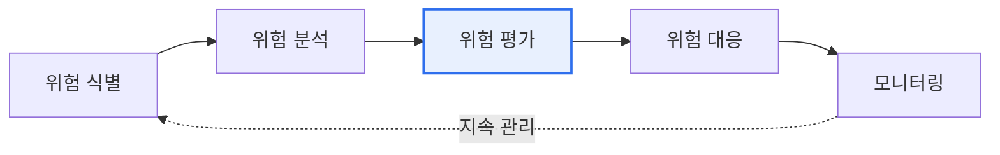

# 공공부문 SaaS 이용 가이드라인

## 1. 개요

### 가. 정의
> 국가기관·지방자치단체·공공기관이 **SaaS(Software as a Service)를 안전하고 효율적으로 이용**하도록 위험관리·보안·계약(SLA) 기준을 제시한 정부 지침. 디지털플랫폼정부·클라우드 네이티브 전환에 대응한다.

### 나. 필요성
- SaaS 활용 확대(업무 효율·비용 절감) ↔ **데이터 주권·보안 우려** 상충 해소
- 공공 데이터 특성상 **중요도 기반 차등 관리** 필요

## 2. 클라우드 서비스 위험 관리 원칙 및 기준 (가)

| 구분 | 내용 |
|---|---|
| **원칙** | 위험기반(Risk-based) 접근, 이용기관 자기책임, 지속적 관리, 중요도 기반 차등 |
| **기준** | 데이터 중요도 분류, **CSAP(클라우드 보안인증) 등급**(상·중·하), 서비스 중요도 평가 |
| **핵심** | 데이터 유형·민감도에 따라 이용 가능 SaaS 범위와 통제 수준 결정 |

## 3. 보안대책 수립 및 보안성 검토 (나)

| 구분 | 세부 내용 |
|---|---|
| **보안대책** | 접근통제·계정권한, 데이터 암호화(전송·저장), 로그·감사 추적, 데이터 위치·주권, 백업·연속성 |
| **보안성 검토** | 도입 **전** CSAP 인증 여부 확인, 필요시 국가정보원 보안성 검토, 도입 **후** 지속 점검·재검토 |
| **책임(SR)** | 클라우드 책임공유모델에 따라 CSP·이용기관 간 보안 책임 범위 명확화 |

## 4. 서비스 수준 협약 (다)

| SLA 항목 | 내용 |
|---|---|
| **가용성** | 서비스 가동률(%) 보장, 미달 시 배상 |
| **성능** | 응답시간·처리량 기준 |
| **장애 대응** | 장애 통지·복구목표(RTO/RPO), 대응 절차 |
| **데이터** | 데이터 반환·파기(Exit Plan), 소유권·이관 |
| **책임·배상** | 책임 범위, 위약·손해배상, 보안사고 통지 의무 |

## 5. 도입 절차 및 시사점

- **CSAP 인증 SaaS 우선 활용**으로 보안성 확보 + 도입 절차 간소화
- 책임공유모델 이해가 핵심 — 이용기관은 데이터·계정 보안 책임 부담
- Exit 전략(데이터 반환·파기)까지 계약 단계에서 명문화

---

> **한 줄 요약**: 공공 SaaS는 *위험·중요도 기반 관리(CSAP 등급) → 보안대책·보안성 검토 → SLA 계약* 의 절차로 안전성과 효율성을 동시에 확보한다.
