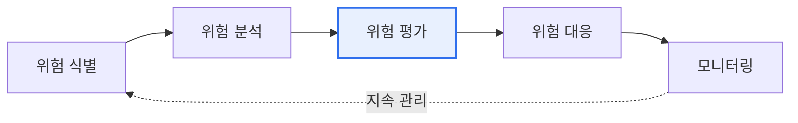

# 공공부문 SaaS 이용 가이드라인

## 1. 개요

### 가. 정의
> **공공부문 SaaS 이용 가이드라인**은 국가기관·지방자치단체·공공기관이 **SaaS(Software as a Service)를 안전하고 효율적으로 이용**하도록 위험관리·보안·계약(SLA) 기준을 제시한 정부 지침이다. 디지털플랫폼정부와 클라우드 네이티브 전환에 대응한다.

공공기관이 SaaS를 도입하면 별도 인프라 구축 없이 최신 기능을 빠르게 쓸 수 있어 업무 효율과 비용 절감 효과가 크다. 그러나 SaaS는 **데이터와 시스템이 외부 CSP(클라우드 사업자)의 인프라에 놓인다**는 근본 특성 때문에, 공공 데이터의 주권·보안 우려와 충돌한다. 가이드라인은 이 상충을 "무조건 금지"가 아니라 **위험 기반으로 관리**해 편익과 안전성을 동시에 확보하려는 취지에서 마련되었다.

### 나. 필요성
공공 데이터는 민감도가 제각각이다. 공개 가능한 홍보 자료와 국민 개인정보를 같은 기준으로 다루는 것은 비효율적이면서 위험하다. 따라서 데이터의 중요도에 따라 이용 가능한 SaaS 범위와 통제 수준을 **차등 적용**하는 관리 원칙이 필요하다. 이 차등 관리가 가이드라인 전체를 관통하는 핵심 논리다.

## 2. 클라우드 서비스 위험 관리 원칙 및 기준 (가)

위험 관리의 기본 철학은 **위험기반(Risk-based) 접근**과 **이용기관 자기책임**이다. 모든 SaaS를 일률 규제하는 대신, 각 기관이 자신이 다루는 데이터의 중요도를 스스로 판단하고 그에 맞는 통제를 책임진다. 이때 판단 기준으로 **CSAP(클라우드 보안인증)** 등급이 활용된다. CSAP는 클라우드 서비스의 보안 수준을 상·중·하로 구분하는데, 민감한 데이터일수록 높은 등급의 인증을 받은 SaaS만 쓰도록 매칭한다. 위험 관리는 한 번의 심사로 끝나지 않고 식별→분석→평가→대응→모니터링을 순환하는 **지속적 활동**이다.

| 구분 | 내용 |
|---|---|
| **원칙** | 위험기반 접근, 이용기관 자기책임, 지속적 관리, 중요도 기반 차등 |
| **기준** | 데이터 중요도 분류, CSAP 등급(상·중·하), 서비스 중요도 평가 |
| **핵심** | 데이터 유형·민감도에 따라 이용 가능 SaaS 범위와 통제 수준 결정 |

예컨대 국민 개인정보를 처리하는 민원 서비스는 CSAP '상' 등급 SaaS로 제한하고, 내부 협업용 문서도구는 '중·하' 등급까지 허용하는 식으로 데이터 민감도와 인증 등급을 대응시킨다.

## 3. 보안대책 수립 및 보안성 검토 (나)

보안대책은 **데이터가 이동·저장·접근되는 전 과정**을 통제하도록 설계한다. 접근통제와 계정권한으로 인가된 사용자만 접근하게 하고, 전송·저장 구간을 암호화해 유출 시에도 내용을 보호하며, 로그·감사 추적으로 사후 추적성을 확보한다. 특히 SaaS는 데이터가 어디에 저장되는지(데이터 위치·주권)가 중요하므로 국내 보관 여부를 확인한다. 보안성 검토는 **도입 전후로 나뉜다**. 도입 전에는 CSAP 인증 여부를 확인하고 필요시 국가정보원 보안성 검토를 받으며, 도입 후에도 지속 점검·재검토로 보안 수준을 유지한다.

| 구분 | 세부 내용 |
|---|---|
| **보안대책** | 접근통제·계정권한, 데이터 암호화(전송·저장), 로그·감사 추적, 데이터 위치·주권, 백업·연속성 |
| **보안성 검토** | (도입 전) CSAP 인증 확인·필요시 국정원 검토, (도입 후) 지속 점검·재검토 |
| **책임(SR)** | 책임공유모델에 따라 CSP·이용기관 간 보안 책임 범위 명확화 |

여기서 반드시 이해해야 할 개념이 **책임공유모델(Shared Responsibility)** 이다. SaaS에서 CSP는 인프라·플랫폼·애플리케이션의 보안을 책임지지만, **데이터와 계정·접근권한의 보안은 이용기관의 몫**이다. 이 경계를 모르면 "CSP가 다 해줄 것"이라 오해해 계정 관리를 소홀히 하다 사고로 이어진다.

## 4. 서비스 수준 협약 (다)

SLA(Service Level Agreement)는 SaaS 이용의 **품질과 책임을 계약으로 못 박는 장치**다. 가용성·성능 기준을 수치로 정해 미달 시 배상하도록 하고, 장애 발생 시 통지·복구 절차를 규정한다. 특히 공공에서 중요한 것은 **데이터 반환·파기(Exit Plan)** 조항이다. 계약 종료 시 데이터를 안전하게 돌려받고 CSP 측에서 완전히 파기하도록 명문화하지 않으면, 종속(Lock-in)되거나 데이터가 남아 유출될 위험이 있다.

| SLA 항목 | 내용 |
|---|---|
| **가용성** | 서비스 가동률(%) 보장, 미달 시 배상 |
| **성능** | 응답시간·처리량 기준 |
| **장애 대응** | 장애 통지·복구목표(RTO/RPO), 대응 절차 |
| **데이터** | 데이터 반환·파기(Exit Plan), 소유권·이관 |
| **책임·배상** | 책임 범위, 위약·손해배상, 보안사고 통지 의무 |

## 5. 도입 절차 및 시사점

도입은 수요 정의 → 위험·중요도 등급 산정 → CSAP 기반 보안성 검토 → SLA 계약 → 운영·모니터링의 순서로 진행된다. 이 절차의 실천적 시사점은 다음과 같다.

- **CSAP 인증 SaaS 우선 활용**: 이미 검증된 인증 서비스를 쓰면 보안성을 확보하면서 도입 심사 절차도 간소화된다.
- **책임공유모델 이해가 핵심**: 이용기관은 데이터·계정 보안 책임을 반드시 부담한다는 점을 전제로 통제를 설계한다.
- **Exit 전략의 계약 명문화**: 데이터 반환·파기와 이관 방안을 계약 단계에서 확정해 종속과 유출 위험을 예방한다.
- **지속 모니터링**: 도입 후에도 보안 수준·SLA 준수를 상시 점검해 위험 변화에 대응한다.

---

> **한 줄 요약**: 공공 SaaS는 *위험·중요도 기반 관리(CSAP 등급) → 보안대책·보안성 검토 → SLA 계약* 의 절차로 안전성과 효율성을 동시에 확보하며, 책임공유모델 이해와 Exit 전략 명문화가 성공의 관건이다.
