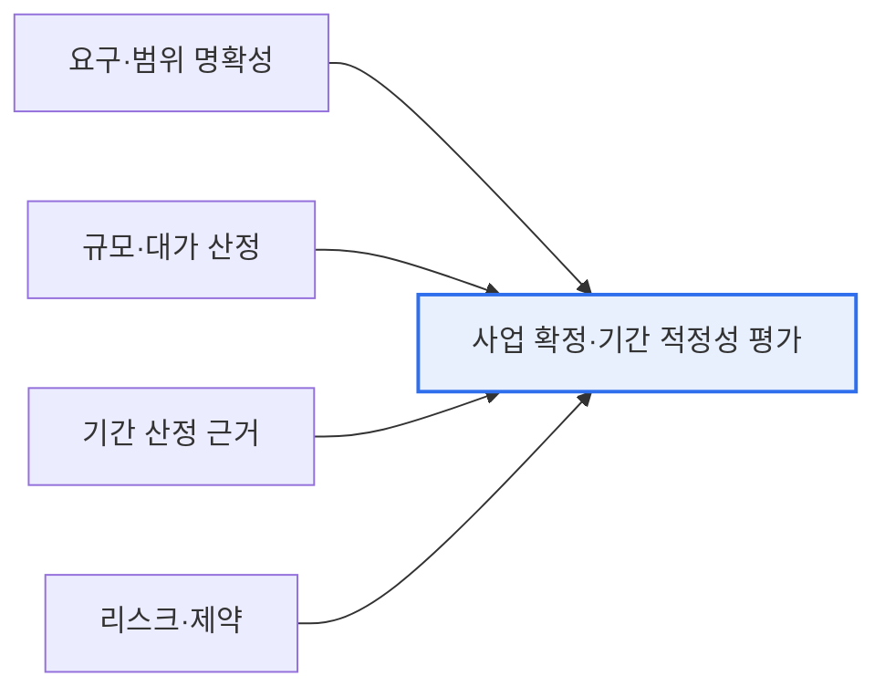

# 공공 소프트웨어 사업의 계획단계 검토와 과업변경 적정성 평가

## 1. 개요

### 가. 배경
> 공공 소프트웨어 사업의 실패를 줄이기 위해, **계획단계에서 사업 확정·기간의 적정성을 평가** 하고, **사업 수행 중 과업 변경의 적정성을 판단** 하는 기준이 마련되었다. 부실한 사업 계획과 무분별한 과업 변경이 사업 실패의 주요 원인이기 때문이다.

이 평가가 필요한 근본 이유는 '**시작이 잘못되거나 도중에 흔들리면 사업이 실패한다**'는 데 있다. 공공 SW 사업은 요구가 불명확한 채 촉박한 일정과 낮은 대가로 발주되는 경우가 많고, 개발 도중 과업이 계속 추가·변경되어 통제 불능에 빠지곤 한다. 그 결과 품질 저하, 일정 지연, 발주기관과 수행사 간 분쟁이 반복된다. 계획단계 적정성 평가는 '**애초에 이 사업이 이 기간·이 범위로 가능한가**'를 사전에 검증해 무리한 발주를 막고, 과업변경 적정성 평가는 '**이 변경이 정당하고 합리적인가**'를 판단해 무분별한 범위 확대를 통제한다. 즉 사업의 입구(계획)와 진행 중(변경) 두 지점에서 리스크를 관리하는 장치다.

### 나. 필요성
공공 SW 사업의 반복적 실패(지연·품질저하·분쟁)를 막으려면, 사업 계획의 타당성과 과업 변경의 정당성을 객관적으로 판단하는 기준이 필요하다.

## 2. 계획단계 검토 항목 (사업 확정·기간 적정성)

| 검토 항목 | 내용 |
|---|---|
| **요구·범위 명확성** | 요구사항이 구체적·확정적인가 |
| **규모·대가 적정성** | 기능점수(FP) 등 규모 산정, 적정 대가 |
| **기간 적정성** | 규모 대비 개발 기간이 현실적인가 |
| **리스크·제약** | 기술·인력·제약 요인 반영 |

핵심은 요구 범위와 규모에 비추어 사업 기간·대가가 현실적인지 검증하는 것이다. 무리한 저가·단기 발주는 품질 저하로 이어진다.

## 3. 과업 변경 적정성 판단 기준

사업 수행 중 발생하는 과업 변경이 정당한지를 판단하는 기준이다.

| 판단 기준 | 내용 |
|---|---|
| **변경 사유의 정당성** | 필수·불가피한 변경인가(자의적 확대 아님) |
| **범위·규모 영향** | 원 계약 대비 범위·규모 변화 정도 |
| **일정·비용 영향** | 변경에 따른 기간·대가 조정 필요성 |
| **절차 준수** | 과업심의위원회 등 공식 절차를 거쳤는가 |

과업 변경은 **과업심의위원회** 같은 공식 절차를 거쳐, 변경의 정당성과 그에 따른 기간·대가 조정을 함께 판단해야 한다. 특히 규모가 늘었는데 기간·대가를 그대로 두면 품질이 희생되므로, 변경에 상응하는 조정이 이뤄져야 한다.

## 4. 고려사항 및 시사점

1. **적정 대가·기간 보장이 품질의 전제**다. 무리한 저가·단기 발주는 필연적으로 품질 저하를 부르므로, 규모에 맞는 대가와 현실적 기간을 계획단계에서 확보해야 한다.
2. **과업 변경의 통제와 정당한 조정**이 병행되어야 한다. 무분별한 범위 확대는 막되, 정당한 변경에는 기간·대가를 상응해 조정하는 것이 공정하다.
3. **ISMP·감리와 연계**한다. 발주 전 요구 상세화(ISMP)로 계획 부실을 예방하고, 단계별 감리로 과업 변경과 품질을 지속 점검해 사업 리스크를 관리한다.

---

> **한 줄 요약**: 공공 SW 사업은 계획단계에서 *요구 명확성·규모·기간·대가의 적정성* 을 검증하고, 수행 중 *과업 변경의 정당성·영향·절차* 를 심의해, 무리한 발주와 무분별한 범위 확대를 통제함으로써 사업 실패를 예방한다.
