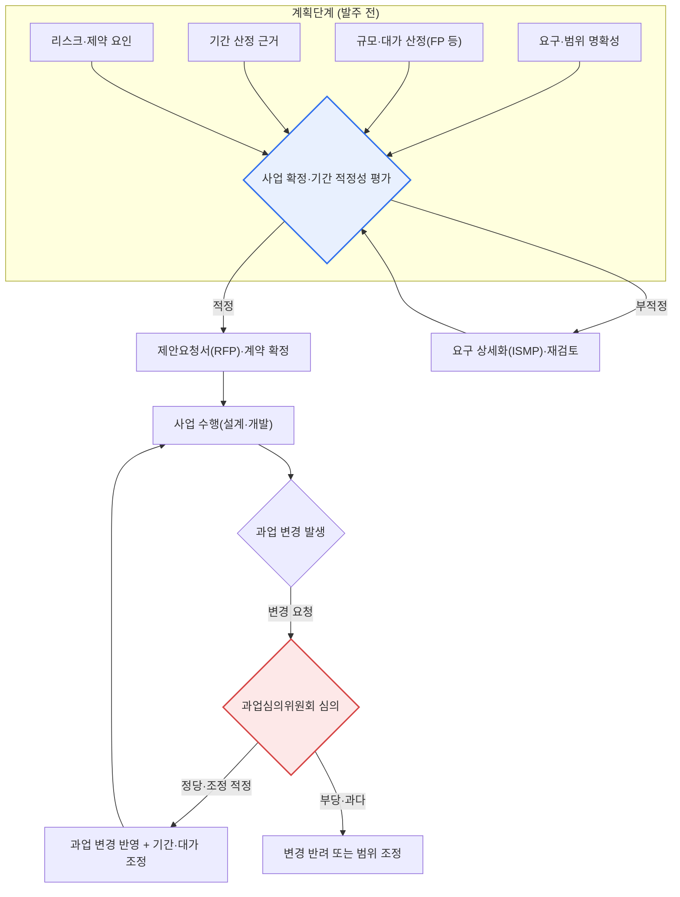
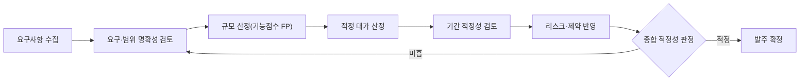

# 공공 소프트웨어 사업의 계획단계 검토와 과업변경 적정성 평가

## 1. 개요

### 가. 정의와 배경
> **계획단계 적정성 검토**는 공공 SW 사업의 발주 전에 요구·범위·규모·기간·대가가 현실적인지를 사전 검증하는 절차이며, **과업변경 적정성 평가**는 사업 수행 중 발생하는 과업의 추가·변경·삭제가 정당하고 합리적인지를 공식 절차를 통해 판단하는 통제 장치다. 두 제도의 공통 목적은 부실한 계획과 무분별한 과업 변경으로 인한 사업 실패(지연·품질저하·분쟁)를 예방하는 데 있다.

이 평가가 필요한 근본 이유는 '**시작이 잘못되거나 도중에 흔들리면 사업이 실패한다**'는 데 있다. 공공 SW 사업은 요구가 불명확한 채 촉박한 일정과 낮은 대가로 발주되는 경우가 많고, 개발 도중 과업이 계속 추가·변경되어 통제 불능에 빠지곤 한다. 특히 발주기관은 예산 편성 시점에 사업 규모를 확정해야 하는데, 이때 요구가 충분히 상세화되지 않은 상태에서 개략적 대가만 산정되는 구조적 한계가 있다. 그 결과 착수 이후 "당연히 포함되는 것 아니냐"는 식의 추가 요구(이른바 요구사항의 상향 표류, scope creep)가 누적되고, 수행사는 계약 대가 안에서 이를 흡수하다 품질을 희생하게 된다.

계획단계 적정성 평가는 '**애초에 이 사업이 이 기간·이 범위로 가능한가**'를 사전에 검증해 무리한 발주를 막고, 과업변경 적정성 평가는 '**이 변경이 정당하고 합리적인가, 그에 상응하는 기간·대가 조정이 이루어졌는가**'를 판단해 무분별한 범위 확대와 부당한 비용 전가를 통제한다. 즉 사업의 입구(계획)와 진행 중(변경)이라는 두 관문에서 리스크를 관리하는 이중 안전장치라 할 수 있다.

제도적으로는 「소프트웨어 진흥법」(2020년 「소프트웨어산업 진흥법」 전부개정)과 그 하위 고시, 그리고 발주기관이 준용하는 「공공 소프트웨어사업 발주·관리 매뉴얼」 등이 계획 검토와 과업심의의 근거가 된다. 다만 세부 고시명·조문은 개정이 잦으므로, 실제 적용 시에는 최신 법령·고시 원문을 확인하는 것이 바람직하다.

### 나. 필요성
공공 SW 사업의 반복적 실패를 막으려면, 사업 계획의 타당성과 과업 변경의 정당성을 발주기관·수행사 어느 한쪽의 자의가 아니라 **객관적 기준과 공식 절차**로 판단해야 한다. 필요성은 세 가지 층위로 나눠 볼 수 있다. 첫째는 **예산의 효율성**이다. 무리한 저가·단기 발주는 재작업과 하자보수 비용을 오히려 키워 총소유비용(TCO)을 높인다. 둘째는 **품질과 국민 서비스의 안정성**이다. 행정·복지·조세 등 국민 생활에 직결되는 시스템의 부실은 사회적 비용으로 전가된다. 셋째는 **공정한 계약 관계**다. 과업 변경에 상응하는 대가·기간 조정이 보장되어야 발주기관과 수행사 간 분쟁을 줄이고 SW 산업 생태계의 건전성을 지킬 수 있다.

## 2. 전체 구조 — 계획 검토와 과업변경 통제의 흐름

계획 검토와 과업변경 평가는 별개의 이벤트가 아니라 사업 생애주기(발주 준비 → 계약 → 수행 → 검수)에 걸쳐 연결된 하나의 리스크 관리 체계다. 아래 구조도는 두 관문이 어디에 위치하며 어떤 산출물·기구와 맞물리는지를 보여준다.

```mermaid
flowchart TB
  subgraph 계획단계["계획단계 (발주 전)"]
    A1["요구·범위 명확성"] --> G1{"사업 확정·기간 적정성 평가"}
    A2["규모·대가 산정(FP 등)"] --> G1
    A3["기간 산정 근거"] --> G1
    A4["리스크·제약 요인"] --> G1
  end
  G1 -->|적정| B["제안요청서(RFP)·계약 확정"]
  G1 -->|부적정| A0["요구 상세화(ISMP)·재검토"]
  A0 --> G1
  B --> C["사업 수행(설계·개발)"]
  C --> D{"과업 변경 발생"}
  D -->|변경 요청| G2{"과업심의위원회 심의"}
  G2 -->|정당·조정 적정| E["과업 변경 반영 + 기간·대가 조정"]
  G2 -->|부당·과다| F["변경 반려 또는 범위 조정"]
  E --> C
  style G1 fill:#e8f0fe,stroke:#2f6fed,stroke-width:2px
  style G2 fill:#fde8e8,stroke:#d64545,stroke-width:2px
```

위 구조에서 주목할 점은 두 관문의 성격 차이다. 계획단계 평가(G1)는 **사전 예방적(preventive)** 통제로, 무리한 사업이 아예 시작되지 않도록 걸러내는 게이트다. 반면 과업심의(G2)는 **진행 중 교정적(corrective)** 통제로, 이미 시작된 사업이 궤도를 벗어나지 않도록 잡아주는 밸브다. 계획단계에서 요구를 충분히 상세화(ISMP 등)해 두면 진행 중 변경 자체가 줄어들기 때문에, 두 관문은 서로를 보완하는 관계에 있다.

## 3. 계획단계 검토 항목 (사업 확정·기간 적정성)

계획단계 검토의 목표는 "요구 범위와 규모에 비추어 사업 기간·대가가 현실적인가"를 판정하는 것이다. 아래 상세 흐름도는 검토가 어떤 순서로 이루어지는지를 나타낸다.

```mermaid
flowchart LR
  R["요구사항 수집"] --> S1["요구·범위 명확성 검토"]
  S1 --> S2["규모 산정(기능점수 FP)"]
  S2 --> S3["적정 대가 산정"]
  S3 --> S4["기간 적정성 검토"]
  S4 --> S5["리스크·제약 반영"]
  S5 --> J{"종합 적정성 판정"}
  J -->|미흡| S1
  J -->|적정| OUT["발주 확정"]
```

### 가. 요구·범위 명확성
계획 부실의 첫 번째 원인은 요구가 모호한 채 발주된다는 데 있다. 요구가 "회원관리 기능 일체"처럼 추상적으로만 기술되면, 수행사와 발주기관이 각자 다른 범위를 상상하게 되고 이 간극이 나중에 과업 변경 분쟁으로 폭발한다. 따라서 계획단계에서는 기능·비기능 요구가 **측정 가능하고 확정적인 수준**으로 정리되어 있는지를 본다. 예컨대 "빠른 응답"이 아니라 "동시접속 1,000명에서 평균 응답 2초 이내"처럼 검증 가능한 형태여야 한다.

요구가 충분히 상세화되지 않은 대규모·복잡 사업의 경우, 발주 전에 별도의 **정보화전략계획(ISP) 또는 정보시스템 마스터플랜(ISMP)** 사업을 선행해 요구를 구체화하도록 권고된다. ISMP는 요구사항을 기능점수 산정이 가능한 수준까지 상세화하는 것을 목표로 하므로, 이후 규모·대가·기간 산정의 신뢰도를 크게 높인다.

### 나. 규모·대가 적정성
요구가 정리되면 규모를 정량화한다. 공공 SW 사업의 표준 규모 척도는 **기능점수(Function Point, FP)** 로, 개발 언어·기술과 무관하게 사용자 관점의 기능 크기를 측정한다는 장점이 있어 발주 규모 산정과 대가 산정의 기준으로 널리 쓰인다. 산정된 FP에 소프트웨어 사업대가 기준의 단가·보정계수를 적용해 개발비를 산출하고, 여기에 직접경비·이윤 등을 더해 적정 대가를 도출한다.

여기서 핵심은 **저가 발주의 위험**을 걸러내는 것이다. 규모 대비 대가가 지나치게 낮으면 수행사는 투입 인력을 줄이거나 숙련도가 낮은 인력으로 채우게 되어 품질이 구조적으로 저하된다. 실제로 공공 SW 사업에서 과도한 가격 경쟁(저가 낙찰)이 품질 저하와 하도급 문제의 원인으로 지적되어 왔고, 이 때문에 상용SW 직접구매(분리발주), 원격지 개발 확대, 적정 대가 지급 등이 정책적으로 강조되어 왔다.

### 다. 기간 적정성
규모가 같아도 기간이 비현실적으로 짧으면 사업은 실패한다. 인월(man-month)을 무한정 압축할 수 없다는 것은 브룩스의 법칙("지연된 프로젝트에 인력을 추가하면 더 늦어진다")이 오래전에 지적한 바다. 계획단계에서는 산정된 규모(FP)와 생산성 지표를 근거로 **필요 기간을 역산**하고, 발주기관이 예산·행정 일정 때문에 설정한 희망 기간과의 격차를 점검한다. 격차가 크면 범위를 단계적으로 나누거나(단계적 구축), 기간을 현실화해야 한다.

예를 들어 어떤 차세대 시스템이 3,000 FP 규모로 산정되었는데 발주 희망 기간이 8개월이라면, 통상적인 생산성 지표로 볼 때 무리한 압축일 가능성이 크다. 이 경우 핵심 기능 우선 구축 후 2단계로 나누는 로드맵을 제시하는 것이 계획 검토의 실무적 결론이 된다.

### 라. 리스크·제약 요인
마지막으로 기술·인력·조직·법제도상의 제약을 계획에 반영했는지 본다. 신기술 도입에 따른 불확실성, 다수 기관 연계에 따른 이해관계 조정, 개인정보·보안 규제 준수, 기존 시스템과의 데이터 이관 난도 등은 모두 일정·비용을 좌우하는 변수다. 이런 리스크가 계획서에 식별·정량화되고 대응 방안(예비비, 완충 일정)이 마련되어 있는지가 적정성의 중요한 판단 요소다.

| 검토 항목 | 핵심 질문 | 부실 시 결과 |
|---|---|---|
| **요구·범위 명확성** | 요구가 측정 가능·확정적인가 | 착수 후 범위 분쟁, scope creep |
| **규모·대가 적정성** | FP 등 규모 산정, 적정 대가인가 | 저가 발주 → 품질 저하 |
| **기간 적정성** | 규모 대비 기간이 현실적인가 | 무리한 압축 → 지연·부실 |
| **리스크·제약** | 기술·인력·규제 제약을 반영했는가 | 예상 못한 변수로 사업 좌초 |

## 4. 과업 변경 적정성 판단 기준

### 가. 과업 변경이 문제되는 이유
사업이 시작된 뒤 발생하는 과업 변경 자체는 불가피하다. 요구는 진화하고, 법·정책이 바뀌며, 착수 후에야 드러나는 요구도 있기 때문이다. 문제는 변경이 **정당한 근거·정식 절차·상응하는 조정 없이** 이루어질 때다. 발주기관이 "원래 그 정도는 해줘야 하는 것"이라며 대가·기간 조정 없이 기능을 추가하면 수행사는 손실을 품질로 메우고, 반대로 수행사가 자의적으로 범위를 축소하면 발주기관이 손해를 본다. 그래서 변경의 정당성과 그 영향을 객관적으로 심의하는 절차가 필요하다.

### 나. 판단 기준 네 가지
과업 변경의 적정성은 다음 네 축으로 판단한다. 각 축은 독립적이지 않고 서로 얽혀 있어, 하나라도 어긋나면 변경은 부적정으로 평가될 수 있다.

첫째, **변경 사유의 정당성**이다. 변경이 법·정책 변화, 상위 계획 변경, 착수 후 확인된 필수 요구처럼 불가피한 것인지, 아니면 단순한 취향·편의에 따른 자의적 확대인지를 가린다. 둘째, **범위·규모 영향**이다. 원 계약 대비 기능점수 증감을 정량화해 변경이 전체 사업에서 차지하는 비중을 파악한다. 셋째, **일정·비용 영향**이다. 규모가 늘었다면 그에 상응해 기간과 대가를 조정해야 하며, 조정 없이 흡수만 요구하는 변경은 부적정이다. 넷째, **절차 준수**다. 변경이 **과업심의위원회** 등 공식 기구의 심의를 거쳤는지, 계약 변경(설계변경·계약금액 조정) 절차가 제대로 이행되었는지를 확인한다.

과업심의위원회는 발주기관·수행사 외부 전문가 등이 참여해 변경의 정당성과 영향을 심의하는 기구로, 변경을 둘러싼 힘의 불균형(발주기관 우위)을 견제하는 장치다. 심의 결과 정당한 변경으로 판정되면 그에 맞춰 기간·대가를 조정하고, 과다·부당한 요구는 반려하거나 범위를 재조정한다.

### 다. 구체 사례로 본 적정/부적정
예를 들어 착수 후 개인정보보호법 개정으로 암호화·접근통제 요건이 강화되어 관련 기능을 추가해야 한다면, 이는 **불가피한 정당한 변경**이므로 규모 증가분만큼 기간·대가를 조정하는 것이 적정하다. 반대로 발주기관 담당자가 개인적 선호로 화면 디자인을 수차례 전면 개편하도록 요구하면서 대가·기간은 그대로 두려 한다면, 이는 사유의 정당성도, 상응 조정도 결여된 **부적정 변경**에 해당해 과업심의를 통해 통제되어야 한다.

| 판단 기준 | 내용 | 적정 판정의 요건 |
|---|---|---|
| **변경 사유의 정당성** | 필수·불가피한 변경인가 | 법·정책·상위계획 변화 등 객관적 근거 |
| **범위·규모 영향** | 원 계약 대비 규모 변화 | FP 등으로 증감 정량화 |
| **일정·비용 영향** | 기간·대가 조정 필요성 | 규모 변화에 상응하는 조정 |
| **절차 준수** | 공식 절차를 거쳤는가 | 과업심의위 심의·계약 변경 이행 |

## 5. 심화 — 관련 제도 연계와 예상 출제 방향

계획 검토와 과업변경 평가는 단독 제도가 아니라 공공 SW 사업 관리 체계 전반과 맞물려 작동한다. **발주 전**에는 ISP/ISMP로 요구를 상세화하고 상용SW 분리발주로 무리한 통합 발주를 완화한다. **수행 중**에는 정보시스템 감리(단계별 감리, 상주감리)로 진척·품질·과업 변경을 지속 점검하고, PMO(발주기관을 대행하는 사업관리 조직)가 과업 변경 요청을 사전 검토해 과업심의의 부담을 줄인다. **검수 시**에는 요구사항 대비 이행 여부를 검증한다. 이처럼 계획 검토(입구)–감리·PMO(진행)–과업심의(변경)–검수(출구)가 하나의 통제 사슬을 이룬다.

정책 동향으로는, 저가 수주·과업 변경 갈등을 줄이기 위한 적정 대가 지급, 원격지 개발 확대, 하도급 구조 개선, SW 영향평가 등이 지속적으로 강조되어 왔다. 다만 세부 제도명과 적용 범위는 개정이 잦으므로 답안 작성 시에는 최신 법령·고시를 확인해 일반화된 표현을 쓰는 것이 안전하다.

기술사 시험 관점에서 이 주제는 "공공 SW 사업 실패 원인과 대책", "과업변경 관리(과업심의위원회)", "SW 사업대가 산정(기능점수)", "정보시스템 감리·PMO"와 연계 출제되기 쉽다. 답안 구성 전략은 ① 계획단계(입구)와 과업변경(진행)의 이중 통제 구조를 먼저 제시하고 ② 각 관문의 세부 판단 기준을 표+산문으로 전개한 뒤 ③ ISMP·감리·PMO 등 연계 제도와 정책 동향으로 마무리하는 흐름이 효과적이다.

## 6. 고려사항 및 시사점

1. **적정 대가·기간 보장이 품질의 전제다.** 무리한 저가·단기 발주는 재작업·하자보수로 오히려 총비용을 키운다. 규모(FP)에 근거한 대가와 현실적 기간을 계획단계에서 확보하는 것이 사업 성공의 출발점이며, 이는 트레이드오프가 아니라 장기적으로 발주기관에도 이익이다.
2. **과업 변경의 통제와 정당한 조정은 반드시 병행되어야 한다.** 무분별한 범위 확대는 막되, 정당한 변경에는 기간·대가를 상응해 조정하는 것이 공정하다. 통제만 강조하면 필요한 변경까지 위축되고, 조정만 강조하면 scope creep을 부추기므로 균형이 관건이다.
3. **예방적 통제(계획)에 투자하는 것이 교정적 통제(변경)보다 효율적이다.** 착수 전 ISMP로 요구를 상세화하면 진행 중 변경 자체가 줄어든다. 요구 불명확성을 뒤에서 과업심의로 감당하는 것보다, 앞에서 요구를 확정하는 편이 비용·분쟁을 근본적으로 줄인다.
4. **감리·PMO와의 연계로 통제의 실효성을 높여야 한다.** 계획 검토와 과업심의는 서류상 절차에 그치기 쉬우므로, 상주감리·PMO가 실제 진척과 변경을 상시 모니터링해 형식적 심의가 되지 않도록 뒷받침해야 한다.
5. **제도의 목적은 규제가 아니라 사업 성공과 산업 생태계 건전성이다.** 통제 절차를 부담으로만 인식하면 형식화된다. 발주기관·수행사가 리스크를 함께 관리하는 협력 장치로 제도를 활용할 때 분쟁 감소와 품질 향상이라는 본래 효과가 나타난다.

## 참고자료
- 국가법령정보센터, 「소프트웨어 진흥법」: https://www.law.go.kr/
- 과학기술정보통신부·정보통신산업진흥원(NIPA), 소프트웨어사업 대가산정 가이드: https://www.nipa.kr/
- 한국지능정보사회진흥원(NIA) 공공 정보화 사업 관리 자료: https://www.nia.or.kr/

---

> **한 줄 요약**: 공공 SW 사업은 *계획단계*에서 요구 명확성·규모(FP)·기간·대가의 적정성을 사전 검증해 무리한 발주를 막고, *수행 중*에는 과업심의위원회를 통해 과업 변경의 정당성·범위영향·일정비용·절차를 심의하고 상응하는 조정을 보장함으로써, 부실 계획과 무분별한 범위 확대라는 두 실패 요인을 입구·진행 두 관문에서 통제한다.
