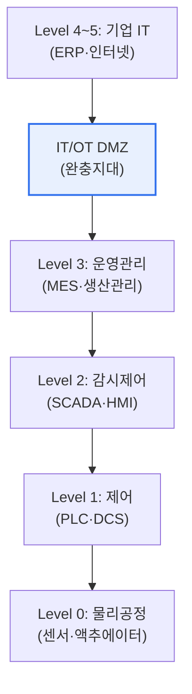

# 산업제어시스템(ICS)의 퍼듀(Purdue) 모델

## 1. 개요

### 가. 개념
> **퍼듀 모델(Purdue Model)** 은 산업제어시스템(ICS)의 구성 요소를 **기능과 역할에 따라 여러 계층으로 나누어 표현한 참조 아키텍처**로, IT(정보기술)와 OT(운영기술) 영역을 계층적으로 분리해 산업 네트워크의 구조와 보안 경계를 정의한다.

퍼듀 모델이 산업 보안의 기준이 된 근본 이유는 '**공장의 물리 설비와 사무실의 IT가 뒤섞이면 위험하니, 계층으로 나누고 경계를 지키자**'는 데 있다. 산업 현장은 실제 물리 설비를 제어하는 OT 영역(센서·PLC·제어시스템)과, 경영·업무를 담당하는 IT 영역(ERP·인터넷)이 함께 존재한다. 그런데 이 둘의 요구가 정반대다. OT는 안전과 가동 지속이 최우선이라 함부로 멈추거나 패치할 수 없고, IT는 데이터·연결성이 중요하다. 만약 이 둘을 아무렇게나 연결하면, 인터넷을 통해 들어온 공격이 곧바로 물리 설비를 조작해 폭발·정전 같은 물리적 재난을 일으킬 수 있다(스턱스넷이 그 예다). 퍼듀 모델은 이를 막기 위해 시스템을 물리 현장(하위)에서 경영(상위)까지 계층으로 나누고, 각 계층 사이에 명확한 경계를 둔다. 특히 IT와 OT 사이에 완충지대(DMZ)를 두어, 상위 IT의 위협이 하위 OT로 직접 전파되지 못하게 한다. 즉 퍼듀 모델은 산업 시스템을 이해하고 방어하는 '지도'이자 '보안 경계선'이다.

### 나. IT/OT 융합 배경
스마트팩토리·Industry 4.0로 폐쇄됐던 OT가 IT와 연결되면서, 계층적 구조 이해와 IT-OT 경계 보안이 필수가 되었다. [[isa-iec-62443]]

## 2. 퍼듀 모델의 계층과 특징

| 계층 | 구성 | 특징 |
|---|---|---|
| **Level 0** | 센서·액추에이터 | 실제 물리 공정(현장 장비) |
| **Level 1** | PLC·DCS·RTU | 기본 제어(설비 직접 제어) |
| **Level 2** | SCADA·HMI | 감시·제어(운영자 조작) |
| **Level 3** | MES·이력관리 | 생산 운영 관리(OT 상위) |
| **IT/OT DMZ** | 프록시·패치서버 | IT-OT 완충·경계 통제 |
| **Level 4~5** | ERP·인터넷·기업망 | 기업 비즈니스 IT |

하위(0~1)로 갈수록 실시간성·가용성·안전이 중요하고, 상위(4~5)로 갈수록 데이터·연결성이 중요하다. 핵심은 **Level 3.5의 IT/OT DMZ**로, OT와 IT를 직접 연결하지 않고 이 완충지대를 거치게 해 위협 전파를 차단한다.

## 3. 보안 관점의 활용

| 관점 | 내용 |
|---|---|
| **경계 분리(Segmentation)** | 계층·구역(Zone)별 분할, DMZ로 IT-OT 격리 |
| **최소 통신** | 계층 간 필요한 통신만 허용(Conduit) |
| **하위 보호 우선** | 물리 설비(L0~1)에 대한 직접 접근 통제 |

퍼듀 모델은 산업 보안 표준 IEC 62443의 **구역(Zone)·통로(Conduit)** 개념과 결합해, 계층·구역별로 보안 등급을 나누고 통제하는 세분화(segmentation) 설계의 기반이 된다.

## 4. 고려사항 및 시사점

1. **IT/OT 경계 보안이 핵심**이다. 대부분의 산업 사이버 공격이 IT를 통해 침투해 OT로 확산되므로, DMZ·망 분리·계층 간 접근통제로 위협 전파를 차단하는 것이 가장 중요하다.
2. **경계 흐려짐에 대응**해야 한다. 클라우드·IIoT·원격 유지보수가 확산되며 전통적 계층 경계가 모호해지고 있어, 퍼듀 모델을 기반으로 하되 제로 트러스트 등 신원 기반 통제를 보완해야 한다. [[zero-trust]]
3. **가용성 우선 특성을 고려**한다. OT는 가동 중단·패치가 어려우므로, IT 보안 방식을 그대로 적용하기보다 OT 특성(실시간·안전)에 맞는 보안(가상 패치·모니터링 중심)을 설계해야 한다.

---

> **한 줄 요약**: 퍼듀 모델은 *ICS를 물리공정(L0)부터 기업IT(L4~5)까지 계층으로 나눈 참조 아키텍처* 로, IT/OT DMZ로 두 영역을 격리해 위협 전파를 차단하며, IEC 62443의 구역·통로 세분화와 결합해 산업 보안의 기반이 된다.
