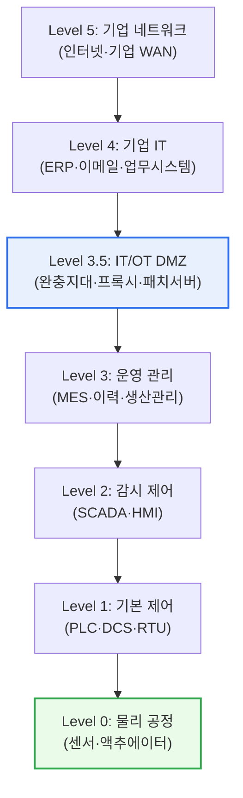
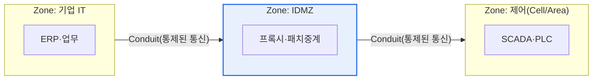

# 산업제어시스템(ICS)의 퍼듀(Purdue) 모델

## 1. 개요

### 가. 정의 및 개념
> **퍼듀 모델(Purdue Model, Purdue Enterprise Reference Architecture)** 은 산업제어시스템(ICS)의 구성 요소를 **기능과 역할에 따라 여러 계층(Level)으로 나누어 표현한 참조 아키텍처**로, IT(정보기술)와 OT(운영기술) 영역을 계층적으로 분리하고 그 사이에 완충지대를 두어 산업 네트워크의 구조와 보안 경계(Security Boundary)를 정의한다.

퍼듀 모델은 1990년대 초 미국 퍼듀 대학교의 컴퓨터 통합 제조(CIM) 연구에서 기업의 정보·제어 흐름을 계층화하기 위해 고안되었고, 이후 ISA-95(기업-제어 시스템 통합) 표준과 결합하며 산업 자동화의 사실상 표준 지도로 자리 잡았다. 오늘날에는 그 기능적 계층 구조가 **산업 사이버보안의 기준선**으로 더 널리 활용된다.

퍼듀 모델이 산업 보안의 기준이 된 근본 이유는 '**공장의 물리 설비와 사무실의 IT가 무분별하게 뒤섞이면 위험하니, 계층으로 나누고 경계를 지키자**'는 데 있다. 산업 현장에는 실제 물리 설비를 제어하는 OT 영역(센서·PLC·SCADA)과, 경영·업무를 담당하는 IT 영역(ERP·인터넷)이 함께 존재한다. 그런데 이 둘의 요구가 정반대다. OT는 안전(Safety)과 가동 지속(Availability)이 최우선이라 함부로 멈추거나 패치할 수 없고 수명주기도 10~20년으로 길다. 반면 IT는 데이터 기밀성·무결성과 연결성이 중요하며 수시로 업데이트된다.

만약 이 둘을 아무런 통제 없이 연결하면, 인터넷을 통해 침투한 공격이 곧바로 물리 설비를 조작해 폭발·정전·인명 피해 같은 물리적 재난을 일으킬 수 있다. 퍼듀 모델은 이를 막기 위해 시스템을 물리 현장(하위)에서 경영(상위)까지 계층으로 나누고, 각 계층 사이에 명확한 경계와 통제를 둔다. 특히 IT와 OT 사이에 **산업 DMZ(IDMZ, Industrial DMZ)** 라는 완충지대를 두어, 상위 IT의 위협이 하위 OT로 직접 전파되지 못하게 차단한다. 요컨대 퍼듀 모델은 산업 시스템을 이해하는 '지도'이자 방어를 설계하는 '보안 경계선'이다.

### 나. IT/OT 융합 배경과 필요성
과거 OT는 외부와 단절된 폐쇄망(Air-gap)이라 보안 위협에서 상대적으로 자유롭다고 여겨졌다. 그러나 스마트팩토리·Industry 4.0·산업 IoT(IIoT)로 생산 데이터를 실시간 수집·분석하려는 수요가 커지면서, 폐쇄됐던 OT가 IT·클라우드와 연결되기 시작했다. 이 연결은 생산성을 높였지만 동시에 공격 표면(Attack Surface)을 넓혔다. 결국 계층적 구조에 대한 이해와 IT-OT 경계 보안이 산업 안전의 필수 요건이 되었으며, 퍼듀 모델은 이러한 세그멘테이션(Segmentation) 설계의 출발점이 된다. [[isa-iec-62443]]

## 2. 퍼듀 모델의 계층 구조

```mermaid
flowchart TB
  L5["Level 5: 기업 네트워크<br/>(인터넷·기업 WAN)"] --> L4["Level 4: 기업 IT<br/>(ERP·이메일·업무시스템)"]
  L4 --> DMZ["Level 3.5: IT/OT DMZ<br/>(완충지대·프록시·패치서버)"]
  DMZ --> L3["Level 3: 운영 관리<br/>(MES·이력·생산관리)"]
  L3 --> L2["Level 2: 감시 제어<br/>(SCADA·HMI)"]
  L2 --> L1["Level 1: 기본 제어<br/>(PLC·DCS·RTU)"]
  L1 --> L0["Level 0: 물리 공정<br/>(센서·액추에이터)"]
  style DMZ fill:#e8f0fe,stroke:#2f6fed,stroke-width:2px
  style L0 fill:#eafbea,stroke:#2fa84f,stroke-width:2px
```

퍼듀 모델은 위 그림처럼 물리 공정(최하위 Level 0)부터 기업 네트워크(최상위 Level 5)까지 계층으로 구성된다. 이 계층 구조를 이해하는 핵심 원리는 **"아래로 갈수록 실시간성·안전·가용성이 중요하고, 위로 갈수록 데이터·연결성·기밀성이 중요하다"** 는 방향성이다. 각 계층을 아래에서 위로 살펴본다.

### 가. OT 영역 — Level 0~2(물리 공정과 실시간 제어)
가장 아래인 **Level 0(물리 공정)** 은 밸브·모터·펌프 같은 액추에이터와 온도·압력·유량을 측정하는 센서로 이루어진 실제 물리 설비다. 이곳에서 밀리초 단위의 실시간 물리 현상이 일어나며, 사고가 나면 곧바로 물리적 피해로 이어지므로 안전이 절대 우선이다.

**Level 1(기본 제어)** 은 PLC(Programmable Logic Controller)·DCS(분산제어시스템)·RTU가 위치해 Level 0 설비를 직접 제어한다. "온도가 임계값을 넘으면 밸브를 닫는다" 같은 제어 로직이 실행되는 계층으로, 여기서의 오작동이나 조작은 곧 물리 공정의 이상으로 직결된다. 스턱스넷이 표적으로 삼은 지점이 바로 이 PLC였다.

**Level 2(감시 제어)** 는 SCADA(감시제어·데이터수집)와 HMI(운영자 화면)가 위치해, 운영자가 공정 상태를 감시하고 설정값을 변경한다. Level 0~2는 통칭 '**셀/에어리어 존(Cell/Area Zone)**'을 이루며 실시간 제어의 핵심 구간이다. 이 세 계층은 가동 중단이 곧 생산·안전 손실이므로, IT식 강제 패치나 재부팅을 그대로 적용하기 어렵다는 특성을 공유한다.

### 나. 경계 계층 — Level 3.5(IT/OT DMZ)
퍼듀 모델의 보안적 핵심은 Level 3과 Level 4 사이에 위치한 **Level 3.5, 즉 IT/OT DMZ(IDMZ)** 다. 이 완충지대는 OT와 IT를 절대 직접 연결하지 않고 반드시 이곳을 경유하게 만든다. IDMZ에는 리버스 프록시, 패치 배포 서버, 데이터 히스토리안의 복제본, 원격접속 점프 서버 등이 배치되어, 상위 IT에서 온 트래픽이 하위 OT로 직접 도달하지 못하도록 중계·검사한다.

IDMZ의 설계 원칙은 명확하다. **"어떤 트래픽도 IT와 OT를 관통(traverse)하지 못하고, DMZ에서 종단(terminate)된다"** 는 것이다. 예컨대 IT의 패치 서버가 OT 자산을 직접 업데이트하는 대신, IDMZ의 중계 서버에 패치를 내려두면 OT 자산이 그곳에서만 가져가도록 한다. 이렇게 하면 IT망이 랜섬웨어에 감염되더라도 그 위협이 물리 설비까지 곧바로 번지지 않는다.

### 다. IT 영역 — Level 3~5(운영 관리와 경영 IT)
**Level 3(운영 관리)** 은 MES(제조실행시스템)·생산 스케줄링·품질 이력관리 등 공장 전체의 운영을 관리하는 계층으로, OT의 최상위이자 IT와 맞닿는 지점이다. **Level 4(기업 IT)** 는 ERP·이메일·업무용 시스템 등 사업장 단위의 비즈니스 IT를, **Level 5(기업 네트워크)** 는 여러 사업장을 아우르는 전사 WAN과 인터넷 연결을 담당한다. 이 상위 계층들은 전통적 IT 보안(패치·백신·접근통제)이 정상적으로 적용되는 영역이다.

| 계층 | 대표 구성요소 | 기능·특징 | 우선 가치 |
|---|---|---|---|
| **Level 5** | 인터넷·기업 WAN | 전사 네트워크·외부 연결 | 연결성 |
| **Level 4** | ERP·이메일·업무시스템 | 사업장 비즈니스 IT | 기밀성·데이터 |
| **Level 3.5** | 프록시·패치서버·점프서버 | IT-OT 완충·경계 통제 | 격리·차단 |
| **Level 3** | MES·이력관리 | 생산 운영 관리(OT 상위) | 운영 효율 |
| **Level 2** | SCADA·HMI | 감시·운영자 조작 | 가시성 |
| **Level 1** | PLC·DCS·RTU | 설비 직접 제어 | 실시간성 |
| **Level 0** | 센서·액추에이터 | 물리 공정 수행 | 안전·가용성 |

## 3. 보안 관점의 활용과 IEC 62443 연계

```mermaid
flowchart LR
  subgraph ZA["Zone: 기업 IT"]
    A1["ERP·업무"]
  end
  subgraph ZD["Zone: IDMZ"]
    D1["프록시·패치중계"]
  end
  subgraph ZO["Zone: 제어(Cell/Area)"]
    O1["SCADA·PLC"]
  end
  ZA -- "Conduit(통제된 통신)" --> ZD
  ZD -- "Conduit(통제된 통신)" --> ZO
  style ZD fill:#e8f0fe,stroke:#2f6fed,stroke-width:2px
```

퍼듀 모델의 계층 개념은 산업 보안 국제표준 **IEC 62443**의 **구역(Zone)·통로(Conduit)** 개념과 결합하며 실질적 방어 설계로 구체화된다. IEC 62443은 퍼듀의 경직된 '계층'을 자산의 논리적 묶음인 '구역(Zone)'과, 구역 간 통제된 통신 경로인 '통로(Conduit)'로 재해석한다. 각 구역에는 요구 보안수준(SL, Security Level 1~4)을 부여하고, 통로에는 방화벽·일방향 게이트웨이(Data Diode) 등으로 최소한의 필요 통신만 허용한다. 실무에서는 흔히 "**퍼듀로 구조를 그리고, 62443으로 그것을 지킨다**"고 표현한다.

| 보안 관점 | 내용 | 실무 적용 예 |
|---|---|---|
| **경계 분리(Segmentation)** | 계층·구역별 망 분할, IDMZ로 IT-OT 격리 | VLAN·방화벽·구역 분리 |
| **최소 통신(Least Communication)** | 계층 간 필요한 통신만 Conduit로 허용 | 화이트리스트·프로토콜 제한 |
| **하위 보호 우선** | 물리 설비(L0~1)에 대한 직접 접근 통제 | 일방향 게이트웨이·점프서버 |
| **깊이 방어(Defense in Depth)** | 각 계층마다 다중 방어선 구축 | 계층별 모니터링·인증 |

역사적 사례가 이 구조의 필요성을 잘 보여준다. 2010년 **스턱스넷(Stuxnet)** 은 USB를 통해 폐쇄된 OT망으로 침투한 뒤 Level 1의 지멘스 PLC를 조작해 이란 나탄즈 원심분리기를 물리적으로 파괴했다. 2015년 12월 **우크라이나 정전 사태(BlackEnergy)** 에서는 공격자가 IT망을 거쳐 배전회사 제어센터에 원격 접속해 약 30개 변전소의 차단기를 조작, 약 23만 명이 정전 피해를 입었다. 2016년에는 산업 프로토콜을 직접 구사하는 **인더스트로이어(Industroyer/CrashOverride)** 가 키이우 전력망 일부를 약 1시간 마비시켰다. 세 사례 모두 IT 경로로 침투해 OT로 확산된 공통점을 가지며, 이는 IT/OT 경계 통제가 왜 산업 보안의 급소인지를 입증한다.

### 가. IT 보안과 OT 보안의 근본적 차이
퍼듀 모델이 IT와 OT를 굳이 계층으로 갈라 놓는 이유는, 두 영역의 보안 우선순위가 근본적으로 상충하기 때문이다. IT 보안은 전통적으로 기밀성(Confidentiality) → 무결성(Integrity) → 가용성(Availability)의 순으로 가치를 둔다. 데이터 유출이 최악의 사고이므로, 의심스러우면 시스템을 차단하고 즉시 패치하는 것이 정석이다.

반면 OT 보안은 이 우선순위가 정확히 뒤집힌다. 가용성·안전이 최우선이고 기밀성은 후순위다. 제어 신호가 단 몇 밀리초만 지연되거나 차단되어도 물리 공정이 오작동해 폭발·정전으로 이어질 수 있으므로, "의심스러우면 차단"하는 IT식 대응은 그 자체가 안전사고를 유발한다. 또한 OT 자산은 24시간 무중단 가동이 전제라 패치를 위한 재부팅이 곧 생산 손실이며, 10~20년 쓰는 레거시 설비는 최신 보안 기능을 지원하지도 않는다.

이 차이 때문에 IT 보안 방식을 OT에 그대로 이식하면 오히려 위험하다. 예컨대 IT에서 흔한 능동 취약점 스캐닝은 구형 PLC를 다운시킬 수 있어 OT에서는 수동적(Passive) 모니터링이 선호되고, 실시간 패치 대신 가상 패치(IPS 시그니처로 취약점 악용을 차단)가 널리 쓰인다. 퍼듀 모델의 계층 분리는 바로 이 상충하는 두 보안 철학이 서로를 침해하지 않도록 물리적·논리적 완충을 제공하는 장치다.

## 4. 심화 — 클라우드·IIoT 시대의 퍼듀 모델 재해석과 제로 트러스트

퍼듀 모델은 명확한 계층과 경계를 전제하지만, 현실의 산업망은 그 전제가 흐려지는 방향으로 변하고 있다. 클라우드 기반 분석, IIoT 센서의 직접 통신(MQTT 등으로 상위 계층을 건너뛰는 통신), 5G 사설망, 코로나 이후 급증한 원격 유지보수는 모두 "계층을 순차적으로 경유한다"는 퍼듀의 가정을 깨뜨린다. 이 때문에 "퍼듀 모델은 이제 낡았는가"라는 논쟁이 이어지고 있다.

현재의 실무적 합의는 "**퍼듀 모델은 개념적 지도(공통 언어·세그멘테이션 사고 틀)로서는 여전히 유효하나, 문자 그대로의 구현 청사진으로는 확장·보완이 필요하다**"는 것이다. 즉 계층 순서를 절대적 통신 경로로 강제하기보다, 계층을 자산 분류와 경계 설계의 기준으로 삼되 실제 통제는 신원 기반으로 옮겨간다. 그 핵심이 **제로 트러스트(Zero Trust)** 로, "네트워크 위치를 신뢰의 근거로 삼지 않고(암묵적 신뢰 제거), 모든 접근을 신원·상황 기반으로 매번 검증"하는 원칙이다. [[zero-trust]]

실제로 2025년 미국 국방부가 발표한 'Zero Trust for Operational Technology' 지침은 퍼듀 모델·IEC 62443을 여전히 권위 있는 OT 분류 프레임워크로 인정하면서도, IIoT·클라우드·원격접속이 만든 공백을 IEC 62443의 구역·통로, 제로 트러스트 검증, IDMZ에서의 하드웨어 강제 경계 통제로 메워야 한다고 제시한다. 예상 출제 방향으로는 "퍼듀 모델의 한계와 제로 트러스트 보완", "IT/OT 융합 환경의 세그멘테이션 설계", "IEC 62443 구역·통로 기반 SL 설계" 등이 유력하다.

## 5. 고려사항 및 시사점

1. **IT/OT 경계 보안이 최우선이다.** 스턱스넷·우크라이나 정전 등 대부분의 중대한 산업 사이버 사고는 IT를 통해 침투해 OT로 확산되었다. 따라서 IDMZ·망 분리·계층 간 접근통제·일방향 게이트웨이로 위협 전파를 차단하는 것이 방어의 급소다. 기술사 관점에서는 IT 보안 예산·역량을 OT 경계에 전략적으로 배분하는 것이 핵심 의사결정이다.

2. **OT 고유 특성을 존중한 보안을 설계하라.** OT는 가동 중단·재부팅·패치가 어렵고 수명주기가 길며 레거시 프로토콜(Modbus 등 인증 부재)이 많다. 따라서 IT 보안 방식을 그대로 이식하기보다, 가상 패치(IPS 시그니처), 수동적 트래픽 모니터링(패시브 이상탐지), 자산 가시성 확보 중심의 OT 특화 보안을 설계해야 한다.

3. **경계 흐려짐에 제로 트러스트로 대응하라.** 클라우드·IIoT·원격 유지보수로 전통적 계층 경계가 모호해지고 있다. 퍼듀 모델을 세그멘테이션의 기준선으로 삼되, 신원·기기 상태 기반의 제로 트러스트 접근통제와 IEC 62443의 구역·통로 설계로 보완하는 하이브리드 전략이 필요하다.

4. **표준·거버넌스와 연계해 지속 관리하라.** IEC 62443(구역·통로·SL), NIST SP 800-82(ICS 보안 가이드), 국내 주요정보통신기반시설 보호제도 등과 정합적으로 보안 아키텍처를 수립하고, 자산 식별→위험 평가→보안수준 목표(SL-T) 설정→지속 점검의 거버넌스 체계로 운영해야 한다.

5. **안전(Safety)과 보안(Security)의 상충을 조율하라.** OT에서는 보안 통제가 오히려 가용성·안전을 해칠 수 있다(예: 방화벽 오탐으로 제어 신호 차단). 보안 조치가 물리 공정의 안전과 실시간성을 저해하지 않도록, 안전성 분석과 보안 설계를 통합적으로 검토하는 것이 기술사적 균형점이다.

## 참고자료
- Fortinet, "What Is the Purdue Model for ICS Security?" — https://www.fortinet.com/resources/cyberglossary/purdue-model
- Zscaler, "What Is IEC 62443? Definition, Breakdown & Methodology" — https://www.zscaler.com/zpedia/what-is-iec-62443
- 4Secure, "The Purdue Model in 2026: Is It Still Fit for Purpose?" — https://www.4-secure.com/purdue-model-ics-security/
- Wikipedia, "Industroyer" — https://en.wikipedia.org/wiki/Industroyer

---

> **한 줄 요약**: 퍼듀 모델은 *ICS를 물리공정(L0)부터 기업IT(L5)까지 계층으로 나눈 참조 아키텍처* 로, Level 3.5의 IT/OT DMZ로 두 영역을 격리해 위협 전파를 차단하며, IEC 62443의 구역·통로 및 제로 트러스트와 결합해 IT/OT 융합 시대 산업 보안의 기반이 된다.
