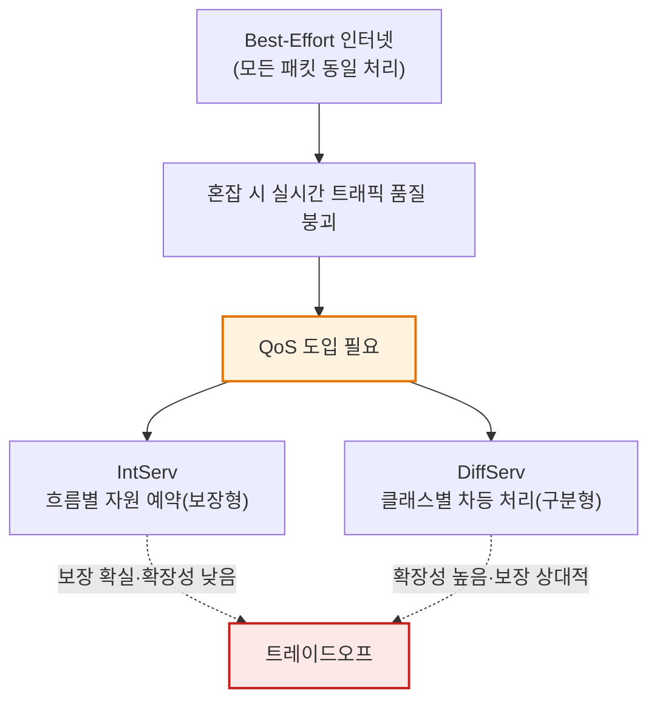
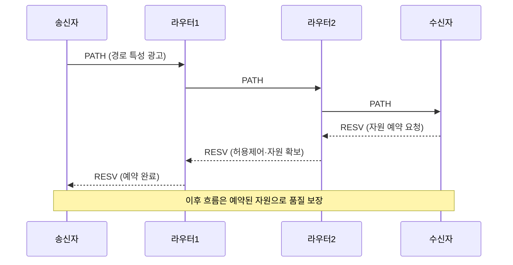
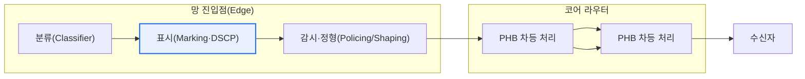

# QoS — DiffServ와 IntServ

## 1. 개요

### 가. QoS의 정의
> **QoS(Quality of Service)** 는 네트워크에서 특정 트래픽에 대해 **대역폭(bandwidth)·지연(delay)·지터(jitter)·손실률(loss)** 등 서비스 품질 지표를 **보장하거나 차등 제공**하는 기술 체계이며, **IntServ(Integrated Services)** 와 **DiffServ(Differentiated Services)** 는 이를 IP 네트워크에서 실현하는 두 가지 대표 아키텍처다.

### 나. 등장 배경과 필요성
QoS가 필요한 근본 이유는 '**모든 트래픽을 똑같이 대하면 정작 중요한 트래픽의 품질이 무너진다**'는 데 있다. 인터넷은 본래 **최선형(Best-Effort) 전달**을 전제로 설계되었다. 라우터는 모든 패킷을 차별 없이 도착 순서대로 처리(FIFO)하고, 혼잡하면 뒤에 온 패킷부터 큐에서 버린다(tail drop). 평상시 링크에 여유가 있을 때는 이 단순한 원리로도 충분하지만, 문제는 혼잡할 때다.

혼잡 시 트래픽의 성격 차이가 결정적이다. 실시간 음성(VoIP)·영상회의는 **지연·지터·손실에 민감**하다. VoIP는 통상 **편도 지연 150ms 이내, 지터 30ms 이내, 손실률 1% 이내**를 유지해야 통화 품질이 보장되는데, 조금만 지연·손실돼도 음성이 끊기고 화면이 깨진다. 반면 대용량 파일 전송(FTP)·백업은 지연에 둔감하고 처리량(throughput)만 확보되면 된다. 이렇게 요구사항이 상반된 트래픽을 최선형으로 똑같이 취급하면, 실시간 트래픽의 품질을 보장할 수 없다.

QoS는 트래픽에 **우선순위와 자원을 차등 배분**해 이 문제를 푼다. 그런데 '어떻게 차등할 것인가'에서 철학이 두 갈래로 갈린다. **IntServ** 는 통신을 시작하기 전에 경로상의 모든 라우터에 필요한 자원을 미리 '**예약(reservation)**'해 흐름별로 품질을 확실히 보장하는 방식이고, **DiffServ** 는 패킷에 우선순위를 '**표시(marking)**'해 각 라우터가 그 등급대로 차등 처리하는 방식이다. 전자는 확실하지만 무겁고, 후자는 가볍지만 절대 보장은 약하다. 즉 두 방식은 근본적으로 **'보장의 확실성(강한 보장)'과 '확장성(scalability)' 사이의 서로 다른 선택**이다. 이 트레이드오프가 이후 모든 비교의 축이 된다.

## 2. IntServ (Integrated Services) — 흐름별 자원 예약

IntServ는 통신에 앞서 **RSVP(Resource reSerVation Protocol)** 로 경로상 모든 라우터에 필요한 대역폭을 예약한다. 개념적으로는 전화망의 회선 예약을 IP 위에 흉내 낸 것으로, '통화를 걸기 전에 회선을 잡아두는' 방식과 유사하다.

**동작 원리**를 단계로 보면, 먼저 송신자가 **PATH 메시지**를 보내 경로와 트래픽 특성을 하류(downstream)로 광고한다. 이를 받은 수신자가 **RESV 메시지**로 필요한 자원을 상류(upstream)로 역방향 요청하면, 경로상 각 라우터는 **허용 제어(Admission Control)** 로 여유 자원이 있는지 판단하고, 가능하면 자원을 예약(확보)한다. 자원이 부족하면 예약을 거부해 새 흐름을 받지 않음으로써 기존 흐름의 품질을 지킨다. 이렇게 **경로 전체에 예약이 성립해야만** 흐름이 시작되므로 품질이 확실히 보장된다(경성 보장, hard guarantee).

**핵심 구성요소**로는 ① 예약을 협상하는 RSVP(시그널링), ② 새 흐름 수용 여부를 결정하는 허용 제어, ③ 예약된 등급대로 큐를 관리하는 패킷 스케줄러(예: WFQ), ④ 흐름이 약속한 트래픽 규격을 지키는지 검사하는 분류·정책(classifier·policer)이 있다. IntServ는 서비스 등급을 **보장형 서비스(Guaranteed Service, 지연 상한 보장)** 와 **부하 제어형 서비스(Controlled-Load, 저부하 시 품질에 근접)** 로 나눈다.

**결정적 한계는 확장성**이다. 각 라우터가 **흐름(flow) 수만큼 상태(state)를 유지**해야 하기 때문이다. 흐름이 수천·수만 개에 이르는 대규모 백본에서는 라우터가 관리해야 할 상태와 시그널링 부하가 폭증한다. 또한 경로상 **모든** 라우터가 RSVP를 지원해야 하므로, 하나라도 지원하지 않으면 보장이 끊긴다. 이 두 가지 때문에 IntServ는 대규모 인터넷에서 사실상 채택되지 못했다.

| 특징 | 내용 |
|---|---|
| **품질 보장** | 흐름별 확실한 보장(경성 보장) |
| **핵심 기술** | RSVP 시그널링, 허용 제어 |
| **상태 관리** | 라우터가 흐름별 상태 유지(stateful) |
| **한계** | 흐름 수 비례 상태·시그널링 → 확장성 낮음 |

## 3. DiffServ (Differentiated Services) — 클래스별 차등 처리

DiffServ는 IntServ의 확장성 문제를 해결하기 위해 **흐름별 예약을 포기하고 '클래스별 차등'** 으로 방향을 바꾼 아키텍처다. 핵심 발상은 '**복잡한 판단은 망 가장자리(edge)에서 한 번만, 내부(core)는 표시만 보고 단순·빠르게 처리**'하는 것이다.

**동작 원리**는 이렇다. 트래픽이 망에 들어오는 진입점(edge) 라우터에서 트래픽을 **분류(classify)** 하고, IP 헤더의 **DSCP(DiffServ Code Point)** 필드(IPv4 ToS/IPv6 Traffic Class 바이트의 상위 6비트)에 클래스를 **표시(mark)** 한다. 진입점에서는 약속된 규격을 초과하는 트래픽을 버리거나 지연시키는 **감시(policing)·정형(shaping)** 도 수행한다. 그다음부터 **내부(core) 라우터는 흐름 상태를 전혀 유지하지 않고**, 오직 패킷의 DSCP 표시가 지정하는 **PHB(Per-Hop Behavior, 홉별 행동)** 에 따라 차등 처리만 한다.

**PHB(홉별 행동)** 는 각 라우터가 특정 클래스 패킷을 어떻게 대할지 정의한 규칙으로, 표준화된 유형은 다음과 같다. ① **EF(Expedited Forwarding)** 는 지연·지터·손실을 최소화하는 최고 우선 클래스로 VoIP·영상 같은 실시간 트래픽에 쓴다. ② **AF(Assured Forwarding)** 는 4개 클래스와 각 3단계 드롭 우선순위로 나뉘어, 혼잡 시 버릴 순서를 차등화한다(기업 데이터 등). ③ **BE(Best-Effort, Default)** 는 기존 최선형 그대로다.

**장점은 뛰어난 확장성**이다. 내부 라우터가 흐름별 상태를 유지하지 않으므로(stateless), 흐름 수와 무관하게 동작하고 대규모 백본에 적합하다. **단점은 절대적 보장의 부재**다. 예약이 아니라 '상대적 우선순위'이므로, 특정 클래스가 반드시 몇 ms 이내를 보장한다고 단언하기 어렵다(연성 보장, soft guarantee). 그래서 실제로는 **SLA(서비스수준협약)** 와 각 클래스의 트래픽 총량을 관리·설계함으로써 통계적으로 품질을 확보한다.

| 특징 | 내용 |
|---|---|
| **품질 보장** | 클래스별 상대적 차등(연성 보장) |
| **핵심 기술** | DSCP 표시, PHB(EF/AF/BE) 차등 처리 |
| **상태 관리** | 코어는 무상태(stateless), 판단은 edge에서 |
| **장점** | 흐름 상태 불필요 → 확장성 높음 |

## 4. 비교와 사례 — 왜 DiffServ가 주류인가

두 아키텍처의 차이는 결국 '**어디서 얼마나 상태를 유지하는가**'에서 비롯되며, 그것이 보장 수준과 확장성의 트레이드오프로 이어진다.

| 구분 | IntServ | DiffServ |
|---|---|---|
| **처리 단위** | 흐름(flow)별 | 클래스(class)별 |
| **보장 수준** | 흐름별 확실한 보장(경성) | 클래스별 상대적 차등(연성) |
| **상태 관리** | 라우터마다 흐름 상태 유지 | 코어 무상태(edge만 분류) |
| **시그널링** | RSVP 필요(사전 예약) | 불필요(패킷 표시로 대체) |
| **확장성** | 낮음(흐름 수 비례) | 높음(흐름 수 무관) |
| **적용 영역** | 소규모·종단 구간 | 대규모 백본·인터넷·SP망 |

**차이가 생기는 근본 이유**는 IntServ가 '흐름별 상태 + 사전 시그널링'이라는 무거운 장치로 확실성을 산 반면, DiffServ는 그 장치를 '패킷 헤더의 6비트 표시'로 대체해 확장성을 얻었다는 데 있다. 상태를 코어에서 없애자 라우터는 흐름 수와 무관하게 동작할 수 있게 됐고, 이 **무상태성(statelessness)** 이 인터넷 규모에서 결정적 이점이 된 것이다.

**첫째 사례 — 통신사업자(ISP) 백본**: 수십만 흐름이 동시에 흐르는 백본에서 흐름별 예약(IntServ)은 라우터 메모리·CPU를 감당할 수 없어 비현실적이다. 그래서 실무의 대규모 망은 DiffServ를 표준으로 채택하고, 음성은 EF, 중요 업무 데이터는 AF, 일반 트래픽은 BE로 매핑해 운영한다.

**둘째 사례 — 기업 VoIP 구축**: 한 기업이 IP전화를 도입하며 화상회의 지연 문제를 겪는다면, 스위치·라우터에서 음성 패킷을 DSCP EF(값 46)로 표시하고 우선 큐에 넣어 데이터 트래픽보다 먼저 내보낸다. 이때 실제 대역 배분은 DiffServ 표시만으로 끝나지 않고, WFQ·LLQ(Low Latency Queuing) 같은 **큐잉·스케줄링 기법**이 수행한다.

**셋째 사례 — 하이브리드 설계**: 두 방식은 배타적이지 않다. 품질이 극히 중요한 종단 구간(예: 캠퍼스 접속망)은 IntServ/RSVP로 확실히 보장하고, 트래픽이 집약되는 백본은 DiffServ로 처리하는 하이브리드로 보장성과 확장성을 함께 취할 수 있다. 실제 RSVP-TE는 MPLS 망의 트래픽 엔지니어링에서 경로·대역 예약 용도로 여전히 활용된다.

## 5. 심화 — QoS 메커니즘 연계와 최신 동향

DiffServ·IntServ는 '**무엇을 우선할지 정하는 정책 틀**'일 뿐, 실제 품질은 그 정책을 실행하는 하위 메커니즘과 결합해야 완성된다. QoS의 실행 체계는 크게 ① **분류·표시(Classification·Marking)**, ② **혼잡 관리(Congestion Management, 큐잉·스케줄링)**, ③ **혼잡 회피(Congestion Avoidance, WRED 등)**, ④ **정책·정형(Policing·Shaping)** 의 네 축으로 구성된다.

특히 **큐잉·스케줄링**이 핵심이다. DiffServ가 패킷을 EF로 표시해도, 라우터가 그 패킷을 먼저 내보내려면 **PQ(우선순위 큐)·WFQ(가중 공정 큐잉)·CBWFQ·LLQ** 같은 알고리즘이 필요하다. 예컨대 LLQ는 음성 같은 지연 민감 트래픽에 엄격한 우선 큐를 주되, 다른 트래픽의 기아(starvation)를 막도록 대역 상한을 둔다. 혼잡 회피 쪽에서는 **WRED(Weighted Random Early Detection)** 가 큐가 가득 차기 전에 낮은 우선순위 패킷을 확률적으로 미리 버려, TCP의 동시 감속(global synchronization)을 방지한다. 즉 DiffServ의 AF 드롭 우선순위는 WRED와 짝을 이룰 때 의미를 갖는다. [[wfq]]

**최신 동향**으로는, 물리 회선 예약에서 소프트웨어 정책으로 무게중심이 옮겨가고 있다. **SD-WAN**은 애플리케이션을 인식(application-aware)해 실시간으로 최적 경로·큐를 선택함으로써, 전통적 DSCP 표시를 넘어 '의도 기반(intent-based)' QoS를 구현한다. **SDN**에서는 컨트롤러가 망 전체를 조망해 흐름 단위로 정책을 중앙 제어하므로, IntServ의 흐름별 제어와 DiffServ의 확장성을 소프트웨어로 절충하려는 시도가 이뤄진다. 5G 코어의 **네트워크 슬라이싱(network slicing)** 역시 하나의 물리망을 논리적으로 나눠 슬라이스별 QoS(초저지연 URLLC 등)를 보장한다는 점에서, IntServ의 '보장' 철학을 가상화 기술로 재해석한 흐름으로 볼 수 있다.

## 6. 고려사항 및 시사점 (기술사 관점)

1. **확장성이 아키텍처 선택을 지배한다.** 인터넷 규모에서 흐름별 예약(IntServ)은 상태·시그널링 부하로 비현실적이므로, 무상태·고확장의 DiffServ가 실무의 사실상 표준이 되었다. 기술사는 QoS 설계 시 '보장의 확실성'과 '확장성'의 트레이드오프를 망 규모에 맞춰 판단해야 하며, 백본은 DiffServ, 종단은 필요 시 IntServ라는 계층적 선택이 합리적이다.

2. **QoS는 단일 기술이 아니라 종단 간(end-to-end) 정책 체계다.** DiffServ 표시가 경로 어느 구간에서라도 무시되거나 재표시(re-marking)되면 품질 보장이 끊긴다. 따라서 서로 다른 사업자망을 지날 때의 **DSCP 신뢰경계(trust boundary)와 마킹 정책 일관성**을 SLA로 명문화하는 것이 핵심 고려사항이다.

3. **오버프로비저닝(대역 과다 확보)과의 경제성 비교가 필요하다.** 링크 대역이 충분히 저렴해진 구간에서는 복잡한 QoS를 설계하기보다 대역을 넉넉히 확보하는 것이 총소유비용(TCO) 측면에서 유리할 수 있다. 기술사는 QoS 도입의 운영 복잡도와 대역 증설 비용을 견주어 최적점을 제시해야 한다.

4. **하위 큐잉·혼잡 회피 메커니즘과의 통합 설계가 성패를 가른다.** DiffServ의 EF/AF 표시는 WFQ·LLQ·WRED 등 실제 스케줄링과 결합해야 품질로 실현된다. 표시(marking)만 하고 큐 정책이 없으면 QoS는 이름뿐이므로, 표시-큐잉-회피-정형의 네 축을 일관되게 설계·검증해야 한다.

5. **SDN·SD-WAN·5G 슬라이싱 등 소프트웨어 기반 QoS로의 전환에 대비해야 한다.** 정적 DSCP 정책에서 애플리케이션·의도 인식 기반의 동적 QoS로 패러다임이 이동하고 있으므로, 기존 DiffServ 설계 위에 중앙 제어·자동화를 얹는 진화 경로를 전략적으로 준비하는 것이 바람직하다.

## 참고자료
- RFC 2205 — Resource ReSerVation Protocol (RSVP), IntServ 시그널링
- RFC 2475 — An Architecture for Differentiated Services (DiffServ)
- RFC 2597 / RFC 3246 — Assured Forwarding(AF) / Expedited Forwarding(EF) PHB

---

> **한 줄 요약**: QoS의 IntServ는 *RSVP로 흐름별 자원을 사전 예약해 확실히 보장(경성)* 하나 흐름 상태 유지로 확장성이 낮고, DiffServ는 *DSCP 표시와 PHB로 클래스별 차등 처리(연성)* 해 코어 무상태·고확장이나 보장이 상대적이며, 대규모 망에서는 DiffServ가 주류이되 WFQ·WRED 등 큐잉·혼잡회피 메커니즘 및 SDN·SD-WAN·5G 슬라이싱과 결합해 완성된다.
