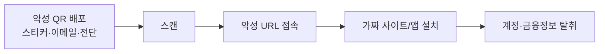

# 큐싱(Qshing, QR code + Phishing)

## 1. 개요

### 가. 정의
> **QR코드(Quick Response Code)** 를 미끼로 사용자를 악성 사이트로 유도하거나 악성 앱을 설치하게 하여 계정·금융정보를 탈취하는 **QR코드 기반 피싱(Phishing)** 공격.

큐싱은 스미싱(문자 기반 피싱)이 한 단계 진화한 형태로, 공격 벡터가 "링크 텍스트"에서 "이미지(QR)"로 바뀐 것이 본질이다. 사람은 URL 문자열은 눈으로 어느 정도 검증할 수 있지만, QR코드는 흑백 점의 패턴이어서 스캔하기 전에는 목적지를 전혀 알 수 없다. 이 **목적지 은닉성(destination opacity)** 이 큐싱의 핵심 무기다.

### 나. 등장 배경 및 필요성
코로나19 이후 비대면·간편결제가 확산되면서 QR코드는 결제·출입 인증·전자메뉴판·전단지 등 일상 곳곳에 자리 잡았다. 사용자는 QR을 "당연히 신뢰할 만한 편의 수단"으로 인식하게 되었고, 이 **학습된 신뢰**가 오히려 공격 표면이 되었다. 또한 QR은 종이 스티커 한 장으로 물리 공간에 손쉽게 심을 수 있고, 이메일 본문에 이미지로 삽입하면 URL 기반 스팸 필터를 우회할 수 있어 공격자 입장에서 비용 대비 효율이 매우 높다. 이 때문에 큐싱은 최근 급증하는 공격 유형이 되었으며, 사후 인지가 어렵다는 특성상 사전 예방 체계 마련이 시급하다.

## 2. 공격 흐름(아키텍처)

큐싱은 대체로 **① 배포 → ② 스캔 유도 → ③ 접속 → ④ 탈취**의 4단계를 거친다. 공격자는 정상 서비스를 가장한 QR을 물리·전자 채널로 뿌리고, "주차 정산", "이벤트 경품", "택배 조회" 같은 사회공학적 명분으로 스캔을 유도한다. 스캔 즉시 브라우저가 악성 URL로 이동하는데, 이 URL은 정상 사이트와 시각적으로 동일한 피싱 페이지이거나 악성 APK 다운로드 링크다. 사용자가 로그인 정보나 카드번호를 입력하는 순간, 혹은 앱 설치 후 과도한 권한을 승인하는 순간 정보가 탈취된다. 특히 모바일 화면은 주소창이 짧게 표시되어 도메인 위조를 알아채기 어렵다는 점이 피해를 키운다.

## 3. 공격 유형·수법

큐싱은 QR이 놓이는 채널과 수법에 따라 다음과 같이 나뉜다. 공통점은 모두 **"정상처럼 보이는 QR"** 을 만든다는 것이다.

- **QR 스티커 덮어쓰기**: 주차 정산기·식당 테이블·공용 결제기 등에 붙은 정품 QR 위에 악성 QR 스티커를 물리적으로 덧붙인다. 예컨대 미국에서는 공용 주차장 정산 QR 위에 가짜 QR을 붙여 결제정보를 빼돌린 사례가 다수 보고되었다. 물리적 접근만으로 가능해 탐지가 매우 어렵다.
- **피싱 메일·문자(Quishing)**: 이메일 본문이나 첨부 이미지에 QR을 삽입한다. 텍스트 URL이 없으므로 전통적 스팸·URL 필터가 걸러내지 못하고, 사용자는 "PC가 아닌 개인 휴대폰"으로 스캔하게 되어 기업 보안 통제(EDR·프록시)를 벗어난다.
- **악성앱 설치 유도**: 스캔 후 공식 앱마켓이 아닌 외부 링크에서 APK 직접 설치를 유도한다. 설치 앱은 SMS·연락처·접근성 권한을 요구해 OTP 탈취나 원격 제어까지 이어진다.
- **결제·송금 사기**: 위조된 계좌·가맹점 QR로 엉뚱한 곳에 송금하게 만든다.

| 유형 | 수법 | 위험 포인트 |
|---|---|---|
| **QR 스티커 덮어쓰기** | 정품 QR 위 악성 QR 부착(주차·결제기) | 물리 접근, 사후 인지 곤란 |
| **피싱 메일/문자** | 첨부·본문 QR로 URL 필터 우회 | 개인 단말로 통제 이탈 |
| **악성앱 설치** | 스캔 후 APK 다운로드 유도 | 과도 권한·OTP 탈취 |
| **결제 사기** | 위조 QR로 송금 유도 | 직접 금전 손실 |

## 4. 대응 방안

큐싱은 목적지 은닉성 때문에 "스캔 후 검증"이 아니라 **"접속 전·입력 전 검증"** 이 핵심이다. 대응은 이용자·기술·기관의 다층 방어로 나눈다.

- **이용자 측면**: 출처가 불명확한 QR(길거리 스티커, 스팸 메일)은 스캔을 자제하고, 스캔 후 자동 열림이 아니라 **URL 미리보기**를 반드시 확인한다. 결제·로그인은 QR이 아닌 **공식 앱·즐겨찾기**로 직접 접속하는 습관이 가장 안전하다.
- **기술 측면**: QR 스캐너 앱이 접속 전 URL을 표시하고, 위협 인텔리전스 기반 **평판(reputation) 조회**로 악성 도메인을 차단한다. 백신·MDM으로 악성앱 설치를 통제한다.
- **기관·서비스 측면**: 게시된 QR의 **무결성(변조 여부)** 을 주기적으로 점검하고, 전자서명이 포함된 **인증 QR**로 위·변조를 방지하며, 사용자 인식 제고 캠페인을 병행한다.

| 주체 | 대응 |
|---|---|
| **이용자** | 출처 불명 QR 스캔 자제, URL 미리보기 확인, 공식 앱 직접 접속 |
| **기술** | 스캔 시 URL 검증·평판 조회, 백신·MDM |
| **기관** | QR 무결성 점검·서명 기반 인증 QR·인식 제고 |

## 5. 고려사항 및 시사점
QR은 목적지 은닉성이 커서 피해가 발생한 뒤에야 인지되는 경우가 많으므로, 기술사 관점에서는 **사전 검증 중심의 예방 아키텍처**가 관건이다. 첫째, 모든 접속을 신뢰하지 않는 **제로트러스트** 원칙과 결합해 QR 스캔 후 접속도 지속 검증 대상으로 둔다. 둘째, 모바일 보안(EDR·MDM·모바일 백신)과 위협 인텔리전스를 연계해 악성 도메인·앱을 실시간 차단한다. 셋째, 결제·인증용 QR에는 **전자서명·동적 QR(일회성)** 을 도입해 위·변조 자체를 무력화한다. 궁극적으로 큐싱은 기술 단독이 아니라 **이용자 인식·서비스 설계·규제**가 함께 가야 줄어드는, 사람과 기술이 얽힌 보안 문제다.

---

> **한 줄 요약**: 큐싱은 *QR코드의 목적지 은닉성을 악용해 악성 사이트·앱으로 유도하고 정보를 탈취* 하는 피싱으로, 스티커 덮어쓰기·메일 QR·악성앱 등 수법에 대해 출처 불명 QR 스캔 자제·접속 전 URL 검증·서명 기반 QR 무결성 확보 등 사전 예방이 핵심이다.
