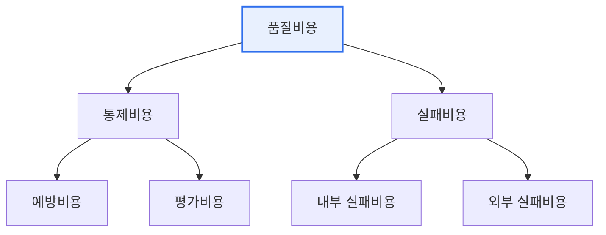

# 소프트웨어 품질비용(Cost of Quality)

## 1. 개요

### 가. 정의
> **품질비용**은 소프트웨어 품질을 확보하고 관리하는 데 드는 모든 비용으로, 좋은 품질을 만들기 위한 **통제비용(예방·평가)** 과 나쁜 품질로 인해 발생하는 **실패비용(내부·외부)** 으로 나뉜다.

품질비용 개념의 핵심 통찰은 '**품질에는 반드시 비용이 들지만, 그 비용을 어디에 쓰느냐가 총비용을 결정한다**'는 데 있다. 흔히 "품질을 높이면 비용이 는다"고 생각하지만, 실제로는 예방·평가에 미리 투자하면 실패비용이 크게 줄어 총 품질비용이 오히려 감소한다. 반대로 예방을 소홀히 하면 결함이 늘어 재작업·고객 배상 같은 실패비용이 폭증한다. 특히 결함은 **발견이 늦을수록 수정 비용이 기하급수적으로 커지므로**(요구 단계 결함이 운영 단계에서 수정되면 수십~수백 배), 앞단의 예방·평가에 투자하는 것이 경제적이다. 품질비용을 4가지로 분류·측정하면 어디에 투자해야 총비용이 최소화되는지 알 수 있다.

### 나. 필요성
품질 활동을 비용 관점에서 관리하지 않으면, 과잉 품질로 낭비하거나 과소 품질로 실패비용이 커진다. 품질비용 분석은 최적의 품질 투자 지점을 찾는 근거가 된다.

## 2. 품질비용 4가지 항목

품질비용은 좋은 품질을 위한 투자(통제)와 나쁜 품질의 대가(실패)로 나뉜다. **예방비용** 은 결함을 애초에 막기 위한 투자, **평가비용** 은 결함을 찾기 위한 검사 비용이다. **내부 실패비용** 은 출시 전에 결함을 발견해 고치는 비용, **외부 실패비용** 은 출시 후 고객이 겪는 결함으로 인한 비용으로 가장 파괴적이다.

| 항목 | 내용 | 사례 |
|---|---|---|
| **예방비용** | 결함 예방을 위한 투자 | 교육, 표준·프로세스, 설계 리뷰, 도구 |
| **평가비용** | 결함 발견을 위한 검사 | 테스트, 코드 리뷰, 검사·감리 |
| **내부 실패비용** | 출시 전 발견 결함 처리 | 버그 수정, 재작업, 재테스트 |
| **외부 실패비용** | 출시 후 결함으로 인한 손실 | 고객 배상, 리콜, 신뢰 하락, 유지보수 |

## 3. 품질비용의 관계

예방·평가(통제비용)에 투자할수록 실패비용은 줄어든다. 초기에는 통제비용 투자로 총비용이 감소하다가, 지나친 통제는 오히려 낭비가 되므로 최적 지점이 존재한다. 핵심은 외부 실패비용이 가장 크고 파괴적이므로, 이를 줄이는 예방·평가 투자가 경제적이라는 점이다.

## 4. 고려사항 및 시사점

1. **예방에 투자하는 것이 가장 경제적**이다. 결함은 앞단에서 막을수록 비용이 적으므로, 예방(리뷰·표준·교육)에 대한 투자가 총 품질비용을 최소화한다.
2. **외부 실패비용의 위험성**을 인식해야 한다. 고객이 겪는 결함은 배상·신뢰 하락 등 눈에 보이는 비용을 넘어선 파괴적 손실이므로, 출시 전 철저한 검증이 필수다.
3. **품질비용 측정으로 의사결정을 근거화**한다. 4가지 비용을 측정·추적하면 품질 투자의 효과를 정량화해, 어디에 투자할지 합리적으로 결정할 수 있다.

---

> **한 줄 요약**: 품질비용은 *통제비용(예방·평가)과 실패비용(내부·외부)* 으로 구성되며, 예방·평가에 미리 투자하면 파괴적인 외부 실패비용이 줄어 총비용이 감소하므로, 앞단 예방 투자가 가장 경제적인 품질 전략이다.
