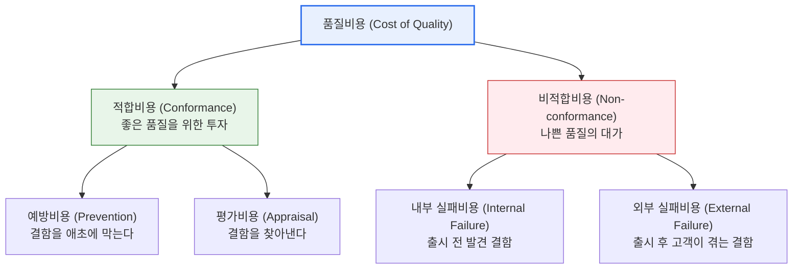
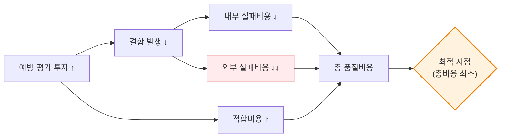

# 소프트웨어 품질비용(Cost of Quality)

## 1. 개요

### 가. 정의
> **품질비용(Cost of Quality, CoQ)** 은 소프트웨어의 품질을 확보·유지·관리하기 위해 발생하는 모든 비용의 총합으로, 좋은 품질을 만들기 위한 **적합비용(Cost of Conformance = 예방비용 + 평가비용)** 과 나쁜 품질 때문에 치르는 **비적합비용(Cost of Non-conformance = 내부 실패비용 + 외부 실패비용)** 으로 구성된다.

품질비용 개념이 담고 있는 핵심 통찰은 **"품질에는 반드시 비용이 들지만, 그 비용을 어느 단계에 쓰느냐가 총비용을 결정한다"** 는 데 있다. 많은 조직이 "품질을 높이면 비용이 늘어난다"는 직관에 사로잡혀 검증 활동을 축소하려 한다. 그러나 품질비용 이론은 이 직관을 정면으로 반박한다. 예방과 평가에 미리 투자하면 결함이 줄어 재작업·배상 같은 실패비용이 급감하고, 결과적으로 **총 품질비용이 오히려 감소**한다는 것이다. 반대로 앞단의 통제를 소홀히 하면 결함이 누적되어 뒷단에서 실패비용이 폭증한다. 즉 품질비용은 "쓰느냐 마느냐"의 문제가 아니라 **"어디에 쓸 것인가(예방이냐, 실패 수습이냐)"** 의 배분 문제다.

이 통찰의 정량적 근거가 바로 **결함 수정 비용의 단계별 증폭 법칙**이다. 결함은 발견이 늦어질수록 수정 비용이 기하급수적으로 커진다. Boehm과 IBM 등의 고전적 연구에 따르면, 요구사항 단계에서 발견하면 1의 비용으로 고칠 결함이 설계 단계에서는 수 배, 코딩·테스트 단계에서는 수십 배, 운영(출시 후) 단계에서는 **수십~수백 배**의 비용으로 불어난다. 운영 단계 결함은 단순 코드 수정을 넘어 장애 대응, 긴급 패치 배포, 고객 통지, 신뢰 회복까지 연쇄 비용을 유발하기 때문이다. 이 법칙이 있기에 "앞단 예방 투자가 경제적"이라는 결론이 이론이 아닌 수치로 뒷받침된다.

### 나. 등장 배경과 필요성
품질비용 개념은 제조업의 품질경영(TQM) 사상가인 Juran과 Crosby로부터 비롯되었다. Crosby의 유명한 명제 *"Quality is Free(품질은 공짜다)"* 는 "예방에 투자한 비용은 그보다 훨씬 큰 실패비용 절감으로 회수되므로, 제대로 만든 품질은 결국 비용을 발생시키지 않는다"는 의미다. 이 사상이 소프트웨어 공학에 도입되면서, 눈에 잘 안 보이던 재작업·야근·고객 이탈 비용을 **화폐 단위로 측정·가시화**하는 도구로 발전했다. 소프트웨어는 무형(intangible)이라 품질의 좋고 나쁨이 즉시 드러나지 않고, 결함이 운영 단계에서 대형 장애로 폭발하는 특성이 있어, 품질 활동을 **비용-효익 관점에서 관리**할 필요성이 특히 크다. 품질비용 분석 없이 검증에 투자하면 과잉 품질로 자원을 낭비하고, 투자하지 않으면 과소 품질로 실패비용이 눈덩이처럼 불어나므로, **최적 투자 지점을 찾는 경영 의사결정의 근거**로서 품질비용이 요구된다.

## 2. 품질비용의 4대 구성 항목

### 가. 전체 분류 구조도
품질비용은 크게 "좋은 품질을 만들기 위한 능동적 투자(적합비용)"와 "나쁜 품질이 초래한 사후 대가(비적합비용)"의 두 축으로 나뉘고, 각 축은 다시 두 항목으로 세분된다.

```mermaid
flowchart TB
  Q["품질비용 (Cost of Quality)"] --> C["적합비용 (Conformance)<br/>좋은 품질을 위한 투자"]
  Q --> F["비적합비용 (Non-conformance)<br/>나쁜 품질의 대가"]
  C --> P["예방비용 (Prevention)<br/>결함을 애초에 막는다"]
  C --> A["평가비용 (Appraisal)<br/>결함을 찾아낸다"]
  F --> IF["내부 실패비용 (Internal Failure)<br/>출시 전 발견 결함"]
  F --> EF["외부 실패비용 (External Failure)<br/>출시 후 고객이 겪는 결함"]
  style Q fill:#e8f0fe,stroke:#2f6fed,stroke-width:2px
  style C fill:#e8f5e9,stroke:#2e7d32
  style F fill:#ffebee,stroke:#c62828
```

이 4분류의 핵심 논리는 **"왼쪽(예방·평가)에 투자할수록 오른쪽(내부·외부 실패)이 줄어든다"** 는 상쇄 관계다. 그리고 오른쪽으로 갈수록, 특히 외부 실패비용으로 갈수록 비용이 파괴적으로 커지므로, 투자 우선순위는 자연히 왼쪽(예방 > 평가)으로 기운다.

### 나. 예방비용(Prevention Cost) — 결함을 애초에 막는 투자
예방비용은 결함이 발생하는 것 자체를 막기 위해 선제적으로 투입하는 비용이다. 여기에는 개발자 교육·훈련, 코딩 표준과 개발 프로세스 정립, 품질 계획 수립, 요구사항·설계 리뷰, 정적 분석 도구 도입, 아키텍처 검토 등이 포함된다. 예방비용의 본질은 **"결함의 근본 원인(root cause)을 제거"** 하는 데 있다는 점이다. 예컨대 특정 유형의 널 포인터 오류가 반복된다면, 그때마다 고치는 것(실패비용)이 아니라 코딩 규칙과 정적 분석 규칙을 추가해 그 유형 자체가 다시 생기지 않게 만드는 것이 예방이다.

예방은 4가지 항목 중 **투자 대비 효과(ROI)가 가장 높다**. 결함이 만들어지기 전에 막으므로 뒷단의 평가·실패비용을 연쇄적으로 절감하기 때문이다. 그러나 효과가 즉각 눈에 보이지 않고(예방한 결함은 "일어나지 않은 사건"이라 측정이 어렵다), 성과 압박 속에서 가장 먼저 삭감되는 항목이기도 하다. 성숙한 조직일수록 예방비용 비중이 높다는 것이 품질비용 분석의 일관된 관찰이다.

### 다. 평가비용(Appraisal Cost) — 결함을 찾아내는 검사
평가비용은 이미 만들어진 산출물에 결함이 있는지 **찾아내기 위한 검사·측정 비용**이다. 동적 테스트(단위·통합·시스템·인수 테스트), 코드 리뷰와 인스펙션, 감리, 품질 감사, 테스트 환경 구축 및 유지 비용 등이 여기 속한다. 평가의 본질은 "결함을 없애는 것"이 아니라 "결함을 발견해 뒷단(운영)으로 새어 나가는 것을 막는 필터 역할"이다.

평가비용을 이해할 때 중요한 것은 예방과의 관계다. 평가는 결함을 **찾을 뿐 예방하지 못하므로**, 평가에만 의존하면 "계속 결함을 찾아 고치는" 소모적 순환에 빠진다. 이상적인 개선 경로는 평가에서 반복 발견되는 결함 패턴을 예방 활동으로 되먹임(feedback)하여, 점차 평가에서 걸리는 결함 자체가 줄어들게 만드는 것이다. 다만 평가를 무한정 강화하는 것도 능사가 아니다. 테스트 커버리지를 99%에서 100%로 끌어올리는 데 드는 한계비용이 그로써 막는 실패비용을 초과하는 지점이 존재하기 때문이다.

### 라. 내부 실패비용(Internal Failure Cost) — 출시 전 발견 결함의 처리
내부 실패비용은 제품이 고객에게 인도되기 **전에** 결함이 발견되어 이를 처리하는 데 드는 비용이다. 버그 수정, 재작업(rework), 재테스트, 결함 원인 분석, 설계 변경 등이 해당한다. 이 비용은 "나쁜 품질의 대가"이긴 하지만, 그나마 **고객에게 도달하기 전에 잡았다는 점에서 외부 실패보다 훨씬 저렴**하다.

내부 실패비용은 평가 활동의 산물이라는 양면성을 지닌다. 테스트를 강화하면(평가비용 증가) 그만큼 출시 전 결함이 많이 잡혀 내부 실패비용이 늘지만, 이는 오히려 건강한 신호다. 같은 결함이 걸러지지 않고 출시되어 외부 실패로 터지는 것보다 압도적으로 낫기 때문이다. 따라서 내부 실패비용은 "낮을수록 좋은 것"이 아니라, **외부 실패비용과의 비율(내부/외부)** 로 품질 프로세스의 건전성을 판단하는 지표로 봐야 한다.

### 마. 외부 실패비용(External Failure Cost) — 가장 파괴적인 비용
외부 실패비용은 결함이 출시 후 **고객에게 도달한 뒤** 발생하는 비용으로, 4가지 중 **가장 크고 파괴적**이다. 고객 배상·환불, 리콜, 긴급 패치와 핫픽스 배포, 콜센터·기술지원 부담, 계약 위약금, 그리고 무엇보다 **브랜드 신뢰 하락과 고객 이탈**이 포함된다. 앞의 세 비용이 조직 내부에서 화폐로 비교적 명확히 측정되는 반면, 외부 실패비용은 신뢰 상실·평판 훼손처럼 **측정하기 어렵지만 실제로는 가장 큰 손실**을 포함한다는 점이 특징이다.

구체적 사례로 규모를 가늠할 수 있다. 2012년 한 글로벌 증권사의 주문 처리 소프트웨어 결함은 45분 만에 약 4억 4천만 달러의 손실을 내고 회사를 파산 위기로 몰았다. 항공사 예약 시스템 장애, 은행 앱의 이체 오류, 대규모 개인정보 유출 사고 등은 모두 출시 후 결함(외부 실패)이 배상·과징금·주가 하락으로 이어진 사례다. 이처럼 외부 실패비용은 개발 비용을 수십 배 상회할 수 있어, "출시 전 검증을 아끼는 것이 가장 비싼 절약"이 되는 역설을 만든다.

| 항목 | 성격 | 대표 활동/사례 | 발생 시점 |
|---|---|---|---|
| **예방비용** | 적합(투자) | 교육, 코딩 표준, 프로세스, 설계 리뷰, 정적 분석 도구 | 개발 이전·전 과정 |
| **평가비용** | 적합(투자) | 테스트, 코드 리뷰, 인스펙션, 감리, 품질 감사 | 개발 중 |
| **내부 실패비용** | 비적합(대가) | 버그 수정, 재작업, 재테스트, 원인 분석 | 출시 전 |
| **외부 실패비용** | 비적합(대가) | 고객 배상, 리콜, 핫픽스, 신뢰 하락, 위약금 | 출시 후 |

## 3. 품질비용 간의 관계와 최적 투자 지점

### 가. 상쇄 관계와 총비용 곡선
품질비용 4항목은 독립적이지 않고 서로 맞물려 움직인다. 핵심 동학은 **"적합비용(예방·평가)을 늘리면 비적합비용(실패)이 줄어든다"** 는 상쇄(trade-off) 관계다. 이를 그래프로 그리면, 품질 수준을 높일수록 적합비용은 우상향으로 증가하고 실패비용은 우하향으로 감소하며, 이 둘을 더한 **총 품질비용은 U자형 곡선**을 그린다.

```mermaid
flowchart LR
  INV["예방·평가 투자 ↑"] --> DEF["결함 발생 ↓"]
  DEF --> INT["내부 실패비용 ↓"]
  DEF --> EXT["외부 실패비용 ↓↓"]
  INT --> TOT["총 품질비용"]
  EXT --> TOT
  INV --> CONF["적합비용 ↑"]
  CONF --> TOT
  TOT --> OPT{"최적 지점<br/>(총비용 최소)"}
  style OPT fill:#fff3e0,stroke:#f57c00,stroke-width:2px
  style EXT fill:#ffebee,stroke:#c62828
```

### 나. 최적 지점의 해석
초기에는 예방·평가 투자를 늘릴수록 실패비용이 크게 줄어 총비용이 감소한다. 그러나 어느 지점을 지나면 추가 투자로 막을 수 있는 실패비용보다 투자 자체의 한계비용이 커져, 총비용이 다시 증가한다. 이 **총비용이 최소가 되는 지점이 최적 품질 투자 수준**이다. 다만 현대의 관점은 다소 진화했는데, 자동화된 테스트·CI/CD·정적 분석 도구의 발달로 평가·예방의 한계비용이 크게 낮아지면서, 최적 지점이 예전보다 **더 높은 품질 쪽으로 이동**했다는 것이다. 즉 "완벽한 품질은 비경제적"이라는 고전적 결론은, 자동화로 검증 비용이 급락한 오늘날 상당 부분 완화되었다.

여기서 반드시 강조할 점은 **외부 실패비용의 가중치**다. 총비용을 계산할 때 외부 실패비용에는 측정 불가능한 신뢰 손실이 숨어 있으므로, 명목상 계산된 최적점보다 **더 앞단에 투자하는 것이 안전**하다. 눈에 보이는 비용만으로 최적화하면 진짜 위험(브랜드 붕괴)을 과소평가하게 된다.

### 다. 항목 간 비율로 읽는 프로세스 성숙도
품질비용은 절대 금액뿐 아니라 **항목 간 비율**로 조직의 품질 성숙도를 진단하는 데 유용하다. 예를 들어 실패비용(내부+외부)이 총 품질비용의 대부분을 차지하고 예방비용이 미미하다면, 그 조직은 "결함을 만들어 놓고 뒤에서 수습하는" 미성숙 단계에 있다는 신호다. 반대로 예방비용 비중이 높고 실패비용이 낮다면, 앞단에서 결함을 통제하는 성숙한 조직이다. 특히 **외부 실패비용 대비 내부 실패비용의 비율**이 높다는 것은 "결함을 고객에게 내보내기 전에 잘 걸러내고 있다"는 긍정적 지표로 해석된다. 이처럼 품질비용은 단순 지출 내역이 아니라 **프로세스 개선의 방향을 가리키는 나침반** 역할을 한다.

또한 품질비용은 개별 결함이 아니라 **추세(trend)** 로 볼 때 의미가 크다. 스프린트나 릴리스마다 항목별 비용을 추적하면, 예방 투자를 늘린 뒤 몇 개월에 걸쳐 실패비용이 실제로 줄어드는지를 데이터로 확인할 수 있다. 이 되먹임 루프가 있어야 "품질 투자가 효과가 있다"는 주장을 경영진에게 정량적으로 입증하고 지속적 예산을 확보할 수 있다.

## 4. 심화 — 애자일·데브옵스 시대의 품질비용과 Shift-Left

전통적 품질비용 이론은 폭포수(waterfall) 모델을 배경으로, "출시 전 철저한 검증"을 강조했다. 그러나 애자일·데브옵스 환경에서는 짧은 주기로 반복 배포하므로 품질비용의 관리 방식도 진화했다. 핵심 전략이 **시프트 레프트(Shift-Left)**, 즉 품질 활동을 개발 생명주기의 **더 앞단(왼쪽)으로 당기는 것**이다. 이는 앞서 본 "결함 수정 비용 증폭 법칙"의 논리적 귀결로, 결함을 최대한 초기에 잡아 실패비용의 뿌리를 자르는 접근이다.

구체적 실천으로는 ① **TDD(테스트 주도 개발)** 로 코드 작성 전에 테스트를 먼저 만들어 결함 유입을 예방하고, ② **CI(지속적 통합)** 파이프라인에서 커밋마다 자동 테스트·정적 분석을 돌려 결함을 즉시 발견하며, ③ **정적 분석 도구(SonarQube 등)** 로 코드 리뷰 이전에 취약점·코드 스멜을 자동 검출한다. 이들은 모두 예방·평가 비용을 **자동화로 저렴하게** 만들어, 사람이 수작업으로 하던 시절보다 훨씬 낮은 비용으로 결함을 앞단에서 걸러낸다. 그 결과 같은 품질을 훨씬 적은 총비용으로 달성하는 것이 가능해졌다.

이러한 자동화의 효과는 품질비용 곡선을 근본적으로 바꾼다. 과거에는 평가 활동(테스트·리뷰)이 사람의 반복 노동이라 한계비용이 높아, 일정 수준 이상 품질을 높이면 곧 경제성이 무너졌다. 그러나 테스트를 코드로 작성해 두면 이후 수천 번 실행해도 추가 비용이 거의 0에 수렴하므로, **같은 예산으로 훨씬 촘촘한 검증**이 가능해진다. 즉 자동화는 평가비용의 성격을 "매번 드는 변동비"에서 "한 번 만들어 두는 고정 투자"로 바꾸어, 예방과 평가의 경계를 흐리게 만든다. 잘 작성된 자동 테스트 스위트는 결함을 찾는 평가 수단이면서 동시에 향후 결함 유입을 막는 예방 장치(회귀 방지)로도 기능하기 때문이다.

한편 최근에는 **시프트 라이트(Shift-Right)** 개념도 보완적으로 논의된다. 운영 환경에서 관측성(observability)·카나리 배포·기능 플래그·A/B 테스트를 통해 실사용 중 문제를 조기에 감지하고 빠르게 롤백함으로써, 외부 실패비용이 대형 장애로 번지기 전에 억제하는 접근이다. 즉 현대의 품질비용 전략은 "앞단 예방(Shift-Left)"과 "운영 단계 조기 감지·신속 복구(Shift-Right)"를 결합해, 결함이 어디서 새더라도 비용이 폭증하기 전에 차단하는 **양방향 방어**로 발전하고 있다. 나아가 AI 기반 코드 리뷰·결함 예측 도구가 예방비용의 효율을 다시 한 번 끌어올리는 최신 흐름도 주목된다.

## 5. 고려사항 및 시사점(기술사 관점)

1. **예방 중심(Prevention-first) 투자 배분** — 4가지 비용 중 예방의 ROI가 가장 높으므로, 품질 예산을 실패 수습이 아니라 리뷰·표준·교육·자동화 도구 같은 예방 활동에 우선 배분해야 한다. "결함을 찾아 고치는 조직"에서 "결함이 생기지 않게 하는 조직"으로의 전환이 총 품질비용 최소화의 핵심이며, 이는 조직의 프로세스 성숙도(CMMI 등) 향상과 직결된다.

2. **외부 실패비용의 숨은 크기 인식** — 외부 실패비용에는 배상·리콜 같은 명시 비용을 넘어 브랜드 신뢰 하락, 고객 이탈, 규제 과징금 등 **측정하기 어렵지만 치명적인 손실**이 포함된다. 따라서 명목상 계산된 최적 투자점보다 다소 앞단에 보수적으로 투자하는 것이 안전하며, 특히 금융·의료·안전 관련 도메인에서는 이 원칙이 절대적이다.

3. **품질비용의 측정·가시화를 통한 데이터 기반 의사결정** — 4가지 비용을 화폐 단위로 측정·추적하지 않으면 품질 투자는 감(感)에 의존하게 된다. 재작업 시간, 결함 밀도, 유출 결함 수, 항목별 비용 비율(예: 예방:평가:내부:외부) 등을 정량 지표화하여 경영진이 이해하는 언어(비용 절감·ROI)로 품질을 논증해야 품질 투자에 대한 지원을 지속적으로 확보할 수 있다.

4. **자동화를 통한 최적 지점의 이동** — CI/CD·정적 분석·자동 테스트로 예방·평가의 한계비용을 낮추면, 총비용을 최소화하는 최적 품질 수준 자체가 더 높은 쪽으로 이동한다. 즉 자동화 투자는 "더 높은 품질을 더 낮은 총비용으로" 달성하는 지렛대이므로, 품질비용 최적화와 데브옵스 자동화 전략은 함께 설계되어야 한다.

5. **Shift-Left/Right 결합과 생명주기 전반의 품질 내재화** — 품질을 특정 단계(출시 전 테스트)의 관문(gate)이 아니라 요구·설계·코딩·운영 전 생명주기에 내재화(built-in quality)해야 한다. 앞단 예방(Shift-Left)과 운영 조기 감지(Shift-Right)를 결합하고, 관측성·카나리 배포로 외부 실패의 파급을 억제하는 것이 현대적 품질비용 관리의 지향점이다.

## 참고자료
- Philip Crosby, *Quality Is Free: The Art of Making Quality Certain* (개념 출처)
- Juran's Quality Handbook — Cost of Quality 프레임워크
- ISTQB Foundation Level Syllabus — Cost of Quality / Cost of Defects 설명 — https://www.istqb.org/

---

> **한 줄 요약**: 품질비용은 *적합비용(예방·평가)과 비적합비용(내부·외부 실패)의 4항목* 으로 구성되며, 결함은 발견이 늦을수록 수정 비용이 기하급수적으로 커지므로(외부 실패비용이 가장 파괴적) 앞단의 예방·평가에 미리 투자해 총비용을 최소화하는 것이 경제적이고, 오늘날에는 자동화와 Shift-Left/Right로 더 높은 품질을 더 낮은 총비용에 달성하는 방향으로 발전하고 있다.
