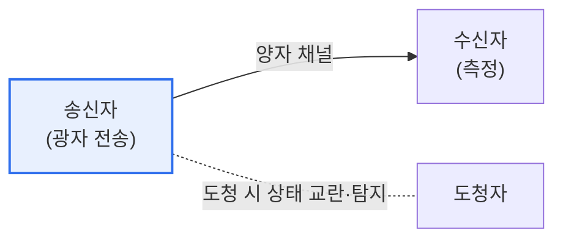

# 양자암호통신(Quantum Cryptography Communication)

## 1. 개요

### 가. 정의
> **양자암호통신**은 양자역학의 원리를 이용해 **도청이 물리적으로 불가능한 방식으로 암호키를 안전하게 분배**하는 통신 기술이다. 대표 방식이 양자키분배(QKD, Quantum Key Distribution)다.

양자암호통신의 핵심 발상은 '**수학적 어려움이 아니라 물리 법칙으로 보안을 보장한다**'는 것이다. 기존 암호(RSA 등)는 소인수분해 같은 수학 문제가 풀기 어렵다는 데 기대므로, 양자컴퓨터가 등장하면 무력화될 수 있다. 반면 양자암호통신은 양자역학의 근본 원리에 보안을 둔다. 양자 상태(광자)는 **측정하면 반드시 상태가 교란되고(불확정성)**, **복제할 수 없다(복제 불가 정리)**. 따라서 도청자가 키를 중간에서 엿보려고 광자를 측정하면 그 흔적이 반드시 남고, 송수신자는 이를 감지해 도청된 키를 폐기한다. 즉 도청 자체가 물리적으로 탐지되므로, 아무리 강력한 컴퓨터를 가진 도청자라도 들키지 않고 키를 훔칠 수 없다. 이것이 '무조건적 안전성(정보이론적 안전성)'이며, 양자컴퓨터 시대에도 안전한 통신을 약속한다.

### 나. 필요성
양자컴퓨터가 기존 공개키 암호를 위협하면서, 계산 복잡도가 아닌 물리 법칙에 기반한 근본적으로 안전한 통신 수단이 요구되었다.

## 2. 암호키 분배 방식 (QKD)

QKD는 광자의 양자 상태(편광 등)에 키 정보를 실어 전송한다. 대표 프로토콜인 **BB84** 는 송신자가 임의의 기저로 광자를 보내고, 수신자가 임의 기저로 측정한 뒤, 공개 채널로 기저를 비교해 일치한 것만 키로 쓴다. 도청자가 중간에서 측정하면 기저 불일치로 오류율이 높아져 도청이 탐지된다.

| 요소 | 내용 |
|---|---|
| **양자 채널** | 광자(양자 상태)로 키 전송 |
| **공개 채널** | 기저 비교·오류 검증(인증 필요) |
| **BB84 등 프로토콜** | 기저 랜덤화로 도청 탐지 |

## 3. 주요 기술

| 기술 | 내용 |
|---|---|
| **단일광자 생성·검출** | 광자 하나씩 정밀 생성·측정 |
| **양자 상태 인코딩** | 편광·위상에 키 정보 인코딩 |
| **양자 중계기** | 장거리 전송을 위한 신호 중계 |
| **키 사후 처리** | 오류정정·비밀성 증폭 |

## 4. 양자암호통신의 취약점

무조건적 안전성은 이론적이며, 실제 구현에는 취약점이 있다.

| 취약점 | 내용 |
|---|---|
| **구현 취약점** | 불완전한 광자원·검출기를 노린 사이드채널 공격 |
| **거리 한계** | 광자 손실로 장거리 전송 제한(중계 필요) |
| **인증 필요** | 공개 채널의 중간자 공격 방지 위해 별도 인증 필요 |
| **비용·인프라** | 전용 장비·광 인프라의 높은 비용 |

## 5. 고려사항 및 시사점

1. **이론과 구현의 간극**을 인식해야 한다. 양자 원리 자체는 안전해도 실제 장비의 불완전성을 노린 사이드채널 공격이 가능하므로, 구현 보안과 검증이 중요하다.
2. **PQC와의 관계**를 이해한다. 양자암호통신(QKD)은 전용 하드웨어로 키를 안전 분배하고, 양자내성암호(PQC)는 소프트웨어로 양자컴퓨터에 견디는 알고리즘을 쓴다. 둘은 경쟁이 아니라 상호 보완적으로 양자 시대 보안을 구성한다.
3. **국가 인프라로 확산**된다. 도청 불가 특성으로 국방·금융·정부 등 초고보안 통신에 우선 적용되며, 양자통신망 구축이 국가 전략으로 추진되고 있다.

---

> **한 줄 요약**: 양자암호통신은 *측정 시 교란·복제 불가라는 양자역학 원리로 도청을 탐지* 해 안전하게 키를 분배(QKD·BB84)하는 기술로, 양자컴퓨터에도 안전하나 구현 취약점·거리 한계가 있어 PQC와 상호 보완적으로 활용된다.
