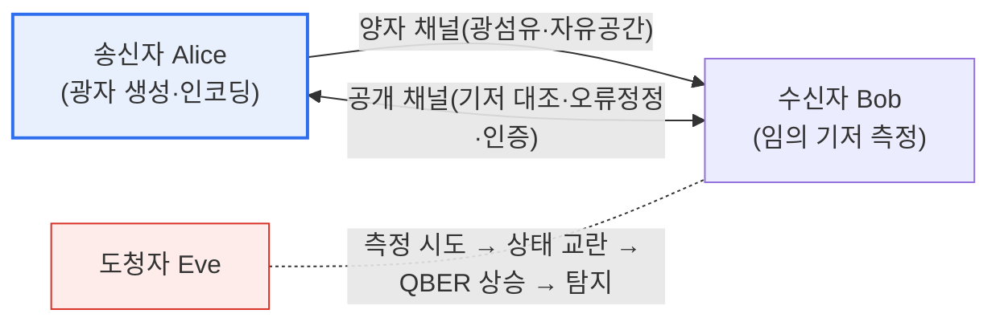

# 양자암호통신(Quantum Cryptography Communication)

## 1. 개요

### 가. 정의

> **양자암호통신**은 양자역학의 근본 원리(측정에 의한 상태 교란, 복제 불가)를 이용해 **도청이 물리적으로 탐지되는 방식으로 암호키를 안전하게 분배**하는 통신 기술이다. 그 대표 구현이 **양자키분배(QKD, Quantum Key Distribution)** 이며, 여기서 분배된 키를 일회용 패드(OTP)나 대칭키 암호에 결합해 실제 데이터를 보호한다.

양자암호통신의 핵심 발상은 '**수학적 계산 난이도가 아니라 물리 법칙 자체로 보안을 보장한다**'는 것이다. RSA·ECC 같은 기존 공개키 암호는 소인수분해나 이산대수 같은 수학 문제가 현실적 시간 안에 풀리지 않는다는 '계산 복잡도 가정'에 보안을 의존한다. 그러나 Shor 알고리즘을 실행할 수 있는 대규모 결함허용 양자컴퓨터가 등장하면 이 가정이 무너져 기존 공개키 암호가 무력화될 수 있다.

반면 양자암호통신은 계산이 아니라 자연법칙에 보안을 둔다. 양자 상태(단일 광자)는 두 가지 근본 성질을 가진다. 첫째, **측정하면 반드시 상태가 교란된다(하이젠베르크 불확정성 원리)**. 둘째, **미지의 양자 상태는 완벽히 복제할 수 없다(복제 불가 정리, No-Cloning Theorem)**. 따라서 도청자(통상 Eve로 표기)가 전송 중인 광자를 가로채 측정하면 그 흔적이 반드시 상태 교란과 오류율 상승으로 남고, 송수신자(Alice·Bob)는 이를 통계적으로 감지해 오염된 키를 즉시 폐기한다. 즉 '도청 시도 자체가 물리적으로 탐지'되므로, 아무리 강력한 컴퓨터를 가진 도청자라도 들키지 않고 키를 훔칠 수 없다. 이 성질이 **무조건적(정보이론적) 안전성**이며, 양자컴퓨터 시대에도 유효한 보안을 약속한다.

### 나. 등장 배경 및 필요성

디지털 사회의 거의 모든 신뢰(전자상거래, 금융, 국방 통신, 전자정부)는 키 교환의 안전성 위에 세워져 있다. 그런데 양자컴퓨팅의 진전으로 현재 널리 쓰이는 공개키 기반 키 교환이 미래에 해독될 수 있다는 우려가 커졌다. 특히 공격자가 지금 암호화된 통신을 저장해 두었다가 훗날 양자컴퓨터로 복호화하는 **HNDL(Harvest Now, Decrypt Later, 선(先)수집 후(後)해독)** 위협은, 장기 기밀성이 요구되는 국가·의료·금융 데이터에 현재진행형의 위험을 안긴다.

이러한 배경에서, 계산 복잡도가 아니라 물리 법칙에 기반해 '근본적으로' 안전한 키 분배 수단이 요구되었고, 그 해답의 하나로 양자암호통신이 부상했다. 소프트웨어 알고리즘만 교체하면 되는 양자내성암호(PQC)와 달리 전용 광 하드웨어를 필요로 하지만, '정보이론적 안전성'이라는 이론적 상한을 제공한다는 점에서 초고보안 영역에서 독자적 가치를 가진다.

## 2. 양자키분배(QKD)의 원리와 구성

QKD는 광자의 양자 상태(편광, 위상 등)에 키 비트를 실어 **양자 채널**로 전송하고, 그 결과를 **공개(고전) 채널**에서 대조·정제하여 Alice와 Bob만 공유하는 비밀키를 만든다. 두 채널의 역할 분리와, 도청이 오류율로 드러난다는 점이 전체 구조의 핵심이다.

```mermaid
flowchart LR
  A["송신자 Alice<br/>(광자 생성·인코딩)"] -->|"양자 채널(광섬유·자유공간)"| B["수신자 Bob<br/>(임의 기저 측정)"]
  A <-->|"공개 채널(기저 대조·오류정정·인증)"| B
  E["도청자 Eve"] -. "측정 시도 → 상태 교란 → QBER 상승 → 탐지" .- B
  style A fill:#e8f0fe,stroke:#2f6fed,stroke-width:2px
  style E fill:#fdecea,stroke:#d93025,stroke-width:1px
```

**양자 채널**은 광자 하나하나에 담긴 양자 상태를 전달하는 물리 경로로, 광섬유 또는 위성·지상 간 자유공간 링크가 쓰인다. 이 채널을 통과하는 광자는 도청자의 측정에 의해 교란되므로, 채널 자체가 도청 탐지 센서 역할을 겸한다. **공개 채널**은 인터넷 같은 일반 통신망으로, 전송 후 어떤 기저로 보내고 측정했는지를 대조하고 오류를 정정하는 데 쓰인다. 다만 공개 채널은 내용이 노출되어도 무방하되 **중간자 공격(MITM)** 을 막기 위해 반드시 별도의 인증(사전 공유 비밀 또는 인증서 기반)이 병행되어야 한다. 이 인증이 없으면 Eve가 Alice·Bob 각각과 별도의 키를 맺어 통신을 중계·감청할 수 있으므로, "QKD는 인증된 고전 채널을 전제로만 안전하다"는 점이 실무의 핵심 단서다.

### 가. BB84 프로토콜의 동작

가장 대표적인 프로토콜은 1984년 Bennett와 Brassard가 제안한 **BB84**이다. Alice는 각 비트를 두 종류의 기저(예: 직선 기저 +와 대각 기저 ×) 중 무작위로 하나를 골라 광자의 편광에 인코딩해 전송한다. Bob 역시 각 광자를 무작위 기저로 측정한다. 전송이 끝나면 두 사람은 공개 채널에서 '어떤 기저를 썼는지'만(비트값은 공개하지 않고) 대조하여, 기저가 일치한 위치의 비트만 남기고 나머지는 버린다. 이 과정을 **기저 대조(Sifting)** 라 하며, 통계적으로 약 절반이 남는다.

도청자 Eve가 중간에서 광자를 측정하려 해도, Eve는 Alice가 어떤 기저를 썼는지 모르므로 무작위 기저로 측정할 수밖에 없다. 기저를 틀리게 선택해 측정하면 상태가 교란되고, 그 광자가 Bob에게 전달될 때 Bob이 올바른 기저로 측정하더라도 원래 값과 다른 결과가 나올 확률이 생긴다. 그 결과 **양자비트오류율(QBER, Quantum Bit Error Rate)** 이 상승하며, Alice·Bob은 남긴 키의 일부를 샘플로 공개 비교해 QBER을 추정한다. QBER이 이론적 임계치(BB84의 경우 대략 11% 부근으로 알려져 있음)를 넘으면 도청 또는 과도한 잡음으로 판단해 키를 폐기하고 재시도한다.

간단한 수치 예로 직관을 정리해 볼 수 있다. Alice가 100개의 광자를 무작위 기저로 보내고 Bob이 무작위 기저로 측정하면, 기저가 우연히 일치하는 비율은 평균 50% 정도이므로 약 50비트가 기저 대조 후 남는다. 여기서 도청자 Eve가 '가로채기-재전송(intercept-resend)' 방식으로 모든 광자를 무작위 기저로 측정한 뒤 재전송한다고 하면, Eve의 기저가 틀린 절반의 광자에서 오류가 유발되고 그중 다시 절반이 Bob의 측정에서 실제 오류로 나타나, 이론적으로 약 25%의 QBER이 발생한다. 즉 도청이 없을 때의 낮은 잡음성 오류(수 % 이내)와 뚜렷이 구별되는 오류율 급등이 관측되므로, 통계적으로 도청을 탐지할 수 있다. 이 예시는 '측정이 흔적을 남긴다'는 원리가 어떻게 정량적 탐지로 이어지는지를 보여 준다.

### 나. 키 사후 처리 — 오류정정과 비밀성 증폭

기저가 일치한 비트라도 채널 잡음과 장비 불완전성 때문에 Alice·Bob의 키가 완전히 같지는 않다. 그래서 공개 채널에서 **오류정정(Information Reconciliation)** 을 수행해 두 키를 동일하게 맞춘다. 이 과정에서 일부 정보가 공개 채널로 새어 나가고 Eve가 부분 정보를 가졌을 수 있으므로, 이어서 **비밀성 증폭(Privacy Amplification)** 을 적용한다. 이는 해시 함수 계열의 변환으로 키를 더 짧게 압축하여, Eve가 알 수 있는 정보량을 무시할 수 있는 수준까지 낮추는 단계다. 이 사후 처리를 거쳐 최종적으로 Alice·Bob만 아는 안전한 대칭키가 완성된다.

## 3. 주요 요소 기술

양자암호통신의 실효성은 광자를 정밀하게 생성·전송·검출하는 하드웨어 기술과, 장거리 한계를 넘기 위한 중계 기술에 달려 있다. 아래 요소들이 상호 결합되어야 실용적 시스템이 성립한다.

| 기술 | 내용 | 실무적 함의 |
|---|---|---|
| **단일광자 생성·검출** | 광자를 하나씩 정밀 생성·측정 | 다광자 방출은 PNS 공격 표면이 됨 |
| **양자 상태 인코딩** | 편광·위상·시간빈에 키 정보 인코딩 | 채널 환경에 맞는 방식 선택 |
| **키 사후 처리** | 오류정정·비밀성 증폭 | 최종 키의 안전성 확보 |
| **양자 중계기·위성 QKD** | 장거리 전송 위한 신호 중계 | 광섬유 손실 한계를 우회 |

**단일광자 생성**이 특히 중요하다. 이상적 QKD는 광자 하나에 한 비트를 실어야 하는데, 실제 광원은 한 번에 여러 광자를 방출하기도 한다. 이 경우 Eve가 여분의 광자만 빼돌리는 **광자수 분할(PNS, Photon Number Splitting) 공격**이 가능해진다. 이를 막기 위해 실무에서는 신호 세기를 무작위로 바꾸는 **미끼상태(Decoy State) 기법**을 널리 채택해, 단일광자원의 불완전성에도 안전성을 회복한다.

**키 생성률(Secret Key Rate)** 도 중요한 실무 지표다. 단일광자 수준의 미약한 신호를 다루고 사후 처리에서 상당한 비트를 폐기하기 때문에, QKD의 초당 안전키 생성량은 고전 통신 대비 낮고 전송 거리가 늘수록 급감한다. 따라서 대용량 데이터를 매번 OTP로 암호화하기보다, QKD로 얻은 키를 AES 같은 대칭키의 세션키로 주기적으로 갱신·공급하는 방식이 실용적이다. 이처럼 '키 생성률 대 요구 갱신주기'의 균형을 맞추는 것이 QKD 시스템 설계의 핵심 성능 과제가 된다.

**장거리 전송**은 QKD의 근본적 제약이다. 광섬유에서 광자는 거리에 따라 지수적으로 손실되며, 고전 통신처럼 신호를 단순 증폭(복제)하면 복제 불가 정리에 위배되어 양자 상태가 파괴된다. 따라서 손실을 우회하기 위해 **양자 중계기(Quantum Repeater)** 나 신뢰노드(Trusted Node) 방식, 또는 대기 손실이 적은 상공 경로를 활용하는 **위성 기반 QKD**가 연구·구축되고 있다. 실제로 중국의 Micius 위성은 위성-지상 간 QKD 및 대륙 규모 양자통신 실험을 수행하여, 자유공간 위성 링크가 지상 광섬유의 거리 한계를 보완할 수 있음을 보였다.

## 4. 취약점과 한계

무조건적 안전성은 어디까지나 '이상적 장비와 프로토콜'을 전제한 이론적 성질이며, 실제 구현에는 여러 취약점과 제약이 존재한다. 이론(프로토콜)과 구현(장비) 사이의 간극이 실무 보안의 최대 관심사다.

| 구분 | 내용 |
|---|---|
| **구현(사이드채널) 취약점** | 불완전한 광원·검출기를 노린 공격(PNS, 검출기 블라인딩 등) |
| **거리·전송률 한계** | 광자 손실로 장거리·고속 전송 제약, 중계 인프라 필요 |
| **인증 필수** | 공개 채널 중간자 공격 방지를 위한 별도 인증 체계 필요 |
| **비용·인프라** | 전용 광 장비·전용 회선의 높은 도입·운영 비용 |

이 표의 항목들은 성격이 서로 다르다. 구현 취약점과 인증 필요는 '안전성' 자체를 위협하는 반면, 거리·전송률 한계와 비용·인프라는 '실용성·경제성'을 제약한다. 따라서 대응도 이원화되어야 하는데, 안전성 위협에는 프로토콜·장비 개선(MDI-QKD, 미끼상태, 강건한 인증)으로, 실용성 제약에는 아키텍처 선택(위성·중계·신뢰노드)과 투자 타당성 검토로 접근한다.

가장 현실적인 위협은 **사이드채널 공격**이다. 프로토콜은 안전해도 실제 광원이 다광자를 방출하거나(PNS), 검출기에 강한 빛을 쏘아 오작동시키는 '검출기 블라인딩' 같은 공격으로 물리 장비의 결함을 파고들 수 있다. 이에 대응해 검출기 측 취약점을 원천 제거하는 **측정장치 독립 QKD(MDI-QKD, Measurement-Device-Independent QKD)** 같은 프로토콜이 제안되어, 신뢰할 수 없는 장비 환경에서도 안전성을 유지하려는 연구가 이어지고 있다.

또한 QKD는 **키 분배만** 담당한다는 점을 명확히 인식해야 한다. QKD는 그 자체로 데이터를 암호화하거나 통신 상대를 인증하지 않으며, 분배한 키는 별도의 대칭키 암호(AES 등)나 OTP와 결합되어야 실제 기밀성을 제공한다. 이 때문에 미국 NSA 등 일부 기관은 QKD의 하드웨어 의존성·거리 제약·인증 문제를 이유로, 광범위한 국가 보안 통신에는 QKD보다 표준화된 PQC를 우선 권고하는 신중한 입장을 취하기도 한다. 즉 QKD의 위상은 분야와 위협 모델에 따라 달리 평가되므로 단정적 우열 판단은 지양해야 한다.

이러한 제약을 종합하면 QKD는 '모든 통신을 대체하는 범용 기술'이라기보다 '특정 고가치 구간을 물리적으로 보호하는 특화 기술'로 자리매김한다. 예컨대 두 데이터센터 간 백본 회선, 금융기관의 재해복구 센터 간 전용 링크, 국방 지휘통제망의 핵심 구간처럼 거리가 상대적으로 짧고 최고 수준의 기밀성이 요구되는 지점에 QKD를 배치하고, 그 밖의 광역·범용 구간은 PQC로 보호하는 계층적 배치가 현실적인 도입 형태로 논의된다. 이때 QKD 구간에서 분배된 키를 기존 암호 인프라(키관리시스템, VPN 등)와 연동하는 통합 설계가 실무의 관건이 된다.

## 5. 심화: PQC와의 관계 및 국내외 동향

양자 시대 보안 대응은 크게 **QKD(하드웨어 기반 물리 보안)** 와 **PQC(소프트웨어 기반 수학 보안)** 두 축으로 나뉜다. QKD는 전용 광 장비로 키를 물리적으로 안전하게 분배해 정보이론적 안전성을 지향하지만 거리·비용·인증 제약이 크다. 반면 PQC(양자내성암호)는 격자·해시·부호 기반 등 양자컴퓨터로도 풀기 어렵다고 여겨지는 수학 문제에 기반한 알고리즘으로, 기존 네트워크 장비에 소프트웨어 업데이트만으로 적용할 수 있어 확장성과 경제성이 높다.

두 접근의 성격 차이는 다음과 같이 정리된다.

| 구분 | QKD(양자키분배) | PQC(양자내성암호) |
|---|---|---|
| **보안 근거** | 물리 법칙(정보이론적 안전성) | 수학적 난제(계산 복잡도) |
| **구현 방식** | 전용 광 하드웨어·전용 회선 | 기존 장비에 소프트웨어 적용 |
| **거리·확장성** | 광자 손실로 거리 제약, 중계 필요 | 네트워크 제약 없이 광역 적용 |
| **인증 문제** | 공개 채널 별도 인증 필요 | 서명 알고리즘으로 자체 인증 |
| **주요 용도** | 국방·금융 등 초고보안 구간 | 범용 인터넷·전자정부·상거래 |

이 둘은 경쟁이 아니라 **상호 보완적**으로 이해하는 것이 타당하다. 표에서 보듯 QKD는 물리적 안전성이라는 이론적 상한을 제공하지만 거리·비용·인증 제약이 크고, PQC는 확장성과 경제성이 높지만 어디까지나 '아직 풀리지 않은 수학 문제'라는 가정에 의존한다. 따라서 공개 채널 인증에 PQC를 쓰고 키 분배에 QKD를 결합하는 하이브리드 구성도 가능하며, 위협 모델·비용·요구 보안수준에 따라 선택 또는 병용된다.

표준화 측면에서 미국 NIST는 2024년 FIPS 203(ML-KEM, CRYSTALS-Kyber 기반)·FIPS 204(ML-DSA)·FIPS 205(SLH-DSA) 등 PQC 표준을 공식 발표하여 PQC 전환이 본격화되고 있다. QKD 진영에서는 앞서 언급한 위성 QKD 실험과 도시 규모 양자통신망(양자 백본) 구축이 국가 전략 사업으로 추진되는 흐름이 이어지고 있으며, 국내에서도 통신사·연구기관을 중심으로 시험망 구축과 실증이 진행되어 왔다. 다만 표준·버전·구축 현황은 빠르게 갱신되므로, 구체 수치·시점은 최신 표준 문서로 재확인하는 태도가 필요하다.

기술사 답안 관점에서 이 주제는 '양자컴퓨팅 위협과 대응'이라는 큰 틀에서 QKD와 PQC를 대비시키고, BB84의 동작·QBER·사후 처리로 원리적 깊이를 보인 뒤, 사이드채널 취약점과 거리 한계 같은 구현 현실을 짚고, 국방·금융 등 초고보안 영역의 실제 적용과 하이브리드 전략으로 마무리하는 구성이 효과적이다.

## 6. 고려사항 및 시사점

1. **이론적 안전성과 구현 안전성의 간극을 관리해야 한다.** 양자 원리 자체는 안전해도 실제 광원·검출기의 불완전성을 노린 사이드채널 공격이 가능하므로, MDI-QKD·미끼상태 같은 구현 보안 기법과 장비 검증·인증 체계가 반드시 병행되어야 한다.

2. **QKD와 PQC를 상호 보완적으로 조합해야 한다.** QKD는 물리적 키 분배, PQC는 소프트웨어 기반 알고리즘 방어라는 서로 다른 층위를 담당한다. 조직의 위협 모델(특히 HNDL 위험)과 비용·거리 제약을 고려해, 초고보안 구간은 QKD, 광역·범용 구간은 PQC로 배치하는 계층적 전략이 현실적이다.

3. **거리·비용·인증이라는 실무 제약을 설계 초기에 반영해야 한다.** 광섬유 손실로 인한 거리 한계, 전용 장비·회선 비용, 공개 채널 인증 요구는 QKD 도입의 타당성을 좌우하는 핵심 변수다. 위성 QKD·양자 중계기·신뢰노드 등 아키텍처 선택을 요구 보안수준·예산과 함께 검토해야 한다.

4. **국가 인프라·전환 로드맵 관점에서 접근해야 한다.** 도청 불가 특성상 QKD는 국방·금융·정부 등 초고보안 통신에 우선 적용되며, 동시에 조직 전반의 암호 자산을 파악하고 PQC로 단계 전환하는 '암호 민첩성(Crypto-Agility)' 확보가 병행되어야 양자 시대의 보안 연속성을 유지할 수 있다.

## 참고자료

- Wikipedia, "Quantum key distribution". https://en.wikipedia.org/wiki/Quantum_key_distribution
- Wikipedia, "BB84". https://en.wikipedia.org/wiki/BB84
- NIST, "NIST Releases First 3 Finalized Post-Quantum Encryption Standards" (2024). https://www.nist.gov/news-events/news/2024/08/nist-releases-first-3-finalized-post-quantum-encryption-standards

---

> **한 줄 요약**: 양자암호통신은 *측정 시 교란·복제 불가라는 양자역학 원리로 도청을 탐지* 해 안전하게 키를 분배(QKD·BB84)하는 기술로, QBER·사후처리(오류정정·비밀성 증폭)로 키를 정제하지만 사이드채널·거리·인증 제약이 있어 PQC와 상호 보완적으로 활용된다.
