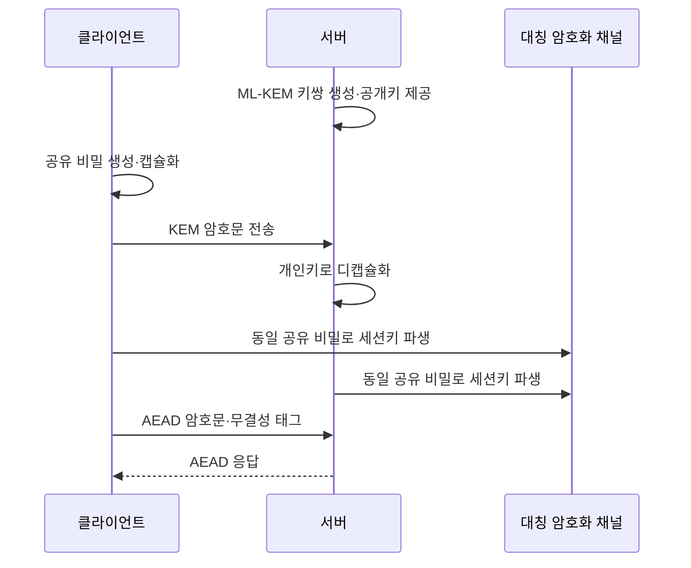

# 양자내성암호(PQC, Post-Quantum Cryptography)와 암호 전환 전략

## 1. 개요

> **정의**: 양자내성암호(PQC)는 충분히 큰 양자컴퓨터가 등장하더라도 기존 공개키 암호의 핵심 문제를 양자내성 수학문제로 대체하여 기밀성·무결성·인증을 유지하도록 설계한 암호 기술이다.

현재의 RSA, Diffie–Hellman, 타원곡선 암호는 정수분해와 이산로그의 계산 난이도에 안전성을 의존한다.
고전 컴퓨터에서 큰 키를 대상으로 이 문제를 푸는 데는 매우 긴 시간이 필요하므로 인터넷의 키 교환, 전자서명, 인증서 체계에 널리 사용되어 왔다.
그러나 Shor 알고리즘을 실행할 수 있는 암호해독용 양자컴퓨터(CRQC)가 현실화되면 이들 공개키 체계의 안전성 가정이 근본적으로 약화된다.

대칭키 암호와 해시 함수도 양자 공격의 영향을 받지만 공개키 암호와 영향의 성격이 다르다.
Grover 알고리즘은 대칭키·해시 탐색의 복잡도를 대략 제곱근 수준으로 낮추므로 키 길이 또는 출력 길이를 늘리는 방식으로 완화할 여지가 있다.
반면 Shor 알고리즘은 RSA·DH·ECC의 기반 문제를 효율적으로 풀 수 있는 가능성을 제시하므로 단순히 키 길이를 조금 늘리는 방식으로는 충분하지 않다.

PQC 전환은 새 알고리즘 하나를 선택하여 교체하는 단순한 암호화 프로젝트가 아니다.
인증서, 키 관리, TLS·VPN·SSH, 코드 서명, 펌웨어 업데이트, 데이터베이스 연결, 장비의 암호 라이브러리와 공급업체 의존성을 함께 조사해야 한다.
특히 지금 수집한 암호문을 훗날 복호화하는 ‘수집 후 복호화(HNDL, Harvest Now, Decrypt Later)’ 위협은 데이터의 비밀 수명이 긴 조직이 지금 준비해야 하는 이유가 된다.

미국 국립표준기술연구소(NIST)는 2024년 FIPS 203·204·205를 최종 승인하여 PQC 표준의 첫 세 축을 제시했다.
FIPS 203은 키 캡슐화 메커니즘 ML-KEM, FIPS 204는 범용 전자서명 ML-DSA, FIPS 205는 해시 기반 전자서명 SLH-DSA를 규정한다.
기술사 답안에서는 알고리즘 이름을 암기하는 데 그치지 않고 현재 암호의 위험 분석에서 암호자산 목록화·우선순위화·시험·단계적 전환으로 이어지는 거버넌스와 아키텍처를 설명해야 한다.

## 2. 양자 위협과 전환 필요성

### 2.1 기존 암호에 대한 양자 알고리즘의 영향

RSA는 큰 정수의 소인수분해, DH와 ECC는 이산로그 문제의 계산 난이도에 기초한다.
고전 컴퓨팅에서는 키 길이를 충분히 키우면 공격 비용을 현실적으로 높일 수 있었지만 양자컴퓨팅에서는 Shor 알고리즘이 이 문제들을 효율적으로 다룰 가능성이 있다.
따라서 RSA 인증서, ECDH 키 교환, ECDSA 서명은 양자컴퓨터가 충분히 발전하면 동시에 교체 대상이 된다.

대칭 암호에 대해서는 Grover 알고리즘의 효과를 고려하여 보안 강도를 재평가한다.
예를 들어 128비트 대칭키의 양자 탐색 안전성이 이론적으로 낮아질 수 있으므로 장기 보호가 필요한 영역에서는 AES-256과 같은 더 긴 키를 검토한다.
다만 실제 공격은 양자 오류정정, 논리 큐비트 수, 회로 깊이, 구현 결함 등 여러 조건을 요구하므로 ‘내일 바로 모든 암호가 깨진다’고 단정해서는 안 된다.

PQC의 목적은 양자컴퓨터를 사용하는 것이 아니라 양자컴퓨터를 가진 공격자에 대해서도 고전 컴퓨터에서 실행 가능한 암호를 제공하는 것이다.
따라서 양자내성 알고리즘도 구현 오류, 난수 생성 실패, 사이드채널, 키 관리 부실, 인증서 오발급과 같은 전통적 위험으로부터 자유롭지 않다.
알고리즘을 바꾸어도 운영 통제가 약하면 전체 보안 수준은 개선되지 않는다.

### 2.2 HNDL과 데이터의 비밀 수명

공격자는 현재 암호를 즉시 풀 수 없어도 네트워크 트래픽과 저장 데이터를 수집해 둘 수 있다.
향후 양자컴퓨팅 능력이 충분해지면 과거에 모은 암호문을 복호화하여 의료정보, 국가기밀, 산업 설계자료, 장기 계약 문서를 훔칠 수 있다.
이 위협은 기밀 유지 기간이 암호 전환에 걸리는 기간보다 긴 조직에서 특히 중요하다.

위험 평가는 데이터의 민감도와 비밀 수명을 함께 봐야 한다.
일주일 뒤 공개될 자료와 20년 동안 보호해야 하는 원천기술 자료는 같은 RSA 사용이라도 우선순위가 다르다.
암호자산 목록에 알고리즘만 적지 말고 데이터 분류, 최초 생성일, 보존 기간, 암호문 유출 가능성, 복호화 주체와 교체 난이도를 기록해야 한다.

### 2.3 전체 전환 흐름

이 흐름에서 가장 먼저 해야 할 일은 알고리즘을 정하는 것이 아니라 현재 암호 사용처를 파악하는 것이다.
직접 호출한 라이브러리뿐 아니라 운영체제, 웹서버, 인증기관, 클라우드 서비스, 네트워크 장비, 외부 SaaS가 내부에서 사용하는 암호까지 포함해야 한다.
발견 결과는 시스템 소유자와 연결되어야 하며 소유자가 없는 암호 사용은 그 자체로 관리 위험으로 분류한다.

다음으로 데이터 중요도, 노출 가능성, 교체 난이도, 공급망 의존성, 장애 영향도를 사용하여 전환 순서를 정한다.
장기 기밀 데이터를 다루는 통신과 코드 서명은 단순한 테스트 서버보다 빠르게 검토해야 하지만 가용성이 중요한 핵심 서비스는 호환성 시험 없이 즉시 교체해서는 안 된다.
전환은 보안성뿐 아니라 성능, 키 크기, 인증서 크기, 네트워크 MTU, 저장공간, 레거시 장비의 지원 여부를 함께 검증해야 한다.

## 3. PQC 표준과 핵심 알고리즘

### 3.1 NIST 표준의 역할 구분

NIST가 최종화한 세 표준은 서로 같은 기능을 경쟁하는 목록이 아니다.
ML-KEM은 두 통신 당사자가 공개 채널에서 공유 비밀을 설정하는 키 캡슐화 계열이고 ML-DSA와 SLH-DSA는 메시지의 무결성과 서명자 인증을 위한 전자서명 계열이다.
실제 TLS나 애플리케이션은 통신 세션의 키 설정과 서버·클라이언트 인증이 모두 필요할 수 있으므로 KEM과 서명을 조합해 설계한다.

| 표준 | 알고리즘 | 주된 기능 | 기반 수학 | 전환 시 역할 |
|---|---|---|---|---|
| FIPS 203 | ML-KEM | 키 캡슐화·공유 비밀 설정 | 모듈 격자 기반 | TLS·VPN·메시지 암호화의 키 설정 |
| FIPS 204 | ML-DSA | 범용 전자서명 | 모듈 격자 기반 | 인증서·코드·문서·토큰 서명 |
| FIPS 205 | SLH-DSA | 상태 없는 해시 기반 전자서명 | 해시 함수 기반 | 대안적 신뢰 루트·알고리즘 다양성 |

이 표의 기능 구분을 잘못 이해하면 ML-KEM으로 문서에 서명하거나 ML-DSA를 키 교환 알고리즘으로 사용하는 식의 오류가 생긴다.
키 캡슐화는 대칭 세션키를 안전하게 합의하기 위한 것이고 전자서명은 공개키로 서명 검증을 하여 출처와 변경 여부를 확인하기 위한 것이다.
따라서 요구사항 분석에서 기밀성 중심 경로와 인증·무결성 중심 경로를 분리한 뒤 적합한 표준을 매핑해야 한다.

### 3.2 ML-KEM과 키 캡슐화

ML-KEM은 CRYSTALS-Kyber 제출안에서 파생된 모듈 격자 기반 키 캡슐화 메커니즘이다.
수신자는 공개키와 개인키를 생성하고 송신자는 수신자의 공개키로 캡슐화하여 암호문과 공유 비밀을 만든다.
수신자는 개인키로 암호문을 디캡슐화하여 동일한 공유 비밀을 얻고 이후의 대용량 데이터는 AES-GCM과 같은 대칭 암호로 처리하는 하이브리드 구조가 일반적이다.

키 캡슐화의 장점은 공개키 암호로 평문 전체를 직접 암호화하지 않고 짧은 공유 비밀을 설정한다는 점이다.
그러나 기존 ECDH보다 공개키와 암호문의 크기가 커질 수 있으므로 인증서·핸드셰이크·패킷 크기와 처리 지연을 측정해야 한다.
특히 작은 IoT 장비, 오래된 VPN 장비, MTU가 엄격한 네트워크에서는 단편화와 버퍼 한계가 연결 실패로 이어질 수 있다.

### 3.3 ML-DSA와 범용 전자서명

ML-DSA는 CRYSTALS-Dilithium 제출안에서 파생된 모듈 격자 기반 전자서명 표준이다.
서명자는 개인키로 메시지에 서명하고 검증자는 공개키와 서명을 사용해 메시지의 변경 여부와 서명자의 공개키 소유를 확인한다.
인증서, 애플리케이션 패키지, 컨테이너 이미지, 펌웨어, API 토큰, 전자문서에 적용할 수 있다.

ML-DSA는 범용성이 높지만 기존 ECDSA 서명보다 공개키·서명 크기가 커질 수 있다.
서명 크기가 커지면 인증서 체인과 코드 배포 패키지의 크기, 검증 시간, 캐시 효율, 로그와 데이터베이스 저장량이 영향을 받는다.
따라서 단순히 알고리즘 이름만 교체하지 말고 인증서 체인 길이와 최대 메시지 크기를 포함한 엔드투엔드 시험을 수행해야 한다.

코드 서명에서는 알고리즘을 바꾸는 것보다 신뢰 루트와 업데이트 실패 시 복구 절차가 더 중요할 수 있다.
서명 검증이 실패했을 때 장비가 안전한 이전 버전으로 돌아갈 수 있는지, 롤백 공격을 차단하는지, 오프라인 서명 키의 접근을 어떻게 통제하는지 점검한다.
공급업체가 생성하는 바이너리와 내부 빌드 산출물의 서명 형식이 다르면 배포 파이프라인 전체를 함께 표준화해야 한다.

### 3.4 SLH-DSA와 알고리즘 다양성

SLH-DSA는 SPHINCS+ 제출안에서 파생된 상태 없는 해시 기반 전자서명이다.
구조화된 격자 문제 대신 해시 함수의 성질에 기반하므로 ML-DSA와 다른 가정의 대안이 될 수 있다.
한 수학적 가정에 문제가 생겼을 때 모든 신뢰 체계가 동시에 무너지는 위험을 낮추려는 알고리즘 다양성 관점에서 의미가 있다.

그 대신 서명 크기와 처리 특성이 ML-DSA와 다를 수 있어 모든 경로의 기본값으로 선택하는 것은 신중해야 한다.
대역폭이 제한된 장치나 서명 빈도가 매우 높은 서비스에서는 성능·저장·전송 부담을 측정하고 장기 신뢰 앵커와 같이 속도보다 보수적 가정을 중시하는 영역에 우선 적용할 수 있다.
알고리즘 다양성은 무조건 여러 알고리즘을 동시에 쓰는 것이 아니라 독립적인 실패 가능성과 운영 복잡도의 균형을 설계하는 원칙이다.

## 4. 암호 민첩성과 하이브리드 전환

### 4.1 암호 민첩성의 개념

암호 민첩성(crypto-agility)은 암호 알고리즘·키 길이·프로토콜·인증서를 주변 업무 로직의 대규모 재작성 없이 교체할 수 있는 시스템 역량이다.
알고리즘 이름이 소스코드 곳곳에 하드코딩되어 있거나 인증서 형식과 키 저장소가 특정 구현체에 묶여 있으면 취약점이 발견될 때 교체 시간이 길어진다.
PQC 전환에서 민첩성은 한 번의 양자 대응책이 아니라 이후의 표준 변경과 알고리즘 취약점에도 대응하는 지속 가능한 품질속성이다.

암호화 서비스를 추상화한 공통 API, 중앙 키 관리, 정책 기반 알고리즘 협상, 버전이 있는 인증서 프로파일, 자동화된 키·인증서 교체를 적용하면 교체 범위를 줄일 수 있다.
다만 추상화 계층이 실제 알고리즘의 파라미터와 오류 동작을 숨기면 성능·보안 검증이 어려워질 수 있으므로 표준화된 인터페이스와 관측 가능한 메타데이터를 함께 설계해야 한다.
암호 민첩성의 성공 기준은 “언제든 바꿀 수 있다”는 선언이 아니라 특정 서비스에서 승인된 알고리즘을 몇 단계와 몇 번의 배포로 교체할 수 있는지로 측정한다.

### 4.2 하이브리드 암호의 의미

하이브리드 방식은 기존 공개키 방식과 PQC 방식을 함께 사용하여 한쪽이 실패해도 다른 쪽의 안전성을 활용하도록 설계하는 접근이다.
키 설정에서는 고전적 ECDH와 ML-KEM에서 나온 비밀을 결합해 키를 파생할 수 있고 서명에서는 기존 서명과 PQC 서명을 함께 검증하는 정책을 둘 수 있다.
이 방식은 상호운용성 검증과 점진적 전환에 도움이 되지만 결합 방법과 검증 정책을 잘못 설계하면 오히려 가장 약한 구성이나 복잡한 실패 경로가 생긴다.

하이브리드 결합은 두 암호문이나 서명을 단순히 이어 붙이는 문제가 아니다.
키 파생 함수에 각 비밀의 출처를 명시하고 어느 하나의 구성요소가 실패했을 때 전체 세션을 실패 처리할지, 다운그레이드가 허용되는지, 협상 결과를 감사 로그에 남길지를 정의해야 한다.
또한 양쪽 알고리즘을 모두 검증하는 동안 핸드셰이크 크기와 처리량이 증가하므로 실제 네트워크·장비·클라이언트 조합으로 시험한다.

### 4.3 기존 암호와 PQC의 비교

| 구분 | RSA·DH·ECC | PQC | 전환 시 시사점 |
|---|---|---|---|
| 안전성 가정 | 소인수분해·이산로그 | 격자·해시 등 다른 문제 | 알고리즘 다양성과 검증 이력 확인 |
| 양자 공격 | Shor 알고리즘에 취약 | 양자 공격을 고려해 설계 | 장기 기밀 데이터부터 우선 전환 |
| 키·서명 크기 | 상대적으로 작음 | 일부 구성에서 더 큼 | MTU·인증서·저장량 측정 필요 |
| 생태계 | 오랜 구현·상호운용성 | 라이브러리·장비 지원이 발전 중 | 하이브리드와 단계적 적용 필요 |
| 운영 위험 | 익숙하지만 장기 위험 존재 | 구현·표준·공급망 변화 위험 | 암호 인벤토리와 민첩성 확보 |

비교의 핵심은 PQC가 모든 항목에서 기존 암호보다 우월하다는 주장이 아니다.
PQC는 양자 위협에 대한 안전성 목표를 제공하지만 키 크기와 성능·구현 생태계에서 비용이 발생할 수 있다.
따라서 시스템의 보안 수명, 성능 예산, 장애 허용 수준, 규제 요구를 반영해 하이브리드 또는 단일 PQC 적용 여부를 결정한다.

## 5. 암호자산 인벤토리와 단계적 전환 절차

### 5.1 발견과 목록화

암호자산 인벤토리는 시스템·애플리케이션·장비·데이터 흐름에서 어떤 암호가 어떤 목적으로 사용되는지 기록한 목록이다.
알고리즘, 모드, 키 길이, 라이브러리 버전, 키와 인증서의 소유자, 수명, 저장 위치, 의존 프로토콜, 공급업체, 교체 방법을 최소 항목으로 포함한다.
소스코드 정적 분석만으로는 하드웨어 보안 모듈, 클라우드 관리형 인증서, 외부 API, 운영자 수동 절차를 찾지 못할 수 있으므로 여러 탐지 방식을 결합한다.

발견 과정에서는 네트워크 스캔, 인증서 저장소 분석, 소프트웨어 구성 분석, 코드 검색, 클라우드 설정 조회, 공급업체 질의, 인터뷰를 함께 활용한다.
각 결과에는 탐지 시각과 정확도, 미확인 영역을 표시하고 자동 발견되지 않은 암호 사용을 별도의 잔여 위험으로 관리한다.
인벤토리는 정적인 스프레드시트가 아니라 CMDB·자산관리·키관리·배포 파이프라인과 연결된 지속적인 데이터 제품으로 운영해야 한다.

### 5.2 위험 우선순위화

우선순위는 암호가 낡았다는 사실 하나로 결정하지 않는다.
데이터의 비밀 수명, 공격 노출성, 시스템 중요도, 교체에 필요한 리드타임, 공급업체 지원 일정, 장애 시 업무 영향도를 함께 평가한다.
예를 들어 외부에 공개된 TLS 엔드포인트는 노출 위험이 크고 교체는 쉬울 수 있지만 단종된 산업 제어 장비는 노출이 제한되어도 교체 리드타임과 안전 영향이 클 수 있다.

| 우선순위 | 대표 대상 | 판단 근거 | 권장 활동 |
|---|---|---|---|
| 매우 높음 | 장기 기밀 데이터, 핵심 PKI, 코드·펌웨어 서명 | HNDL·신뢰 붕괴·교체 리드타임 | 즉시 인벤토리·설계·공급업체 계획 수립 |
| 높음 | 인터넷 TLS, VPN, IAM·API 인증 | 외부 노출과 대규모 영향 | 하이브리드 시험·인증서·프로토콜 로드맵 |
| 중간 | 일반 내부 서비스와 단기 데이터 | 비밀 수명과 영향이 상대적으로 낮음 | 표준 라이브러리·민첩성 적용 후 순차 전환 |
| 낮음 | 공개 데이터·지원 종료 예정 자산 | 보호 가치 또는 잔여 수명이 낮음 | 예외 승인·교체 또는 폐기 계획 |

이 표는 자동 결정 규칙이 아니라 위험평가의 출발점이다.
높은 우선순위라도 실제 적용 전에는 상호운용성, 성능, 장애 복구를 검증하고 낮은 우선순위라도 법규나 계약이 별도 기한을 요구하면 순서를 조정한다.
예외는 시스템 소유자, 보안 책임자, 조달·법무 이해관계자가 승인하고 만료일과 보완통제를 명시해야 한다.

### 5.3 구현·시험·배포

파일럿은 대표성이 있으면서 실패의 범위를 제한할 수 있는 서비스에서 시작한다.
공개 TLS 엔드포인트, 내부 서비스 간 mTLS, 코드 서명, VPN, 데이터베이스 연결처럼 서로 다른 암호 경로를 하나씩 선정하고 지원되는 라이브러리와 알고리즘 파라미터를 확인한다.
시험 결과에는 평균 지연뿐 아니라 p99 핸드셰이크 지연, 최대 메시지 크기, CPU·메모리 사용량, 연결 실패율, 인증서 체인 처리, 롤백 시간을 포함한다.

배포는 개발·검증·일부 트래픽·전체 트래픽의 단계로 나누고 협상 실패 시 안전한 오류를 반환하되 취약 알고리즘으로 조용히 강등하지 않도록 한다.
실험 기능 플래그가 운영에 남아 허용되지 않은 알고리즘을 재활성화하지 않도록 만료일과 자동 점검을 둔다.
전환 완료 후에는 기존 인증서·키를 즉시 삭제하기보다 의존성 확인과 보존 의무를 검토한 뒤 안전하게 폐기하고 폐기 증적을 남긴다.

## 6. 적용 사례와 연계 기술

### 6.1 금융기관의 외부 채널 전환 사례

대형 금융기관이 모바일 앱과 인터넷 뱅킹의 TLS, 내부 API mTLS, 고객 인증서, 전자문서 서명을 운영한다고 가정한다.
먼저 인증서 발급·갱신 경로와 클라이언트 버전을 인벤토리화하고 장기간 보존되는 거래 문서와 단기 세션 데이터를 구분한다.
그 다음 서버·최신 모바일 클라이언트·API 게이트웨이의 하이브리드 키 교환을 시험하고 구형 클라이언트의 실패율과 통신 패킷 크기를 측정한다.

서버만 PQC를 지원해도 구형 단말이 새 인증서와 핸드셰이크를 처리하지 못하면 서비스 장애가 발생한다.
따라서 앱 업데이트, 호환 가능한 암호 라이브러리, 인증서 체인, 고객센터의 오류 대응, 장애 시 롤백을 하나의 릴리스 계획으로 묶어야 한다.
거래 문서의 전자서명은 키 설정과 별도 경로이므로 ML-DSA·SLH-DSA 적용과 장기 검증을 위한 서명 형식·타임스탬프 정책도 함께 정한다.

### 6.2 제조·IoT 펌웨어 서명 사례

제조 현장에는 수명이 10년 이상인 센서, 게이트웨이, PLC, 차량용 제어기가 존재할 수 있다.
장비가 인터넷에 직접 연결되지 않아도 악성 펌웨어가 공급망이나 정비용 노트북을 통해 유입될 수 있으므로 펌웨어 서명과 업데이트 키의 장기 보호가 중요하다.

전환 계획은 부트로더가 새 서명 알고리즘을 검증할 수 있는지, ROM에 고정된 신뢰 루트를 바꿀 수 있는지, 서명 크기를 저장할 플래시 공간이 있는지부터 확인한다.
구형 장비를 한 번에 교체하기 어렵다면 보안 게이트웨이에서 업데이트 패키지 검증을 강화하고 신규 장비부터 암호 민첩성을 내장하며 장비 수명 종료와 교체 예산을 로드맵에 반영한다.
이 사례는 알고리즘 선택만으로 해결되지 않는 하드웨어 수명·현장 접근성·안전 정지 절차의 문제를 보여준다.

### 6.3 PKI와 소프트웨어 공급망의 연계

PQC 전환은 PKI의 루트·중간 인증기관·리프 인증서뿐 아니라 코드 서명, 컨테이너 이미지, 패키지 저장소, 빌드 워크플로에 연결된다.
인증서 크기와 서명 형식이 바뀌면 프록시, 보안장비, 클라이언트 SDK, 서명 검증 도구가 연쇄적으로 영향을 받는다.
소프트웨어 공급망에서는 빌드 환경의 서명 키를 보호하고 어떤 알고리즘과 키로 언제 산출물을 서명했는지 provenance와 함께 기록해야 한다.

## 7. 심화: 표준화·운영 동향과 출제 연계

NIST는 2024년 FIPS 203·204·205를 공개한 뒤 추가 표준화와 백업 알고리즘을 개발하는 흐름을 유지하고 있다.
따라서 특정 시점의 후보 목록을 영구적인 정답처럼 암기하기보다 최종 표준인지 초안인지, 키 설정인지 전자서명인지, 적용 제품이 검증되었는지를 구분하는 것이 중요하다.
최신 표준 상태는 NIST PQC 프로젝트와 FIPS 원문을 기준으로 확인하고 제품 벤더의 마케팅 설명과 표준 요구사항을 분리해서 평가한다.

NIST의 전환 방향은 취약한 공개키 사용을 식별하고 시스템과 데이터를 우선순위화하며 암호 교체가 가능한 구조로 이동하는 것이다.
이 관점은 정보보호 거버넌스, PKI, 시큐어 코딩, 소프트웨어 공급망 보안, 개인정보 보호, 재해복구와 연결된다.
기술사 답안에서는 “PQC 도입”을 보안팀의 알고리즘 교체로 축소하지 말고 전사 자산관리·조달·개발·운영·감사 체계의 변화로 확장하여 서술하면 논리성이 높아진다.

예상 논술은 양자 위협의 원리와 대응 알고리즘 비교, HNDL을 고려한 전환 로드맵, 암호자산 인벤토리 구축, 암호 민첩성 설계, 하이브리드 전환의 장단점, PKI·코드 서명 적용 사례를 결합하는 형태로 구성할 수 있다.
답안 구성은 위협과 필요성, 표준·구성요소, 전환 절차, 사례·비교, 위험과 거버넌스, 기술사 시사점 순서로 전개하면 원인에서 실행으로 이어진다.

## 8. 고려사항 및 시사점

### 가. 표준·상호운용성 관리

PQC 표준이 최종화되었더라도 모든 운영체제·브라우저·네트워크 장비·HSM이 동시에 지원하는 것은 아니다.
표준 버전, 파라미터 세트, 인증 모듈 검증 상태, 라이브러리 구현의 사이드채널 대응, 라이선스와 유지보수 주체를 확인해야 한다.
하이브리드 협상에서 양쪽 구현의 조합이 실제로 상호운용되는지 공급업체와 공동 시험을 수행하고 실패 시 사용자 영향과 롤백 경로를 문서화한다.

### 나. 성능·용량·가용성 트레이드오프

키·서명·암호문의 크기 증가는 네트워크 대역폭, MTU, 인증서 저장, 캐시, 데이터베이스 컬럼, 로그 비용을 키울 수 있다.
평균 성능만으로 의사결정하지 말고 트래픽 피크, 재연결 폭증, 모바일 저대역폭, CPU 부족 장비, 장애 복구 시 대량 검증을 포함한 부하 시험을 수행한다.
보안 강도를 높이는 대신 가용성이 떨어질 수 있으므로 사용자 경험과 서비스 수준 목표를 만족하는 파라미터와 배포 단계를 선택한다.

### 다. 키 관리·운영 통제

PQC도 개인키 탈취, 난수 생성 오류, 키 백업 노출, 권한 오남용에 취약할 수 있다.
HSM·KMS의 알고리즘 지원, 키 생성과 폐기, 이중 승인, 접근 로그, 백업 암호화, 인증서 자동 갱신, 비상 교체를 정책으로 정의한다.
암호자산 인벤토리와 키관리 시스템의 데이터가 불일치하지 않도록 정기 대조와 소유자 확인을 운영 통제로 만든다.

### 라. 장기 거버넌스와 투자

PQC는 단기 프로젝트의 완료 선언보다 지속적인 발견·우선순위화·교체·재검증의 프로그램으로 운영해야 한다.
CISO 또는 정보보호 최고책임자를 중심으로 시스템 소유자, 네트워크, PKI, 개발, 조달, 법무, 감사가 참여하는 의사결정 체계를 만들고 공급업체의 지원 일정과 계약상 책임을 관리한다.
신규 시스템은 처음부터 승인된 암호 API와 교체 가능한 인증서 프로파일을 사용하게 하고 레거시 예외에는 종료일·보완통제·예산을 부여한다.

### 마. 기술사 관점의 전망

양자내성암호는 양자컴퓨팅만의 주제가 아니라 신뢰할 수 있는 디지털 사회의 장기 암호 인프라를 재설계하는 주제다.
앞으로는 암호자산을 소프트웨어 구성요소처럼 추적하는 CBOM, 자동화된 인증서·키 수명관리, 공급망 증적, 정책 기반 암호 협상이 중요해질 것이다.
기술사는 특정 알고리즘을 추천하는 데서 끝나지 않고 조직의 위험·데이터 수명·서비스 품질·조달 제약을 반영한 전환 아키텍처와 실행 가능한 로드맵을 제시해야 한다.

## 참고자료

- [NIST Post-Quantum Cryptography 프로젝트](https://csrc.nist.gov/projects/post-quantum-cryptography)
- [NIST FIPS 203: Module-Lattice-Based Key-Encapsulation Mechanism Standard](https://csrc.nist.gov/pubs/fips/203/final)
- [NIST FIPS 204: Module-Lattice-Based Digital Signature Standard](https://csrc.nist.gov/pubs/fips/204/final)
- [NIST FIPS 205: Stateless Hash-Based Digital Signature Standard](https://csrc.nist.gov/pubs/fips/205/final)
- [NIST IR 8547: Transition to Post-Quantum Cryptography Standards](https://csrc.nist.gov/pubs/ir/8547/ipd)
- [NIST NCCoE Migration to Post-Quantum Cryptography FAQ](https://pages.nist.gov/nccoe-migration-post-quantum-cryptography/FAQ/)

---

> **한 줄 요약**: PQC 전환은 ML-KEM·ML-DSA·SLH-DSA를 고르는 일이 아니라 암호자산을 발견하고 위험을 우선순위화한 뒤 암호 민첩성과 단계적 검증으로 전사 PKI·프로토콜·공급망을 양자내성 구조로 옮기는 전략이다.
