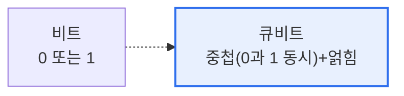

# 큐비트(Qubit)

## 1. 개요

### 가. 정의
> **큐비트(Qubit, Quantum Bit)** 는 양자컴퓨터의 정보 최소 단위로, 고전 컴퓨터의 비트가 0 또는 1만 갖는 것과 달리 **0과 1의 상태가 동시에 겹쳐 존재(중첩)** 할 수 있는 양자 정보 단위다.

큐비트를 이해하는 핵심은 '**0이거나 1이 아니라, 0이면서 동시에 1일 수 있다**'는 양자역학적 성질이다. 고전 비트는 켜짐(1)이나 꺼짐(0) 중 하나만 표현한다. 반면 큐비트는 **중첩(Superposition)** 덕분에 0과 1을 특정 확률로 동시에 담을 수 있다. n개의 큐비트는 2ⁿ개의 상태를 동시에 표현하므로, 큐비트가 늘수록 표현·연산 능력이 지수적으로 폭증한다. 여기에 여러 큐비트가 서로 강하게 연결되는 **얽힘(Entanglement)** 이 더해지면, 한 큐비트의 측정이 즉시 다른 큐비트에 영향을 주어 강력한 병렬 연산이 가능하다. 이 중첩과 얽힘이 특정 문제(소인수분해·최적화·양자 시뮬레이션)에서 고전 컴퓨터를 압도하는 양자컴퓨터의 힘의 원천이다. 다만 측정하는 순간 중첩이 하나의 값으로 붕괴되고, 외부 간섭에 매우 취약하다.

### 나. 필요성
고전 컴퓨터로는 사실상 풀 수 없는 초대형 최적화·시뮬레이션·암호 문제가 존재하며, 이를 지수적 연산력으로 다루기 위해 큐비트 기반 양자컴퓨팅이 요구된다.

## 2. 고전 비트와 비교

| 구분 | 고전 비트 | 큐비트 |
|---|---|---|
| **상태** | 0 또는 1 | 0과 1의 중첩 |
| **표현력** | n비트 = n개 상태 | n큐비트 = 2ⁿ 상태 동시 |
| **연산** | 순차 | 양자 병렬(중첩·얽힘) |
| **측정** | 결정적 | 확률적(측정 시 붕괴) |

## 3. 핵심 양자 성질과 구현

| 성질/요소 | 내용 |
|---|---|
| **중첩** | 0과 1을 동시에 표현 |
| **얽힘** | 큐비트 간 강한 상관(동시 영향) |
| **간섭** | 확률 진폭을 조절해 정답 강화 |
| **결어긋남(Decoherence)** | 외부 간섭으로 양자상태 붕괴(오류 원인) |
| **구현 방식** | 초전도, 이온트랩, 광자, 스핀 등 |

## 4. 고려사항 및 시사점

1. **오류·결어긋남이 최대 난제**다. 큐비트는 외부 간섭에 극도로 취약해 상태가 쉽게 무너지므로, 극저온 환경과 양자오류정정(다수의 물리 큐비트로 하나의 논리 큐비트 구성)이 필수다.
2. **암호 체계에 미치는 영향**이 크다. 충분한 큐비트의 양자컴퓨터는 쇼어 알고리즘으로 RSA 등 공개키 암호를 무력화할 수 있어, **양자내성암호(PQC)** 로의 전환이 시급하다.
3. **특정 문제 특화 기술**이다. 양자컴퓨터가 모든 연산에서 우월한 것은 아니며, 소인수분해·최적화·양자 시뮬레이션·양자 머신러닝 등 특정 문제에서 지수적 우위를 갖는 상보적 기술로 발전하고 있다.

---

> **한 줄 요약**: 큐비트는 *0과 1의 중첩과 얽힘* 으로 n개가 2ⁿ 상태를 동시에 표현하는 양자 정보 단위로, 양자컴퓨터의 지수적 연산력의 원천이나 결어긋남·오류 취약성이 과제이며 기존 공개키 암호를 위협해 PQC 전환을 촉발한다.
