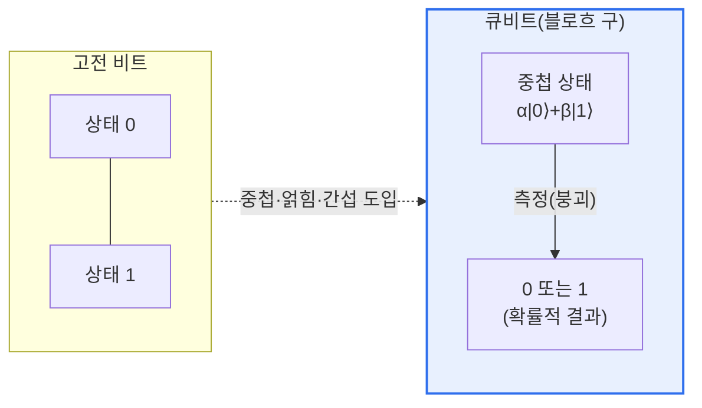
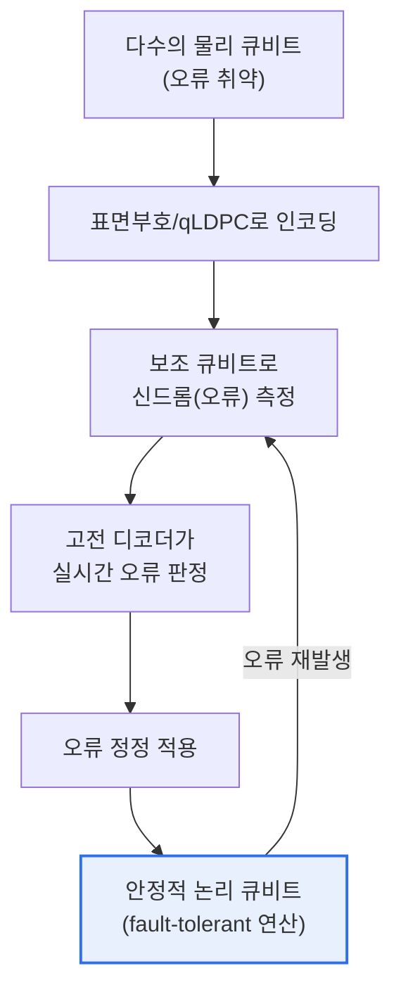

# 큐비트(Qubit)

## 1. 개요

### 가. 정의
> **큐비트(Qubit, Quantum Bit)** 는 양자컴퓨터의 정보 최소 단위로, 고전 컴퓨터의 비트가 0 또는 1 중 하나만 갖는 것과 달리 **0과 1의 상태가 확률 진폭으로 동시에 겹쳐 존재(중첩)** 할 수 있는 양자 정보 단위다.

큐비트를 이해하는 출발점은 '**0이거나 1이 아니라, 0이면서 동시에 1일 수 있다**'는 양자역학적 성질이다. 고전 비트는 트랜지스터의 켜짐(1)·꺼짐(0)이라는 두 값 중 하나만 갖는 결정적(deterministic) 상태다. 반면 큐비트는 **중첩(Superposition)** 덕분에 |0⟩과 |1⟩ 두 기저상태를 각각의 확률 진폭(complex amplitude)으로 동시에 담는다. 수식으로는 |ψ⟩ = α|0⟩ + β|1⟩ (|α|²+|β|²=1)로 표현되며, α·β가 복소수라는 점이 위상(phase) 정보를 담아 고전 확률과 결정적으로 구별된다. 하나의 큐비트 상태는 반지름 1의 구(球) 표면 한 점, 즉 **블로흐 구(Bloch Sphere)** 위의 벡터로 시각화되는데, 북극이 |0⟩, 남극이 |1⟩, 적도가 완전 중첩 상태에 해당한다.

큐비트의 진짜 힘은 개수가 늘 때 드러난다. n개의 큐비트는 2ⁿ개의 기저상태를 동시에 표현하므로, 50큐비트면 2⁵⁰(약 1,126조), 300큐비트면 우주의 원자 수를 넘는 경우의 수를 하나의 상태 벡터에 담는다. 여기에 여러 큐비트가 하나의 결합 상태로 묶여 개별적으로 기술할 수 없게 되는 **얽힘(Entanglement)** 이 더해지면, 한 큐비트의 측정 결과가 즉시 다른 큐비트의 상태를 결정짓는 강한 상관이 형성된다. 마지막으로 **간섭(Interference)** 을 이용해 오답에 해당하는 확률 진폭은 상쇄시키고 정답의 진폭은 보강함으로써, 지수적으로 많은 후보 중 원하는 해를 높은 확률로 뽑아낸다. 이 중첩·얽힘·간섭의 삼중주가 소인수분해·최적화·양자 시뮬레이션 같은 특정 문제에서 고전 컴퓨터를 압도하는 양자컴퓨터 성능의 원천이다.

### 나. 등장 배경과 필요성
고전 컴퓨터는 문제 크기가 커질 때 계산량이 지수적으로 폭증하는 부류의 문제(대규모 분자 시뮬레이션, 조합 최적화, 큰 수의 소인수분해)를 사실상 풀 수 없다. 예컨대 2,048비트 RSA 키를 고전 컴퓨터로 소인수분해하려면 현재 슈퍼컴퓨터로도 수십억 년이 걸리지만, 충분한 큐비트를 갖춘 양자컴퓨터는 쇼어(Shor) 알고리즘으로 다항 시간 내에 처리할 수 있다. 또 신약·촉매·배터리 소재를 좌우하는 분자의 양자 상태는 본질적으로 양자역학을 따르므로, 같은 양자 원리로 동작하는 큐비트로 시뮬레이션하는 것이 자연스럽고 효율적이다. 리처드 파인만이 1982년 "자연을 시뮬레이션하려면 컴퓨터 자체가 양자적이어야 한다"고 지적한 것이 바로 이 필요성이며, 큐비트는 그 실현 수단이다.

## 2. 고전 비트와 큐비트의 구조적 비교

먼저 전체 구조 관점에서, 고전 비트와 큐비트가 정보를 담는 방식의 차이를 개념도로 정리한다. 고전 비트는 두 값 사이의 이산적 스위치이지만, 큐비트는 블로흐 구 위 임의의 점을 가리키는 연속적 벡터이며 측정하는 순간에만 0 또는 1로 붕괴된다.

```mermaid
flowchart LR
  subgraph CL["고전 비트"]
    B0["상태 0"] --- B1["상태 1"]
  end
  subgraph QB["큐비트(블로흐 구)"]
    S["중첩 상태<br/>α|0⟩+β|1⟩"] -->|"측정(붕괴)"| R["0 또는 1<br/>(확률적 결과)"]
  end
  CL -.->|"중첩·얽힘·간섭 도입"| QB
  style QB fill:#e8f0fe,stroke:#2f6fed,stroke-width:2px
```

표는 두 방식의 핵심 차이를 요약한 것이나, 각 항목이 '왜' 그렇게 되는지가 중요하다. **표현력**이 비트는 선형(n개), 큐비트는 지수(2ⁿ개)로 벌어지는 이유는 중첩이 기저상태를 병렬로 얹기 때문이다. **측정**이 큐비트에서 확률적인 이유는, 중첩 상태를 관측하는 순간 파동함수가 하나의 고전 값으로 붕괴(collapse)하기 때문이다. 이 붕괴 때문에 큐비트는 '지수적으로 많은 계산을 동시에 하지만, 답은 단 한 번, 확률적으로만 읽어낼 수 있다'는 제약을 갖는다. 그래서 양자 알고리즘 설계의 본질은 '간섭을 잘 조율해 정답이 읽힐 확률을 최대로 키우는 것'에 있다.

| 구분 | 고전 비트 | 큐비트 |
|---|---|---|
| **상태** | 0 또는 1(결정적) | α\|0⟩+β\|1⟩ 중첩(확률 진폭) |
| **표현력** | n비트 = n개 상태 | n큐비트 = 2ⁿ 상태 동시 |
| **연산** | 논리 게이트(AND·OR) 순차 | 유니터리 양자 게이트(가역) |
| **측정** | 언제나 같은 값(비파괴) | 확률적·파괴적(측정 시 붕괴) |
| **복제** | 자유롭게 복사 가능 | 복제 불가(No-Cloning 정리) |
| **오류** | 비트 플립 중심 | 비트+위상 플립, 결어긋남 |

## 3. 핵심 양자 성질과 물리적 구현

### 가. 중첩·얽힘·간섭의 작동 원리
**중첩**은 단일 큐비트가 여러 가능성을 동시에 품게 하는 성질로, 아다마르(Hadamard) 게이트를 |0⟩에 적용하면 (|0⟩+|1⟩)/√2라는 완전 중첩이 만들어진다. 중첩만으로는 고전 확률적 컴퓨팅과 근본적 차이가 없다. 차이를 만드는 것은 **얽힘**이다. 두 큐비트를 얽으면 (|00⟩+|11⟩)/√2 같은 벨(Bell) 상태가 되어, 첫 큐비트를 0으로 측정하면 둘째도 즉시 0으로 확정된다. 이 상관은 두 큐비트가 아무리 떨어져 있어도 유지되며, 개별 큐비트의 상태로는 분해되지 않는 '전체로서의 정보'를 만든다. 마지막으로 **간섭**은 파동의 보강·상쇄처럼 확률 진폭을 조작하는 것으로, 그로버(Grover) 검색 알고리즘은 정답 상태의 진폭을 반복적으로 증폭해 √N 번 만에 원하는 항목을 찾는다(고전은 N번). 이 세 성질이 맞물려야 비로소 '양자 우위'가 성립한다.

### 나. 결어긋남과 오류 — 최대 난제
큐비트의 가장 큰 약점은 **결어긋남(Decoherence)** 이다. 큐비트는 열·진동·전자기 잡음 등 외부 환경과 미세하게라도 상호작용하면 위상과 중첩 정보를 잃어버린다. 이 유지 시간을 나타내는 지표가 코히어런스 시간(T1: 에너지 이완, T2: 위상 이완)이며, 현재 초전도 큐비트는 마이크로초~밀리초 수준이다. 즉 계산을 이 짧은 시간 안에 끝내야 한다. 그래서 초전도 방식은 절대영도에 가까운 약 15mK(밀리켈빈, 우주 배경복사보다 낮은 온도)의 희석냉동기 안에서 큐비트를 격리한다. 그럼에도 게이트 한 번당 0.1~1% 수준의 오류가 발생하므로, 수백만 게이트를 쓰는 실용 알고리즘을 그대로 돌릴 수는 없다.

### 다. 양자오류정정과 논리 큐비트
이 문제의 정공법이 **양자오류정정(QEC, Quantum Error Correction)** 이다. No-Cloning 정리 때문에 고전처럼 단순 복제 다수결을 쓸 수 없으므로, 여러 개의 **물리 큐비트(physical qubit)** 를 얽어 하나의 안정적인 **논리 큐비트(logical qubit)** 를 구성하고, 보조 큐비트 측정으로 상태를 무너뜨리지 않고 오류만 감지·정정한다. 대표적으로 표면부호(Surface Code)는 격자형 배치로 구현이 쉬워 초전도 방식에서 널리 쓰이며, 물리 큐비트의 오류율이 특정 임계값(threshold) 아래로 내려가야 큐비트를 늘릴수록 논리 오류가 줄어드는 '손익분기'에 도달한다. 아래는 물리 큐비트로부터 논리 큐비트를 만들어 계산에 쓰는 흐름을 나타낸 개념도다.

```mermaid
flowchart TD
  A["다수의 물리 큐비트<br/>(오류 취약)"] --> B["표면부호/qLDPC로 인코딩"]
  B --> C["보조 큐비트로<br/>신드롬(오류) 측정"]
  C --> D["고전 디코더가<br/>실시간 오류 판정"]
  D --> E["오류 정정 적용"]
  E --> F["안정적 논리 큐비트<br/>(fault-tolerant 연산)"]
  F -->|"오류 재발생"| C
  style F fill:#e8f0fe,stroke:#2f6fed,stroke-width:2px
```

### 라. 양자 게이트와 대표 알고리즘
큐비트를 조작하는 연산이 **양자 게이트(quantum gate)** 다. 고전 논리 게이트와 달리 양자 게이트는 정보를 잃지 않는 가역(reversible)·유니터리 변환이어야 한다. 단일 큐비트 게이트로는 상태를 뒤집는 X(NOT), 위상을 바꾸는 Z, 중첩을 만드는 아다마르(H)가 대표적이고, 두 큐비트를 얽는 CNOT 게이트가 있으면 임의의 양자 연산을 근사할 수 있는 보편 집합이 구성된다. 이 게이트들을 시간 순으로 배열한 것이 **양자 회로(quantum circuit)** 이며, 알고리즘은 곧 회로 설계다.

대표 알고리즘을 통해 큐비트의 위력과 한계를 함께 이해할 수 있다. **쇼어(Shor) 알고리즘**은 큰 수의 소인수분해를 다항 시간에 처리해 RSA를 위협하는 지수적 우위를 보이며, 이것이 PQC 전환의 직접적 계기다. **그로버(Grover) 알고리즘**은 정렬되지 않은 N개 데이터 검색을 √N번에 끝내는 제곱근 수준의 가속을 제공한다. NISQ 시대에 실용성이 기대되는 **VQE(변분 양자 고유값 해법)** 는 양자컴퓨터가 상태를 준비·측정하고 고전 컴퓨터가 파라미터를 최적화하는 고전-양자 하이브리드 방식으로, 분자 에너지 계산 등 화학 시뮬레이션에 적용된다. 이처럼 큐비트의 이점은 모든 문제가 아니라 특정 구조(주기성·탐색·양자 시뮬레이션)를 가진 문제에서만 발현된다.

| 알고리즘 | 대상 문제 | 우위 | 산업 응용 |
|---|---|---|---|
| **Shor** | 소인수분해·이산대수 | 지수적 | 공개키 암호 해독(→PQC 촉발) |
| **Grover** | 비정렬 데이터 탐색 | 제곱근(√N) | DB 검색·역함수 탐색 |
| **VQE/QAOA** | 화학·조합 최적화 | 문제 의존(하이브리드) | 신소재·신약·물류 최적화 |

### 마. 구현 방식의 다양성
큐비트를 물리적으로 무엇으로 만들 것인가는 아직 표준이 확정되지 않았고, 방식마다 속도·안정성·확장성의 트레이드오프가 다르다. 어떤 방식이든 확장 가능한 큐비트, 초기화, 긴 코히어런스, 보편 게이트 집합, 측정이라는 **디빈센조 기준(DiVincenzo Criteria)** 5가지를 만족해야 실용 양자컴퓨터가 된다.

| 구현 방식 | 대표 주체 | 특징 |
|---|---|---|
| **초전도(Superconducting)** | IBM, Google | 게이트 빠름·집적 유리, 극저온 필요 |
| **이온트랩(Trapped Ion)** | IonQ, Quantinuum | 코히어런스·정밀도 우수, 속도 느림 |
| **광자(Photonic)** | PsiQuantum, Xanadu | 상온·통신망 친화, 게이트 구현 난이도 |
| **중성원자(Neutral Atom)** | QuEra, Pasqal | 큐비트 재배치 유연, 확장성 기대 |
| **스핀/실리콘(Spin)** | Intel 등 | 기존 반도체 공정 활용 가능 |
| **위상(Topological)** | Microsoft | 원리상 오류에 강함, 실증 초기 단계 |

## 4. 발전 단계와 산업 동향 비교

현재는 오류정정이 완비되지 않은 **NISQ(Noisy Intermediate-Scale Quantum)** 시대로, 존 프레스킬이 2018년 명명했다. 수십~수백 개의 잡음 섞인 큐비트로 제한적 실험을 하는 단계다. 구글은 2019년 53큐비트 Sycamore로 특정 무작위 회로 샘플링에서 고전 슈퍼컴퓨터 대비 압도적 속도를 보이는 '양자 우위(quantum supremacy)'를 주장했고, 2024년 말 **Willow** 칩으로는 큐비트를 늘릴수록 오류가 줄어드는 '임계값 이하(below-threshold)' 오류정정을 실증해 QEC가 원리 검증을 넘어 공학적 진전에 들어섰음을 보였다. IBM은 2021년 127큐비트 Eagle, 2022년 433큐비트 Osprey, 2023년 1,121큐비트 Condor로 물리 큐비트 수를 키운 뒤, 단순 개수 경쟁에서 모듈화·오류정정 중심으로 전환했다. IBM 로드맵은 qLDPC 부호와 실시간 디코딩을 활용해 2029년 **Starling**(200 논리 큐비트, 1억 게이트급의 대규모 내결함성 양자컴퓨터)을 목표로 하며, 그 이전 단계로 Loon·Kookaburra·Cockatoo를 제시하고 있다(발표된 로드맵 기준으로, 일정은 유동적일 수 있다).

이 흐름의 실무적 함의는, 방식 간 우열이 아직 갈리지 않았다는 점이다. 초전도는 게이트가 빠르고 반도체 공정과 접점이 있어 집적에 유리하지만 극저온 인프라 비용이 크고, 이온트랩은 큐비트 품질(정밀도·코히어런스)이 뛰어나지만 연산 속도가 느려 대규모 회로에서 불리하다. 따라서 응용 성격(정밀도 우선 vs 처리량 우선)에 따라 적합한 방식이 달라지며, 당분간은 여러 방식이 병존하며 발전할 가능성이 높다.

여기서 유의할 점은 **큐비트의 '수(數)'만으로 성능을 판단하면 안 된다**는 것이다. 아무리 큐비트가 많아도 오류율이 높고 코히어런스가 짧으면 유의미한 회로를 돌릴 수 없기 때문이다. 그래서 큐비트 수·연결성·게이트 충실도(fidelity)·오류율을 종합한 지표인 **양자 볼륨(Quantum Volume)** 이나 초당 유효 연산량(예: CLOPS) 같은 척도가 함께 쓰인다. 예컨대 '127큐비트'라는 숫자는 물리 큐비트 수일 뿐, 오류정정을 거친 논리 큐비트로 환산하면 훨씬 적다. 기술사 관점에서 양자컴퓨팅의 성숙도를 평가할 때는 이처럼 물리 큐비트 수, 논리 큐비트 수, 게이트 충실도, 코히어런스 시간을 함께 봐야 과장된 마케팅에 오도되지 않는다.

## 5. 심화 — 암호 위협과 PQC 전환

큐비트가 산업·사회에 미치는 가장 시급한 영향은 **공개키 암호 체계에 대한 위협**이다. 충분한 규모·품질의 논리 큐비트를 갖춘 양자컴퓨터는 쇼어 알고리즘으로 큰 수의 소인수분해와 이산대수 문제를 다항 시간에 풀 수 있어, 오늘날 인터넷 보안의 근간인 RSA·ECC(타원곡선) 공개키 암호를 무력화한다. 대칭키(AES)나 해시는 그로버 알고리즘으로 탐색 속도가 √배 빨라지는 정도라 키 길이를 2배로 늘리면 대응되지만, 공개키는 원리적으로 대체가 불가피하다.

문제는 '**Harvest Now, Decrypt Later**' 위협이다. 공격자가 지금 암호화된 통신·데이터를 저장해 두었다가, 암호학적으로 유의미한 양자컴퓨터(CRQC)가 등장한 미래에 소급 복호화할 수 있으므로, 장기 기밀성이 필요한 데이터는 양자컴퓨터가 실제로 완성되기 전에 미리 보호해야 한다. 이에 미국 NIST는 2024년 8월 격자·해시 기반의 **양자내성암호(PQC, Post-Quantum Cryptography)** 표준을 공식 발표했다 — ML-KEM(FIPS 203, 키 캡슐화), ML-DSA(FIPS 204)·SLH-DSA(FIPS 205, 전자서명). 국내외 기관들도 암호 자산 목록화(crypto-agility 확보)와 단계적 PQC 전환 로드맵을 수립하고 있다. 큐비트 기술의 진보가 곧 암호 전환의 시급성을 결정하는 구조다.

## 6. 고려사항 및 시사점 (기술사 관점)

1. **오류·결어긋남 극복이 상용화의 결정 변수다.** 물리 큐비트 수 경쟁을 넘어, 하나의 논리 큐비트를 안정적으로 만드는 QEC 오버헤드(논리 큐비트당 수백~수천 물리 큐비트)를 얼마나 낮추느냐가 실용성의 관건이다. 표면부호와 qLDPC 부호, 실시간 고전 디코더의 발전을 함께 지켜봐야 한다.

2. **특정 문제 특화 기술로 이해해야 한다.** 양자컴퓨터가 모든 연산에서 우월한 것은 아니며, 소인수분해·양자 시뮬레이션·조합 최적화·양자 머신러닝 등 지수적 우위가 있는 문제군에서만 유효하다. 범용 컴퓨팅을 대체하기보다 고전 HPC와 역할을 나누는 **하이브리드(고전+양자)** 구조로 활용될 전망이며, 알고리즘·응용 발굴이 하드웨어만큼 중요하다.

3. **암호 전환(PQC)은 지금 착수할 전략 과제다.** Harvest Now, Decrypt Later 위협 때문에 양자컴퓨터 완성 이전에 대응해야 한다. 조직은 암호 사용 현황을 목록화하고 crypto-agility(암호 알고리즘 교체 유연성)를 확보하며, NIST PQC 표준을 반영한 단계적 전환 계획을 수립해야 한다.

4. **국가 전략·공급망 관점의 접근이 필요하다.** 극저온 냉동기, 제어 전자장비, 소재 등 양자 하드웨어 공급망과 인력은 소수 국가·기업에 집중되어 있어 기술 주권 이슈가 크다. 접근 방식은 클라우드 기반 양자컴퓨팅(QCaaS)으로 문턱이 낮아지고 있으므로, 자체 하드웨어 확보와 클라우드 활용을 병행하는 투자 전략이 현실적이다.

5. **구현 방식의 불확실성을 전제한 포트폴리오 전략이 요구된다.** 초전도·이온트랩·중성원자·광자 등 방식별 트레이드오프가 뚜렷하고 승자가 미정이므로, 특정 방식에 조기 종속되기보다 표준·성숙도 추이를 관찰하며 응용 준비(알고리즘·인력·유즈케이스)를 선행하는 것이 리스크를 줄인다.

## 참고자료
- IBM Quantum, "IBM lays out clear path to fault-tolerant quantum computing": https://www.ibm.com/quantum/blog/large-scale-ftqc
- IBM Quantum Hardware and roadmap: https://www.ibm.com/quantum/hardware
- NIST, Post-Quantum Cryptography 표준(FIPS 203/204/205): https://csrc.nist.gov/projects/post-quantum-cryptography

---

> **한 줄 요약**: 큐비트는 *중첩·얽힘·간섭* 으로 n개가 2ⁿ 상태를 동시에 표현하는 양자 정보 단위로 양자컴퓨터 지수적 연산력의 원천이나, 결어긋남·오류 취약성을 논리 큐비트(QEC)로 극복해야 하는 과제를 안고 있으며, 쇼어 알고리즘으로 공개키 암호를 위협해 NIST PQC 표준으로의 전환을 촉발하고 있다.
