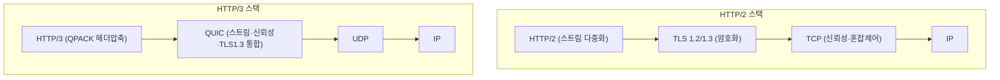
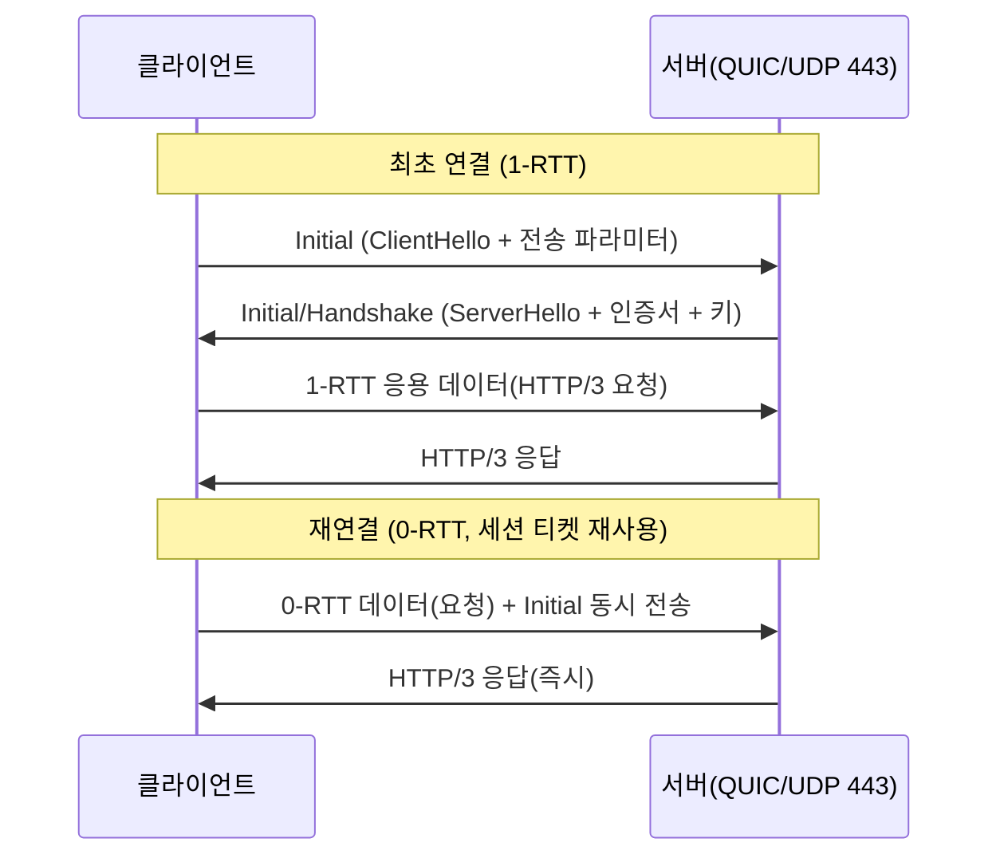

# QUIC와 HTTP/3

## 1. 개요

> **QUIC(Quick UDP Internet Connections)**는 UDP 위에서 동작하면서도 TCP의 신뢰성·순서보장과 TLS 1.3의 암호화, 그리고 스트림 다중화를 하나로 통합한 전송 프로토콜이다. **HTTP/3**는 이 QUIC를 전송 계층으로 사용하도록 재정의한 차세대 HTTP 버전으로, 각각 IETF에서 RFC 9000(QUIC, 2021)과 RFC 9114(HTTP/3, 2022)로 표준화되었다.

QUIC와 HTTP/3가 등장한 근본 배경은 **웹 성능의 병목이 더 이상 대역폭이 아니라 지연(latency)과 프로토콜 구조 자체에 있다**는 인식에 있다. 초기 웹은 HTTP/1.1의 텍스트 기반 요청-응답 구조를 오래 사용했는데, 한 연결에서 요청을 순차 처리해야 하는 제약(Head-of-Line Blocking, HOL Blocking) 때문에 브라우저는 도메인당 여러 TCP 연결을 병렬로 여는 편법을 써야 했다. 이를 개선한 HTTP/2는 하나의 TCP 연결 안에서 여러 스트림을 다중화(multiplexing)해 애플리케이션 계층의 HOL Blocking을 해소했지만, 여전히 근본적 한계가 남아 있었다.

문제의 핵심은 **HTTP/2가 신뢰성을 TCP에 의존한다**는 데 있다. TCP는 바이트 스트림 하나를 순서대로 전달하는 프로토콜이므로, 다중화된 여러 스트림이 실제로는 단일 TCP 시퀀스 위에 얹혀 있다. 따라서 중간에 패킷 하나만 유실되어도 TCP는 그 뒤에 도착한 모든 데이터를 애플리케이션에 넘기지 못하고 재전송을 기다린다. 논리적으로는 독립적인 스트림들이 물리적으로는 하나의 TCP 큐를 공유하기 때문에, **전송 계층 수준의 HOL Blocking**이 그대로 재현되는 것이다. 여기에 TCP 3-way 핸드셰이크(1 RTT) 위에 TLS 핸드셰이크(TLS 1.2 기준 2 RTT, 1.3은 1 RTT)가 직렬로 얹혀 연결 수립 지연이 크고, 커널에 내장된 TCP는 개선·배포가 수년 단위로 느리다는 경직성(ossification) 문제도 있었다. QUIC는 이 모든 문제를 **UDP 위에 신뢰성·암호화·다중화를 사용자 공간(user space)에서 재구현**하는 방식으로 우회한다.

## 2. QUIC 프로토콜 구조와 핵심 특성

QUIC는 OSI 계층으로 보면 UDP(전송) 위에 자리 잡되, TCP·TLS·HTTP/2의 스트림 제어를 통째로 흡수한 '융합 전송 계층'이다. 아래 개념도는 기존 HTTP/2 스택과 HTTP/3 스택의 계층 구조 차이를 대비해 보여준다.

QUIC의 특성은 네 가지 축으로 정리된다. 첫째, **스트림 단위 독립 전송**이다. QUIC는 하나의 연결 안에 여러 스트림을 두되, 각 스트림의 순서·재전송을 개별적으로 관리한다. 따라서 A 스트림의 패킷이 유실되어도 B·C 스트림은 영향 없이 애플리케이션에 전달된다. 이것이 QUIC가 전송 계층 HOL Blocking을 근본적으로 없앤 방식이며, 손실률이 높은 모바일·무선 환경일수록 체감 효과가 크다.

둘째, **암호화의 기본 내장(Encryption by default)**이다. QUIC는 TLS 1.3을 프로토콜에 통합해 헤더 일부와 페이로드 전체를 항상 암호화한다. 별도의 평문 QUIC는 존재하지 않으므로 도청·변조뿐 아니라, 중간 장비(미들박스)가 프로토콜 세부를 들여다보고 특정 동작에 의존해 굳어버리는 ossification도 구조적으로 방지한다.

셋째, **연결 ID 기반 연결 이주(Connection Migration)**다. TCP 연결은 (출발지 IP·포트, 목적지 IP·포트) 4-튜플로 식별되므로, 스마트폰이 Wi-Fi에서 LTE로 전환하며 IP가 바뀌면 연결이 끊긴다. 반면 QUIC는 IP·포트와 무관한 **Connection ID**로 연결을 식별하기 때문에, 네트워크가 바뀌어도 동일 연결을 유지한 채 통신을 이어갈 수 있다. 이동성이 큰 단말에서 재접속·재핸드셰이크 비용을 크게 줄이는 실질적 장점이다.

넷째, **사용자 공간 구현에 따른 민첩성**이다. TCP는 OS 커널에 내장되어 개선안이 배포되기까지 오랜 시간이 걸리지만, QUIC는 브라우저·라이브러리 등 애플리케이션 레벨에서 구현되므로 혼잡제어 알고리즘 교체나 기능 개선을 애플리케이션 업데이트만으로 빠르게 반영할 수 있다.

## 3. HTTP/3 연결 수립과 0-RTT 동작 절차

HTTP/3의 성능 이점을 결정짓는 것은 **연결 수립 지연의 단축**이다. QUIC는 전송 핸드셰이크와 TLS 1.3 암호 협상을 하나의 과정으로 합쳐, 신규 연결은 1 RTT, 이전에 접속한 적 있는 서버로의 재연결은 0-RTT로 데이터 전송을 시작할 수 있다. 아래 순서도는 QUIC 연결 수립과 0-RTT 재개 흐름을 나타낸다.

최초 연결에서 클라이언트는 QUIC의 전송 파라미터와 TLS ClientHello를 담은 Initial 패킷을 보내고, 서버가 ServerHello·인증서·키 재료로 응답하면 단 1 RTT 만에 암호화된 응용 데이터를 주고받을 수 있다. TCP+TLS 1.2가 최소 3 RTT를 소모하던 것과 비교하면 초기 로딩 지연이 크게 줄어든다. 한편 이미 통신했던 서버에는 이전 세션에서 받은 **세션 티켓(PSK)**을 이용해, 핸드셰이크 완료를 기다리지 않고 첫 왕복에 곧바로 요청 데이터를 실어 보내는 **0-RTT**가 가능하다. 다만 0-RTT 데이터는 재전송 공격(replay)에 취약할 수 있어, 서버는 조회(GET)처럼 멱등(idempotent)한 요청에만 허용하고 결제·주문 같은 비멱등 요청은 1-RTT 확립 이후로 미루는 방어가 필요하다.

헤더 압축 방식도 달라진다. HTTP/2는 HPACK을 썼으나, HPACK은 동적 테이블 갱신 순서에 의존해 QUIC의 비순차 전달과 충돌한다. 이에 HTTP/3는 **QPACK**을 도입해, 헤더 압축 상태의 동기화를 별도 스트림으로 분리함으로써 스트림 독립성을 해치지 않으면서 헤더 중복을 제거한다.

## 4. HTTP/2(TCP) vs HTTP/3(QUIC) 비교

두 프로토콜의 차이는 단순한 버전 향상이 아니라 **신뢰성을 어느 계층에서 책임지는가**라는 설계 철학의 차이에서 비롯된다. HTTP/2는 신뢰성을 TCP에 위임했기에 다중화의 이점이 단일 TCP 큐에 갇혔고, HTTP/3는 신뢰성을 QUIC가 스트림별로 직접 관리하므로 다중화의 이점이 손실 상황에서도 유지된다. 아래 표는 주요 항목을 정리한 것이다.

| 구분 | HTTP/2 (over TCP) | HTTP/3 (over QUIC) |
|------|-------------------|--------------------|
| 전송 계층 | TCP | UDP 기반 QUIC |
| 다중화 HOL Blocking | 전송 계층에서 발생 | 스트림 독립으로 해소 |
| 연결 수립 | TCP 1-RTT + TLS 1-~2-RTT | QUIC 1-RTT(재연결 0-RTT) |
| 암호화 | TLS 별도 계층(선택적) | TLS 1.3 상시 내장 |
| 연결 식별 | 4-튜플(IP·포트) | Connection ID |
| 네트워크 전환 | 재연결 필요 | 연결 이주로 유지 |
| 헤더 압축 | HPACK | QPACK |
| 구현 위치 | 커널(TCP) | 사용자 공간 |

표에서 보듯 가장 실무적으로 의미 있는 차이는 **손실·이동 환경에서의 강건성**이다. 예를 들어 지하철에서 이동하며 웹 페이지를 여는 사용자는 패킷 손실과 Wi-Fi↔LTE 전환을 동시에 겪는데, HTTP/2에서는 손실 한 번이 전체 스트림을 멈추고 IP 변경이 연결을 끊지만, HTTP/3에서는 해당 스트림만 잠시 지연되고 연결은 그대로 유지된다. 다만 안정적 유선·저손실 환경에서는 TCP도 충분히 최적화되어 있어 QUIC의 이점이 상대적으로 작을 수 있으며, UDP 처리에 따른 CPU 부하는 오히려 불리하게 작용할 수 있다.

## 5. 도입 현황 및 실무 고려사항 (심화)

QUIC는 Google이 2012년경 사내 실험 프로토콜(gQUIC)로 시작해 Chrome·YouTube·검색 트래픽에 적용하며 대규모 검증을 거쳤고, 이후 IETF 표준화를 통해 벤더 중립적 프로토콜로 정착했다. 현재 Chrome·Firefox·Edge 등 주요 브라우저와 Cloudflare·Google·Meta 등 대형 CDN·서비스가 HTTP/3를 지원하며, 전 세계 웹 트래픽 중 상당 비중이 이미 HTTP/3로 처리되고 있다(정확한 수치는 조사 기관·시점에 따라 다르므로 일반화한다). 대개 브라우저는 먼저 HTTP/2로 접속한 뒤 서버가 보내는 **Alt-Svc(Alternative Services)** 헤더를 통해 HTTP/3 사용 가능성을 인지하고 다음 접속부터 QUIC로 전환한다.

도입 시 실무적으로는 몇 가지 제약을 고려해야 한다. 첫째, 상당수 기업 방화벽·NAT는 UDP 443 포트를 차단하거나 속도를 제한(throttling)하므로, 이 경우 브라우저가 TCP 기반 HTTP/2로 자동 복귀(fallback)하도록 이중 지원 구성이 필요하다. 둘째, UDP 패킷을 사용자 공간에서 처리하는 특성상 동일 트래픽에서 TCP보다 CPU 사용량이 높을 수 있어, 커널 우회(kernel bypass)·GSO 같은 최적화나 하드웨어 오프로딩을 함께 검토해야 한다. 셋째, 패킷이 모두 암호화되어 기존 네트워크 장비(IDS·프록시)가 페이로드를 검사하기 어려우므로, 보안 가시성 확보 전략(엔드포인트 기반 검사, 정책 재설계)을 사전에 마련해야 한다.

## 6. 고려사항 및 시사점 (기술사 관점)

- **적용 전략**: HTTP/3는 전면 교체가 아니라 HTTP/2와의 병행 지원을 전제로 점진 도입해야 한다. Alt-Svc와 fallback을 활용해 UDP 차단 환경에서도 서비스 연속성을 보장하고, 손실·이동성이 큰 모바일 서비스부터 우선 적용해 효과를 극대화하는 것이 합리적이다.
- **트레이드오프**: 지연 단축·이동성이라는 이점과 CPU 부하 증가·기존 보안장비 가시성 저하라는 비용이 상충한다. 트래픽 특성(손실률·RTT·이동성)과 인프라 여건을 정량 분석해 이점이 비용을 상회하는 워크로드를 선별 적용하는 판단이 요구된다.
- **보안 관점**: 상시 암호화는 프라이버시를 강화하지만 네트워크 기반 위협 탐지를 어렵게 하므로, 보안 통제의 무게중심을 네트워크 경계에서 엔드포인트·애플리케이션으로 이동(제로 트러스트 정합)시키는 아키텍처 전환이 병행되어야 한다. 0-RTT는 재전송 공격에 유의해 멱등 요청으로 제한한다.
- **전망·연계 기술**: QUIC는 HTTP/3를 넘어 DNS over QUIC, 미디어 전송(WebTransport·Media over QUIC), 나아가 6G·엣지 컴퓨팅 환경의 저지연 전송 기반으로 확장되고 있다. 사용자 공간 구현의 민첩성을 살려 혼잡제어(BBR 등)·멀티패스(Multipath QUIC) 진화가 빠르게 이어질 것으로 전망되며, 관측성(Observability)·CDN·서비스 메시 설계와의 연계를 함께 고려해야 한다.

## 참고자료

- IETF RFC 9000, "QUIC: A UDP-Based Multiplexed and Secure Transport", https://www.rfc-editor.org/rfc/rfc9000
- IETF RFC 9114, "HTTP/3", https://www.rfc-editor.org/rfc/rfc9114
- IETF RFC 9204, "QPACK: Field Compression for HTTP/3", https://www.rfc-editor.org/rfc/rfc9204

---

> **한 줄 요약**: QUIC는 UDP 위에 TLS 1.3·스트림 다중화·신뢰성을 통합해 전송 계층 HOL Blocking을 없애고 0-RTT 연결·연결 이주를 실현한 전송 프로토콜이며, 이를 사용하는 HTTP/3는 손실·이동 환경에서 특히 강한 차세대 웹 프로토콜이다.
