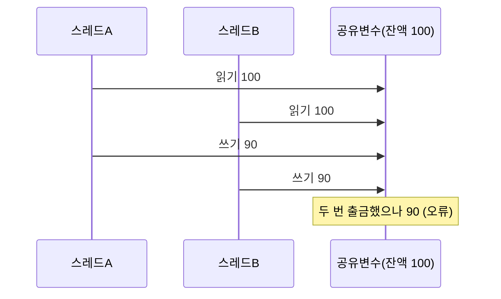

# 경쟁 상태(Race Condition)

## 1. 개요

### 가. 정의
> **경쟁 상태**는 둘 이상의 프로세스·스레드가 **공유 자원에 동시에 접근할 때, 실행 순서(타이밍)에 따라 결과가 달라지는 오류 상황**이다.

경쟁 상태가 위험한 이유는 '**언제 터질지 모르고, 재현조차 어렵다**'는 데 있다. 여러 스레드가 같은 변수를 동시에 읽고 쓰면, 누가 먼저 실행되느냐에 따라 결과가 매번 달라진다. 예를 들어 잔액 100원에서 두 스레드가 동시에 10원씩 출금하면, 각자 100원을 읽고 90원을 쓰는 바람에 두 번 출금했는데 잔액이 90원이 되는 일이 벌어진다. 이 문제의 고약함은 '가끔만' 발생한다는 것이다. 대부분은 우연히 순서가 맞아 정상 동작하다가, 특정 타이밍이 겹칠 때만 오류가 나므로 테스트로 잡기 어렵고 재현이 힘들다. 근본 원인은 여러 명령으로 이뤄진 갱신 작업이 **원자적(atomic)이지 않아** 중간에 끼어들 수 있기 때문이다. 그 끼어들 수 있는 코드 구간이 **임계구역(Critical Section)** 이며, 이를 보호하는 것이 해결의 핵심이다.

### 나. 발생 조건
공유 자원, 동시 접근, 비원자적 연산(읽기-수정-쓰기), 그리고 실행 순서에 대한 미제어가 겹칠 때 발생한다. 특히 보안에서는 검사 시점과 사용 시점의 간격을 노리는 **TOCTOU**(Time-Of-Check to Time-Of-Use) 공격으로 악용된다.

## 2. 발생 원리

## 3. 해결 방법

경쟁 상태의 해법은 **임계구역을 한 번에 하나의 실행 흐름만 들어가게(상호 배제, Mutual Exclusion)** 하는 것이다. 즉 공유 자원을 갱신하는 동안 다른 스레드가 접근하지 못하도록 잠근다.

| 기법 | 내용 |
|---|---|
| **뮤텍스(Mutex)** | 잠금으로 임계구역 상호 배제 |
| **세마포어(Semaphore)** | P/V 연산으로 자원 접근 수 제어 |
| **모니터(Monitor)** | 언어 차원의 동기화 추상화 |
| **원자적 연산** | CAS 등 하드웨어 원자 명령 |
| **불변/지역 변수** | 공유 자체를 없애 경쟁 제거 |

## 4. 고려사항 및 시사점

1. **동기화의 대가를 인식**해야 한다. 잠금은 경쟁 상태를 막지만, 과도하면 성능 저하와 교착상태(Deadlock)를 부른다. 잠금 범위를 최소화하고 잠금 순서를 일관되게 유지해 데드락을 예방한다.
2. **테스트로 잡기 어려운 결함**임을 유념한다. 간헐적·비결정적이므로, 정적 분석·동시성 테스트 도구·코드 리뷰로 공유 자원 접근을 사전에 점검한다.
3. **보안 취약점으로도 이어진다.** TOCTOU 같은 경쟁 조건은 권한 상승·인증 우회에 악용되므로, 검사와 사용을 원자적으로 묶어(atomic) 시점 차이를 없애야 한다.

---

> **한 줄 요약**: 경쟁 상태는 *공유 자원에 대한 동시 접근으로 실행 순서에 따라 결과가 달라지는 오류* 로, 임계구역을 뮤텍스·세마포어·원자적 연산으로 상호 배제해 해결하되 데드락과 성능 저하를 함께 관리해야 한다.
