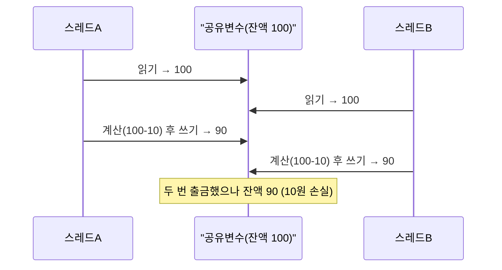
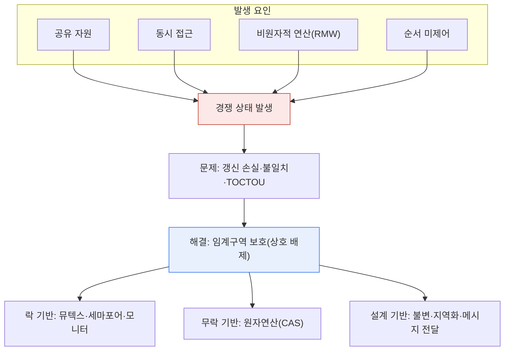

# 경쟁 상태(Race Condition)

## 1. 개요

### 가. 정의
> **경쟁 상태(Race Condition)** 는 둘 이상의 프로세스·스레드가 **공유 자원에 동시에 접근할 때, 그 실행 순서(타이밍)에 따라 최종 결과가 달라지는 오류 상황**을 말한다. 즉 프로그램의 정확성이 '누가 먼저 실행되느냐'라는 통제 불가능한 우연에 좌우되는 상태다.

경쟁 상태가 특별히 위험한 이유는 '**언제 터질지 모르고, 재현조차 어렵다**'는 데 있다. 여러 스레드가 같은 변수를 동시에 읽고 쓰면, 스케줄러가 각 스레드를 어느 순간에 끼워 실행하느냐에 따라 결과가 매번 달라진다. 예를 들어 잔액 100원 계좌에서 두 스레드가 동시에 10원씩 출금한다고 하자. 각 출금은 '현재 잔액을 읽고 → 10을 빼고 → 다시 쓴다'는 세 단계로 이뤄지는데, 두 스레드가 거의 동시에 100을 읽어버리면 각자 90을 계산해 쓰는 바람에, 두 번 출금했는데도 잔액이 80이 아니라 90이 되는 일이 벌어진다. 10원이 허공으로 사라진 것이다.

이 문제의 고약함은 '**가끔만**' 발생한다는 데 있다. 대부분의 실행에서는 우연히 순서가 맞아 정상 동작하다가, 특정 타이밍이 겹치는 극히 드문 경우에만 오류가 난다. 그래서 개발·테스트 환경에서는 멀쩡하다가 부하가 높은 운영 환경에서, 그것도 간헐적으로만 터지므로 원인을 찾기가 대단히 어렵다. 이런 비결정성(non-determinism) 때문에 경쟁 상태는 '하이젠버그(Heisenbug, 관찰하려 하면 사라지는 버그)'의 대표 사례로 불린다.

근본 원인은 여러 명령으로 이뤄진 갱신 작업이 **원자적(atomic)이지 않아** 그 중간에 다른 실행 흐름이 끼어들 수 있기 때문이다. 이렇게 끼어들면 데이터 일관성이 깨지는 코드 구간을 **임계구역(Critical Section)** 이라 하며, 이 임계구역을 한 번에 하나의 실행 흐름만 지나가도록 보호하는 것이 문제 해결의 핵심이다.

여기서 흔한 오해 하나를 짚어야 한다. "코드 한 줄이면 원자적"이라는 생각은 틀렸다. 고급 언어의 `balance = balance - 10;` 한 줄도 컴파일되면 '메모리에서 값을 레지스터로 읽기 → 빼기 → 메모리에 쓰기'의 여러 기계 명령으로 쪼개지며, 그 사이에 스케줄러가 다른 스레드를 끼워 넣을 수 있다. 심지어 멀티코어에서는 CPU의 캐시·메모리 재정렬(reordering) 때문에 한 스레드가 쓴 값이 다른 스레드에 즉시 보이지 않는 **가시성(visibility)** 문제까지 겹쳐, 경쟁 상태는 단순한 순서 문제를 넘어 메모리 모델(memory model) 차원의 문제로 확장된다.

### 나. 발생 조건과 배경
경쟁 상태는 (1) **공유 자원**(전역 변수·파일·DB 레코드·하드웨어 등)이 존재하고, (2) 둘 이상이 그 자원에 **동시에 접근**하며, (3) 그 접근이 **읽기-수정-쓰기(read-modify-write)** 처럼 비원자적 연산이고, (4) **실행 순서가 통제되지 않을** 때 성립한다. 이 네 조건은 뒤집으면 그대로 해결의 실마리가 된다. 즉 공유를 없애거나(1 제거), 동시 접근을 직렬화하거나(2 제거), 연산을 원자적으로 만들거나(3 제거), 순서를 강제(4 제거)하면 경쟁 상태는 사라진다. 뒤에서 볼 해결 기법들은 모두 이 네 조건 중 하나 이상을 무너뜨리는 방식이다.

멀티코어 CPU가 보편화되고 비동기·병렬 프로그래밍이 일상화되면서, 과거 단일 스레드에서는 드러나지 않던 이 결함이 현대 소프트웨어의 핵심 신뢰성·보안 위협으로 부상했다. 특히 보안 영역에서는 검사 시점(Time-Of-Check)과 사용 시점(Time-Of-Use) 사이의 짧은 틈을 노리는 **TOCTOU** 공격으로 악용된다. 예컨대 파일 권한을 검사한 뒤 실제로 여는 사이에 공격자가 그 파일을 심볼릭 링크로 바꿔치기하면, 검사는 통과하되 실제로는 권한 없는 파일에 접근하게 되는 식이다.

## 2. 발생 원리

경쟁 상태의 본질은 '원자적이어야 할 갱신이 중간에 쪼개져 다른 흐름이 끼어든다'는 것이다. 아래 시퀀스 다이어그램은 앞서 설명한 잔액 출금 예시에서, 두 스레드의 읽기-쓰기가 어떻게 교차(interleaving)하며 갱신 손실(lost update)을 일으키는지를 보여준다.

```mermaid
sequenceDiagram
  participant A as 스레드A
  participant M as "공유변수(잔액 100)"
  participant B as 스레드B
  A->>M: 읽기 → 100
  B->>M: 읽기 → 100
  A->>M: 계산(100-10) 후 쓰기 → 90
  B->>M: 계산(100-10) 후 쓰기 → 90
  Note over M: 두 번 출금했으나 잔액 90 (10원 손실)
```

위 그림의 핵심은 A가 '읽기'와 '쓰기' 사이에서 아직 90을 반영하기 전에 B가 끼어들어 낡은 값 100을 읽어버린다는 점이다. 만약 A의 세 단계가 원자적으로 묶여 B가 그 사이에 끼어들 수 없었다면, B는 90을 읽어 80을 썼을 것이고 결과는 정확했을 것이다. 즉 경쟁 상태는 '동시성 그 자체'가 아니라 '**보호되지 않은 임계구역에 대한 동시 접근**'에서 비롯된다.

경쟁 상태는 그 양상에 따라 몇 가지 유형으로 나눌 수 있다. 위 예시 같은 **갱신 손실(lost update)** 이 가장 흔하고, 두 자원을 갱신하는 도중의 중간 상태가 다른 흐름에 노출되는 **읽기 불일치(dirty read)**, 그리고 보안에서 문제되는 **TOCTOU**(검사와 사용 사이의 상태 변경 악용)가 대표적이다. 아래 다이어그램은 경쟁 상태의 원인 요소와 해결 계층의 관계를 구조적으로 정리한 것이다.

```mermaid
flowchart TB
  subgraph C["발생 요인"]
    C1["공유 자원"]
    C2["동시 접근"]
    C3["비원자적 연산(RMW)"]
    C4["순서 미제어"]
  end
  C1 & C2 & C3 & C4 --> RC["경쟁 상태 발생"]
  RC --> P["문제: 갱신 손실·불일치·TOCTOU"]
  P --> S["해결: 임계구역 보호(상호 배제)"]
  S --> S1["락 기반: 뮤텍스·세마포어·모니터"]
  S --> S2["무락 기반: 원자연산(CAS)"]
  S --> S3["설계 기반: 불변·지역화·메시지 전달"]
  style RC fill:#fde8e8,stroke:#c0392b
  style S fill:#e8f0fe,stroke:#2f6fed
```

## 3. 해결 방법

경쟁 상태의 해법은 결국 하나의 원리로 수렴한다. 임계구역에 **한 번에 하나의 실행 흐름만 들어가게(상호 배제, Mutual Exclusion)** 하거나, 아예 공유를 없애는 것이다. 다만 그 구현 수단은 계층에 따라 크게 락(lock) 기반, 무락(lock-free) 기반, 설계 기반으로 나뉘며 각각 트레이드오프가 다르다. 표 이전에 각 접근의 원리를 짚어본다.

**가. 락(Lock) 기반 상호 배제.** 가장 직관적인 방법으로, 임계구역에 진입하기 전 잠금을 획득하고 나올 때 반환하여 다른 흐름의 진입을 막는다. **뮤텍스(Mutex)** 는 단 하나의 흐름만 통과시키는 이진 잠금이고, **세마포어(Semaphore)** 는 P(대기)·V(신호) 연산으로 동시에 접근 가능한 자원의 개수를 N개로 제어한다(뮤텍스는 N=1인 특수한 경우로 볼 수 있다). **모니터(Monitor)** 는 자바의 `synchronized`처럼 언어·런타임 차원에서 잠금과 조건변수를 캡슐화해 개발자가 잠금 해제를 잊는 실수를 줄여준다. 락 기반은 이해하기 쉽고 강력하지만, 잠금이 성능 병목이 되고 잘못 쓰면 교착상태(deadlock)를 부른다는 대가가 있다.

락 기반 기법을 쓸 때 반드시 지켜야 할 원리가 있다. 잠금 획득과 해제는 예외 상황에서도 짝이 맞아야 한다는 것이다. 임계구역 안에서 예외가 발생해 잠금을 해제하지 못하면 다른 모든 흐름이 영원히 대기하므로, `try-finally`나 RAII(자원 획득이 곧 초기화) 패턴으로 해제를 보장해야 한다. 모니터가 언어 차원에서 선호되는 이유도 바로 이 해제 누락 위험을 언어가 대신 막아주기 때문이다.

**나. 무락(Lock-Free) 원자 연산.** 하드웨어가 제공하는 원자 명령, 대표적으로 **CAS(Compare-And-Swap)** 를 이용해 잠금 없이 안전하게 갱신한다. CAS는 '메모리 값이 내가 읽은 예상값과 같을 때만 새 값으로 바꾼다'는 비교-교환을 한 번의 원자 연산으로 수행하므로, 중간에 다른 흐름이 값을 바꿨다면 실패를 반환하고 재시도하게 한다. 잠금이 없어 교착상태가 없고 경합이 적을 때 성능이 좋지만, 경합이 심하면 재시도가 폭증하고 'ABA 문제' 같은 미묘한 함정이 있어 구현 난도가 높다.

**다. 설계 기반 회피.** 가장 근본적인 해법은 '공유 자체를 없애는' 것이다. 값이 변하지 않는 **불변(immutable) 객체**를 쓰면 동시에 읽어도 문제가 없고, 상태를 스레드마다 따로 두는 **스레드 지역(thread-local)** 변수는 공유가 없어 경쟁이 원천 봉쇄된다. 나아가 상태를 공유하지 않고 **메시지 전달(message passing)** 로만 소통하는 액터(Actor) 모델(Erlang·Go의 채널)은 동시성 오류의 상당 부분을 설계 단계에서 제거한다.

| 기법 | 계층 | 핵심 원리 | 주의점 |
|---|---|---|---|
| **뮤텍스(Mutex)** | 락 | 임계구역 상호 배제(N=1) | 데드락·병목 |
| **세마포어(Semaphore)** | 락 | P/V로 접근 수 N개 제어 | 잘못된 순서 시 데드락 |
| **모니터(Monitor)** | 락 | 언어 차원 동기화 캡슐화 | 언어 지원 필요 |
| **원자 연산(CAS)** | 무락 | 비교-교환·재시도 | ABA·경합 시 재시도 폭증 |
| **불변/지역/메시지** | 설계 | 공유 자체 제거 | 설계 변경 비용 |

기법 선택의 실무 지침은 '경합의 성격'에 따라 달라진다. 임계구역이 짧고 경합이 드물면 스핀락(spinlock)이나 CAS 같은 무락 기법이 문맥 전환 비용을 아껴 유리하고, 임계구역이 길거나 대기가 길어질 수 있으면 스레드를 잠재우는 뮤텍스가 CPU 낭비를 막는다. 읽기가 압도적으로 많고 쓰기가 드문 경우에는 여러 읽기를 동시에 허용하되 쓰기만 배타적으로 잠그는 **읽기-쓰기 락(RW Lock)** 이 처리량을 크게 높인다. 즉 '무조건 뮤텍스'가 아니라, 접근 패턴을 분석해 적합한 도구를 고르는 것이 성능과 안전의 균형점이다.

## 4. 실무 사례와 데드락과의 관계

경쟁 상태는 이론상의 문제가 아니라 실제 대형 사고의 원인이 되어 왔다. 대표적으로 1980년대 방사선 치료기 **Therac-25** 사고는 조작자 입력과 장비 제어 스레드 간의 경쟁 상태가 안전 검사를 우회하게 만들어 환자에게 과다 방사선을 조사한 것으로 알려져 있으며, 소프트웨어 동시성 결함이 인명 피해로 이어진 고전적 교훈으로 남아 있다. 웹 서비스에서는 재고 1개 상품에 두 주문이 동시에 들어와 둘 다 성공 처리되는 오버셀링(overselling), 은행에서는 앞서 본 이중 출금이 전형적 사례다. 이런 문제는 애플리케이션 잠금뿐 아니라 데이터베이스의 트랜잭션 격리 수준(isolation level)과 낙관적·비관적 락으로도 함께 통제해야 한다.

데이터베이스 계층에서는 경쟁 상태가 트랜잭션 격리 수준(isolation level)의 문제로 나타난다. 격리 수준이 낮으면(예: Read Uncommitted) 성능은 좋지만 더티 리드·갱신 손실 같은 경쟁 현상이 그대로 노출되고, 높으면(Serializable) 안전하지만 잠금 경합으로 처리량이 떨어진다. 실무에서는 **비관적 락(Pessimistic Lock)** 으로 갱신 대상 레코드를 미리 잠그거나, **낙관적 락(Optimistic Lock, 버전 컬럼 비교)** 으로 충돌 시에만 재시도하게 하여, 앞서 본 애플리케이션 계층의 뮤텍스·CAS와 같은 원리를 데이터 계층에서 구현한다. 즉 경쟁 상태 통제는 애플리케이션과 데이터베이스 양쪽에서 일관된 전략으로 설계되어야 한다.

한편 경쟁 상태를 막으려 잠금을 남용하면 정반대의 문제인 **교착상태(Deadlock)** 로 이어진다. 두 스레드가 서로가 쥔 잠금을 기다리며 영원히 멈추는 상황으로, 상호 배제·점유와 대기·비선점·순환 대기의 네 조건이 모두 성립할 때 발생한다.

따라서 실무의 요체는 '잠금을 쓰되, **잠금 순서를 일관되게 정하고 잠금 범위를 최소화**해 데드락과 성능 저하를 함께 통제'하는 균형에 있다. 잠금 순서를 전역적으로 통일하면 순환 대기 조건이 깨져 데드락이 예방되고, 임계구역을 최소화하면 직렬화로 인한 성능 저하를 줄일 수 있다. 경쟁 상태와 데드락은 서로를 유발하는 관계이므로, 둘 중 하나만 보고 대응하면 다른 하나가 악화된다. 동시성 제어는 이 둘을 하나의 설계 문제로 함께 다뤄야 하는, 동전의 양면과 같은 과제다.

## 5. 심화 — 탐지 기법과 언어 차원의 대응

경쟁 상태는 재현이 어렵기 때문에, 사후 디버깅보다 **사전 탐지 도구와 언어 차원의 예방**이 점점 중요해지고 있다. 동적 분석 도구인 **ThreadSanitizer(TSan)** 는 프로그램을 실제 실행하면서 서로 다른 스레드가 동기화 없이 같은 메모리에 접근하는지를 추적해 데이터 경쟁을 잡아내며, C/C++·Go 등에서 널리 쓰인다. Go 언어는 `-race` 플래그로 이 기능을 내장 제공한다. 정적 분석은 실행 없이 코드에서 잠재적 경쟁 패턴을 찾고, 스트레스·퍼징 테스트는 인위적으로 스케줄을 뒤흔들어 드문 타이밍을 강제로 노출시킨다.

가시성 문제를 다루는 언어 차원의 장치도 중요하다. 자바의 `volatile`이나 메모리 배리어(memory barrier)는 한 스레드가 쓴 값이 다른 스레드에 확실히 보이도록 보장하고, 명령 재정렬을 제한하는 **happens-before** 관계를 성립시킨다. 즉 현대의 경쟁 상태 대응은 '상호 배제'뿐 아니라 '가시성·순서 보장'까지 함께 다뤄야 완결되며, 이는 각 언어의 메모리 모델을 정확히 이해해야 함을 뜻한다.

언어 설계 차원의 대응도 주목할 흐름이다. **Rust**는 소유권(ownership)과 빌림(borrow) 규칙을 통해 '가변 참조는 동시에 하나만 존재할 수 있다'는 제약을 컴파일 시점에 강제함으로써, 데이터 경쟁의 상당 부분을 **컴파일 단계에서 원천 차단**한다("fearless concurrency"). 이는 런타임 검사에 의존하던 기존 방식과 대비되는 근본적 전환으로, 동시성 안전성을 타입 시스템의 문제로 끌어올린 사례다.

**Go**의 채널 기반 CSP(Communicating Sequential Processes) 모델은 "메모리를 공유해 소통하지 말고, 소통해서 메모리를 공유하라"는 철학 아래 고루틴 간 데이터를 채널로 주고받게 하여 공유 가변 상태를 줄인다. 함수형 언어들이 불변성을 강조하는 것도 같은 맥락으로, 이들은 공통적으로 '공유 가변 상태를 줄여 경쟁을 설계 단계에서 없앤다'는 방향을 지향한다. 이러한 흐름은 경쟁 상태 대응의 무게중심이 '실행 중 잠금으로 막기'에서 '설계·컴파일 단계에서 애초에 불가능하게 만들기'로 이동하고 있음을 보여준다.

## 6. 고려사항 및 시사점

기술사 관점에서 경쟁 상태를 다룰 때는 다음을 종합적으로 고려해야 한다.

1. **동기화의 대가를 반드시 인식해야 한다.** 잠금은 경쟁 상태를 막지만, 과도하면 성능 저하(직렬화)와 교착상태를 부른다. 잠금 범위(임계구역)를 필요한 최소로 줄이고, 여러 잠금을 쓸 때는 획득 순서를 전역적으로 일관되게 유지해 순환 대기를 끊는 것이 데드락 예방의 핵심이다.

2. **테스트로 잡기 어려운 결함임을 전제로 설계해야 한다.** 경쟁 상태는 간헐적·비결정적이어서 일반 테스트로는 재현되지 않는다. 따라서 ThreadSanitizer 등 동시성 탐지 도구, 스트레스·퍼징 테스트, 공유 자원 접근에 대한 집중 코드 리뷰를 개발 프로세스에 상시 편입해 '사후 발견'이 아닌 '사전 차단'을 지향해야 한다.

3. **보안 취약점으로 직결됨을 유의해야 한다.** TOCTOU 같은 경쟁 조건은 권한 검사와 실제 사용 사이의 틈을 노려 권한 상승·인증 우회에 악용된다. 검사와 사용을 원자적으로 묶거나, 파일 디스크립터 기반 접근처럼 시점 차이를 없애는 설계로 방어해야 하며, 보안 검토 항목에 경쟁 조건을 명시적으로 포함해야 한다.

4. **'공유를 없애는' 설계를 우선 고려해야 한다.** 잠금으로 사후 보호하기보다, 불변 객체·스레드 지역 상태·메시지 전달(액터/채널)로 공유 가변 상태 자체를 줄이는 것이 근본적이고 확장성 있는 해법이다. 신규 시스템 설계 시 Rust·Go 같은 언어의 동시성 안전 모델을 적극 검토해 결함을 설계 단계에서 배제하는 전략이 바람직하다.

---

> **한 줄 요약**: 경쟁 상태는 *공유 자원에 대한 보호되지 않은 동시 접근으로 실행 순서에 따라 결과가 달라지는 비결정적 오류* 로, 임계구역을 뮤텍스·세마포어·원자연산(CAS)으로 상호 배제하거나 불변·메시지 전달로 공유 자체를 없애 해결하되, 데드락·성능 저하와 TOCTOU 보안 위협을 함께 통제해야 한다.
