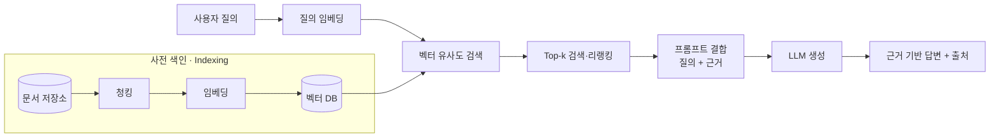

# RAG(Retrieval Augmented Generation, 검색증강생성)

## 1. 개요

### 가. 정의
> LLM이 답변을 생성하기 전에 **외부 지식베이스에서 질의와 관련된 문서를 검색(Retrieval)** 하고, 그 내용을 프롬프트에 결합(Augmentation)하여 **검색된 근거에 기반해 답변을 생성(Generation)** 하는 기법.

즉 RAG는 "**비모수 기억(외부 문서)**"과 "**모수 기억(LLM 내부 파라미터)**"을 결합하는 구조다. LLM은 학습 시점에 파라미터로 지식을 압축해 기억하는데, 이 방식만으로는 학습 이후의 최신 정보나 학습에 포함되지 않은 사내 문서를 알 수 없다. RAG는 답변에 필요한 지식을 **추론 시점에 외부에서 조회**해 프롬프트에 넣어줌으로써 이 한계를 메운다.

### 나. 등장 배경 및 필요성
LLM은 그럴듯하지만 사실과 다른 답을 생성하는 **환각(Hallucination)**, 학습 데이터 컷오프 이후를 모르는 **최신성 부족**, 기업 내부·전문 도메인 지식의 부재라는 근본 한계를 가진다. 이를 파인튜닝(재학습)으로 해결하려면 데이터 구축·GPU 비용이 크고, 지식이 바뀔 때마다 다시 학습해야 한다. RAG는 **모델을 재학습하지 않고도** 지식베이스만 갱신하면 최신·전용 지식을 반영할 수 있고, **출처(근거)를 함께 제시**할 수 있어 신뢰성과 검증 가능성을 높인다. 이 때문에 기업용 LLM 도입의 사실상 표준 아키텍처가 되었다.

## 2. 처리 흐름(아키텍처)

RAG는 두 단계로 나뉜다. **① 사전 색인(오프라인)** 단계에서는 문서를 청킹·임베딩해 벡터 DB에 색인해 둔다. **② 질의 처리(온라인)** 단계에서는 사용자 질의를 같은 임베딩 공간으로 변환해 유사한 청크를 검색하고, 이를 프롬프트에 결합해 LLM이 답을 생성한다. 검색 품질이 최종 답변 품질을 좌우하므로, RAG 성능 개선의 초점은 대부분 "생성"보다 "**검색**"에 있다.

## 3. 구성 요소

각 구성요소는 다음과 같이 동작하며, 어느 하나라도 부실하면 전체 답변 품질이 떨어진다.

- **문서 처리·청킹(Chunking)**: 원문을 검색·주입 단위인 청크로 분할한다. 너무 크면 불필요한 내용이 섞여 노이즈가 되고, 너무 작으면 문맥이 끊긴다. 그래서 문단·의미 경계 기반 분할과 청크 간 **오버랩**을 둔다.
- **임베딩 모델(Embedding)**: 텍스트를 의미가 가까울수록 벡터도 가까워지도록 고차원 벡터로 변환한다. 도메인 특화 임베딩을 쓰면 검색 정확도가 오른다.
- **벡터 DB**: 대량의 임베딩을 저장하고 **근사 최근접 탐색(ANN, 예: HNSW·IVF)** 으로 빠르게 유사 청크를 찾는다(FAISS·Pinecone·pgvector 등).
- **검색기(Retriever)**: 질의와 유사한 Top-k 청크를 반환한다. 벡터(의미) 검색과 키워드(BM25) 검색을 합친 **하이브리드 검색**이 일반적이다.
- **생성기(LLM)**: 검색된 근거를 프롬프트 컨텍스트로 받아, 그 범위 안에서 답을 생성하고 출처를 인용한다.

| 구성 | 역할 | 품질 영향 요인 |
|---|---|---|
| 청킹 | 검색 단위 분할 | 청크 크기·오버랩·경계 |
| 임베딩 | 의미의 벡터화 | 모델 성능·도메인 적합성 |
| 벡터 DB | 색인·유사도 검색 | ANN 알고리즘·인덱스 |
| 검색기 | Top-k 근거 선별 | 하이브리드·리랭킹 |
| 생성기(LLM) | 근거 기반 생성 | 프롬프트·컨텍스트 길이 |

## 4. 고도화(Advanced RAG) 유형

기본(Naive) RAG는 "검색→주입→생성"이 단순해 검색 실패나 무관 문서 혼입에 취약하다. 이를 보완하는 대표 기법은 다음과 같다.

- **하이브리드 검색 + 리랭킹**: 벡터·키워드 검색 결과를 합친 뒤 Cross-Encoder 리랭커로 정밀 재정렬해 상위 근거의 정확도를 높인다.
- **질의 변환(Query Rewriting/HyDE)**: 모호한 질의를 확장·재작성하거나 가상 답변을 생성해 검색 적중률을 개선한다.
- **GraphRAG**: 지식그래프로 엔터티·관계를 구조화해, 여러 문서에 걸친 추론이 필요한 질문에 대응한다.
- **Self/Corrective RAG**: 검색 결과의 관련성을 스스로 평가해 부적합하면 재검색하거나 웹 검색으로 보완한다.

## 5. RAG vs 파인튜닝

둘은 대체재가 아니라 **역할이 다르다**. 파인튜닝은 지식을 가중치에 내재화하므로 응답의 **형식·말투·특정 능력**을 학습시키는 데 강하지만, 지식이 바뀌면 재학습이 필요하다. 반면 RAG는 **사실·최신 정보**를 외부에서 주입하므로 갱신이 빠르고 출처를 제시할 수 있다. 그래서 실무에서는 "**능력은 파인튜닝, 지식은 RAG**"로 병행하는 경우가 많다.

| 구분 | RAG | 파인튜닝 |
|---|---|---|
| 지식 주입 | 추론 시 외부 검색으로 프롬프트 결합 | 학습으로 가중치에 내재화 |
| 최신성/갱신 | 지식베이스만 갱신(빠름) | 재학습 필요(느림·비용) |
| 출처 제시 | 가능(근거 인용) | 어려움 |
| 강점 | 최신·근거 기반 사실 응답 | 형식·톤·전문 능력 |
| 비용 | 검색 인프라 | 학습 비용·데이터 |

## 6. 한계 및 평가

RAG의 약점은 대부분 **검색 단계**에서 온다. 관련 문서를 못 찾으면(Recall 저하) 답이 부실해지고, 무관 문서가 섞이면(Precision 저하) 오히려 환각을 유발한다. 또 검색·리랭킹으로 인한 **지연(latency)** 과 컨텍스트 길이 제한, 근거가 상충할 때의 처리도 과제다. 이 때문에 검색 정확도, 근거 충실성(Faithfulness), 답변 관련성 등을 정량 평가하는 **RAGAS 같은 평가 체계**로 지속 측정·개선해야 한다.

## 7. 고려사항 및 시사점
- **검색 품질이 곧 답변 품질**: 투자 우선순위를 생성보다 청킹·임베딩·리랭킹 등 검색 파이프라인에 둔다.
- **거버넌스·보안**: 사내 문서 기반이므로 접근권한·개인정보(민감정보 필터링)·출처 관리가 필수다.
- **평가·운영**: RAGAS·A/B 테스트로 품질을 계량하고, 문서 갱신·재색인 파이프라인을 자동화한다.
- **적용**: 사내 지식검색·고객 상담 챗봇·업무 자동화의 핵심 아키텍처이며, 에이전트(Tool 사용)·GraphRAG로 확장되고 있다.

---

> **한 줄 요약**: RAG는 *외부 지식 검색 결과를 LLM 프롬프트에 결합* 해 재학습 없이 **환각을 줄이고 최신·근거 기반 답변**을 생성하는 기법으로, 성능은 검색 파이프라인(청킹·임베딩·하이브리드·리랭킹)이 좌우하며 파인튜닝과 상호 보완된다.
