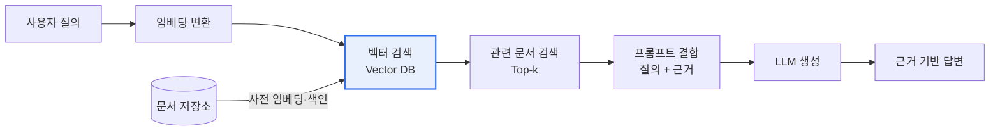

# RAG(Retrieval Augmented Generation, 검색증강생성)

## 1. 개요

### 가. 정의
> LLM이 답변을 생성하기 전에 **외부 지식베이스에서 관련 문서를 검색(Retrieval)** 하여, 그 내용을 프롬프트에 결합(Augment)해 **근거 기반으로 생성(Generation)** 하는 기법.

### 나. 등장 배경
- LLM의 **환각(Hallucination)·최신성 부족·도메인 지식 한계**
- 재학습(파인튜닝) 없이 **최신·전용 지식** 을 주입할 필요

## 2. 처리 흐름

## 3. 구성 요소

| 구성 | 역할 |
|---|---|
| **문서 처리·청킹** | 원문을 검색 단위(chunk)로 분할 |
| **임베딩 모델** | 텍스트를 벡터로 변환 |
| **벡터 DB** | 임베딩 저장·유사도 검색(예: FAISS, Pinecone) |
| **검색기(Retriever)** | 질의와 유사한 Top-k 문서 검색 |
| **생성기(LLM)** | 검색 근거를 반영해 최종 답변 생성 |

## 4. 장점 및 고려사항

| 구분 | 내용 |
|---|---|
| **장점** | 환각 감소, 최신성·출처 제시, 재학습 불필요, 비용 효율 |
| **고려사항** | 검색 품질(청킹·임베딩)이 답변 좌우, 검색 지연, 컨텍스트 길이 제한 |

## 5. 시사점
- 파인튜닝 대비 **저비용·빠른 지식 갱신**, 출처 제시로 신뢰성 확보
- 검색 품질 향상: **하이브리드 검색(키워드+벡터), 리랭킹, GraphRAG**
- 기업 내부 문서 기반 **지식 검색·챗봇·업무 자동화** 핵심 아키텍처

---

> **한 줄 요약**: RAG는 *외부 지식 검색 결과를 LLM 프롬프트에 결합* 하여 **환각을 줄이고 최신·근거 기반 답변** 을 생성하는, 재학습 없는 지식 주입 기법이다.
