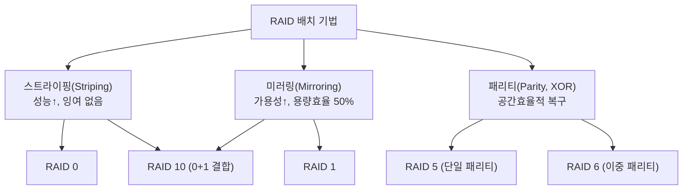
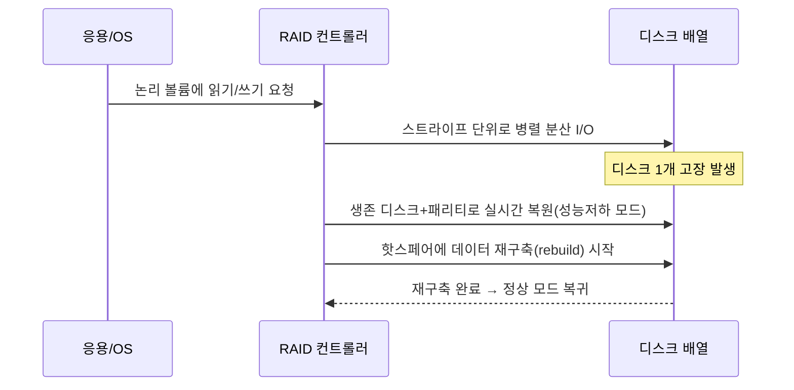

# RAID(Redundant Array of Independent Disks)

## 1. 개요

### 가. 정의
> 여러 개의 물리 디스크를 하나의 논리적 저장장치로 묶어, **데이터를 분산(Striping)·복제(Mirroring)·패리티(Parity)** 방식으로 배치함으로써 **성능 향상과 내결함성(Fault Tolerance)** 을 동시에 달성하는 저장 기술.

RAID의 본질은 "여러 개의 값싸고 신뢰성이 낮은 디스크를, 소프트웨어·하드웨어적 배치 기법으로 묶어 마치 하나의 빠르고 안정적인 디스크처럼 보이게 하는 것"이다. 초기에 'I'는 Inexpensive(저가)를 뜻했으나, 오늘날에는 엔터프라이즈 디스크까지 포함하는 의미로 Independent(독립적)로 통용된다. 핵심 아이디어는 **분산을 통한 병렬성**과 **잉여(redundancy)를 통한 복구 능력**이라는 두 축이며, RAID 레벨은 이 두 축을 어떻게 조합하느냐의 차이로 정의된다.

### 나. 등장 배경 및 필요성
단일 디스크는 성능(회전·탐색 지연)과 신뢰성(MTBF) 양면에서 한계가 있다. 특히 디스크 용량과 대수가 늘수록 배열 전체의 고장 확률은 급격히 커진다 — 디스크 한 대의 연간고장률(AFR)이 1%라도 100대를 묶으면 배열 관점의 고장 사건은 훨씬 잦아진다. 따라서 개별 디스크가 언젠가 반드시 고장난다는 전제 위에서, **한두 개의 디스크가 죽어도 데이터를 잃지 않고 서비스를 지속**해야 한다는 요구가 생긴다. 동시에 대용량 데이터의 처리량(throughput)을 높이려면 **여러 디스크에 I/O를 병렬 분산**해야 한다. RAID는 이 "성능과 가용성을 동시에" 요구를 저가 디스크의 조합으로 경제적으로 해결하기 위해 등장했다.

## 2. 핵심 원리와 구성 방식

RAID는 세 가지 기본 배치 기법의 조합으로 이해할 수 있다. **스트라이핑**은 하나의 데이터를 여러 디스크에 잘게 나눠(스트라이프 단위) 병렬로 읽고 쓰게 하여 성능을 높이지만 그 자체로는 잉여가 없다. **미러링**은 동일 데이터를 두 벌 이상 복제해 한쪽이 죽어도 다른 쪽으로 즉시 복구하지만 용량 효율이 절반으로 떨어진다. **패리티**는 XOR 연산으로 만든 오류정정 정보를 저장해, 적은 용량 오버헤드로 임의의 한(또는 두) 디스크 손실을 복원한다.

패리티의 원리는 단순하다. 데이터 블록 D1, D2, D3에 대해 패리티 P = D1 ⊕ D2 ⊕ D3(XOR)를 저장해 두면, 임의의 한 블록(예: D2)이 손실되어도 D2 = D1 ⊕ D3 ⊕ P로 복원된다. RAID 6는 서로 다른 두 개의 독립 패리티(P, Q — Q는 갈루아 필드 연산 기반)를 사용해 **두 디스크 동시 고장**까지 견딘다. 이 원리 덕분에 RAID 5는 N개 디스크 중 1개 용량만, RAID 6는 2개 용량만 잉여로 쓰면서도 복구 능력을 확보한다.

## 3. 주요 RAID 레벨 비교

각 레벨은 성능·가용성·용량효율의 트레이드오프 위에서 서로 다른 지점을 택한다. RAID 0은 잉여 없이 스트라이핑만 하므로 최고 성능·최대 용량이지만 디스크 하나만 죽어도 전체 데이터가 소실된다 — 즉 신뢰성은 오히려 단일 디스크보다 나쁘다. 반대로 RAID 1은 미러링으로 가용성이 뛰어나고 읽기 성능도 좋지만 가용 용량이 절반이다. RAID 5는 용량효율과 가용성의 균형점으로 오랫동안 표준처럼 쓰였고, RAID 6는 대용량 디스크 시대에 재구축(rebuild) 중 2차 고장 위험이 커지면서 사실상 필수가 되었다.

| 레벨 | 최소 디스크 | 잉여 방식 | 결함 허용 | 가용 용량 | 특징 |
|---|---|---|---|---|---|
| RAID 0 | 2 | 없음(스트라이핑) | 0개 | 100% | 최고 성능·최대 용량, 무보호 |
| RAID 1 | 2 | 미러링 | 1개(쌍당) | 50% | 읽기 우수·복구 단순 |
| RAID 5 | 3 | 분산 단일 패리티 | 1개 | (N-1)/N | 균형형, 쓰기 패리티 부담 |
| RAID 6 | 4 | 분산 이중 패리티 | 2개 | (N-2)/N | 대용량·재구축 안전성 |
| RAID 10 | 4 | 미러+스트라이프 | 그룹당 1개 | 50% | 고성능·고가용, DB에 선호 |

### 쓰기 패널티(Write Penalty)와 성능적 함의
패리티 기반 RAID의 가장 중요한 실무 포인트는 **쓰기 패널티**다. RAID 5에서 임의의 한 블록을 갱신하려면 (1) 기존 데이터 읽기, (2) 기존 패리티 읽기, (3) 새 데이터 쓰기, (4) 새 패리티 쓰기의 **4회 I/O**가 필요하다. RAID 6는 패리티가 둘이므로 **6회 I/O**로 늘어난다. 반면 RAID 1/10은 데이터를 양쪽에 쓰는 2회로 끝난다. 이 때문에 무작위 쓰기가 많은 OLTP 데이터베이스에는 RAID 5/6보다 RAID 10이 권장된다. 실무에서는 컨트롤러의 쓰기 캐시(NVRAM)와 전체 스트라이프 쓰기(full-stripe write)로 이 패널티를 완화한다.

## 4. 동작 흐름: 정상 → 고장 → 재구축

정상 상태에서 컨트롤러는 요청을 스트라이프 단위로 쪼개 여러 디스크에 병렬 처리한다. 디스크 하나가 고장나면 배열은 **성능저하(degraded) 모드**로 전환되어, 손실된 블록을 나머지 디스크와 패리티로 실시간 계산해 제공한다 — 데이터는 살아 있지만 매 접근마다 복원 연산이 붙어 느려진다. 이때 미리 대기시켜 둔 **핫 스페어(Hot Spare)** 디스크로 자동 재구축이 시작된다. 문제는 대용량 디스크(수십 TB)의 재구축이 수 시간~수일 걸리며, 그 사이 다른 디스크가 추가 고장나면 RAID 5는 데이터를 완전히 잃는다는 점이다. 이 "재구축 창(window)" 위험이 RAID 6와 후술할 분산 RAID의 필요성을 낳았다.

## 5. 심화: 한계와 최신 동향

전통적 RAID는 대용량·대규모 환경에서 한계에 부딪혔다. 첫째, 재구축 시간이 디스크 용량에 비례해 길어져 이중 고장 위험이 커진다. 둘째, 재구축 부하가 특정 스페어 디스크에 집중되어 병목이 된다. 이를 해결하기 위한 흐름은 다음과 같다.

- **분산 RAID(Declustered RAID)**: 패리티·스페어 공간을 전체 디스크에 흩뿌려, 재구축 시 모든 디스크가 병렬로 참여하게 한다. 재구축 시간을 대폭 단축(수배~수십배)해 위험 창을 줄인다. 넷앱 RAID-DP, IBM 등에서 채택.
- **소거 코딩(Erasure Coding)**: Reed-Solomon 등 수학적 코드로 데이터를 n개 조각+k개 패리티로 분산해, 임의의 k개 손실을 복구한다. RAID 6의 일반화로 볼 수 있으며, 오브젝트 스토리지·분산 파일시스템(예: Ceph, HDFS EC)에서 지역(geo) 단위 내결함성에 널리 쓰인다.
- **파일시스템 통합형(ZFS RAID-Z, Btrfs)**: 볼륨매니저·파일시스템·RAID를 통합해 "쓰기 구멍(write hole)"(패리티와 데이터가 불일치한 채 정전되는 문제)을 근본적으로 제거하고, 블록 단위 체크섬으로 무결성을 보장한다.
- **하드웨어 vs 소프트웨어 RAID**: 전용 컨트롤러(배터리 백업 캐시 포함)는 성능·CPU 오프로드에 유리하나 벤더 종속·컨트롤러 단일 장애 위험이 있고, 소프트웨어 RAID(mdadm, Storage Spaces)는 유연·저비용이나 호스트 CPU를 사용한다.

## 6. 고려사항 및 시사점

- **RAID ≠ 백업**: RAID는 디스크 물리 고장에 대한 **가용성** 대책일 뿐, 사용자 실수·랜섬웨어·논리적 손상·사이트 재해로부터 데이터를 지키지 못한다. 반드시 별도 백업·스냅샷·원격 복제(DR)와 병행해야 한다. 이는 3-2-1 백업 원칙과 함께 설계돼야 한다.
- **워크로드 정합 설계**: 무작위 쓰기 중심(OLTP DB)은 쓰기 패널티가 없는 RAID 10, 순차 읽기·아카이브·대용량은 용량효율이 좋은 RAID 6/EC가 유리하다. 성능·용량·비용·가용성의 4각 트레이드오프를 워크로드 특성에 맞춰 선택하는 것이 기술사적 판단의 핵심이다.
- **재구축 리스크 관리**: 디스크 대용량화 추세에서 RAID 5는 재구축 중 이중 고장·URE(복구불가읽기오류) 위험이 커 지양하고, RAID 6·분산 RAID·핫스페어 다중 배치로 위험 창을 관리해야 한다.
- **소프트웨어 정의 스토리지(SDS)·클라우드로의 확장**: 전통적 컨트롤러 중심 RAID는 노드·사이트 단위 복제와 소거 코딩을 결합한 분산 스토리지(SDS·오브젝트 스토리지)로 진화하고 있으며, 내결함성의 경계가 디스크에서 노드·리전으로 확장되고 있다. 향후 스토리지 설계는 단일 배열의 RAID보다 **분산 잉여·소거 코딩 기반 아키텍처**를 우선 고려하는 방향으로 이동할 것이다.

---
> **한 줄 요약**: RAID는 스트라이핑·미러링·패리티의 조합으로 여러 디스크를 묶어 성능과 내결함성을 동시에 얻는 기술이며, 워크로드별 트레이드오프(특히 쓰기 패널티·재구축 위험)를 고려해 레벨을 선택하고 백업과 반드시 병행해야 한다.
