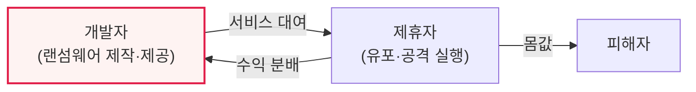

# 랜섬웨어(Ransomware)와 RaaS(Ransomware as a Service)

## 1. 개요

### 가. 정의
> **랜섬웨어**는 시스템·파일을 **암호화하거나 잠가 사용 불능으로 만든 뒤 복구 대가로 금전(몸값)을 요구**하는 악성코드이고, **RaaS(Ransomware as a Service)** 는 랜섬웨어를 서비스 형태로 제작·대여해 비전문가도 공격할 수 있게 하는 범죄 비즈니스 모델이다.

랜섬웨어가 특히 위협적인 이유는 '**데이터를 인질로 삼아 직접 금전을 갈취**'하기 때문이다. 정보를 훔쳐 파는 다른 악성코드와 달리, 랜섬웨어는 피해자의 소중한 데이터를 암호화해 즉시 업무를 마비시키고 몸값을 요구한다. RaaS는 이 위협을 산업화한 것이 문제의 핵심이다. 과거에는 랜섬웨어를 직접 만들 수 있는 고급 해커만 공격할 수 있었지만, RaaS는 랜섬웨어 제작자가 '**개발**'을 맡고 공격 실행자(제휴자, Affiliate)가 '**유포**'를 맡아 수익을 나누는 분업 구조를 만들었다. 그 결과 기술이 없는 범죄자도 랜섬웨어를 빌려 공격할 수 있게 되어 공격이 폭발적으로 늘었다. 최근에는 데이터를 암호화하는 동시에 훔쳐서 "돈을 안 주면 공개하겠다"고 협박하는 **이중 갈취(Double Extortion)** 로 진화했다.

### 나. 등장 배경
암호화폐로 익명 금전 요구가 쉬워지고, RaaS로 공격 진입장벽이 낮아지면서 랜섬웨어가 가장 심각한 사이버 위협으로 부상했다.

## 2. RaaS의 분업 구조

RaaS는 랜섬웨어 개발자와 실제 공격을 수행하는 제휴자가 수익을 나누는 구조로, 다크웹에서 구독·수익배분 형태로 거래된다. 이 분업이 공격의 확산과 전문화를 촉진했다.

## 3. 공격 단계와 진화

| 단계/유형 | 내용 |
|---|---|
| **초기 침투** | 피싱·취약점·인포스틸러로 침입 |
| **내부 확산·권한 상승** | 측면 이동, 관리자 권한 탈취 |
| **암호화·갈취** | 데이터 암호화 + 몸값 요구 |
| **이중 갈취** | 암호화 + 데이터 유출 협박 |
| **삼중 갈취** | + DDoS·고객 협박 추가 |

## 4. 대응 방안

| 구분 | 대응 |
|---|---|
| **예방** | 패치·취약점 관리, 피싱 교육, 최소 권한, EDR |
| **백업** | 3-2-1 백업(오프라인·불변 백업), 복구 훈련 |
| **탐지·격리** | EDR/XDR 이상행위 탐지, 네트워크 분할 |
| **대응** | 침해대응(IR) 체계, 신고, 몸값 지불 지양 |

핵심 방어는 '**믿을 수 있는 백업**'이다. 오프라인·불변(immutable) 백업이 있으면 암호화당해도 복구할 수 있어 몸값을 낼 이유가 없어진다. 다만 이중 갈취(유출 협박)에는 백업만으로 부족해 예방·탐지가 병행되어야 한다.

## 5. 고려사항 및 시사점

1. **백업이 최후의 보루**다. 3-2-1 원칙(3벌, 2매체, 1오프라인)과 불변 백업으로 복구 능력을 확보하고, 복구 훈련으로 실효성을 검증해야 한다.
2. **이중·삼중 갈취에는 예방·탐지가 필수**다. 데이터 유출 협박은 백업으로 막을 수 없으므로, 침투 차단(EDR·최소권한)과 데이터 유출 탐지(DLP)가 중요하다.
3. **몸값 지불은 지양**한다. 지불해도 복구가 보장되지 않고 추가 공격을 부르며 범죄를 조장하므로, 사전 대비(백업·IR 체계)로 지불하지 않아도 되는 상태를 만들어야 한다.

---

> **한 줄 요약**: 랜섬웨어는 *데이터를 암호화해 몸값을 요구* 하는 악성코드이고 RaaS는 이를 서비스로 대여하는 범죄 모델로, 이중 갈취로 진화하고 있어 *불변 백업(3-2-1)·EDR 탐지·최소권한·IR 체계* 로 대응하되 몸값 지불은 지양한다.
