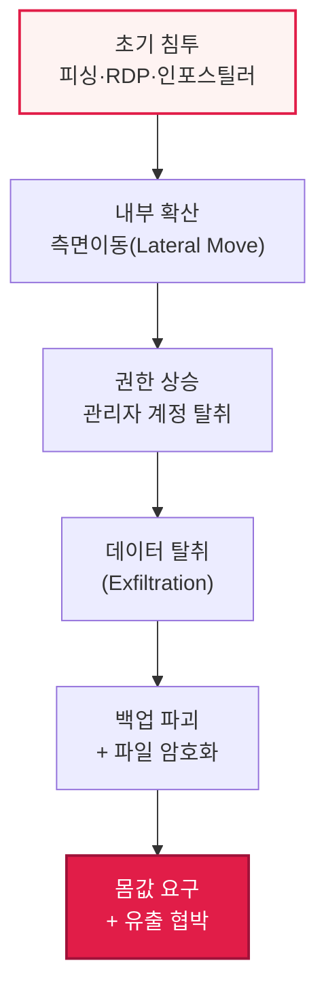

# 랜섬웨어(Ransomware)와 RaaS(Ransomware as a Service)

## 1. 개요

### 가. 정의

> **랜섬웨어(Ransomware)** 는 시스템·파일을 **암호화하거나 잠가 사용 불능으로 만든 뒤 복구 대가로 금전(몸값, ransom)을 요구**하는 악성코드이며, **RaaS(Ransomware as a Service)** 는 랜섬웨어를 클라우드 서비스처럼 제작·대여하여 기술이 없는 비전문가도 공격을 수행할 수 있게 만든 **구독형 범죄 비즈니스 모델**이다.

랜섬웨어가 다른 악성코드보다 특히 위협적인 이유는 '**데이터를 인질로 삼아 피해자에게서 직접 금전을 갈취**'하는 구조에 있다. 정보를 훔쳐 제3자에게 되파는 인포스틸러(Infostealer)나 은밀히 잠복하는 백도어와 달리, 랜섬웨어는 피해자의 업무에 직결된 데이터를 즉시 암호화해 업무를 마비시키고 그 고통 자체를 지렛대 삼아 몸값을 받아낸다. 피해자는 데이터가 없으면 당장 사업이 멈추므로 지불 압박이 크고, 공격자는 훔친 데이터를 되팔 구매자를 찾을 필요 없이 피해자 본인에게 곧장 청구할 수 있어 '수익화(monetization)'가 가장 빠른 공격이다.

**RaaS는 이 위협을 산업화(industrialization)했다는 점이 문제의 핵심**이다. 과거에는 강력한 암호 루틴과 전파 코드를 직접 짤 수 있는 소수의 고급 해커만 랜섬웨어 공격을 할 수 있었다. 그러나 RaaS는 랜섬웨어 개발자(Operator)가 '**개발·인프라 운영**'을 전담하고, 실제 침투·유포는 별도의 공격 실행자인 '**제휴자(Affiliate)**'가 맡아 수익(몸값)을 배분하는 **분업 구조**를 만들었다. 그 결과 코딩 능력이 없는 범죄자도 다크웹에서 랜섬웨어를 빌려 공격할 수 있게 되어 공격 건수가 폭발적으로 늘었고, 소프트웨어 산업의 SaaS 모델이 그대로 지하경제에 이식되는 결과를 낳았다.

### 나. 등장 배경과 진화

랜섬웨어가 최악의 사이버 위협으로 부상한 배경에는 세 가지 촉진 요인이 있다. 첫째, **암호화폐(비트코인 등)** 의 등장으로 추적이 어려운 익명 송금이 가능해져 몸값 수취가 쉬워졌다. 둘째, **RaaS로 공격 진입장벽이 극적으로 낮아져** 공급이 폭증했다. 셋째, 방어 기술이 백업으로 진화하자 공격자는 데이터를 암호화하는 동시에 **탈취(exfiltration)** 한 뒤 "돈을 안 주면 공개하겠다"고 협박하는 **이중 갈취(Double Extortion)** 로 대응했다. 최근에는 여기에 **DDoS 공격·피해 고객 직접 협박** 까지 더한 삼중·사중 갈취로 압박 수단을 계속 늘리고 있다. 즉 랜섬웨어는 정적인 악성코드가 아니라 방어에 맞춰 진화하는 '범죄 생태계'로 이해해야 한다.

## 2. RaaS의 분업 구조와 참여자

### 가. 분업 구조 개념도

RaaS는 하나의 조직이 모든 것을 하는 대신, 역할별로 전문화된 참여자들이 수익을 나누는 밸류체인 형태다. 개발자는 랜섬웨어 바이너리·암호 키 관리·협상 포털·몸값 수취 인프라를 '서비스'로 제공하고, 제휴자는 이를 빌려 실제 대상에 침투·유포한다. 여기에 침투 경로(계정·VPN 접근권)를 파는 **초기 침투 브로커(IAB, Initial Access Broker)** 까지 가세하면 분업은 더 세밀해진다.

```mermaid
flowchart LR
  IAB["초기침투 브로커(IAB)<br/>접근권 판매"] -->|접근 권한| A
  D["개발자/운영자<br/>(랜섬웨어·인프라 제공)"] -->|서비스 대여| A["제휴자(Affiliate)<br/>(유포·공격 실행)"]
  A -->|몸값 요구| V[피해자]
  V -->|암호화폐 지불| A
  A -->|수익 분배(예: 70:30)| D
  style D fill:#fef3f2,stroke:#e11d48,stroke-width:2px
  style A fill:#fff7ed,stroke:#ea580c,stroke-width:2px
```

**개발자·운영자(Operator)** 는 이 생태계의 '플랫폼 사업자'다. 강력한 하이브리드 암호(대칭키로 파일 암호화, 그 키를 공격자 공개키로 재암호화), 협상용 다크웹 포털, 데이터 유출 사이트(Leak Site), 몸값 수취용 지갑을 갖춘 인프라를 상시 운영한다. 이들은 브랜드 평판(복구 보장·협상 매너)까지 관리하는데, 이는 피해자가 "돈을 내면 정말 풀어준다"고 믿어야 지불하기 때문이다. 수익 배분은 흔히 제휴자 70~80%, 운영자 20~30% 수준으로 알려져 있으나 조직마다 다르다.

**제휴자(Affiliate)** 는 실제로 손을 더럽히는 실행자다. 피싱 메일 발송, IAB에게 산 계정으로 로그인, 노출된 RDP·VPN 취약점 악용 등으로 침투한 뒤 내부를 장악하고 랜섬웨어를 실행한다. 코딩 능력이 없어도 되므로 진입장벽이 낮고, 여러 RaaS 브랜드를 갈아타며 활동한다.

**초기 침투 브로커(IAB)** 는 조직 네트워크의 '열쇠'를 전문으로 파는 중간상이다. 이들이 미리 확보한 접근권을 제휴자가 사서 시간을 단축하는데, 이 분업 덕분에 침투~암호화까지 걸리는 시간이 과거 수 주에서 수 시간 단위로 짧아졌다. 이러한 전문화된 분업이야말로 랜섬웨어가 대량·고속으로 확산되는 근본 동력이다.

### 나. 대표 사례로 보는 파급

RaaS 생태계의 파괴력은 실제 사건으로 확인된다. 2021년 미국 최대 송유관 운영사 **Colonial Pipeline** 은 DarkSide RaaS 제휴자의 공격으로 송유관 운영을 중단했고, 약 440만 달러를 지불했으며 미 동부 연료 공급에 혼란이 빚어졌다. 같은 해 IT 관리 소프트웨어 공급업체 **Kaseya** 가 REvil RaaS에 공급망(supply chain) 방식으로 뚫리면서 전 세계 수천 개 하위 기업이 연쇄 피해를 입었다. 이 두 사건은 랜섬웨어가 개별 기업을 넘어 국가 기반시설(CI)과 공급망 전체를 위협하는 단계에 이르렀음을 보여주는 대표적 수치·사례다.

## 3. 공격 단계와 갈취의 진화

### 가. 공격 단계(킬 체인)

랜섬웨어 공격은 즉흥적 암호화가 아니라 **초기 침투 → 내부 확산·권한 상승 → 데이터 탈취 → 암호화·갈취** 로 이어지는 계획된 침해 과정이다. 이 과정을 이해해야 '암호화되기 전' 단계에서 끊는 방어가 가능하다.

```mermaid
flowchart TB
  I["초기 침투<br/>피싱·RDP·인포스틸러"] --> L["내부 확산<br/>측면이동(Lateral Move)"]
  L --> P["권한 상승<br/>관리자 계정 탈취"]
  P --> E["데이터 탈취<br/>(Exfiltration)"]
  E --> C["백업 파괴<br/>+ 파일 암호화"]
  C --> R["몸값 요구<br/>+ 유출 협박"]
  style I fill:#fef3f2,stroke:#e11d48,stroke-width:2px
  style R fill:#e11d48,stroke:#9f1239,stroke-width:2px,color:#fff
```

공격자는 먼저 피싱·노출된 RDP·인포스틸러가 훔친 자격증명으로 한 대에 침투(초기 침투)한 뒤, 내부를 옆으로 이동하며(측면 이동) 도메인 관리자 권한을 탈취한다. 이 관리자 권한으로 **가장 먼저 하는 일이 백업·섀도카피(VSS) 파괴**인데, 이는 피해자의 복구 능력을 없애 지불 외에 선택지를 남기지 않기 위함이다. 그다음 중요 데이터를 외부로 빼돌린 뒤(탈취) 대량 암호화를 실행하고 몸값 노트를 남긴다. 방어 관점에서 핵심은, 암호화는 공격의 '마지막' 행동이라는 점이다. 그 앞의 측면 이동·권한 상승·대량 데이터 전송 단계에서 이상행위를 탐지하면 암호화 이전에 차단할 수 있다.

### 나. 갈취 모델의 진화

| 유형 | 압박 수단 | 백업만으로 방어 가능? |
|---|---|---|
| **단일 갈취** | 데이터 암호화 → 복구 대가 | 가능 (복원하면 됨) |
| **이중 갈취** | 암호화 + 데이터 유출 협박 | 불가 (이미 유출됨) |
| **삼중 갈취** | + DDoS로 추가 압박 | 불가 |
| **사중 갈취** | + 피해 고객·파트너 직접 협박 | 불가 |

갈취 모델이 단일에서 다중으로 진화한 것은 **방어와 공격의 군비경쟁 결과**다. 기업들이 백업을 갖추자 "복원하면 되니 돈을 안 낸다"는 대응이 가능해졌고, 이에 공격자는 데이터를 먼저 훔친 뒤 암호화하는 이중 갈취로 전환했다. 이제는 백업으로 복구해도 "훔친 개인정보·영업비밀을 공개하겠다"는 협박이 남기 때문에, 규제(개인정보 유출 신고·과징금)와 평판 리스크가 새로운 지불 압박이 된다. 따라서 이중 갈취 이후로는 백업이 '만능'이 아니며, 애초에 데이터가 나가지 못하게 막는 예방·탐지가 동등하게 중요해졌다.

## 4. 대응 방안

랜섬웨어 대응은 하나의 은탄환이 없고, **예방 → 백업 → 탐지·격리 → 대응(IR)** 의 다층 방어(Defense in Depth)로 설계해야 한다. 각 층은 서로 다른 공격 단계를 겨냥한다.

| 구분 | 대응 | 겨냥하는 단계 |
|---|---|---|
| **예방** | 패치·취약점 관리, 피싱 교육, 최소 권한, MFA | 초기 침투 |
| **백업** | 3-2-1 백업(오프라인·불변), 복구 훈련 | 암호화 후 복구 |
| **탐지·격리** | EDR/XDR 이상행위 탐지, 네트워크 분할 | 확산·권한상승 |
| **대응** | 침해대응(IR) 체계, 신고, 몸값 지불 지양 | 사후 수습 |

핵심 방어의 최후 보루는 '**믿을 수 있는 백업**'이다. 특히 **3-2-1 원칙**(데이터 3벌, 서로 다른 2개 매체, 그중 1벌은 오프라인/오프사이트)과 함께, 공격자가 관리자 권한으로도 지울 수 없는 **불변(Immutable)·에어갭(Air-gap) 백업**이 있으면 암호화를 당해도 복원할 수 있어 몸값을 낼 이유가 사라진다. 다만 앞서 보았듯 이중 갈취(유출 협박)에는 백업만으로 부족하므로, 침투 차단(MFA·최소권한·패치)과 이상행위 탐지(EDR/XDR), 데이터 유출 탐지(DLP)가 반드시 병행되어야 한다. 또한 백업은 '갖고 있는 것'이 아니라 '복구되는 것'이 중요하므로, 정기적 **복구 훈련(Restore Drill)** 으로 RTO·RPO를 검증해야 실효성이 있다.

각 방어 층을 실무 통제로 구체화하면 다음과 같다. 이들은 어느 하나가 뚫려도 다음 층이 공격을 지연·차단하도록 겹쳐서 배치한다.

- **초기 침투 차단**: 외부 노출 RDP 폐쇄 또는 VPN+MFA 강제, 피싱 대응 훈련, 인터넷 경계 자산의 신속 패치(KEV 우선).
- **계정·권한 통제**: 최소 권한 원칙, 관리자 계정 분리(Tiering), 서비스 계정 점검, 자격증명 탈취(인포스틸러) 모니터링.
- **확산 차단**: 네트워크 분할·마이크로 세분화, 측면 이동에 쓰이는 SMB·RDP·WMI 내부 통신 제한, 제로 트러스트 접근제어.
- **백업·복구**: 3-2-1 + 불변·에어갭 백업, 백업망 격리, 주기적 복구 훈련으로 RTO·RPO 실측.
- **탐지·대응**: EDR/XDR로 대량 암호화·VSS 삭제 등 이상행위 탐지, SIEM 상관분석, IR 플레이북·모의훈련(TTX) 상시화.

## 5. 심화 — 최신 동향과 기출 연계

최근 랜섬웨어 생태계는 몇 가지 뚜렷한 변화를 보인다. 첫째, **암호화 없는 갈취(Encryption-less Extortion)** 가 늘고 있다. 데이터를 훔치기만 하고 암호화는 생략한 채 유출 협박만으로 돈을 요구하는 방식으로, 암호화에 따르는 탐지·복구 논란을 피하면서도 압박은 유지한다. 이는 방어의 무게중심이 '복구'에서 '유출 방지'로 옮겨가고 있음을 뜻한다. 둘째, **공급망·MSP 표적화** 가 심화되어 한 번의 침투로 다수 하위 기업을 감염시키는 지렛대 효과를 노린다(Kaseya 사례). 셋째, 각국 정부가 **몸값 지불 금지·신고 의무화** 로 대응하면서, 지불이 자금세탁·제재 위반이 될 수 있다는 법적 리스크가 커졌다.

방어 기술 측면에서는 AI 기반 EDR/XDR의 **이상행위·대량 암호화 패턴 탐지**, 제로 트러스트(Zero Trust) 기반 측면 이동 차단, 마이크로 세분화(Micro-segmentation)가 강조된다. 기출·유사주제 관점에서 랜섬웨어는 **EDR/XDR, 제로 트러스트, 백업·재해복구(DR), 침해사고 대응(CERT/CSIRT), 사이버 킬 체인, 다크웹·암호화폐** 등과 폭넓게 연계되어 출제된다. 답안에서는 'RaaS의 분업 구조로 인한 산업화'와 '갈취 모델의 진화(백업 무력화)'라는 두 축을 짚고, 이에 대응하는 다층 방어와 '지불하지 않아도 되는 상태 만들기' 전략을 제시하는 구성이 설득력을 갖는다.

## 6. 고려사항 및 시사점

1. **백업이 최후의 보루이되 조건이 있다.** 3-2-1 원칙과 불변·에어갭 백업으로 복구 능력을 확보하되, 공격자가 관리자 권한으로 백업부터 파괴한다는 점을 고려해 백업 인프라를 운영망과 분리하고 복구 훈련으로 RTO·RPO를 실측·검증해야 한다.

2. **이중·삼중 갈취에는 예방·탐지가 필수다.** 데이터 유출 협박은 백업으로 막을 수 없으므로, 초기 침투 차단(MFA·최소권한·패치)과 EDR/XDR 이상행위 탐지, DLP 기반 유출 탐지를 병행해 '데이터가 나가기 전에' 끊는 방어로 무게중심을 옮겨야 한다.

3. **몸값 지불은 원칙적으로 지양한다.** 지불해도 완전 복구가 보장되지 않고, 재공격 대상이 되며(피해자 재타깃 비율이 높다는 보고), 제재 대상 조직에 지불하면 법적 책임이 따를 수 있고 범죄 생태계를 존속시킨다. 따라서 '지불하지 않아도 되는 상태'를 사전에 만드는 대비(백업·IR 체계)가 최선의 전략이다.

4. **침해대응(IR) 체계와 훈련을 상시 갖춘다.** 실제 사고 시 초동 격리·증거 보존·신고(개인정보 유출 시 법정 기한 내)·대외 커뮤니케이션이 혼선 없이 돌아가려면 CSIRT 조직·연락체계·플레이북과 모의훈련(TTX)이 사전에 정비되어 있어야 한다.

5. **RaaS의 산업화에 대응한 생태계적 접근이 필요하다.** 단일 기업 방어를 넘어, 초기 침투 브로커가 유통하는 자격증명 탈취(인포스틸러) 차단, 위협 인텔리전스(다크웹 모니터링) 공유, 공급망·MSP 보안 요구 강화 등 밸류체인 전체를 겨냥한 대응으로 확장해야 한다.

## 7. 참고자료

- CISA, #StopRansomware Guide: https://www.cisa.gov/stopransomware
- MITRE ATT&CK, Data Encrypted for Impact(T1486): https://attack.mitre.org/techniques/T1486/
- ENISA Threat Landscape(Ransomware): https://www.enisa.europa.eu/topics/threat-risk-management/threats-and-trends
- No More Ransom Project: https://www.nomoreransom.org/

---

> **한 줄 요약**: 랜섬웨어는 *데이터를 암호화·탈취해 몸값을 요구* 하는 악성코드이고 RaaS는 개발자·제휴자·IAB의 분업으로 이를 서비스화한 범죄 모델로, *이중·삼중 갈취로 진화* 해 백업만으로는 부족하므로 *불변 백업(3-2-1)·EDR/XDR 탐지·최소권한·MFA·IR 체계* 의 다층 방어로 대응하되 몸값 지불은 지양한다.
