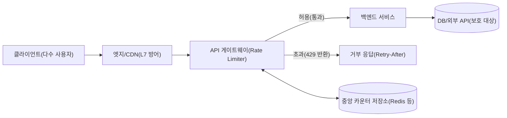
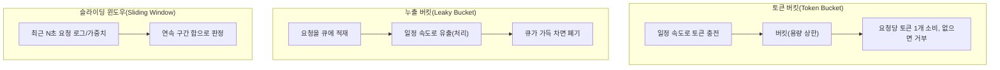

# 처리율 제한(Rate Limiting)과 트래픽 제어 알고리즘

## 1. 개요

### 가. 정의

> **처리율 제한(Rate Limiting)**은 특정 시간 창(window) 안에서 클라이언트·API·자원이 수행할 수 있는 요청의 수를 사전에 정의한 한도(quota)로 통제하여, 초과분을 지연·거부·완충함으로써 시스템의 안정성과 공정성을 확보하는 트래픽 제어 기법이다.

처리율 제한은 "얼마나 빨리, 얼마나 많이" 요청을 허용할 것인가를 결정하는 흐름 제어 정책이다.
네트워크 계층의 혼잡 제어가 종단 간 전송 속도를 조절하는 것과 달리, 처리율 제한은 주로 애플리케이션·API 계층에서 개별 호출자를 식별하여 그 호출자의 요청 빈도를 규율한다는 점에서 관심사가 다르다.
즉 대상은 패킷이 아니라 논리적 요청(HTTP 요청, RPC 호출, 메시지)이며, 식별 기준은 IP·API 키·사용자 계정·테넌트처럼 비즈니스적으로 의미 있는 주체다.

처리율 제한은 종종 "쓰로틀링(Throttling)"과 혼용되지만 결이 다르다.
넓게 보면 처리율 제한은 한도 초과 여부를 판정하는 정책이고, 쓰로틀링은 초과가 확인되었을 때 요청을 어떻게 처리(거부·지연·큐잉)할지에 대한 실행 방식이다.
따라서 잘 설계된 시스템은 "한도 정의(Rate Limiting)"와 "초과 시 동작(Throttling)"을 분리해 설계하고, 초과 응답으로는 HTTP `429 Too Many Requests`와 `Retry-After` 헤더를 반환하는 것이 사실상의 표준으로 자리 잡았다.

### 나. 등장 배경과 필요성

현대 서비스는 공개 API, 오픈뱅킹, 마이데이터, 생성형 AI API처럼 외부에 인터페이스를 노출하는 형태로 진화했다.
인터페이스가 열리는 순간 서비스는 선의의 대량 호출과 악의의 남용을 동시에 마주한다.
예를 들어 잘못 구현된 클라이언트가 재시도 루프에 빠져 초당 수천 건을 호출하거나, 크리덴셜 스터핑 공격이 로그인 API를 초당 수만 건으로 두드리면, 정상 사용자까지 영향을 받는 서비스 저하가 발생한다.
처리율 제한은 이러한 상황에서 "한 명의 과도한 사용자가 전체 자원을 독점하지 못하도록" 격벽을 세우는 최소한의 방어선이다.

두 번째 필요성은 비용과 자원의 유한성에 있다.
클라우드 환경에서 오토스케일링이 부하를 흡수해 준다고 해도 스케일링에는 지연과 비용이 따른다.
특히 생성형 AI 추론이나 결제·정산처럼 호출당 비용이 큰 백엔드는 무한정 확장할 수 없으므로, 요청 유입 단계에서 상한을 두어 다운스트림을 보호해야 한다.
이때 처리율 제한은 서킷 브레이커·벌크헤드와 함께 "부하 제거(Load Shedding)"를 구현하는 핵심 수단이 된다.

세 번째 필요성은 공정성과 수익화다.
SaaS·API 비즈니스는 Free·Pro·Enterprise처럼 요금제별로 서로 다른 호출 한도를 부여함으로써 서비스 등급을 차등화한다.
예컨대 한 상용 LLM API는 요금 등급에 따라 분당 요청 수(RPM)와 분당 토큰 수(TPM)를 함께 제한하는데, 이는 처리율 제한이 단순 방어를 넘어 과금·SLA·상품 설계의 축이 되었음을 보여준다.

### 다. 적용 목표

적용 목표는 첫째 가용성 보호(폭주·DDoS·재시도 폭풍으로부터 백엔드 방어), 둘째 공정한 자원 분배(테넌트·사용자 간 격리), 셋째 비용 통제(다운스트림 호출량 상한), 넷째 수익화·SLA 이행(등급별 차등 한도), 다섯째 남용·이상행위 탐지의 1차 신호 제공이다.
이 다섯 목표는 서로 상충할 수 있으므로, 뒤에서 다룰 알고리즘 선택과 분산 구현 방식은 어떤 목표에 우선순위를 두느냐에 따라 달라진다.

## 2. 전체 구조와 배치 위치

처리율 제한기는 요청 경로 어디에 배치하느냐에 따라 정확도·성능·운영 복잡도가 달라진다.
아래 개념도는 클라이언트에서 백엔드에 이르는 요청 경로 위에 처리율 제한이 어떤 지점에서 개입하는지를 보여준다.

가장 일반적인 배치는 **API 게이트웨이·리버스 프록시** 계층이다.
이 지점은 모든 요청이 반드시 통과하는 관문이므로, 인증 직후 호출자를 식별한 상태에서 한도를 적용하기 좋다.
게이트웨이는 여러 백엔드로 분기하기 전에 요청을 걸러내므로 다운스트림 전체를 한 번에 보호할 수 있다는 장점이 있다.
반면 각 백엔드가 가진 개별 자원 특성(예: 특정 무거운 엔드포인트)까지 세밀하게 반영하기는 어렵다는 한계가 있어, 게이트웨이의 전역 한도와 서비스 내부의 국지 한도를 계층적으로 조합하는 설계가 실무에서 자주 쓰인다.

두 번째 배치는 **애플리케이션 미들웨어** 계층이다.
서비스 코드 안에서 엔드포인트·기능 단위로 한도를 걸 수 있어, "결제 요청은 분당 5회, 조회는 분당 300회"처럼 도메인 특성에 맞춘 정밀한 제어가 가능하다.
다만 서비스 인스턴스가 여러 대로 확장되면 각 인스턴스의 로컬 카운터를 어떻게 합산할 것인가라는 분산 문제가 발생한다.

세 번째 배치는 **엣지/CDN** 계층이다.
CDN·WAF 수준에서 IP·지역·봇 시그널 기반으로 대량 트래픽을 조기에 차단하면, 오리진에 도달하기 전에 비용을 절감하고 계층적 방어(Defense in Depth)를 구성할 수 있다.
정확도는 낮지만 가장 저렴하고 빠른 1차 방어선 역할을 한다.

## 3. 처리율 제한 알고리즘

알고리즘은 "시간과 카운트를 어떻게 세느냐"에 따라 구분되며, 각각 정확도·버스트 허용·메모리·구현 난도의 트레이드오프가 다르다.
아래 세부 아키텍처도는 대표적인 네 가지 알고리즘의 동작 원리를 대비한다.

### 가. 토큰 버킷(Token Bucket)

토큰 버킷은 일정한 속도(refill rate)로 토큰이 버킷에 채워지고, 요청은 처리 시 토큰을 하나 소비하며, 토큰이 없으면 거부되는 방식이다.
버킷에는 최대 용량(capacity)이 있어 그 이상으로 토큰이 쌓이지 않는다.
이 구조의 핵심 미덕은 **버스트(순간 폭증) 허용**이다.
평소 요청이 적어 토큰이 용량만큼 쌓여 있으면, 갑자기 몰린 요청을 한꺼번에 처리할 수 있다.
예를 들어 용량 100, 충전 속도 초당 10개인 버킷은 평균적으로 초당 10건을 유지하되, 유휴 시간에 축적된 100개의 토큰으로 순간 100건까지 흡수한다.
따라서 사용자 체감이 중요한 대화형 API(검색·자동완성)에 적합하며, 실제로 다수의 API 게이트웨이와 클라우드 API가 기본 알고리즘으로 채택한다.
단점은 용량과 속도라는 두 파라미터를 함께 튜닝해야 하고, 버스트를 지나치게 허용하면 다운스트림이 순간 부하를 받을 수 있다는 점이다.

### 나. 누출 버킷(Leaky Bucket)

누출 버킷은 요청을 큐(버킷)에 담고 **일정한 속도로만 꺼내 처리(누출)**하며, 큐가 가득 차면 이후 요청을 폐기하는 방식이다.
토큰 버킷이 "허용량을 미리 적립"하는 발상이라면, 누출 버킷은 "출력 속도를 평탄하게 고정"하는 발상이다.
따라서 출력 트래픽이 매끄럽게 정형화(traffic shaping)되어, 뒤단이 일정한 처리율을 요구하는 경우(예: 초당 정해진 건수만 받는 외부 결제망, 메시지 브로커 소비자)에 유리하다.
반대로 버스트를 흡수하지 못하므로, 유휴 후 몰린 정상 요청도 큐 지연을 겪거나 폐기될 수 있어 대화형 서비스에는 덜 적합하다.
구현상 누출 버킷은 사실상 고정 용량 FIFO 큐 + 정속 소비자로 실현되며, 지연이 누적되면 응답 시간이 늘어나는 트레이드오프가 있다.

### 다. 고정 윈도우 카운터(Fixed Window Counter)

고정 윈도우는 "매 분 0초~59초"처럼 경계가 고정된 시간 창마다 카운터를 두고, 창이 바뀌면 0으로 초기화하는 가장 단순한 방식이다.
메모리는 카운터 하나로 충분해 극히 가볍고 구현이 쉽다.
그러나 **경계 폭주(boundary burst)** 라는 치명적 약점이 있다.
한도가 분당 100건일 때, 어떤 사용자가 12:00:59에 100건, 12:01:00에 다시 100건을 보내면 1초 남짓한 구간에 200건이 통과한다.
즉 창의 경계에서 순간적으로 한도의 2배까지 허용될 수 있어, 엄밀한 상한이 필요한 결제·인증 같은 민감 엔드포인트에는 부적합하다.

### 라. 슬라이딩 윈도우(Sliding Window)

슬라이딩 윈도우는 고정 윈도우의 경계 문제를 해결하기 위해 "현재 시각 기준 최근 N초"를 연속적으로 평가한다.
정밀한 형태인 **슬라이딩 윈도우 로그**는 각 요청의 타임스탬프를 저장하고, 판정 시 최근 N초에 속한 로그 수를 센다.
정확하지만 요청마다 타임스탬프를 보관해야 하므로 메모리 소모가 크다.
실무에서 널리 쓰이는 절충안인 **슬라이딩 윈도우 카운터**는 현재 창과 직전 창의 카운터를 가중 평균하여 근사한다.
예컨대 현재 창 경과 비율이 30%라면 `직전창_카운트 × 0.7 + 현재창_카운트`로 추정하며, 메모리는 카운터 두 개로 유지하면서 경계 폭주를 크게 완화한다.
정확도와 자원의 균형이 좋아, 대규모 트래픽을 다루는 CDN·API 게이트웨이가 즐겨 채택한다.

아래 표는 네 알고리즘의 특성을 비교한다.
표는 요약을 돕기 위한 것이며, 선택의 근거는 위 산문의 트레이드오프 설명에 있다.

| 알고리즘 | 버스트 허용 | 정확도 | 메모리 | 대표 용도 |
|---|---|---|---|---|
| 토큰 버킷 | 높음(적립분) | 중 | 낮음 | 대화형 API, 게이트웨이 기본값 |
| 누출 버킷 | 낮음(평탄화) | 중 | 중 | 트래픽 셰이핑, 정속 소비 |
| 고정 윈도우 | 경계서 과다 | 낮음 | 매우 낮음 | 단순·저위험 제한 |
| 슬라이딩 윈도우 | 낮음 | 높음 | 중 | 정밀 제한, 대규모 API |

## 4. 분산 환경에서의 구현

서비스 인스턴스가 수십 대로 확장되면 "한도는 전역인데 카운터는 분산된다"는 근본 문제가 생긴다.
각 인스턴스가 로컬 카운터만 쓰면 인스턴스 수만큼 한도가 부풀려지고, 반대로 매 요청을 중앙 저장소에 물으면 지연과 부하가 커진다.
따라서 분산 처리율 제한은 정확도와 성능 사이의 절충 설계다.

가장 보편적인 구현은 **중앙 저장소(Redis)** 에 카운터를 두는 방식이다.
Redis의 원자적 명령(`INCR`, `EXPIRE`)이나 Lua 스크립트로 "증가와 만료를 한 번에" 처리해 경합을 없애고, 여러 인스턴스가 동일한 키(예: `rate:user:1234:minute`)를 공유하여 전역 한도를 강제한다.
정확하지만 저장소가 단일 장애점이 될 수 있어, 저장소 장애 시 요청을 막을지(fail-closed) 통과시킬지(fail-open)를 정책으로 정해야 한다.
가용성이 최우선인 서비스는 흔히 fail-open을 택하되, 인증·결제처럼 남용 위험이 큰 경로는 fail-closed로 둔다.

성능이 중요하면 **로컬 근사 + 주기적 동기화** 를 쓴다.
각 인스턴스가 로컬에서 빠르게 판정하고, 배경에서 사용량을 중앙에 보고·조정하는 방식으로, 약간의 초과를 감수하는 대신 저지연을 얻는다.
정밀한 전역 상한이 필요 없고 대략적 보호로 충분한 경우에 적합하다.

여기서 유의할 실무 포인트는 처리율 제한 상태를 클라이언트에 투명하게 알리는 것이다.
`X-RateLimit-Limit`, `X-RateLimit-Remaining`, `X-RateLimit-Reset` 헤더로 잔여 한도를 노출하고, 초과 시 `429`와 `Retry-After`를 반환하면 클라이언트가 지수 백오프로 협조할 수 있어 재시도 폭풍을 예방한다.

## 5. 심화 — 표준화 동향과 실무 적용 사례

처리율 제한은 오랫동안 벤더별로 헤더 이름과 응답 형식이 제각각이어서 클라이언트 상호운용성이 낮았다.
이를 개선하기 위해 IETF는 처리율 제한 정보를 표준 헤더로 노출하는 규격(`RateLimit`/`RateLimit-Policy` 계열)을 표준화하는 작업을 진행해 왔으며, 세부 필드는 개정 중이므로 구현 시 최신 초안을 확인하는 것이 바람직하다.
표준화의 취지는 서로 다른 서비스가 동일한 형식으로 잔여 한도·재설정 시각을 알려, SDK와 게이트웨이가 일관되게 백오프를 수행하도록 만드는 데 있다.

실무 사례로는 첫째, 공개 API 플랫폼의 등급제 과금을 들 수 있다.
클라우드·SaaS 사업자는 요금제별로 초당·분당 호출 한도를 부여하고, 초과 시 429를 반환하거나 추가 과금(버스트 크레딧)으로 유연화한다.
둘째, 생성형 AI API는 요청 수 한도(RPM)와 토큰 수 한도(TPM)를 이중으로 적용한다.
동일한 요청 수라도 프롬프트 길이에 따라 실제 계산 비용이 크게 달라지므로, 자원 소비의 실제 단위(토큰)에 한도를 거는 것이 합리적이라는 점을 보여주는 사례다.
셋째, 로그인·OTP·비밀번호 재설정 같은 인증 엔드포인트는 IP·계정별로 촘촘한 슬라이딩 윈도우 제한을 걸어 크리덴셜 스터핑·무차별 대입을 늦추는데, 이는 처리율 제한이 보안 통제와 직접 맞닿는 지점이다.

향후 방향으로는 정적 한도에서 **적응형(adaptive) 처리율 제한**으로의 전환이 주목된다.
백엔드의 실시간 지연·에러율·큐 길이 같은 부하 신호를 관측하여 한도를 동적으로 조정하는 방식으로, 서킷 브레이커·부하 제거·오토스케일링과 결합해 시스템 스스로 안정 지점을 찾도록 한다.
정률의 고정 한도보다 자원 활용률을 높일 수 있으나, 제어 루프가 불안정하면 진동(oscillation)이 발생할 수 있어 관측성과 신중한 튜닝이 전제된다.

## 6. 고려사항 및 시사점

- **한도 대상과 키 설계의 정밀함**: IP 기준은 NAT·프록시 뒤 다수 사용자를 한 덩어리로 묶어 오탐을 유발하고, 사용자·API 키 기준은 인증 이후에만 가능하다. 따라서 미인증 구간은 IP·디바이스 지문으로, 인증 구간은 계정·테넌트 키로 계층화하고, 엔드포인트 민감도별(조회 vs 결제)로 서로 다른 한도를 두는 다차원 키 설계가 필요하다.
- **알고리즘·배치의 트레이드오프 정렬**: 버스트 허용이 필요한 대화형 트래픽은 토큰 버킷, 정속 처리가 필요한 다운스트림은 누출 버킷, 엄밀한 상한이 필요한 민감 API는 슬라이딩 윈도우가 적합하다. 전역 보호는 게이트웨이, 정밀 제어는 서비스 내부로 나누어 계층적으로 조합해야 한다.
- **장애 정책(fail-open vs fail-closed)의 명시**: 카운터 저장소 장애 시 무엇을 우선할지 미리 결정해야 한다. 가용성 우선 서비스는 fail-open, 남용·비용 위험이 큰 경로는 fail-closed로 두되, 두 경우 모두 알람과 폴백(로컬 근사 제한)을 함께 마련한다.
- **관측성과 남용 탐지 연계**: 429 발생률, 한도 근접 사용자, 키별 소비 분포를 지표화하면 용량 계획과 이상행위 탐지에 활용할 수 있다. 처리율 제한 로그는 SIEM·이상탐지의 유의미한 입력이 되며, 단순 방어를 넘어 보안·운영의 신호원으로 기능한다.
- **회복탄력성 패턴과의 결합**: 처리율 제한은 단독으로 완결되지 않는다. 서킷 브레이커(장애 전파 차단), 벌크헤드(자원 격리), 재시도·지수 백오프(협조적 재시도), 부하 제거(우선순위 낮은 요청 우선 폐기)와 함께 설계할 때 비로소 폭주와 장애에 견디는 시스템이 된다.

## 참고자료

- IETF, "RateLimit header fields for HTTP" (draft), https://datatracker.ietf.org/doc/draft-ietf-httpapi-ratelimit-headers/
- MDN Web Docs, "429 Too Many Requests", https://developer.mozilla.org/en-US/docs/Web/HTTP/Status/429
- Cloudflare, "What is rate limiting?", https://www.cloudflare.com/learning/bots/what-is-rate-limiting/

---
> **한 줄 요약**: 처리율 제한은 시간 창 내 요청 수를 한도로 통제하는 트래픽 제어 기법으로, 토큰 버킷·누출 버킷·고정/슬라이딩 윈도우 알고리즘을 상황에 맞게 선택하고 게이트웨이·중앙 저장소로 분산 구현하여 가용성·공정성·비용·보안을 동시에 확보한다.
