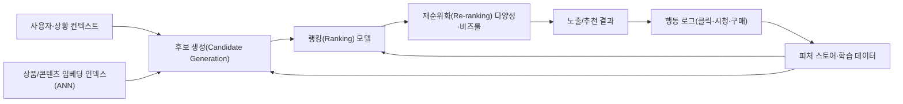
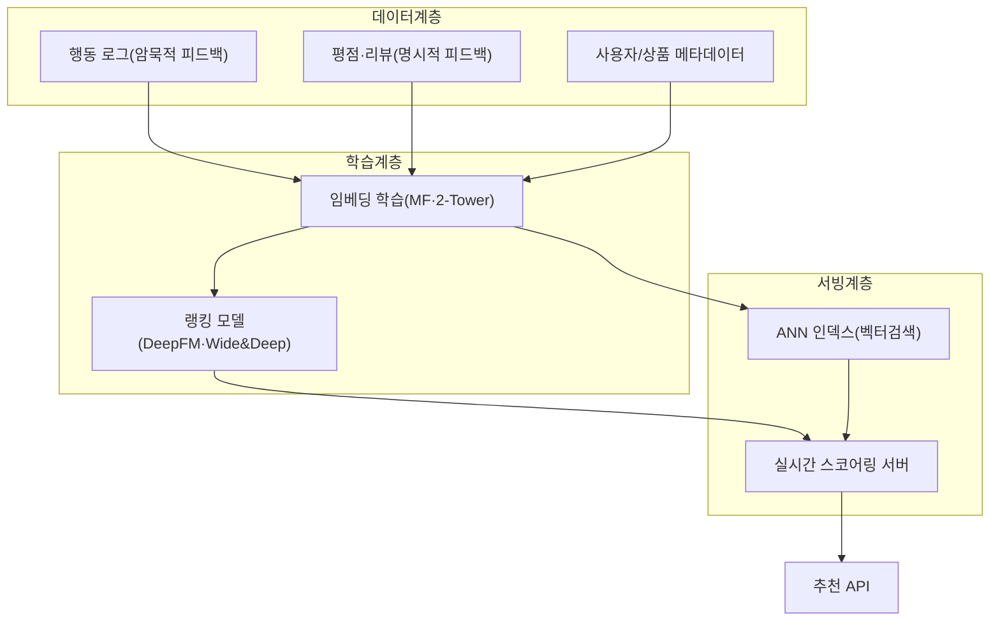

# 추천 시스템(Recommendation System)

## 1. 개요

> **정의**: 추천 시스템은 사용자·상품·상황에 관한 데이터를 학습해 특정 사용자가 아직 접하지 않은 항목 중 선호할 가능성이 높은 항목을 예측·순위화하여 제시하는 정보 필터링 시스템이다.

정보가 폭증하면서 사용자가 선택지를 일일이 탐색하는 비용은 감당하기 어려운 수준이 되었다. 수천만 개의 상품, 수억 개의 동영상, 무한히 갱신되는 게시물 앞에서 검색만으로는 "무엇을 원하는지 아직 모르는" 잠재 수요를 채울 수 없다. 추천 시스템은 이 **정보 과부하(Information Overload)** 문제를 사용자 대신 후보를 좁혀 주는 방식으로 해결하며, 오늘날 커머스·미디어·광고·금융의 핵심 수익 엔진이 되었다.

추천이 사업적으로 중요한 이유는 소비의 편중 구조에 있다. 오프라인 매장은 진열 공간의 제약으로 소수 인기 상품만 취급하지만, 온라인은 저장·유통 비용이 낮아 판매량이 적은 다수 상품(롱테일, Long Tail)의 합이 상당한 매출을 형성한다. 추천 시스템은 개인화를 통해 이 롱테일을 발굴하여 다양성과 매출을 동시에 끌어올린다. 실제로 Netflix는 시청의 상당 부분이 추천에서 비롯된다고 밝혀 왔고, Amazon 역시 매출의 큰 비중이 추천 기반 노출과 연관된다는 분석이 반복적으로 인용된다.

추천은 검색과 대비하면 성격이 더 분명해진다. 검색은 사용자가 질의(Query)로 의도를 명시적으로 표현하는 **풀(Pull)** 방식인 반면, 추천은 사용자가 명시적으로 요청하지 않아도 맥락과 이력으로 의도를 추정해 먼저 제시하는 **푸시(Push)** 방식이다. 따라서 추천은 "무엇을 원하는지 아직 모르는" 잠재 수요까지 겨냥하며, 질의가 없으므로 사용자의 과거 행동·상황(시간·기기·위치)이 사실상의 질의 역할을 대신한다.

기술사 관점에서 추천 시스템은 단순한 머신러닝 모델이 아니라 **데이터 수집(로그)–후보 생성–랭킹–노출–피드백**이 순환하는 하나의 정보 파이프라인이자 서비스 아키텍처다. 정확도만 높으면 되는 것이 아니라, 응답 지연(수십 ms), 신규 사용자·상품의 콜드 스타트, 필터 버블·공정성 같은 사회적 부작용, 개인정보 보호까지 함께 설계해야 한다는 점에서 종합적 판단이 요구된다.

## 2. 추천 시스템의 전체 구조와 파이프라인

추천 시스템을 하나의 알고리즘으로 이해하면 실무 설계가 어렵다. 현대의 대규모 추천은 정확도와 지연 시간을 절충하기 위해 **다단계(Multi-stage) 파이프라인**으로 구성된다. 수백만~수억 개의 전체 항목에서 곧바로 정교한 모델을 돌리면 지연과 비용을 감당할 수 없으므로, 값싼 모델로 후보를 크게 줄인 뒤 점점 정교한 모델로 좁혀 간다.

**후보 생성(Candidate Generation)** 단계는 전체 카탈로그에서 수백~수천 개의 후보를 빠르게 추린다. 협업 필터링, 임베딩 기반 최근접 이웃 탐색(ANN, Approximate Nearest Neighbor) 등이 쓰이며, 정확도보다 재현율(Recall)과 속도가 중요하다. **랭킹(Ranking)** 단계는 이 후보에 대해 사용자별 클릭·전환 확률을 정밀 예측하여 순위를 매기며, 딥러닝 기반 CTR 예측 모델이 주로 사용된다. **재순위화(Re-ranking)** 단계는 순위 상위군에 다양성·신선도·중복 제거·비즈니스 규칙(품절 제외, 광고 삽입, 공정 노출)을 적용한다.

이 파이프라인이 닫힌 고리를 이루는 지점이 **피드백 루프**다. 노출된 결과에 대한 사용자 행동(클릭·체류·구매·이탈)이 다시 로그로 쌓여 다음 학습의 정답 신호가 된다. 이 순환은 개인화를 강화하지만, 시스템이 이미 노출한 항목에만 피드백이 쌓이는 **노출 편향(Exposure Bias)**을 낳아 필터 버블과 인기 편중을 심화시킬 수 있으므로, 탐색(Exploration)을 의도적으로 섞는 설계가 필요하다.

아래는 추천 파이프라인을 지탱하는 데이터·모델 관점의 아키텍처를 정리한 것이다.

운영 관점에서는 학습·서빙의 시간 축도 설계 대상이다. 임베딩·랭킹 모델의 무거운 학습은 배치(일/시간 단위)로 갱신하되, 방금 본 상품·검색어·장바구니 같은 즉각적 신호는 실시간 피처로 반영해야 추천이 상황에 민감하게 반응한다. 이 때문에 배치와 스트리밍을 함께 쓰는 람다/카파형 데이터 흐름과 온라인 피처 스토어가 추천 인프라의 핵심 구성요소가 된다.

데이터 계층에서 가장 중요한 구분은 **명시적 피드백(Explicit Feedback)**과 **암묵적 피드백(Implicit Feedback)**이다. 별점·리뷰처럼 사용자가 직접 표현한 명시적 신호는 정확하지만 희소하고, 클릭·시청 시간·장바구니 담기 같은 암묵적 신호는 풍부하지만 노이즈가 크고 "부정(비선호)" 신호가 명확하지 않다. 실무에서는 데이터 양이 압도적인 암묵적 피드백을 주로 활용하되, 미노출을 곧 비선호로 단정하지 않도록 가중치·샘플링을 신중히 설계한다.

## 3. 추천 방식의 유형

### 가. 콘텐츠 기반 필터링(Content-based Filtering)

콘텐츠 기반 필터링은 사용자가 과거에 선호한 항목의 **속성(특징)**과 유사한 항목을 추천한다. 예컨대 사용자가 "SF·크리스토퍼 놀란·2시간 이상" 영화를 즐겨 봤다면, 같은 특징 벡터에 가까운 다른 영화를 추천하는 식이다. 항목을 TF-IDF나 임베딩으로 벡터화하고, 사용자 프로파일 벡터와의 코사인 유사도로 순위를 매긴다.

이 방식의 강점은 다른 사용자의 데이터가 없어도 동작한다는 점이다. 따라서 신규 항목이 들어와도 속성만 있으면 즉시 추천 대상이 될 수 있어 **항목 콜드 스타트**에 강하다. 또한 "왜 추천되었는지"를 속성으로 설명하기 쉬워 설명가능성이 높다.

한계는 명확하다. 사용자가 소비하던 속성 범위를 벗어나기 어려워 추천이 좁아지는 **과전문화(Over-specialization)**가 발생하고, 뜻밖의 발견(Serendipity)이 부족하다. 또한 속성 추출 품질에 성능이 크게 좌우되어, 이미지·영상처럼 속성 태깅이 어려운 도메인에서는 별도의 표현학습이 필요하다. 뉴스 추천에서 특정 정치 성향 기사만 계속 노출되는 현상이 대표적 부작용이다.

한 가지 유의할 점은 콘텐츠 기반 방식이 "사용자 콜드 스타트"까지 해결하지는 못한다는 것이다. 신규 항목은 속성만 있으면 추천 후보가 되지만, 신규 사용자는 선호 속성을 알 수 있는 이력이 아직 없어 프로파일을 만들 수 없다. 따라서 온보딩 설문으로 초기 취향을 수집하거나 인기·트렌드 기반의 기본 추천으로 시작한 뒤, 상호작용이 쌓이면 개인 프로파일로 전환하는 단계적 설계가 병행되어야 한다.

### 나. 협업 필터링(Collaborative Filtering)

협업 필터링은 항목의 속성이 아니라 **사용자–항목 상호작용 행렬(평점/클릭)** 자체의 패턴을 이용한다. "나와 취향이 비슷한 사람들이 좋아한 것을 나도 좋아할 것"이라는 집단 지성 가정에 기반하며, 도메인 속성을 몰라도 되는 범용성이 최대 강점이다.

메모리 기반 방식은 다시 **사용자 기반(User-based)**과 **항목 기반(Item-based)**으로 나뉜다. 사용자 기반은 나와 유사한 이웃 사용자를 찾아 그들이 높게 평가한 항목을 추천하고, 항목 기반은 내가 좋아한 항목과 함께 소비되는 항목을 추천한다. Amazon이 대규모 서비스에서 항목 기반을 채택한 이유는, 사용자 수보다 상품 수의 변동이 적어 유사도 행렬을 미리 계산해 두기 쉽고 확장성이 좋기 때문이다.

유사도 계산에는 코사인 유사도, 피어슨 상관계수, 자카드 계수 등이 쓰이는데, 어떤 척도를 선택하느냐가 결과를 좌우한다. 평점처럼 사용자마다 후하거나 박한 성향 차이(평점 편향)가 있는 데이터에서는 사용자 평균을 보정하는 피어슨 상관이 유리하고, 클릭·구매 같은 이진 상호작용에서는 자카드·코사인이 적합하다. 이처럼 데이터의 성질과 척도의 가정이 맞아야 이웃이 실제로 "취향이 닮은" 대상이 된다는 점이 메모리 기반 방식의 핵심 설계 포인트다.

모델 기반 방식의 대표는 **행렬 분해(Matrix Factorization, MF)**다. 희소한 사용자–항목 행렬 R(m×n)을 사용자 잠재요인 행렬 P(m×k)와 항목 잠재요인 행렬 Q(n×k)의 곱으로 근사하여, 관측되지 않은 칸의 값을 예측한다. 예측 평점은 두 잠재벡터의 내적 r̂ = pᵤ · qᵢ 로 계산하며, k(잠재요인 수)는 보통 수십~수백 차원이다. 2006~2009년 Netflix Prize에서 MF 계열 기법이 우승의 핵심이 되면서 이 접근이 산업 표준으로 자리 잡았다.

행렬 분해의 학습은 관측된 상호작용에 대한 예측 오차 제곱합을 최소화하되, 과적합을 막기 위해 잠재벡터 크기에 페널티를 주는 **정규화(L2)** 항을 함께 둔다. 최적화에는 오차를 조금씩 역전파하는 확률적 경사하강법(SGD)과, P와 Q를 번갈아 고정해 닫힌 해로 갱신하는 교대최소제곱(ALS)이 쓰이며, ALS는 병렬화가 쉬워 분산 환경의 대규모 암묵적 피드백 데이터에 적합하다. 여기에 사용자·항목별 평점 성향을 흡수하는 편향(bias) 항과 시간 변화를 반영하는 항을 더하면 예측 품질이 개선되는데, 이는 잠재요인만으로 설명되지 않는 체계적 편차를 분리해 주기 때문이다.

다만 협업 필터링은 상호작용 이력이 없는 신규 사용자·항목을 다룰 수 없는 **콜드 스타트**와, 인기 항목에 쏠리는 편중, 극단적 희소성 문제를 안고 있다. 실제 상호작용 행렬은 채워진 칸이 전체의 1%에도 못 미치는 경우가 흔해, 희소성이 심할수록 이웃·잠재요인 추정의 신뢰도가 급격히 떨어진다는 점을 설계에서 항상 감안해야 한다.

### 다. 하이브리드(Hybrid) 및 딥러닝 기반

콘텐츠 기반과 협업 필터링은 서로의 약점을 보완하므로, 실제 서비스는 대부분 두 방식을 결합한 **하이브리드**로 구성된다. 결합 방식에는 두 모델 점수를 가중합하는 가중형, 상황에 따라 모델을 바꾸는 전환형, 한 모델의 출력을 다른 모델 입력으로 쓰는 특징결합형 등이 있다. 예를 들어 신규 사용자에게는 콘텐츠 기반·인기 기반으로 시작하고, 상호작용이 쌓이면 협업 필터링 비중을 높이는 전환 전략이 콜드 스타트 완화에 효과적이다.

딥러닝이 협업 필터링을 넘어선 근본 이유는 표현력에 있다. 행렬 분해는 사용자·항목 잠재벡터의 선형 내적으로만 상호작용을 설명하지만, 실제 선호는 "20대 + 주말 + 모바일 + 특정 장르"처럼 여러 특징이 비선형으로 결합될 때 형성된다. 신경망은 이런 고차 특징 상호작용과 텍스트·이미지 같은 비정형 콘텐츠, 행동 순서까지 하나의 표현으로 학습할 수 있어, 정확도와 콜드 스타트 대응을 동시에 끌어올린다.

최근에는 딥러닝이 주류가 되었다. **2-Tower(Two-Tower) 모델**은 사용자 타워와 항목 타워를 각각 임베딩으로 학습하고 그 내적으로 관련도를 계산하여, 항목 임베딩을 미리 ANN 인덱스에 넣어 두면 대규모 후보 생성을 수십 ms에 처리할 수 있다. 랭킹 단계에서는 Wide&Deep, DeepFM처럼 저차·고차 특징 상호작용을 함께 학습하는 CTR 예측 모델이 널리 쓰인다. 사용자 행동을 시퀀스로 보고 트랜스포머로 다음 소비를 예측하는 **순차 추천(Sequential Recommendation, 예: SASRec·BERT4Rec)**, 사용자–항목 관계를 그래프로 모델링하는 **그래프 신경망(GNN) 추천**도 활발하다. 나아가 LLM을 활용해 상품 설명·리뷰의 의미를 반영하거나 자연어로 추천 이유를 생성하는 생성형 추천이 새 흐름으로 부상하고 있다.

다음 표는 세 방식의 핵심 차이를, 단순 나열이 아니라 강·약점이 생기는 근본 이유와 함께 정리한 것이다.

| 구분 | 근거 데이터 | 콜드 스타트 | 강점(이유) | 약점(이유) |
|------|------------|------------|-----------|-----------|
| 콘텐츠 기반 | 항목 속성 + 개인 이력 | 항목에 강함 | 신규 항목 즉시 추천, 설명 용이(속성 기반) | 과전문화·발견성 부족(이력 범위에 갇힘) |
| 협업 필터링 | 사용자–항목 상호작용 | 신규 사용자·항목에 취약 | 도메인 무관·뜻밖의 발견(집단 패턴) | 희소·콜드스타트·인기 편중(이력 의존) |
| 하이브리드/딥러닝 | 상호작용 + 속성 + 시퀀스 | 상대적으로 강함 | 정확도·확장성·개인화 극대화 | 복잡도·비용·해석 난이도 증가 |

## 4. 평가와 비교 — 정확도 그 이상

추천 시스템 평가는 두 축으로 이뤄진다. **오프라인 평가**는 과거 로그를 학습/검증으로 분할해 지표를 계산한다. 평점 예측에는 RMSE·MAE를, 순위 품질에는 Precision@K·Recall@K·MAP·NDCG(순위 위치에 가중치를 두는 지표)를 쓴다. 예를 들어 상위 5개 추천 중 실제 클릭이 2개면 Precision@5는 0.4다. 그러나 오프라인 지표가 높다고 실제 매출·만족이 오른다는 보장은 없어, **온라인 A/B 테스트**로 클릭률(CTR)·전환율(CVR)·체류시간·재방문 등 사업 지표를 반드시 검증한다. 오프라인에서 우수했던 모델이 온라인에서 열위인 경우가 드물지 않은데, 이는 노출 편향과 피드백 루프 때문에 과거 로그가 미래 노출 분포를 대표하지 못하기 때문이다.

특히 암묵적 피드백만 있는 서비스에서는 정답(비선호) 정의 자체가 모호하다는 점이 평가를 어렵게 한다. 노출되었으나 클릭하지 않은 항목을 "비선호"로 볼지, 단지 "아직 못 본 것"으로 볼지에 따라 학습·평가가 크게 달라진다. 그래서 실무에서는 순위 기반 지표(NDCG·MAP)와 함께, 노출 로그를 활용한 반사실적(counterfactual) 평가나 온라인 실험을 병행해 오프라인 지표의 착시를 보정한다.

정확도만 추구하면 오히려 서비스가 나빠질 수 있다는 점이 추천 평가의 핵심 통찰이다. 이미 살 것이 뻔한 상품만 추천하면 지표는 좋아도 사용자에게 새로운 가치를 주지 못한다. 그래서 **다양성(Diversity), 신선도(Novelty), 뜻밖의 발견(Serendipity), 커버리지(Coverage)**를 함께 관리한다. YouTube가 시청 시간 위주 최적화로 자극적·극단적 콘텐츠 편향 논란을 겪은 사례는, 단일 지표 최적화가 어떻게 사회적 부작용으로 이어지는지 보여 준다. 이후 업계는 "책임 있는 추천"을 위해 만족도 설문·다양성 제약·건강성 신호를 목적함수에 함께 반영하는 방향으로 이동했다.

## 5. 심화 — 최신 동향과 실무 적용

추천 기술은 세 갈래로 빠르게 진화하고 있다. 첫째, **생성형·대화형 추천**이다. LLM이 상품 리뷰·설명의 의미와 사용자의 자연어 요구("조용한 분위기의 가성비 노트북")를 이해하여 후보를 생성하고, 추천 이유를 문장으로 설명한다. 이는 콜드 스타트 완화와 설명가능성 향상에 유리하지만, 환각(존재하지 않는 상품 추천)과 지연·비용 문제를 통제해야 한다.

둘째, **프라이버시 보호 추천**이다. 개인 상호작용 데이터가 매우 민감해지면서, 원본 로그를 중앙에 모으지 않고 단말에서 학습하는 **연합학습(Federated Learning)**, 통계적 보호를 제공하는 **차분 프라이버시(Differential Privacy)**를 결합한 On-device 추천이 확산되고 있다. GDPR·개인정보보호법과 프로파일링 규제, 서드파티 쿠키 폐지 흐름이 이를 가속한다.

셋째, **편향·공정성 완화와 인과 추천**이다. 노출 편향을 보정하기 위해 성향 점수(IPS, Inverse Propensity Scoring) 기반 비편향 학습, 인기 편중을 줄이는 리랭킹, 판매자·창작자 간 노출 공정성을 보장하는 제약 최적화가 연구·적용되고 있다. 실무 사례로, Spotify의 "Discover Weekly"는 협업 필터링·오디오 콘텐츠 분석·자연어처리(플레이리스트·리뷰 텍스트)를 결합한 하이브리드로 매주 개인화 플레이리스트를 생성하여 발견성과 체류를 동시에 끌어올린 대표적 성공 사례로 꼽힌다. 한국의 네이버·카카오·쿠팡 등도 다단계 파이프라인 위에 딥러닝 랭킹과 실시간 피처 스토어를 결합해 커머스·콘텐츠 추천을 운영한다.

국내 공공·산업 현장에서도 추천은 확산되고 있다. 전자정부·공공포털의 맞춤형 서비스 안내, 도서관의 도서 추천, 교육 플랫폼의 학습경로 추천, 헬스케어의 콘텐츠 추천처럼 개인화가 이용자 편익을 크게 높이는 영역이 늘고 있다. 다만 공공 영역에서는 편향·차별 방지와 설명책임, 개인정보 최소 수집이 민간보다 엄격히 요구되므로, 정확도 극대화보다 공정성·투명성·안전성을 우선하는 목적함수 설계가 필요하다.

예상 출제 방향으로는 ▲협업 필터링과 콘텐츠 기반의 비교 및 하이브리드 설계 ▲콜드 스타트 해결 방안 ▲행렬 분해 원리와 딥러닝 추천으로의 발전 ▲필터 버블·공정성 등 추천의 사회적 이슈와 대응이 반복적으로 다뤄질 수 있다. 답안 구성 시에는 "정확도–다양성–공정성–프라이버시"의 트레이드오프를 축으로 잡고, 다단계 파이프라인 관점에서 서술하면 심화 답안으로 완성도가 높아진다.

## 6. 고려사항 및 시사점

- **콜드 스타트 전략의 이원화**: 신규 사용자에게는 인기·트렌드·온보딩 설문·콘텐츠 기반으로 시작하고, 신규 항목에는 메타데이터 임베딩과 소량 노출을 통한 탐색을 병행한다. 상호작용이 축적되는 시점을 기준으로 협업 필터링·딥러닝 비중을 점진 전환하는 하이브리드 설계가 실무 표준이다.

- **탐색–활용(Exploration–Exploitation) 균형**: 확실히 선호할 항목만 노출(활용)하면 필터 버블과 인기 편중이 심화되고 데이터 다양성이 고갈된다. 멀티암드 밴딧·ε-greedy·Thompson Sampling 등으로 일정 비율의 탐색을 섞어 장기 만족과 데이터 건강성을 확보해야 한다.

- **성능·비용·지연의 절충**: 실시간 추천은 수십 ms 내 응답이 요구되므로, 정교한 모델을 전량 적용하기보다 후보 생성–랭킹–재순위화의 다단계로 계산을 배분한다. 임베딩 사전계산·ANN 인덱스·피처 스토어·캐시로 지연과 인프라 비용을 함께 관리한다.

- **공정성·투명성·규제 대응**: 추천은 여론·소비·기회 분배에 영향을 미치므로, 노출 편향 보정, 창작자·판매자 공정 노출, 추천 이유 설명(설명가능성), 프로파일링 거부권 보장이 필요하다. 개인정보보호법·GDPR과 EU 디지털서비스법(DSA)의 추천 투명성 요구를 설계 단계부터 반영해야 한다.

- **연계 기술과의 통합**: 추천은 벡터 데이터베이스(ANN), 피처 스토어, MLOps/LLMOps, 실시간 스트리밍(CDC·Kafka), 데이터 거버넌스와 밀접하게 연결된다. 모델 드리프트 모니터링과 온라인 A/B 실험 체계를 갖춰야 지속적으로 품질을 유지할 수 있다.

## 참고자료

- Netflix TechBlog, "Netflix Recommendations: Beyond the 5 stars" — https://netflixtechblog.com/netflix-recommendations-beyond-the-5-stars-part-1-55838468f429
- Google Developers, "Recommendation Systems (ML Crash Course)" — https://developers.google.com/machine-learning/recommendation
- Covington et al., "Deep Neural Networks for YouTube Recommendations" (RecSys 2016) — https://research.google/pubs/pub45530/
- Wikipedia, "Recommender system" — https://en.wikipedia.org/wiki/Recommender_system

---

> **한 줄 요약**: 추천 시스템은 정보 과부하 속에서 사용자가 선호할 항목을 예측·순위화하는 정보 필터링 시스템으로, 콘텐츠 기반·협업 필터링·하이브리드(딥러닝)를 후보생성–랭킹–재순위화의 다단계 파이프라인으로 결합하며, 정확도뿐 아니라 다양성·공정성·프라이버시·지연까지 함께 설계해야 한다.
