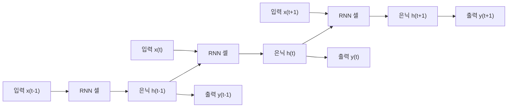
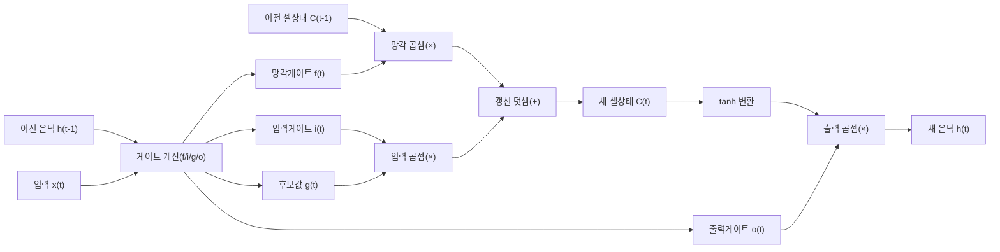

# 순환 신경망(RNN)과 LSTM·GRU

## 1. 개요

### 가. 정의

> **순환 신경망(RNN, Recurrent Neural Network)** 은 은닉 상태(Hidden State)를 시간 축을 따라 다음 시점으로 전달하는 **순환 연결(Recurrent Connection)** 을 두어, 가변 길이의 순차(Sequence) 데이터를 처리하도록 설계된 신경망이다. 즉 현재 출력이 현재 입력뿐 아니라 **과거 입력의 누적 요약(문맥)** 에 의존하도록 만든 구조다.

완전연결 신경망(FFNN)이나 합성곱 신경망(CNN)은 각 입력을 서로 독립적인 고정 크기 벡터로 간주한다. 그러나 언어·음성·주가·센서 로그처럼 **순서 자체가 의미를 규정하는 데이터**에서는 "지금까지 무엇이 있었는가"가 다음 값을 결정한다. "나는 밥을 ___"라는 문장에서 빈칸을 채우려면 앞선 단어들의 문맥이 필요하고, 심전도 파형의 이상 판정에는 직전 수 초의 리듬이 필요하다. RNN의 핵심 통찰은 "**시퀀스를 한 번에 보는 대신 한 시점씩 읽어 나가며, 그동안 본 것을 은닉 상태라는 메모리에 압축해 계속 갱신한다**"는 것이다. 이 은닉 상태가 곧 네트워크의 단기 기억(working memory) 역할을 한다.

### 나. 등장 배경과 필요성

FFNN·CNN을 순차 데이터에 적용할 때는 두 가지 근본적 한계가 드러난다. 첫째는 **가변 길이 처리의 어려움**이다. 문장은 3단어일 수도 300단어일 수도 있지만, 완전연결층은 고정 크기 입력만 받는다. 억지로 최대 길이에 맞춰 패딩하면 계산이 낭비되고, 잘라내면 정보가 소실된다. 둘째는 **파라미터 공유와 순서 정보의 부재**다. 입력을 단순히 이어 붙이면(concatenate) 같은 단어가 위치만 바뀌어도 완전히 다른 가중치로 처리되어, "패턴은 어디서 나타나든 동일하다"는 시계열의 본질을 학습하지 못한다.

RNN은 **모든 시점에서 동일한 가중치 집합을 재사용**함으로써 이 두 문제를 동시에 해결한다. 시점 수만큼 같은 셀을 반복 적용하므로 길이에 무관하게 하나의 파라미터 세트로 임의 길이 시퀀스를 처리할 수 있고, 시간에 따른 패턴을 위치와 무관하게 일반화한다. 이러한 특성 덕분에 RNN 계열은 2010년대 초·중반 기계번역·음성인식·필기인식의 사실상 표준이 되었으며, 현재의 트랜스포머(Transformer)가 등장하기 전까지 순차 모델링의 주류를 이뤘다. 트랜스포머 시대에도 온디바이스 음성인식, 실시간 스트리밍 처리, 저지연 임베디드 추론 등 **상태를 순차적으로 유지해야 하는 영역**에서는 여전히 실무적 가치가 크다.

| 구분 | FFNN/CNN | 순환 신경망(RNN) |
|---|---|---|
| 입력 | 고정 크기, 독립 | 가변 길이 시퀀스, 시점 간 의존 |
| 메모리 | 없음(무상태) | 은닉 상태로 과거 문맥 유지 |
| 파라미터 | 층마다 별도 | 시점 간 공유(전개 시 반복) |
| 대표 과업 | 이미지 분류·회귀 | 번역·음성인식·시계열 예측 |
| 대표 한계 | 순서 표현 불가 | 장기 의존성·기울기 소실 |

## 2. 전체 구조와 동작 원리

RNN은 하나의 셀을 시간 축으로 "펼쳐(unfold)" 보면 이해가 쉽다. 아래 그림은 은닉 상태 $h_t$가 이전 시점 $h_{t-1}$과 현재 입력 $x_t$로부터 계산되어 다음 시점으로 전달되는 순환 구조와, 이를 시간축으로 전개한 모습을 함께 나타낸다.

활성함수로 시그모이드 대신 $\tanh$를 쓰는 이유도 이 구조에서 비롯된다. $\tanh$는 출력이 $[-1, 1]$로 0을 중심으로 대칭이어서 은닉 상태의 값이 한쪽으로 치우쳐 포화되는 것을 늦추고, 시그모이드보다 기울기가 커 학습 신호가 상대적으로 잘 전파된다. 그럼에도 반복 곱 구조 자체가 소실을 유발하므로 근본 해법은 되지 못한다.

기본(Vanilla) RNN의 순전파는 다음 점화식으로 정의된다. 은닉 상태는 $h_t = \tanh(W_{xh} x_t + W_{hh} h_{t-1} + b_h)$로 갱신되고, 출력은 $y_t = W_{hy} h_t + b_y$로 산출된다. 여기서 핵심은 **가중치 $W_{xh}, W_{hh}, W_{hy}$가 모든 시점에서 공유**된다는 점이다. 은닉 상태 $h_t$는 시점 $t$까지 관측한 입력의 비선형 요약이며, 이 요약이 다음 셀로 재귀적으로 흘러가면서 문맥이 축적된다.

학습은 **시간에 따른 역전파(BPTT, Backpropagation Through Time)** 로 이뤄진다. 시퀀스를 시간축으로 전개하면 매우 깊은 피드포워드 네트워크와 동형이 되므로, 손실의 기울기를 마지막 시점부터 첫 시점까지 시간을 거슬러 전파하며 공유 가중치의 그래디언트를 각 시점의 기여분으로 누적한다. 긴 시퀀스에서는 전개 깊이가 커져 계산·메모리 부담이 크므로, 실무에서는 일정 길이마다 끊어 역전파하는 **절단 BPTT(Truncated BPTT)** 를 사용한다.

### 가. 기울기 소실·폭발 문제

기본 RNN의 치명적 약점은 **장기 의존성(Long-Term Dependency) 학습 실패**다. BPTT에서 기울기는 시간축을 거슬러 갈 때마다 순환 가중치 $W_{hh}$와 활성함수 미분값이 반복 곱해진다. 이 곱의 스펙트럴 반경이 1보다 작으면 기울기가 지수적으로 0에 수렴(**기울기 소실, Vanishing Gradient**)해 먼 과거의 정보가 학습에 반영되지 못하고, 1보다 크면 지수적으로 발산(**기울기 폭발, Exploding Gradient**)해 학습이 불안정해진다.

실무적 함의는 명확하다. "그는 프랑스에서 자랐다 … (수십 단어) … 그래서 그는 유창한 ___를 구사한다"에서 빈칸(프랑스어)을 맞히려면 수십 시점 전의 정보를 기억해야 하는데, 기본 RNN은 대략 10시점을 넘으면 앞의 맥락을 사실상 잊어버린다. 기울기 폭발은 그래디언트 클리핑(Gradient Clipping)으로 비교적 쉽게 완화되지만, 기울기 소실은 구조 자체를 바꿔야 해결되며, 이것이 LSTM·GRU가 등장한 직접적 동기다.

### 나. 시퀀스 입출력 유형

RNN은 입력·출력 시퀀스의 대응 관계에 따라 여러 형태로 활용된다. **다대일(Many-to-One)** 은 문장 전체를 읽고 감성(긍정/부정) 하나를 출력하는 감성분석에, **일대다(One-to-Many)** 는 이미지 한 장으로 설명 문장을 생성하는 이미지 캡셔닝에, **다대다 동기형(Many-to-Many, 동일 길이)** 은 각 단어에 품사를 붙이는 개체명 인식에 쓰인다. 특히 입력을 먼저 모두 읽어 문맥 벡터로 압축한 뒤 출력 시퀀스를 생성하는 **인코더-디코더(Seq2Seq)** 구조는 기계번역의 기반이 되었고, 여기에 어텐션(Attention)이 더해지며 트랜스포머로 발전하는 가교가 되었다.

이러한 유형 구분은 답안 작성 시 "**문제의 입출력이 몇 대 몇인가**"를 먼저 규정하고 그에 맞는 손실함수·디코딩 방식을 논하는 틀을 제공한다. 예컨대 다대일 분류는 마지막 시점 은닉 상태만 분류기에 연결하고 교차엔트로피로 학습하지만, Seq2Seq 생성은 매 시점 소프트맥스 출력을 이전 출력에 조건화(teacher forcing)해 학습하고 추론 시 빔 서치(Beam Search)로 디코딩한다. 동일한 RNN 셀이라도 과업 유형에 따라 학습·추론 파이프라인이 달라짐을 이해하는 것이 실무 설계의 출발점이다.

### 다. 심층 RNN과 양방향 RNN

표현력을 높이기 위해 은닉층을 수직으로 쌓은 **심층(Stacked) RNN** 은 하위 층이 저수준(음소·글자) 특징을, 상위 층이 고수준(단어·구문) 추상을 학습하도록 계층적 표현을 형성한다. 다만 층이 깊어질수록 학습 난이도와 연산량이 커지므로 잔차 연결·층 정규화가 함께 쓰인다. 한편 **양방향(Bidirectional) RNN** 은 순방향과 역방향 두 개의 RNN을 병렬로 두어 각 시점에서 과거와 미래 문맥을 동시에 활용한다. 개체명 인식·품사 태깅처럼 문장 전체가 이미 주어진 오프라인 과업에서는 정확도를 크게 높이지만, 미래 입력이 필요하므로 실시간 스트리밍 처리와는 구조적으로 상충한다는 트레이드오프가 있다.

## 3. LSTM과 GRU — 게이트 메커니즘

### 가. LSTM(Long Short-Term Memory)

LSTM은 기울기 소실을 해결하기 위해 **셀 상태(Cell State) $C_t$라는 별도의 정보 고속도로**와, 그 위에서 정보를 선택적으로 지우고·더하고·내보내는 **세 개의 게이트**를 도입한다. 게이트는 시그모이드(0~1)로 각 원소의 통과 비율을 결정하는 밸브다. 아래 그림은 한 LSTM 셀 내부의 데이터 흐름을 나타낸다.

동작 원리를 순서대로 보면 다음과 같다. 첫째, **망각 게이트(Forget Gate) $f_t = \sigma(W_f[h_{t-1}, x_t] + b_f)$** 는 이전 셀 상태에서 무엇을 버릴지 결정한다. 예컨대 문장에서 주어의 성별이 새 주어로 바뀌면, 이전 성별 정보를 잊는다. 둘째, **입력 게이트(Input Gate) $i_t$** 와 tanh로 만든 **후보값 $\tilde{C}_t$** 가 결합해 새로 기억할 정보를 정하고, 셀 상태는 $C_t = f_t \odot C_{t-1} + i_t \odot \tilde{C}_t$로 갱신된다. 셋째, **출력 게이트(Output Gate) $o_t$** 가 갱신된 셀 상태 중 이번 시점에 내보낼 부분을 골라 $h_t = o_t \odot \tanh(C_t)$로 은닉 상태를 만든다.

LSTM에는 게이트 계산에 셀 상태를 직접 참조시키는 핍홀(Peephole) 연결, 망각·입력 게이트를 하나로 묶는 결합형(coupled) 변형 등 여러 변종이 있으나, 실무에서는 표준 3게이트 구조가 안정성과 성능의 균형이 가장 좋아 기본값으로 쓰인다.

LSTM이 장기 의존성을 학습할 수 있는 결정적 이유는 셀 상태 갱신식이 **곱셈이 아니라 덧셈($+$) 중심**이기 때문이다. 셀 상태를 따라 기울기가 흐를 때 망각 게이트가 1에 가까우면 그래디언트가 거의 감쇠 없이 전파되어, 수백 시점 전 정보까지 학습 신호가 도달한다. 이 "상수 오차 회전(Constant Error Carousel)" 구조가 기울기 소실을 근본적으로 완화한다. 실제로 구글은 2016년 GNMT(Google Neural Machine Translation)에 8층 LSTM 인코더·디코더를 적용해 번역 오류를 이전 통계기반(PBMT) 대비 약 60% 낮췄다고 보고했다.

### 나. GRU(Gated Recurrent Unit)

GRU는 2014년 조경현 교수 등이 제안한 LSTM의 경량화 변형으로, **셀 상태와 은닉 상태를 하나로 통합**하고 게이트를 **리셋 게이트(Reset Gate) $r_t$** 와 **업데이트 게이트(Update Gate) $z_t$** 두 개로 줄였다. 업데이트 게이트는 LSTM의 망각+입력 게이트 역할을 하나로 합쳐 "이전 상태를 얼마나 유지하고 새 후보로 얼마나 대체할지"를 $h_t = (1-z_t)\odot h_{t-1} + z_t \odot \tilde{h}_t$로 한 번에 조절한다. 리셋 게이트는 후보 상태를 계산할 때 과거를 얼마나 무시할지 정한다.

한 예로 은닉 차원이 512인 층에서 LSTM은 게이트 4개분의 가중치를 학습하지만 GRU는 3개분만 학습하므로, 층당 파라미터가 대략 4:3의 비율로 줄어든다. 이 차이는 층을 여러 겹 쌓거나 모바일·임베디드에 배포할 때 메모리·전력 예산에 직접적인 영향을 준다.

게이트가 하나 적고 셀 상태가 없어 **파라미터가 약 25% 적고 학습이 빠르며 데이터가 적을 때 과적합에 유리**하다. 반면 표현력은 이론적으로 LSTM보다 약간 제한적이라, 매우 길고 복잡한 의존성에서는 LSTM이 근소하게 앞서는 경향이 있다. 실무에서는 "**데이터·연산이 넉넉하면 LSTM, 가볍고 빠른 학습이 필요하면 GRU**"를 우선 시도하되, 두 모델의 성능 차이가 과업에 따라 뒤바뀌므로 검증셋으로 실측해 선택하는 것이 정석이다.

| 구분 | Vanilla RNN | LSTM | GRU |
|---|---|---|---|
| 게이트 수 | 없음 | 3개(망각·입력·출력) | 2개(리셋·업데이트) |
| 상태 | 은닉 $h_t$ | 셀 $C_t$ + 은닉 $h_t$ | 은닉 $h_t$ 통합 |
| 장기 의존성 | 취약(소실) | 강함 | 강함 |
| 파라미터·연산 | 최소 | 최대 | 중간(LSTM보다 적음) |
| 적합 상황 | 짧은 시퀀스 | 길고 복잡한 의존성 | 데이터·자원 제약, 빠른 학습 |

## 4. 비교와 적용 사례

RNN 계열의 실무적 위치는 트랜스포머와의 대비에서 뚜렷해진다. 트랜스포머는 자기어텐션(Self-Attention)으로 시퀀스 내 모든 토큰 쌍을 한 번에 병렬 비교하므로, GPU에서의 학습 병렬성과 초장기 의존성 포착에서 RNN을 압도한다. 이 때문에 대규모 언어모델(LLM)·기계번역·문서 이해는 사실상 트랜스포머로 재편되었다. 그러나 트랜스포머의 어텐션은 시퀀스 길이 $n$에 대해 $O(n^2)$의 연산·메모리를 요구하는 반면, RNN은 시점당 $O(1)$ 상태 갱신으로 **길이에 선형($O(n)$)** 이고 상태가 상수 크기라, 스트리밍·저지연·저전력 환경에서 구조적 이점을 가진다.

복잡도 차이를 수치로 가늠하면 선택 기준이 뚜렷해진다. 시퀀스 길이 $n=4{,}000$(예: 장문 로그)에서 어텐션은 대략 $n^2 = 1{,}600$만 회의 쌍대 비교를 요구하지만, RNN은 $n=4{,}000$회의 순차 상태 갱신으로 충분하다. 반대로 RNN의 순차성은 시점 간 의존 때문에 GPU 병렬화가 어려워 학습 속도가 느리다는 대가를 치른다. 즉 "**연산 총량은 RNN이 유리, 병렬 처리 속도는 트랜스포머가 유리**"라는 상반된 이점이 존재하며, 이 때문에 배치 학습은 트랜스포머로, 실시간 순차 추론은 RNN으로 나누어 쓰는 하이브리드 설계가 현실적 절충안이 된다.

구체적 산업 적용 사례를 보면 그 함의가 분명하다. 첫째, **실시간 음성인식**에서는 발화가 끝나기 전에 프레임 단위로 즉시 디코딩해야 하므로, 전체 시퀀스를 모아야 하는 어텐션보다 상태를 유지하며 순차 처리하는 LSTM/GRU가 온디바이스 스트리밍 STT에 여전히 활용된다. 둘째, **산업 설비 예지정비**에서는 진동·온도 센서의 시계열을 LSTM으로 학습해 정상 패턴에서의 이탈(이상)을 조기 탐지하는데, 수천 시점의 주기적 리듬을 기억해야 하므로 게이트 구조가 효과적이다. 셋째, **금융 시계열 예측**에서는 과거 수개월 주가·거래량 흐름을 GRU로 요약해 단기 방향성을 예측하며, 파라미터가 적어 상대적으로 작은 데이터셋에서도 과적합을 줄인다. 최근에는 이러한 선형 복잡도의 장점을 계승하면서 병렬 학습까지 가능하게 한 **상태공간모델(SSM) 계열(예: Mamba)** 이 트랜스포머의 대안으로 주목받으며, "순환 구조의 재부상"이라는 흐름을 만들고 있다.

## 5. 심화 — 최신 동향과 예상 출제 방향

RNN을 둘러싼 최신 흐름은 세 갈래로 요약된다. 첫째, **어텐션의 흡수**다. Seq2Seq+Attention(Bahdanau, 2014)이 인코더의 고정 문맥 벡터 병목을 해소하며 번역 성능을 끌어올렸고, 이 어텐션이 순환 구조를 완전히 대체한 결과가 트랜스포머(2017)다. 즉 RNN은 "어텐션이 왜 필요했는가"를 이해하는 서사의 출발점으로서 여전히 중요하며, 기술사 답안에서 "RNN의 한계 → 어텐션 → 트랜스포머"의 발전 맥락을 연결해 서술하면 깊이를 보일 수 있다.

둘째, **효율적 장기 시퀀스 모델의 재부상**이다. 트랜스포머의 $O(n^2)$ 비용이 초장문·초장기 시계열에서 병목이 되자, S4·Mamba 같은 선택적 상태공간모델과 RWKV·xLSTM 같은 "선형 어텐션형 순환" 아키텍처가 RNN의 선형 복잡도·상수 메모리 장점을 병렬 학습 가능성과 결합해 재조명되고 있다. 셋째, **엣지·임베디드 배포**다. TinyML 흐름에서 LSTM/GRU는 양자화·프루닝을 거쳐 MCU급 장치의 상시 음성 웨이크워드 탐지, 웨어러블 심박 이상 감지 등에 탑재된다.

응용 기법 측면에서는 입력과 출력의 정렬(alignment)이 불분명한 음성인식·필기인식을 위해 **CTC(Connectionist Temporal Classification)** 손실이 RNN과 함께 널리 쓰인다. CTC는 공백(blank) 토큰과 반복 병합 규칙으로 프레임-라벨 정렬을 명시적 주석 없이 학습하게 해, 발화 길이와 전사 길이가 다른 문제를 우아하게 해결한다. 이처럼 RNN은 단독으로보다 과업별 손실·디코딩 기법과 결합될 때 실무 성능을 낸다는 점을 답안에서 짚으면 응용력을 보일 수 있다.

예상 출제 방향으로는 ① 기울기 소실의 원인을 BPTT 수식과 함께 설명하고 LSTM 셀 상태가 이를 완화하는 원리(덧셈 갱신·CEC)를 논하라, ② LSTM과 GRU의 게이트 구조를 비교하고 선택 기준을 실무 관점에서 제시하라, ③ RNN과 트랜스포머의 계산 복잡도·병렬성·적용 영역을 비교하라 등이 자주 다뤄진다. 답안에서는 반드시 **수식·게이트 그림·복잡도 비교**를 곁들여 정량적으로 서술하는 것이 고득점 전략이다.

## 6. 고려사항 및 시사점

- **아키텍처 선택 전략**: 과업의 시퀀스 길이·지연 요구·데이터 규모를 기준으로 판단한다. 초장기 의존성·대규모 데이터·병렬 학습이 관건이면 트랜스포머, 실시간 스트리밍·저지연·저전력이면 LSTM/GRU, 자원·데이터가 매우 제약적이면 경량 GRU를 우선 검토한다. 단정적 우열보다 검증셋 실측으로 결정하는 것이 원칙이다.
- **학습 안정화 트레이드오프**: 기울기 폭발은 그래디언트 클리핑으로 억제하고, 소실은 게이트 구조·잔차 연결(Residual)·적절한 초기화로 완화한다. 양방향(Bidirectional) RNN은 문맥 정확도를 높이지만 전체 시퀀스가 필요해 실시간 처리와는 상충하므로, 온라인/오프라인 요건에 맞춰 선택해야 한다.
- **경량화·배포 전망**: 엣지 추론을 위해서는 양자화(INT8)·프루닝·지식 증류로 모델을 압축하되, 게이트의 시그모이드 연산 정밀도 저하가 장기 기억 성능에 미치는 영향을 검증해야 한다. TinyML·온디바이스 AI 확산으로 순환 모델의 저전력 이점은 재평가되는 추세다.
- **연계 기술과 거버넌스**: RNN 계열은 어텐션·트랜스포머·상태공간모델(Mamba)·CNN(하이브리드 CRNN)과 결합해 활용되며, 시계열 예측 결과를 의사결정에 쓸 때는 설명가능성(XAI)과 데이터 품질·드리프트 모니터링을 함께 갖춰야 신뢰할 수 있는 서비스가 된다. 특히 예측 실패가 안전·재무에 직결되는 도메인에서는 불확실성 정량화와 휴먼 인 더 루프 검증을 병행해야 한다.
- **데이터·전처리 관점**: 순차 모델의 성능은 시퀀스 길이 분포·정규화·결측 처리 같은 전처리 품질에 민감하다. 지나치게 긴 시퀀스는 절단 BPTT의 창 크기와 패딩 전략에 따라 학습 안정성이 달라지고, 시점 간 스케일 편차가 크면 특정 게이트가 조기 포화된다. 따라서 표준화·리샘플링·마스킹을 데이터 파이프라인에서 표준화해 두는 것이 재현성과 성능 안정성의 전제가 된다.

## 참고자료

- Hochreiter & Schmidhuber, "Long Short-Term Memory", Neural Computation, 1997. https://www.bioinf.jku.at/publications/older/2604.pdf
- Cho et al., "Learning Phrase Representations using RNN Encoder-Decoder (GRU)", 2014. https://arxiv.org/abs/1406.1078
- Vaswani et al., "Attention Is All You Need", 2017. https://arxiv.org/abs/1706.03762
- Gu & Dao, "Mamba: Linear-Time Sequence Modeling with Selective State Spaces", 2023. https://arxiv.org/abs/2312.00752

---

> **한 줄 요약**: RNN은 은닉 상태로 과거 문맥을 순환 전달해 가변 길이 시퀀스를 처리하는 신경망이며, 기울기 소실 한계를 게이트(셀 상태의 덧셈 갱신)로 극복한 LSTM·GRU가 장기 의존성 학습을 가능케 하고, 트랜스포머·상태공간모델과의 복잡도·지연 트레이드오프 속에서 스트리밍·엣지 영역에 여전히 유효하다.
