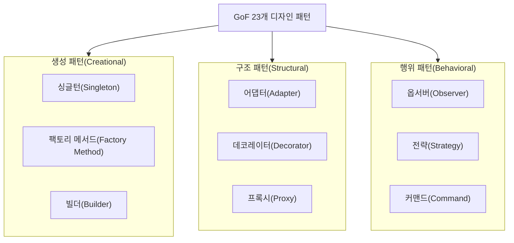
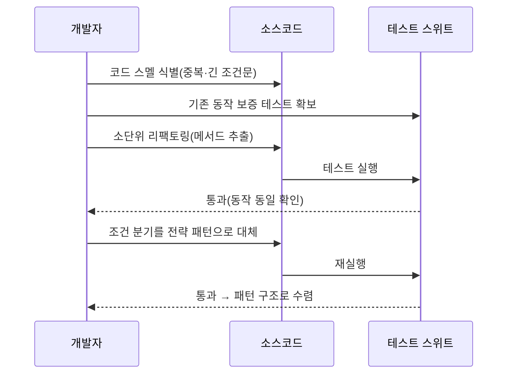

# 리팩토링(Refactoring)과 디자인 패턴(Design Pattern)

## 1. 개요

### 가. 정의
> **리팩토링(Refactoring)** 은 소프트웨어의 **외부 동작(기능)은 그대로 유지하면서 내부 구조를 개선**하여 이해와 수정을 쉽게 만드는 활동이고, **디자인 패턴(Design Pattern)** 은 자주 반복되는 설계 문제에 대한 **검증되고 재사용 가능한 해결 구조(설계 템플릿)** 이다.

두 기법의 관계를 이해하는 핵심은 '**리팩토링은 과정(process), 디자인 패턴은 목표(target)**'라는 점이다. 코드가 시간이 지나며 지저분해지고 이해·수정이 어려워질 때(즉 코드 스멜이 쌓일 때) 리팩토링으로 내부를 정리하는데, 이때 "어떤 구조로 개선할 것인가"의 방향을 제시하는 것이 디자인 패턴이다. 마틴 파울러(Martin Fowler)는 저서 『Refactoring』(1999, 2018년 2판)에서 리팩토링을 "관찰 가능한 동작을 바꾸지 않으면서 소프트웨어의 내부 구조를 변경해 이해하기 쉽고 수정 비용을 낮추는 것"으로 정의했는데, 여기서 "동작을 바꾸지 않는다"는 제약이 리팩토링과 일반적인 코드 수정(기능 추가·버그 수정)을 가르는 결정적 기준이다.

리팩토링을 하다 보면 코드는 자연스럽게 검증된 패턴 구조로 수렴하고, 반대로 패턴을 적용하는 행위 자체가 곧 리팩토링이 된다. 실제로 파울러의 책 후반부는 "패턴을 향한 리팩토링(Refactoring Toward Patterns)"이라는 관점을 담고 있고, 조슈아 케리에프스키(Joshua Kerievsky)의 『Refactoring to Patterns』(2004)는 이 접근을 체계화한 대표적 저술이다. 둘의 공통점은 소프트웨어 품질(유지보수성·유연성·재사용성)을 높인다는 것이고, 차이점은 리팩토링이 '**행위(개선 활동)**'인 반면 디자인 패턴은 '**산출물(해결 구조)**'이라는 데 있다.

### 나. 등장 배경 및 필요성
소프트웨어는 요구 변경으로 끊임없이 수정된다. 레만(Lehman)의 소프트웨어 진화 법칙이 지적하듯, 사용되는 소프트웨어는 계속 변경 압력을 받고 방치하면 구조가 부패(software entropy 증가)해 유지보수 비용이 기하급수적으로 증가한다. 새로운 기능 하나를 붙일 때마다 얽힌 의존성 때문에 예상치 못한 곳이 깨지고, 결국 "손대기 두려운 코드(레거시)"가 된다.

이러한 부패를 막기 위한 두 축이 리팩토링과 디자인 패턴이다. 리팩토링은 부패한 코드를 점진적으로 정돈해 변경 비용을 낮게 유지하는 예방적·지속적 활동이고, 디자인 패턴은 애초에 변경에 강한 구조를 설계하거나 리팩토링의 지향점을 제공하는 어휘(vocabulary)다. 특히 애자일·DevOps 환경에서는 짧은 주기로 릴리스를 반복하므로, 코드 건강을 상시 유지하는 리팩토링이 지속적 통합(CI)과 결합해 필수 실천법으로 자리 잡았다.

## 2. 리팩토링의 원리와 절차

### 가. 안전한 리팩토링의 전제 — 테스트
리팩토링은 기능을 바꾸지 않는 것이 대전제이므로, "기능이 그대로임"을 어떻게 보장하느냐가 핵심이다. 이 보증 장치가 바로 **자동화된 테스트**다. 테스트가 없으면 구조를 고친 뒤 동작이 동일한지 확인할 방법이 없어, 리팩토링이 곧 잠재적 버그 주입이 된다. 따라서 파울러는 "리팩토링에 앞서 견고한 테스트를 갖추라"고 강조하며, 이 원칙은 TDD(Test-Driven Development)의 Red-Green-**Refactor** 사이클에 그대로 녹아 있다.

절차는 '**작은 단위로 코드를 고치고 → 테스트로 기능이 그대로인지 확인**'을 반복하는 것이다. 한 번에 크게 바꾸면 실패 시 원인 추적이 어렵고 위험이 커지므로, 메서드 추출 하나·이름 변경 하나처럼 **원자적(atomic) 단계**로 쪼개어 각 단계마다 테스트를 돌린다. 실패하면 직전 단계로 즉시 되돌릴 수 있어 안전성이 확보된다. 이 점에서 리팩토링은 버전 관리(형상관리)와 결합할 때 가장 효과적이다.

### 나. 리팩토링을 촉발하는 신호 — 코드 스멜(Code Smell)
리팩토링이 필요한 시점을 알려주는 징후가 **코드 스멜**이다. 이는 "고쳐야 할 냄새가 나는" 코드로, 그 자체가 버그는 아니지만 유지보수를 어렵게 만드는 구조적 문제다. 대표적으로 **중복 코드(Duplicated Code)**, **긴 메서드(Long Method)**, **큰 클래스(Large Class)**, **과도한 매개변수(Long Parameter List)**, **기능 산재(Shotgun Surgery, 하나를 고치려면 여러 곳을 함께 고쳐야 함)**, **기능 편애(Feature Envy, 다른 클래스의 데이터를 지나치게 참조)** 등이 있다.

스멜을 인지했다고 즉시 다 고치는 것은 아니다. 파울러가 제시한 실무 규칙은 "**세 번째 반복될 때 리팩토링하라(Rule of Three)**"로, 두 번까지는 감내하되 중복이 세 번째 나타나면 그때 정리하라는 절제된 접근이다. 이는 과도한 사전 추상화를 경계하는 실용주의로, 스멜의 존재만으로 무조건 손대기보다 변경이 실제로 잦은 부분에 리팩토링을 집중하라는 뜻이다.

### 다. 주요 리팩토링 기법
가장 빈번한 기법은 **메서드 추출(Extract Method/Function)** 로, 긴 메서드나 중복 로직을 의미 있는 이름의 별도 메서드로 뽑아낸다. 예컨대 여러 화면에서 중복된 세금 계산 로직(코드 스멜)을 `calculateTax()` 하나로 모으면, 세율이 바뀌어도 한 곳만 고치면 된다. 이 밖에 **이름 변경(Rename)** 으로 의도를 드러내고, **클래스 추출/분리(Extract Class)** 로 비대해진 클래스를 책임 단위로 나누며, **조건문 단순화(Decompose Conditional, Replace Conditional with Polymorphism)** 로 복잡한 분기를 다형성으로 대체한다.

아래 표는 대표 기법을 정리한 것이나, 실무에서 중요한 것은 "어떤 스멜에 어떤 기법을 대응시키는가"라는 판단이다. 표는 참조용이며, 실제로는 스멜 → 기법 → 테스트 검증의 흐름을 몸에 익히는 것이 관건이다.

| 항목 | 내용 |
|---|---|
| **목적** | 외부 동작 유지, 내부 구조 개선(가독성·유지보수성·유연성) |
| **절차** | 테스트 확보 → 소단위(원자적) 개선 → 테스트 검증 → 반복 |
| **주요 기법** | 메서드 추출, 이름 변경, 클래스 분리, 조건문 단순화, 임시변수 제거 |
| **코드 스멜** | 중복 코드, 긴 메서드, 큰 클래스, 과도한 매개변수, 기능 산재/편애 |
| **전제 도구** | 자동화 테스트, 형상관리(VCS), IDE 자동 리팩토링 기능 |

## 3. 디자인 패턴(GoF)의 분류와 원리

디자인 패턴은 GoF(Gang of Four; Gamma, Helm, Johnson, Vlissides)가 1994년 저서 『Design Patterns』에서 정리한 23개가 대표적이며, 목적에 따라 생성·구조·행위 패턴으로 나뉜다. 이 분류는 "패턴이 무엇을 다루는가"를 기준으로 하며, 각 범주는 서로 다른 설계 관심사에 대응한다.

**생성 패턴(Creational)** 은 객체를 어떻게 생성·구성할지를 캡슐화해, 생성 로직의 변경이 사용 코드에 파급되지 않게 한다. 예를 들어 **싱글턴**은 인스턴스를 하나만 보장하고(설정 관리자·로그 등), **팩토리 메서드**는 어떤 구체 클래스를 만들지를 서브클래스에 위임해 `new`에 대한 직접 의존을 제거한다. 실무에서 결제 수단(카드·간편결제·계좌이체)이 자주 추가되는 시스템은 팩토리로 생성부를 격리해 신규 수단 추가 시 기존 코드 수정을 최소화한다.

**구조 패턴(Structural)** 은 클래스·객체를 조합해 더 큰 구조를 만들면서 유연성을 확보한다. **어댑터**는 호환되지 않는 인터페이스를 이어 붙여 레거시·외부 라이브러리를 재사용하게 하고, **데코레이터**는 상속 대신 객체를 감싸(wrapping) 기능을 동적으로 덧붙인다. 자바 표준 라이브러리의 `BufferedReader(new FileReader(...))`가 데코레이터의 전형이다.

**행위 패턴(Behavioral)** 은 객체 간 책임 분배와 상호작용(알고리즘·통신)을 다룬다. **옵서버**는 상태 변화를 구독자에게 통지해(이벤트·MVC의 갱신) 결합을 낮추고, **전략**은 교체 가능한 알고리즘을 캡슐화해 조건문 대신 다형성으로 분기를 대체한다. 특히 전략 패턴은 앞서 언급한 "조건문을 다형성으로 대체" 리팩토링의 도착지여서, 리팩토링과 패턴이 만나는 지점을 잘 보여준다.

| 유형 | 목적 | 대표 예 |
|---|---|---|
| **생성 패턴** | 객체 생성·구성 캡슐화 | 싱글턴, 팩토리 메서드, 추상 팩토리, 빌더, 프로토타입 |
| **구조 패턴** | 객체·클래스 조합으로 구조 구성 | 어댑터, 데코레이터, 프록시, 컴포지트, 퍼사드 |
| **행위 패턴** | 객체 간 책임·상호작용·알고리즘 | 옵서버, 전략, 커맨드, 상태, 템플릿 메서드 |

## 4. 리팩토링과 디자인 패턴의 관계 — 비교 및 사례

두 개념은 대립하는 것이 아니라 상호 보완한다. 아래 다이어그램은 코드 스멜에서 출발해 리팩토링을 거쳐 패턴 구조로 수렴하는 흐름을 나타낸다.

차이를 만드는 핵심은 '**성격**'과 '**시점**'이다. 리팩토링은 이미 존재하는 코드를 대상으로 하는 사후적·연속적 개선 **활동**이고, 디자인 패턴은 설계 문제에 대한 정적인 **해결 구조**다. 실무적 함의는 다음과 같다. 초기 설계 단계에서 미래를 과도하게 예측해 패턴을 미리 심는 것(투기적 일반화)은 대개 과설계로 이어지므로, 오히려 단순하게 시작하고 변경이 실제로 발생해 스멜이 드러나면 그때 리팩토링으로 필요한 패턴을 도입하는 편이 안전하다. 즉 패턴은 "미리 넣는 것"이 아니라 "리팩토링으로 도달하는 것"에 가깝다.

**구체 사례:** 어느 주문 시스템이 배송비를 `if (지역 == "도서산간") ... else if (무게 > 20) ...` 식의 긴 조건문으로 계산하다가, 프로모션·해외배송 규칙이 계속 늘며 조건문이 40줄을 넘겼다고 하자(긴 메서드 + 반복되는 조건 스멜). 개발자는 먼저 계산 결과를 검증하는 테스트를 확보한 뒤, 각 규칙을 `ShippingPolicy` 인터페이스의 구현체로 분리(전략 패턴)한다. 그 결과 새 배송 규칙 추가 시 기존 조건문을 건드리지 않고 클래스만 추가하면 되어 OCP(개방-폐쇄 원칙)를 만족하게 된다. 이 과정 전체가 리팩토링이고, 도착점이 전략 패턴이다.

| 구분 | 리팩토링 | 디자인 패턴 |
|---|---|---|
| **성격** | 행위(개선 활동, 동사) | 산출물(해결 구조, 명사) |
| **대상** | 기존 코드의 내부 구조 | 반복되는 설계 문제 |
| **시점** | 사후적·지속적 | 설계 어휘로 상시 참조 |
| **공통점** | 유지보수성·유연성·재사용성 등 품질 향상 | (동일) |
| **관계** | 패턴을 지향점 삼아 개선 | 리팩토링으로 도달·구현 |

## 5. 심화 — 최신 동향과 실무 적용

리팩토링·패턴은 개념 자체는 성숙했지만, 도구와 개발 환경의 변화로 실천 방식이 진화하고 있다. 첫째, **IDE의 자동 리팩토링** 이 표준화되어 IntelliJ IDEA·Eclipse·Visual Studio 등은 이름 변경·메서드 추출·시그니처 변경을 안전하게(참조 자동 갱신) 수행한다. 수작업 리팩토링의 실수 위험이 크게 줄어, 리팩토링이 특별한 이벤트가 아니라 코딩 중 상시 수행하는 미시 활동이 되었다.

둘째, **정적 분석·품질 게이트와의 결합**이다. SonarQube 같은 도구는 코드 스멜·중복도·복잡도(Cyclomatic Complexity)를 자동 측정하고, CI 파이프라인의 품질 게이트로 통합해 기준 미달 시 병합을 차단한다. 이로써 "리팩토링을 언제 할 것인가"라는 판단이 데이터(스멜 지표)에 근거하게 되었다.

셋째, **생성형 AI 코딩 도우미(AI 코드 리뷰·리팩토링 제안)** 의 등장이다. 최근의 코드 어시스턴트는 함수 단위로 리팩토링 후보와 패턴 적용안을 제안하는데, 다만 AI 제안은 "외부 동작 불변"을 자동 보증하지 못하므로 여전히 회귀 테스트가 안전망으로 필수다. 즉 AI는 리팩토링의 속도를 높이지만 "테스트 기반 검증"이라는 원칙 자체를 대체하지는 않는다.

넷째, **아키텍처 수준의 리팩토링**으로 개념이 확장되고 있다. 모놀리식을 마이크로서비스로 점진 분해할 때 쓰이는 **스트랭글러 무화과(Strangler Fig)** 패턴은 대규모 리팩토링을 안전하게 수행하는 대표 전략으로, 기존 시스템을 한 번에 교체하지 않고 기능 단위로 새 구조가 옛 구조를 서서히 감싸며 대체한다. 이는 "소단위·검증 반복"이라는 리팩토링 원리를 시스템 규모로 확장한 것이다.

## 6. 고려사항 및 시사점 (기술사 관점)

1. **테스트 없는 리팩토링은 위험(품질 안전망 우선).** 기능 불변을 보장하려면 자동화된 테스트가 전제되어야 하며, TDD의 Red-Green-Refactor와 결합할 때 안전한 지속 개선이 가능하다. 레거시처럼 테스트가 없는 코드는 마이클 페더스의 특성화 테스트(Characterization Test)로 현재 동작을 고정한 뒤 리팩토링에 착수하는 것이 정석이다.

2. **패턴 남용은 과설계(절제의 원칙).** 문제가 없는데 패턴을 억지로 적용하면 간접 계층만 늘려 복잡도가 오히려 증가한다. "Rule of Three"에 따라 스멜이 실제로 반복될 때 필요한 패턴만 절제해 도입하고, 투기적 일반화(YAGNI 위반)를 경계해야 한다.

3. **지속적 개선 문화와 프로세스 내재화.** 리팩토링을 별도 승인이 필요한 큰 작업이 아니라 개발의 일상적 습관(보이스카우트 규칙: "왔을 때보다 깨끗하게 남기고 떠나라")으로 정착시키고, CI에 정적 분석·품질 게이트를 통합해 기술 부채(Technical Debt)를 상시 관리한다.

4. **비용·리스크 관점의 우선순위화(트레이드오프).** 모든 스멜을 다 고칠 수는 없으므로, 변경 빈도가 높고 결함 위험이 큰 핫스팟에 리팩토링을 집중하고, 대규모 구조 개선은 스트랭글러 패턴처럼 점진적·가역적 방식으로 수행해 릴리스 리스크를 통제한다.

5. **거버넌스와 측정 지표 연계.** 리팩토링의 효과(복잡도 감소·결함률·리드타임 개선)를 지표로 관리해 경영진에 정당성을 설명하고, 기술 부채 상환을 정규 백로그에 편입해 지속 가능하게 만든다.

## 참고자료
- Martin Fowler, "Refactoring", https://refactoring.com/
- Refactoring Guru — Design Patterns & Refactoring, https://refactoring.guru/
- Martin Fowler, "StranglerFigApplication", https://martinfowler.com/bliki/StranglerFigApplication.html

---

> **한 줄 요약**: 리팩토링은 *기능을 유지하며 내부 구조를 개선하는 지속적 활동*, 디자인 패턴은 *검증된 설계 해결 구조* 로서, 코드 스멜을 테스트 기반의 소단위 리팩토링으로 정리하며 패턴을 지향점 삼아 품질을 높이되 패턴 남용(과설계)은 절제의 원칙으로 경계해야 한다.
