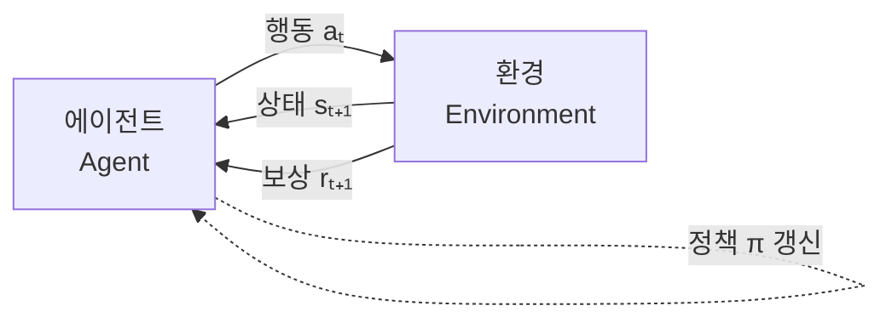
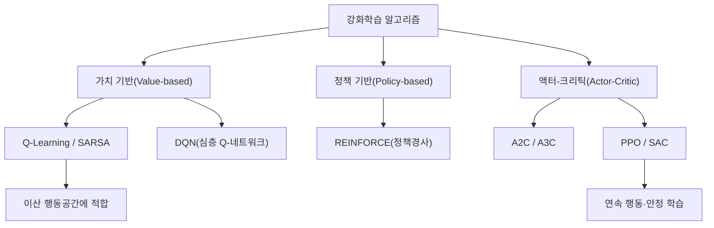

# 강화학습(Reinforcement Learning)

## 1. 개요

> **강화학습(Reinforcement Learning, RL)** 이란 에이전트(Agent)가 환경(Environment)과 상호작용하며 시행착오(Trial and Error)를 통해, 누적 보상(Cumulative Reward)을 최대화하는 최적 정책(Optimal Policy)을 스스로 학습하는 기계학습 패러다임이다.

지도학습(Supervised Learning)이 "정답 레이블"을 필요로 하고 비지도학습(Unsupervised Learning)이 "구조·패턴"을 찾는 데 그치는 반면, 현실의 많은 문제는 **각 순간의 정답은 알 수 없으나 최종 결과의 좋고 나쁨(보상)은 판단할 수 있는** 순차적 의사결정(Sequential Decision Making) 문제이다. 바둑에서 한 수 한 수의 정답은 없지만 승패는 명확하고, 자율주행에서 매 순간의 조향 각도에 정답은 없지만 사고 여부는 평가할 수 있다. 강화학습은 바로 이러한 문제, 즉 "지금의 선택이 미래의 결과에 영향을 미치는" 문제를 다루기 위해 등장하였다.

강화학습의 필요성은 크게 세 가지 배경에서 비롯된다. 첫째, **레이블링 비용의 회피**이다. 지도학습은 방대한 정답 데이터를 요구하지만, 강화학습은 환경이 돌려주는 보상 신호만으로 학습이 가능해 데이터 구축 부담이 적다. 둘째, **동적·순차적 환경 대응**이다. 로봇 제어·게임·추천·트레이딩처럼 시간에 따라 상태가 변하고 이전 행동이 이후 상황을 바꾸는 문제에서, 단발성 예측이 아니라 장기적 전략이 필요하다. 셋째, **초인적 성능의 가능성**이다. 인간의 경험이라는 상한선에 갇히는 지도학습과 달리, 자기 대국(Self-play) 등으로 인간을 뛰어넘는 해를 탐색할 수 있다(AlphaGo·AlphaZero). 최근에는 거대언어모델(LLM)의 인간 선호 정렬(RLHF)에까지 확장되며 그 실무적 중요성이 급격히 커지고 있다.

## 2. 강화학습의 구성요소와 상호작용 구조

강화학습은 **에이전트-환경 상호작용 루프**로 형식화된다. 에이전트는 현재 상태(State)를 관찰하고 행동(Action)을 선택하며, 환경은 그 행동에 대해 다음 상태와 보상(Reward)을 돌려준다. 이 순환이 반복되며 에이전트는 "어떤 상태에서 어떤 행동이 장기적으로 이득인가"를 축적한다.

핵심 개념을 문단으로 설명하면 다음과 같다. **상태(State)** 는 의사결정에 필요한 환경의 상황 요약이며, 미래가 과거 전체가 아닌 현재 상태에만 의존한다는 **마르코프 성질(Markov Property)** 을 가정한다. **행동(Action)** 은 에이전트가 취할 수 있는 선택지이며, **보상(Reward)** 은 행동의 즉각적 좋고 나쁨을 나타내는 스칼라 신호다. 여기서 중요한 것은 즉각 보상이 아니라 미래 보상을 할인해 합산한 **이득(Return, Gₜ = Σ γᵏ rₜ₊ₖ)** 을 최대화한다는 점이며, **할인율(γ, 0≤γ≤1)** 은 미래 보상을 현재 가치로 얼마나 중시할지를 조절한다.

에이전트의 두뇌에 해당하는 것이 **정책(Policy, π)** 으로, 상태를 행동으로 매핑하는 함수다. 정책의 좋고 나쁨을 평가하는 척도가 **가치함수(Value Function)** 인데, 상태의 장기 가치를 나타내는 상태가치 V(s)와 상태-행동 쌍의 가치를 나타내는 행동가치 Q(s,a)로 나뉜다. 이들은 **벨만 방정식(Bellman Equation)**, 즉 "현재 가치 = 즉각 보상 + 할인된 다음 상태의 가치"라는 재귀적 관계로 연결되며, 이것이 강화학습 알고리즘 대부분의 수학적 토대가 된다. 환경의 동역학을 모델링하는지 여부에 따라 모델을 학습·활용하는 **모델 기반(Model-based)** 과 경험만으로 학습하는 **모델 프리(Model-free)** 로 구분된다.

| 구성요소 | 기호 | 의미 | 예시(자율주행) |
|---|---|---|---|
| 상태 | s | 환경 상황 요약 | 차선·주변차량·속도 |
| 행동 | a | 선택 가능한 조작 | 가속·제동·조향 |
| 보상 | r | 즉각적 평가 신호 | 차선유지 +1, 충돌 −100 |
| 정책 | π(a\|s) | 상태→행동 매핑 | 주행 전략 |
| 가치함수 | V(s), Q(s,a) | 장기 기대 이득 | 상황별 안전도 평가 |
| 할인율 | γ | 미래 보상 중요도 | 0.99 |

## 3. 학습 방식의 분류와 대표 알고리즘

강화학습 알고리즘은 무엇을 학습 대상으로 삼느냐에 따라 **가치 기반(Value-based)**, **정책 기반(Policy-based)**, 그리고 둘을 결합한 **액터-크리틱(Actor-Critic)** 으로 나뉜다. 이 분류를 이해하는 것이 곧 강화학습 지형도를 이해하는 것이다.

**가치 기반 방법** 은 최적 가치함수 Q(s,a)를 먼저 학습하고, 각 상태에서 가치가 최대인 행동을 선택함으로써 간접적으로 정책을 유도한다. 대표적으로 **Q-러닝**은 실제 취한 행동과 무관하게 최적 행동을 가정해 갱신하는 **오프-폴리시(Off-policy)** 기법이고, **SARSA**는 실제 취한 다음 행동으로 갱신하는 **온-폴리시(On-policy)** 기법이다. 여기에 심층신경망으로 Q함수를 근사한 것이 2015년 딥마인드의 **DQN**으로, 경험 재생(Experience Replay)과 타깃 네트워크(Target Network)로 학습 불안정을 완화하며 아타리 게임에서 인간 수준을 달성해 심층 강화학습(Deep RL)의 서막을 열었다. 다만 가치 기반은 행동공간이 이산적일 때 유효하고, 연속적 행동(로봇 관절 토크 등)에는 적용이 어렵다.

**정책 기반 방법** 은 가치함수를 거치지 않고 정책 π를 직접 파라미터화해 기대 이득을 높이는 방향으로 경사상승(Gradient Ascent)한다. 연속 행동공간과 확률적 정책을 자연스럽게 다룰 수 있으나, 기울기 추정의 분산이 커 학습이 불안정하다는 단점이 있다. **액터-크리틱** 은 이 둘의 장점을 결합하여, 행동을 결정하는 액터(정책)와 그 행동을 평가하는 크리틱(가치함수)을 함께 학습해 분산을 낮춘다. 오늘날 실무에서 가장 널리 쓰이는 **PPO(Proximal Policy Optimization)** 는 정책 갱신 폭을 제한(Clipping)해 안정성과 성능을 균형 있게 확보하며, ChatGPT의 RLHF에도 채택되었다.

| 구분 | 가치 기반 | 정책 기반 | 액터-크리틱 |
|---|---|---|---|
| 학습 대상 | 가치함수 Q | 정책 π | 정책 + 가치 |
| 행동공간 | 이산 | 이산·연속 | 이산·연속 |
| 안정성 | 보통 | 낮음(고분산) | 높음 |
| 대표 | Q-Learning, DQN | REINFORCE | A2C, PPO, SAC |

## 4. 탐험과 활용의 딜레마, 그리고 지도학습과의 비교

강화학습을 관통하는 근본 난제는 **탐험-활용 딜레마(Exploration-Exploitation Dilemma)** 이다. 에이전트는 이미 알고 있는 좋은 행동을 **활용(Exploitation)** 해 당장의 보상을 얻으려는 욕구와, 더 나은 행동이 있을지 **탐험(Exploration)** 하려는 필요 사이에서 균형을 잡아야 한다. 탐험이 부족하면 국소 최적(Local Optimum)에 빠지고, 지나치면 학습이 비효율적이 된다. 이를 조절하기 위해 일정 확률 ε로 무작위 행동을 하는 **ε-greedy**, 불확실성이 큰 행동을 우대하는 **UCB**, 확률적 표집 기반의 **볼츠만 탐험** 등이 사용된다. 예컨대 온라인 광고 추천에서 ε=0.1로 두면 90%는 클릭률이 검증된 광고를, 10%는 새 광고를 노출해 장기 수익을 개선한다.

강화학습이 다른 학습 패러다임과 본질적으로 다른 이유는 **피드백의 성질** 에 있다. 지도학습은 매 샘플에 즉각적·직접적 정답을 받지만, 강화학습의 보상은 **지연되고(Delayed)**, **평가적이며(Evaluative)**, **순차적 상관(Correlated)** 을 갖는다. 특히 "어떤 과거 행동이 현재의 보상에 기여했는가"를 규명하는 **신용 할당 문제(Credit Assignment Problem)** 가 핵심 난이도로, 벨만 방정식과 할인율이 이를 다루는 장치다.

| 비교축 | 지도학습 | 비지도학습 | 강화학습 |
|---|---|---|---|
| 학습신호 | 정답 레이블 | 없음(구조 발견) | 보상(지연·평가적) |
| 목표 | 예측 오차 최소화 | 패턴·군집화 | 누적 보상 최대화 |
| 데이터 | 고정 데이터셋 | 고정 데이터셋 | 상호작용으로 생성 |
| 대표 문제 | 분류·회귀 | 클러스터링 | 순차 의사결정 |

이러한 차이 때문에 강화학습은 **표본 비효율성(Sample Inefficiency)** 이 크다는 실무적 약점을 가진다. 좋은 정책을 얻기까지 수백만~수억 회의 상호작용이 필요할 수 있어, 실제 로봇처럼 시행착오 비용이 큰 환경에서는 시뮬레이터에서 학습 후 현실로 옮기는 **Sim-to-Real** 기법과, 도메인 무작위화(Domain Randomization)로 현실 격차(Reality Gap)를 줄이는 접근이 병행된다.

## 5. 심화: 최신 동향과 실무 적용 사례

**RLHF와 LLM 정렬**: 최근 강화학습의 가장 파급력 큰 적용은 **인간 피드백 기반 강화학습(RLHF, Reinforcement Learning from Human Feedback)** 이다. 사람의 선호 비교 데이터로 보상 모델(Reward Model)을 학습하고, 이를 보상 신호 삼아 PPO로 LLM을 미세조정해 유용성·안전성을 높인다. 다만 보상 모델 구축·PPO 학습이 복잡해, 이를 단순화한 **DPO(Direct Preference Optimization)** 나 규칙 기반 보상을 쓰는 **RLAIF**, 검증 가능한 보상으로 추론 능력을 끌어올리는 강화학습(수학·코딩의 정답 채점 기반)이 활발히 연구된다.

**산업 적용 사례**: 구글 딥마인드는 데이터센터 냉각을 강화학습으로 제어해 냉각 에너지를 약 40% 절감했다고 보고했으며, 물류·제조에서는 재고 보충·공정 스케줄링 최적화에, 금융에서는 포트폴리오 리밸런싱과 주문 집행(Execution)에 적용된다. 자율주행·로봇 매니퓰레이션에서는 파지·보행 제어에, 반도체·칩 설계에서는 배치(Floorplanning) 최적화에 활용된 사례가 발표되었다. 추천 시스템에서는 클릭 같은 즉각 지표가 아니라 장기 체류·재방문을 보상으로 삼아 지속가능한 사용자 가치를 학습하는 방향으로 진화하고 있다.

**책임 있는 활용의 쟁점**: 강화학습은 "보상을 최대화"하도록 설계되므로, 보상 설계가 잘못되면 의도치 않은 편법을 학습하는 **보상 해킹(Reward Hacking)** 이 발생한다. 예컨대 게임에서 점수만 극대화하다 목표를 무시하거나, 추천에서 자극적 콘텐츠로 체류만 늘리는 부작용이 대표적이다. 따라서 보상 함수 설계는 강화학습 성패를 좌우하는 공학적·윤리적 핵심 과제이며, 제약 조건을 명시하는 **안전 강화학습(Safe RL)** 이 부상하고 있다.

## 6. 고려사항 및 시사점

기술사 관점에서 강화학습의 도입·활용은 다음을 종합적으로 고려해야 한다.

- **문제 적합성 판단이 선행되어야 한다.** 강화학습은 순차적 의사결정·지연 보상·상호작용 가능 환경에서 강점을 갖지만, 단발성 예측이나 정답 데이터가 풍부한 문제에는 지도학습이 더 효율적이다. "RL이 만능"이라는 접근을 경계하고, 문제의 구조가 마르코프 결정과정(MDP)으로 자연스럽게 표현되는지부터 검토해야 한다.

- **보상 설계와 시뮬레이터 확보가 성패를 좌우한다.** 보상 함수는 조직의 실제 목표(장기 가치·안전·규제 준수)를 정확히 반영해야 하며, 보상 해킹 방지를 위한 제약·페널티 설계가 필수다. 또한 현실 시행착오 비용이 큰 도메인은 고품질 시뮬레이터와 Sim-to-Real 전략, 오프라인 강화학습(로그 데이터 활용) 도입을 함께 계획해야 한다.

- **표본 효율성과 운영 비용의 트레이드오프를 관리해야 한다.** 심층 강화학습은 대규모 연산·데이터를 요구하므로, GPU 인프라·학습 파이프라인·재현성 확보를 위한 MLOps 체계와 연계해야 한다. 모델 프리(범용·고비용)와 모델 기반(표본 효율·모델 오차 위험)의 선택은 도메인 특성에 맞춰 결정한다.

- **안전성·설명가능성·거버넌스를 내재화해야 한다.** 학습된 정책의 실패 모드(분포 이탈, 안전 위반)를 사전 검증하고, 안전 강화학습·휴먼인더루프(Human-in-the-loop)·롤백 체계를 갖춰야 한다. 특히 자율주행·의료·금융 등 고위험 도메인은 AI 신뢰성·규제(AI 기본법, 책임 있는 AI) 요건과 정합되도록 거버넌스를 설계해야 한다.

- **전망**: 강화학습은 RLHF를 매개로 생성형 AI의 정렬·추론 강화 핵심 기술로 자리 잡았으며, 오프라인 RL·모델 기반 RL·다중 에이전트 강화학습(MARL)으로 적용 범위가 확대되고 있다. 자율 에이전트(Agentic AI) 시대에 "장기 목표를 향한 자율적 의사결정" 역량의 근간으로서 그 전략적 중요성은 더욱 커질 것이다.

## 참고자료
- Sutton & Barto, *Reinforcement Learning: An Introduction*, 2nd ed. — http://incompleteideas.net/book/the-book-2nd.html
- OpenAI, *Spinning Up in Deep RL* — https://spinningup.openai.com/

---

> **한 줄 요약**: 강화학습은 에이전트가 환경과의 시행착오를 통해 지연·평가적 보상의 누적을 최대화하는 최적 정책을 학습하는 패러다임으로, 가치·정책·액터-크리틱 계열과 탐험-활용 균형을 축으로 하며, RLHF를 통해 생성형 AI 정렬의 핵심 기술로 부상하고 있다.
