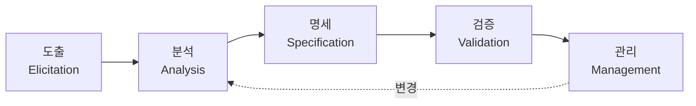

# 소프트웨어 요구공학(Requirement Engineering)

## 1. 개요

### 가. 정의
> 이해관계자의 요구를 **도출·분석·명세·검증·관리**하여 개발 대상 시스템의 **요구사항을 정확·완전하게 정의**하는 소프트웨어공학의 체계적 활동.

### 나. 필요성
- 요구 결함은 후반부로 갈수록 **수정비용 급증**(1:10:100 법칙)
- 요구 불명확은 **프로젝트 실패의 주요 원인**(재작업·범위 변경)
- 이해관계자 간 **의사소통·합의·추적성** 확보

## 2. 요구공학 절차

| 단계 | 활동 | 기법 |
|---|---|---|
| **도출(Elicitation)** | 이해관계자 식별·요구 수집 | 인터뷰, 워크숍, 설문, 관찰, 프로토타이핑, 브레인스토밍 |
| **분석(Analysis)** | 상충·중복 해소, 실현가능성·우선순위 | 유스케이스, 모델링(DFD·UML), MoSCoW 우선순위 |
| **명세(Specification)** | 문서화(SRS 작성) | 자연어·정형명세, 유스케이스 명세 |
| **검증(Validation)** | 정확·완전·일관성 확인 | 리뷰·인스펙션, 프로토타입, 검토회의 |
| **관리(Management)** | 변경·이력·추적 관리 | 형상관리, 추적성 매트릭스(RTM), 변경통제위(CCB) |

## 3. 요구사항 유형

| 구분 | 내용 |
|---|---|
| **기능 요구** | 시스템이 수행할 기능·서비스 |
| **비기능 요구** | 성능·보안·가용성·사용성 등 품질속성 |
| **제약사항** | 법·표준·플랫폼·예산 제약 |

## 4. 요구사항 명세서(SRS)
- **구성**: 목적·범위, 기능 요구, 비기능 요구, 인터페이스, 제약조건
- **좋은 SRS의 품질 특성**:

| 특성 | 의미 |
|---|---|
| **완전성** | 필요한 요구를 빠짐없이 포함 |
| **일관성** | 요구 간 상충 없음 |
| **명확성** | 모호하지 않고 단일 해석 |
| **검증가능성** | 테스트로 확인 가능 |
| **추적성** | 상위 요구~설계~테스트 연결 |

## 5. 고려사항 및 시사점
- **추적성(Traceability)** 확보로 변경 영향분석·품질보증 강화
- 애자일에서는 **User Story·Product Backlog**로 점진적·반복적 요구관리
- 이해관계자 참여·합의(사인오프)와 요구 **베이스라인** 관리가 프로젝트 성공의 기반

---

> **한 줄 요약**: 요구공학은 *도출→분석→명세→검증→관리* 절차로 이해관계자 요구를 체계화하고, 완전·일관·명확·검증가능·추적가능한 SRS로 요구 결함과 프로젝트 실패를 예방하는 활동이다.
