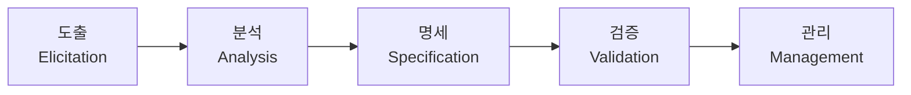

# 소프트웨어 요구공학(Requirement Engineering)

## 1. 개요

### 가. 정의
> 이해관계자의 요구를 **체계적으로 도출·분석·명세·검증·관리**하는 소프트웨어공학 활동.

### 나. 필요성
- 요구 오류는 후반 수정비용 급증 → **초기 정확한 요구 확보**로 프로젝트 실패 방지

## 2. 요구공학 절차

| 단계 | 활동 |
|---|---|
| **도출(Elicitation)** | 인터뷰·워크숍·설문·관찰로 요구 수집 |
| **분석(Analysis)** | 상충·중복 해소, 우선순위·타당성 검토 |
| **명세(Specification)** | 요구사항 명세서(SRS) 작성 |
| **검증(Validation)** | 정확·완전·일관성 확인, 리뷰 |
| **관리(Management)** | 변경·추적성(Traceability) 관리 |

## 3. 요구사항 명세서(SRS)
- **기능·비기능 요구**, 제약조건, 인터페이스 정의
- 품질 특성: **완전성·일관성·명확성·검증가능성·추적성**

## 4. 시사점
- 애자일에서는 **User Story·백로그**로 점진적 요구관리, 추적성 도구 활용

---

> **한 줄 요약**: 요구공학은 *도출→분석→명세→검증→관리* 절차로 이해관계자 요구를 체계화하며, 완전·일관·추적 가능한 SRS로 프로젝트 실패를 예방한다.
