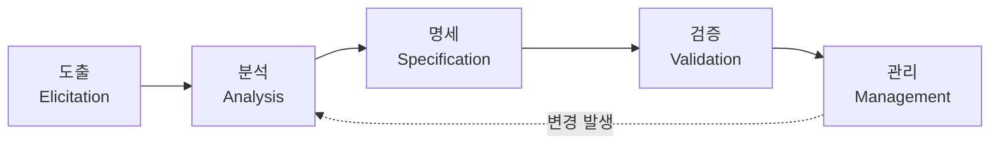

# 소프트웨어 요구공학(Requirement Engineering)

## 1. 개요

### 가. 정의
> 이해관계자의 요구를 **도출·분석·명세·검증·관리**하는 체계적 절차를 통해, 개발 대상 시스템이 갖춰야 할 요구사항을 **정확·완전·일관되게 정의하고 변경까지 통제**하는 소프트웨어공학 활동.

### 나. 등장 배경 및 필요성
소프트웨어 프로젝트 실패의 가장 큰 원인은 코딩 실수가 아니라 "**잘못된 것을 제대로 만드는 것**", 즉 요구의 오류다. 요구 결함은 발견이 늦어질수록 수정 비용이 기하급수적으로 커진다. 요구 단계에서 1의 비용으로 고칠 결함이 설계에서 10, 운영에서 100의 비용이 든다는 **1:10:100 법칙**이 이를 말한다. 또 요구가 모호하면 개발 도중 범위가 계속 바뀌어(**스코프 크리프**) 재작업이 폭증한다. 요구공학은 이런 손실을 막기 위해, 요구를 즉흥적 대화가 아닌 **공학적 절차**로 다루어 이해관계자 간 합의·추적성을 확보한다.

## 2. 요구공학 절차

요구공학은 도출부터 관리까지 다섯 단계가 순차적이면서도, 변경이 생기면 다시 분석으로 돌아가는 **반복적** 활동이다. 각 단계는 앞 단계의 산출물을 정제해 최종적으로 신뢰할 수 있는 요구 명세로 수렴시킨다.

- **도출(Elicitation)**: 이해관계자를 식별하고 그들의 요구·기대를 끌어낸다. 사용자는 자신이 무엇을 원하는지 스스로도 명확히 모르는 경우가 많아, 인터뷰·워크숍만이 아니라 관찰·프로토타이핑으로 잠재 요구까지 발굴하는 것이 관건이다.
- **분석(Analysis)**: 수집한 요구의 **상충·중복·모호함을 해소**하고, 실현 가능성과 우선순위를 따진다. 유스케이스·DFD·UML로 모델링하고 MoSCoW로 우선순위를 매긴다.
- **명세(Specification)**: 합의된 요구를 **SRS(요구사항 명세서)** 로 문서화한다. 자연어의 모호성을 줄이기 위해 유스케이스 명세·정형 명세를 병행한다.
- **검증(Validation)**: 명세가 이해관계자의 실제 요구를 정확·완전·일관되게 담았는지 리뷰·인스펙션·프로토타입으로 확인한다.
- **관리(Management)**: 확정된 요구를 **베이스라인**으로 고정하고, 이후 변경을 형상관리·RTM·변경통제위(CCB)로 통제한다.

| 단계 | 활동 | 대표 기법 |
|---|---|---|
| 도출 | 이해관계자 식별·요구 수집 | 인터뷰, 워크숍, 관찰, 프로토타이핑 |
| 분석 | 상충·중복 해소, 우선순위 | 유스케이스, DFD/UML, MoSCoW |
| 명세 | SRS 문서화 | 자연어·정형 명세, 유스케이스 명세 |
| 검증 | 정확·완전·일관성 확인 | 리뷰·인스펙션, 프로토타입 |
| 관리 | 변경·이력·추적 관리 | 형상관리, RTM, CCB |

## 3. 요구사항 유형

요구를 유형으로 나누는 이유는, 유형마다 검증 방법과 설계 영향이 다르기 때문이다. 특히 비기능 요구는 놓치기 쉬우면서도 아키텍처를 근본적으로 좌우한다. 예컨대 "동시 사용자 1만 명, 응답 2초 이내"라는 성능 요구는 초기 아키텍처 선택을 바꿔놓는다.

| 구분 | 내용 | 예 |
|---|---|---|
| 기능 요구 | 시스템이 수행할 기능·서비스 | 로그인, 주문 처리 |
| 비기능 요구 | 성능·보안·가용성 등 품질속성 | 응답 2초, 99.9% 가용성 |
| 제약사항 | 법·표준·플랫폼·예산 제약 | 개인정보보호법 준수 |

## 4. 요구사항 명세서(SRS)와 품질 특성

SRS는 목적·범위, 기능/비기능 요구, 인터페이스, 제약조건으로 구성되며, "**좋은 요구란 무엇인가**"에 대한 품질 특성을 만족해야 한다. 이 특성들이 중요한 이유는, 하나라도 어기면 개발 단계에서 해석 차이·재작업으로 이어지기 때문이다. 예를 들어 "화면이 빨라야 한다"는 요구는 검증 불가능하므로, "**메인 화면은 2초 이내 로딩**"처럼 검증 가능하게 써야 한다.

| 특성 | 의미 |
|---|---|
| 완전성 | 필요한 요구를 빠짐없이 포함 |
| 일관성 | 요구 간 상충 없음 |
| 명확성 | 모호하지 않고 단일 해석 가능 |
| 검증가능성 | 테스트로 확인 가능(정량 기준) |
| 추적성 | 상위 요구~설계~테스트 연결 |

## 5. 고려사항 및 시사점
- **추적성(Traceability) 확보**: RTM으로 요구-설계-코드-테스트를 연결해 두면, 요구 변경 시 **영향 분석**이 즉시 되고 누락 없는 테스트가 보장된다. 이것이 품질보증의 핵심 도구다.
- **애자일에서의 요구관리**: 애자일은 SRS를 한 번에 확정하지 않고 **User Story·Product Backlog**로 반복 스프린트마다 점진적으로 정제한다. 요구의 변동을 결함이 아니라 자연스러운 것으로 수용하되, 백로그 우선순위 관리로 통제한다.
- **성공 기반**: 결국 이해관계자의 적극 참여·합의(사인오프)와 **요구 베이스라인 관리**가 프로젝트 성공의 토대다.

---

> **한 줄 요약**: 요구공학은 *도출→분석→명세→검증→관리* 절차로 이해관계자 요구를 공학적으로 체계화하고, 완전·일관·명확·검증가능·추적가능한 SRS와 베이스라인·RTM으로 요구 결함과 프로젝트 실패(1:10:100)를 예방하는 활동이다.
