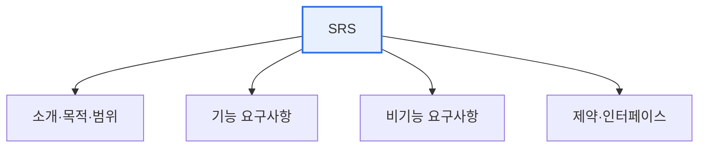

# 요구사항명세서(SRS)의 기술 항목

## 1. 개요

### 가. 정의
> 시스템이 **무엇을 해야 하는지(기능)와 어떤 제약을 만족해야 하는지(비기능)를 명확·완전하게 문서화**한 산출물. 이해관계자 간 합의와 설계·검증의 기준이 된다. IEEE 830·29148이 대표 표준이다.

SRS가 중요한 이유는 '**모호한 요구가 프로젝트 실패의 최대 원인**'이기 때문이다. 명확히 문서화되지 않은 요구는 개발자마다 다르게 해석되고, 후반에 큰 재작업을 부른다. SRS는 요구를 검증 가능한 형태로 확정해 이 리스크를 줄인다.

## 2. SRS 기술 항목

| 항목 | 내용 |
|---|---|
| **개요·목적·범위** | 시스템 목적, 대상, 용어 정의 |
| **기능 요구사항** | 시스템이 제공할 기능·동작(입력·처리·출력) |
| **비기능 요구사항** | 성능·보안·가용성·사용성 등 품질 |
| **인터페이스 요구** | 사용자·하드웨어·소프트웨어·통신 인터페이스 |
| **제약사항** | 법규·표준·기술 제약 |
| **데이터 요구** | 데이터 구조·항목·규칙 |

## 3. 좋은 요구사항의 품질속성

| 속성 | 내용 |
|---|---|
| **완전성** | 필요한 요구가 빠짐없이 |
| **명확성(무모호성)** | 하나의 의미로 해석 |
| **일관성** | 상호 모순 없음 |
| **검증가능성** | 테스트로 확인 가능 |
| **추적성** | 출처·설계·테스트로 연결 |

## 4. 시사점
- 모호·불완전 명세는 재작업·분쟁의 원인 → **검증가능성·추적성**이 핵심
- 애자일은 사용자 스토리·수용조건(AC)으로 경량 명세
- 요구사항 추적 매트릭스(RTM)로 전 생명주기 관리

---

> **한 줄 요약**: SRS는 *개요·기능·비기능·인터페이스·제약·데이터* 요구를 문서화하며, 완전성·명확성·일관성·검증가능성·추적성을 갖춰 설계·검증의 기준이 된다.
