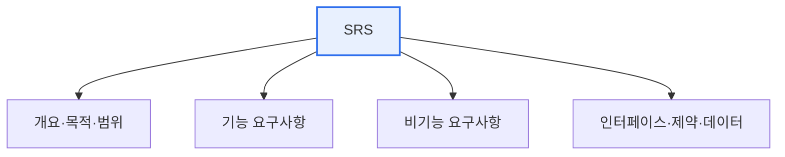

# 요구사항명세서(SRS)의 기술 항목

## 1. 개요

### 가. 정의
> 시스템이 **무엇을 해야 하는지(기능)와 어떤 제약·품질을 만족해야 하는지(비기능)를 명확하고 완전하게 문서화**한 산출물. 이해관계자 간 합의의 근거이자 설계·구현·검증의 기준이 된다. IEEE 830·29148이 대표 표준이다.

SRS가 중요한 이유는 '**모호한 요구사항이 프로젝트 실패의 최대 원인**'이라는 데 있다. 여러 연구가 소프트웨어 프로젝트 실패의 상당수가 요구사항의 불명확·불완전·잦은 변경에서 비롯됨을 보여준다. 요구가 문서로 명확히 확정되지 않으면 발주자·개발자·테스터가 각자 다르게 해석하고, 그 간극은 개발 후반에 큰 재작업으로 터진다. SRS는 요구를 **검증 가능한 형태로 확정**해 이 리스크를 줄이는 계약서 역할을 한다. "화면이 빨라야 한다" 같은 모호한 말을 "조회 응답은 2초 이내"처럼 측정 가능하게 만드는 것이 SRS의 힘이다.

### 나. 필요성
요구사항 오류는 발견이 늦을수록 수정 비용이 기하급수적으로 커진다. 요구 단계 결함을 운영 단계에서 고치면 비용이 수십~수백 배가 된다. SRS로 초기에 요구를 명확히 확정하는 것이 가장 경제적인 품질 확보다.

## 2. SRS 기술 항목

SRS는 시스템의 여러 측면을 빠짐없이 담아야 한다. **개요·목적·범위** 는 시스템이 왜 필요하고 어디까지 다루는지, 용어를 정의한다. **기능 요구사항** 은 시스템이 제공할 구체적 기능(입력→처리→출력)을 기술하고, **비기능 요구사항** 은 성능·보안·가용성·사용성 같은 품질 속성을 정의한다. 여기에 사용자·하드웨어·소프트웨어·통신 **인터페이스**, 법규·표준·기술 **제약**, 데이터 구조·규칙까지 포함한다.

| 항목 | 내용 |
|---|---|
| **개요·목적·범위** | 시스템 목적, 대상, 용어 정의 |
| **기능 요구사항** | 제공할 기능·동작(입력·처리·출력) |
| **비기능 요구사항** | 성능·보안·가용성·사용성 등 품질 |
| **인터페이스 요구** | 사용자·HW·SW·통신 인터페이스 |
| **제약사항** | 법규·표준·기술 제약 |
| **데이터 요구** | 데이터 구조·항목·규칙 |

## 3. 좋은 요구사항의 품질속성

SRS에 담기는 요구사항 하나하나가 갖춰야 할 품질이 있다. 필요한 요구가 빠짐없어야 하고(완전성), 하나의 의미로만 해석되어야 하며(명확성/무모호성), 요구 간 모순이 없어야 하고(일관성), 테스트로 충족 여부를 확인할 수 있어야 하며(검증가능성), 출처와 설계·테스트로 연결되어야 한다(추적성). 이 중 특히 검증가능성이 중요한데, "사용하기 편해야 한다"처럼 측정할 수 없는 요구는 나중에 충족 여부를 두고 분쟁이 생기기 때문이다.

| 속성 | 내용 |
|---|---|
| **완전성** | 필요한 요구가 빠짐없이 포함 |
| **명확성** | 하나의 의미로 해석(무모호성) |
| **일관성** | 요구 간 상호 모순 없음 |
| **검증가능성** | 테스트로 충족 확인 가능 |
| **추적성** | 출처·설계·테스트로 연결 |

## 4. 고려사항 및 시사점

1. **검증가능성·추적성이 핵심**이다. 측정 불가능한 요구는 분쟁의 씨앗이므로 정량화하고, 요구사항 추적 매트릭스(RTM)로 요구–설계–코드–테스트를 연결해 누락·변경 영향을 관리한다.
2. **애자일에서는 경량 명세**로 대체된다. 상세 SRS 대신 사용자 스토리와 수용조건(Acceptance Criteria)으로 요구를 표현하되, 검증가능성이라는 본질은 동일하게 지킨다.
3. **요구사항은 변한다는 전제**로 관리한다. 완벽한 초기 명세는 불가능하므로, 변경 통제 절차를 갖춰 요구 변경을 통제된 방식으로 반영해야 한다.

---

> **한 줄 요약**: SRS는 *개요·기능·비기능·인터페이스·제약·데이터* 요구를 문서화하며, 완전성·명확성·일관성·검증가능성·추적성을 갖춰야 하고, 모호한 요구를 정량화하고 RTM으로 추적해 프로젝트 실패의 최대 원인인 요구 오류를 줄인다.
