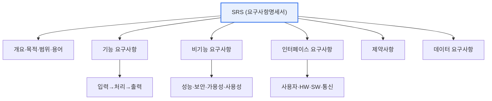
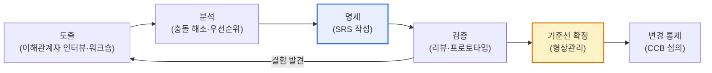

# 요구사항명세서(SRS)의 기술 항목

## 1. 개요

### 가. 정의
> **요구사항명세서(SRS, Software Requirements Specification)** 는 시스템이 **무엇을 해야 하는지(기능)와 어떤 제약·품질을 만족해야 하는지(비기능)를 명확하고 완전하며 검증 가능한 형태로 문서화**한 산출물이다. 발주자·개발자·테스터 등 이해관계자 간 합의의 근거이자, 설계·구현·검증의 기준선(baseline)이 되며, 대표 표준으로는 IEEE Std 830-1998과 이를 대체한 ISO/IEC/IEEE 29148(2011, 2018 개정)이 있다.

SRS가 소프트웨어공학에서 중요하게 다루어지는 근본 이유는 '**요구사항의 불명확·불완전·잦은 변경이 프로젝트 실패의 가장 큰 원인 중 하나**'라는 오랜 경험적 관찰에 있다. 시스템이 무엇을 해야 하는지가 문서로 명확히 확정되지 않으면, 발주자·기획자·개발자·테스터가 같은 문장을 서로 다르게 해석하고, 그 해석의 간극은 개발이 진행될수록 눈덩이처럼 커지다가 통합·인수 시험 단계에서 대규모 재작업(rework)으로 터진다. SRS는 바로 이 해석의 간극을 초기에 봉인하는 장치다.

특히 SRS의 힘은 **모호한 자연어를 측정 가능한 진술로 바꾸는 데** 있다. "화면이 빨라야 한다", "사용하기 편해야 한다"와 같은 문장은 각자에게 다른 그림을 떠올리게 하지만, "조회 응답 시간은 정상 부하에서 95백분위수 기준 2초 이내"처럼 정량화하면 누구도 다르게 해석할 수 없고, 완성 후 충족 여부를 시험으로 판정할 수 있다. 즉 SRS는 단순한 문서가 아니라, 이후의 설계·개발·검수·정산이 딛고 설 **검증 가능한 계약서**의 성격을 갖는다.

### 나. 등장 배경과 필요성
SRS가 하나의 정형 산출물로 자리 잡은 배경에는 '결함의 발견 시점이 늦을수록 수정 비용이 기하급수적으로 커진다'는 결함 경제학이 있다. Boehm이 제시한 고전적 관찰 이래, 요구 단계에서 잡을 수 있었던 결함을 운영 단계에서 고치면 그 비용이 수십에서 수백 배까지 커진다는 것은 소프트웨어공학의 상식으로 통한다. 요구를 초기에 명확히 확정하는 것이 결국 가장 값싼 품질 확보 수단인 셈이다.

또 하나의 필요성은 **책임과 범위의 경계 설정**이다. SI·공공 SW 사업에서 발주자와 수행사 사이의 분쟁 대부분은 "이것도 원래 요구에 포함된 것 아니냐"는 범위(scope) 다툼에서 비롯된다. SRS가 기능·비기능·제약을 빠짐없이 확정해 두면, 이후의 요구 변경은 '범위 밖의 새 요구'로 식별되어 변경 통제(Change Control) 절차와 대가 산정의 대상이 된다. 명세가 부실하면 이 경계가 흐려지고, 무한한 요구 증식(scope creep)이 프로젝트를 잠식한다.

## 2. SRS의 구성과 기술 항목

SRS는 시스템의 여러 측면을 특정 관점에 치우치지 않고 빠짐없이 담아야 한다. 아래 구조도는 IEEE 830/29148 계열이 권고하는 대표 항목을 개요·기능·비기능·인터페이스·제약·데이터의 여섯 축으로 정리한 것이다.

```mermaid
flowchart TB
  S["SRS (요구사항명세서)"] --> I["개요·목적·범위·용어"]
  S --> F["기능 요구사항"]
  S --> N["비기능 요구사항"]
  S --> IF["인터페이스 요구사항"]
  S --> C["제약사항"]
  S --> D["데이터 요구사항"]
  F --> F1["입력→처리→출력"]
  N --> N1["성능·보안·가용성·사용성"]
  IF --> IF1["사용자·HW·SW·통신"]
  style S fill:#e8f0fe,stroke:#2f6fed,stroke-width:2px
```

**개요·목적·범위** 항목은 SRS의 도입부로, 시스템이 왜 필요한지, 어떤 문제를 해결하려는지, 어디까지를 대상으로 하고 무엇은 대상이 아닌지(범위와 비범위)를 정의하고, 이후 문서 전체에서 사용할 용어·약어를 명확히 규정한다. 이 부분이 부실하면 뒤따르는 상세 요구가 아무리 정교해도 '무엇을 위한 시스템인지'에 대한 공통 이해가 없어 방향이 어긋난다. 예컨대 은행의 여신 심사 시스템이라면 대상 상품군, 연동할 신용평가사, 자동 승인의 한도 범위 같은 경계를 개요에서 못 박아야 한다.

**기능 요구사항(Functional Requirements)** 은 시스템이 제공해야 할 구체적 동작을 '입력→처리→출력'의 형태로 기술한다. "사용자가 계좌 이체를 요청하면(입력), 잔액·한도·이상거래 여부를 검증한 뒤(처리), 성공/실패 결과와 거래 내역을 반환한다(출력)"처럼, 관측 가능한 행위 단위로 서술해야 한다. 기능 요구는 대개 유스케이스, 기능 목록, 또는 애자일의 사용자 스토리 형태로 표현되며, 각 기능에는 고유 식별자(FR-001 등)를 부여해 추적성을 확보한다.

**비기능 요구사항(Non-Functional Requirements, 품질 속성)** 은 시스템이 '얼마나 잘' 동작해야 하는지를 규정한다. 성능(응답시간·처리량·TPS), 가용성(예: 연간 99.9%, 곧 연간 다운타임 약 8.76시간 이내), 보안, 사용성, 확장성, 유지보수성 등이 여기에 속한다. 비기능 요구는 특정 화면이 아니라 시스템 전반에 걸쳐 영향을 주며, 아키텍처를 사실상 결정짓기 때문에 초기에 정량적으로 확정하는 것이 특히 중요하다. "빨라야 한다"가 아니라 "동시 사용자 1만 명에서 조회 응답 2초 이내, 처리량 500 TPS 이상"처럼 수치로 못 박아야 한다.

**인터페이스·제약·데이터 요구사항** 은 시스템이 놓일 환경을 규정한다. 인터페이스 요구는 사용자 인터페이스(UI), 하드웨어, 다른 소프트웨어(외부 시스템 API), 통신 프로토콜과의 접점을 정의한다. 제약사항은 준수해야 할 법규(예: 개인정보보호법, 전자금융감독규정)·산업 표준·기술 스택·예산·일정 같은 외부 조건이다. 데이터 요구는 다룰 데이터의 구조·항목·무결성 규칙·보존 기간을 규정한다. 이 세 항목은 종종 소홀히 다뤄지지만, 실무에서 통합 지연과 규제 위반 리스크가 바로 이 지점에서 발생한다.

| 항목 | 내용 | 대표 식별자·예시 |
|---|---|---|
| **개요·목적·범위** | 시스템 목적, 대상, 범위/비범위, 용어 정의 | 사업 배경, 대상 업무 범위 |
| **기능 요구사항** | 제공할 기능·동작(입력·처리·출력) | FR-001 계좌 이체 처리 |
| **비기능 요구사항** | 성능·보안·가용성·사용성 등 품질 | NFR-P-01 응답 2초 이내 |
| **인터페이스 요구** | 사용자·HW·SW·통신 인터페이스 | 신용평가사 REST API 연동 |
| **제약사항** | 법규·표준·기술·예산·일정 제약 | 개인정보보호법 준수 |
| **데이터 요구** | 데이터 구조·항목·무결성·보존 규칙 | 거래 로그 5년 보존 |

## 3. 좋은 요구사항의 품질 속성

SRS 문서 전체뿐 아니라, 그 안에 담기는 요구사항 하나하나가 갖춰야 할 품질 기준이 있다. ISO/IEC/IEEE 29148은 개별 요구와 요구 집합(set) 모두에 대한 특성을 제시하는데, 여기서는 실무에서 자주 강조되는 다섯 가지를 산문으로 풀어 설명한다.

첫째, **완전성(Completeness)** 은 필요한 요구가 빠짐없이 포함되고, 각 요구 내에도 예외·경계 조건이 명시되어야 함을 뜻한다. 정상 흐름만 적고 오류 처리를 누락하면, 개발자는 그 부분을 임의로 해석하거나 아예 구현하지 않는다. 둘째, **명확성/무모호성(Unambiguity)** 은 한 문장이 오직 하나의 의미로만 해석되어야 함을 말한다. "및/또는", "적절히", "필요시" 같은 표현은 해석의 여지를 남기므로 배제한다.

셋째, **일관성(Consistency)** 은 요구들 사이에 상호 모순이 없어야 함이다. 한 곳에서는 "모든 거래를 실시간 처리"라 하고 다른 곳에서는 "야간 배치로 정산"이라 하면 충돌이며, 이런 모순은 대개 이해관계자가 여럿일 때 발생한다. 넷째, **검증가능성(Verifiability)** 은 요구 충족 여부를 시험·검사·분석·시연으로 객관적으로 판정할 수 있어야 함을 의미한다. 다섯째, **추적성(Traceability)** 은 각 요구가 그 출처(이해관계자 요구·상위 요구)와 하위 산출물(설계·코드·테스트케이스)로 양방향 연결되어, 변경의 파급을 추적할 수 있어야 함이다.

이 중에서도 실무 분쟁을 줄이는 열쇠는 **검증가능성**이다. "사용하기 편해야 한다"처럼 측정할 수 없는 요구는 완성 후 "이게 편한 거냐"를 두고 발주자와 수행사가 끝없이 다투게 만든다. 반면 "신규 사용자가 교육 없이 5분 내에 이체를 완료할 수 있어야 하며, 사용성 테스트에서 대상자의 90% 이상이 성공"처럼 쓰면 판정이 객관화된다.

| 속성 | 내용 | 위반 예 → 개선 예 |
|---|---|---|
| **완전성** | 필요한 요구·예외 조건 빠짐없이 포함 | 오류 처리 누락 → 실패 시 재시도 3회 명시 |
| **명확성** | 하나의 의미로만 해석(무모호성) | "빨라야" → "응답 2초 이내" |
| **일관성** | 요구 간 상호 모순 없음 | 실시간 vs 배치 충돌 제거 |
| **검증가능성** | 시험·검사로 충족 확인 가능 | "편해야" → "5분 내 완료, 성공률 90%" |
| **추적성** | 출처·설계·코드·테스트로 양방향 연결 | RTM으로 요구–테스트 매핑 |

## 4. 요구공학 프로세스와 SRS의 위치

SRS는 어느 순간 한 번에 작성되는 문서가 아니라, **요구공학(Requirements Engineering)** 이라는 반복적 프로세스의 산출물이다. 아래 다이어그램은 도출(Elicitation)→분석(Analysis)→명세(Specification)→검증(Validation)으로 이어지며, 승인된 SRS가 형상관리 하에 놓이고 이후 변경 통제를 받는 흐름을 보여준다.

```mermaid
flowchart LR
  E["도출<br/>(이해관계자 인터뷰·워크숍)"] --> A["분석<br/>(충돌 해소·우선순위)"]
  A --> S["명세<br/>(SRS 작성)"]
  S --> V["검증<br/>(리뷰·프로토타입)"]
  V -->|결함 발견| E
  V --> B["기준선 확정<br/>(형상관리)"]
  B --> CC["변경 통제<br/>(CCB 심의)"]
  style S fill:#e8f0fe,stroke:#2f6fed,stroke-width:2px
  style B fill:#fef3c7,stroke:#d97706,stroke-width:2px
```

**도출** 단계에서는 인터뷰, 워크숍, 관찰, 기존 문서 분석 등으로 이해관계자의 진짜 요구를 캐낸다. 이때 이해관계자가 말하는 '해결책'과 그 뒤에 숨은 '진짜 문제'를 구분하는 것이 핵심이다. **분석** 단계에서는 도출된 요구들의 충돌을 해소하고, 실현 가능성을 따지며, 비즈니스 가치와 리스크에 따라 우선순위(예: MoSCoW — Must/Should/Could/Won't)를 매긴다.

**명세** 단계에서 비로소 SRS가 정형 문서로 작성되고, **검증** 단계에서 이해관계자 리뷰·인스펙션·프로토타입으로 "우리가 옳은 것을 명세했는가(Validation)"와 "명세를 규칙대로 잘 썼는가(Verification)"를 함께 확인한다. 검증을 통과해 승인된 SRS는 **기준선(baseline)** 으로 형상관리에 등록되며, 이후의 모든 변경은 변경통제위원회(CCB)의 심의를 거쳐야 한다. 이 되먹임 구조가 없으면 SRS는 작성된 순간 낡기 시작한다.

## 5. 사례 — 모호한 요구가 부른 실패와 정량화의 효과

SRS의 가치는 실패 사례와 대비할 때 가장 선명해진다. 대형 공공·금융 SI에서 반복적으로 관찰되는 전형적 실패는 "국민이 편리하게 이용할 수 있어야 한다"거나 "안정적으로 운영되어야 한다"는 식의 정성적 문장을 요구사항으로 확정한 경우다. 이런 요구는 사업 종료 시점에 발주자와 수행사가 "충분히 편리한가", "이 정도면 안정적인가"를 두고 무한히 다투게 만들고, 감리·검수 지연과 추가 비용으로 이어진다. 문제의 뿌리는 개발 역량이 아니라 **판정 기준이 명세에 없다**는 데 있다.

이를 정량화하면 상황이 달라진다. "편리해야 한다"를 "핵심 업무 3종은 신규 사용자가 별도 교육 없이 3분 이내 완료, 사용성 테스트 대상자의 90% 이상이 성공"으로, "안정적이어야 한다"를 "가용성 연 99.9%(연간 다운타임 약 8.76시간 이내), 장애 복구목표시간(RTO) 30분·복구목표시점(RPO) 5분"으로 바꾸면, 완성 후 시험으로 충족 여부를 객관적으로 판정할 수 있다. 동일한 문장을 정량 지표로 바꾸는 것만으로 분쟁의 여지가 사라지는 것이다.

또 하나 실무에서 반복되는 사례는 **비기능 요구를 뒤늦게 발견하는 것**이다. 개발이 상당히 진행된 뒤 "동시 접속 1만 명을 견뎌야 한다"는 성능 요구가 뒤늦게 드러나면, 이미 단일 서버·강한 결합으로 짜인 아키텍처를 확장 가능한 구조로 재설계해야 하므로 재작업 비용이 폭증한다. 성능·가용성·보안 같은 비기능 요구가 아키텍처를 사실상 결정하기 때문에, 이들을 SRS 단계에서 정량 목표로 확정하는 것이 결정적으로 중요하다는 점을 이 사례가 보여준다.

## 6. 심화 — 표준의 변화와 애자일 환경의 경량 명세

전통적으로 SRS의 골격은 IEEE Std 830-1998이 제공했으나, 이 표준은 2011년 **ISO/IEC/IEEE 29148**("Requirements engineering")로 통합·대체되었고 2018년 개정판이 나왔다. 29148은 SRS뿐 아니라 이해관계자 요구사항 명세(StRS), 시스템 요구사항 명세(SyRS)까지 아우르며, 개별 요구와 요구 집합이 갖춰야 할 특성(필요성·명확성·완전성·일관성·검증가능성·추적성 등)을 정교하게 규정한다는 점에서 830보다 포괄적이다. 기술사 답안에서는 "830이 대표 표준"이라고만 쓰기보다 "830을 계승·대체한 29148 체계"까지 언급하면 최신성이 드러난다.

한편 애자일·데브옵스 확산으로 **무거운 문서 중심 SRS는 경량 명세로 대체**되는 흐름이 뚜렷하다. 상세 SRS 대신 제품 백로그의 **사용자 스토리("~로서, ~을 위해, ~을 원한다")** 와 **수용조건(Acceptance Criteria)**, 나아가 실행 가능한 명세인 **BDD(Given-When-Then)** 로 요구를 표현한다. 대표적으로 Cucumber·Gherkin 문법은 "Given 잔액이 10만 원, When 5만 원 이체, Then 잔액은 5만 원"처럼 요구가 곧 자동화 테스트가 되게 한다.

주목할 점은, 형식이 문서에서 스토리·시나리오로 바뀌었을 뿐 **검증가능성·추적성이라는 요구사항의 본질은 그대로**라는 것이다. 수용조건이 곧 검증가능성이고, 백로그 항목과 테스트·커밋의 연결이 곧 추적성이다. 대규모 규제 산업(금융·의료·항공)에서는 여전히 감사·인증을 위해 정형 SRS를 유지하되, 내부 개발 흐름은 애자일 산출물과 도구(Jira, Confluence, ALM)로 실시간 동기화하는 하이브리드가 실무의 주류다. 예컨대 의료기기 SW는 IEC 62304를 만족하기 위해 요구–설계–검증의 추적 매트릭스를 규제 증빙으로 반드시 남긴다.

## 7. 고려사항 및 시사점

기술사 관점에서 SRS는 단순 문서 작성 기법이 아니라 **프로젝트 리스크를 초기에 통제하는 관리 전략**으로 접근해야 한다. 다음 네 가지가 핵심이다.

1. **검증가능성과 추적성을 최우선 설계 원칙으로 삼는다.** 측정 불가능한 요구는 분쟁의 씨앗이므로 모든 비기능 요구를 정량화하고, **요구사항 추적 매트릭스(RTM)** 로 요구–설계–코드–테스트를 양방향 연결한다. RTM은 변경 시 영향 범위를 즉시 식별하게 해 회귀 결함을 예방하는 관리 도구다.

2. **애자일에서는 경량화하되 본질은 유지한다.** 상세 SRS를 사용자 스토리·수용조건·BDD로 대체하더라도, 검증가능성과 추적성은 도구(Jira, Xray, Cucumber)로 자동 확보한다. 문서를 없애는 것이 목적이 아니라, 낡지 않고 실행되는 명세를 만드는 것이 목적이다.

3. **요구는 반드시 변한다는 전제로 변경 통제 체계를 갖춘다.** 완벽한 초기 명세는 불가능하므로, 기준선을 형상관리에 두고 CCB 심의·영향 분석·재승인의 절차를 통해 통제된 방식으로만 변경을 반영한다. 무통제 변경(scope creep)이야말로 일정·원가 초과의 주범이다.

4. **비기능 요구가 아키텍처를 결정함을 인식하고 조기에 확정한다.** 성능·가용성·보안 목표는 설계 이후에 끼워 넣을 수 없으므로, SRS 단계에서 정량 목표(TPS·응답시간·가용성·RTO/RPO)를 못 박아 아키텍처 의사결정과 트레이드오프(예: 강한 일관성 vs 고가용성)의 기준선을 마련해야 한다.

## 참고자료
- ISO/IEC/IEEE 29148:2018, Systems and software engineering — Life cycle processes — Requirements engineering. https://www.iso.org/standard/72089.html
- IEEE Std 830-1998, Recommended Practice for Software Requirements Specifications. https://standards.ieee.org/ieee/830/1222/
- ISO/IEC/IEEE 29148 개요(위키백과). https://en.wikipedia.org/wiki/ISO/IEC/IEEE_29148

---

> **한 줄 요약**: SRS는 *개요·기능·비기능·인터페이스·제약·데이터* 요구를 문서화하며, 완전성·명확성·일관성·검증가능성·추적성을 갖춰야 하고, IEEE 830을 계승한 ISO/IEC/IEEE 29148 체계 아래 모호한 요구를 정량화하고 RTM으로 추적해 프로젝트 실패의 최대 원인인 요구 오류를 초기에 통제한다.
