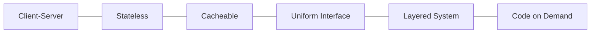

# REST API(Representational State Transfer API)

## 1. 개요

### 가. 정의
> HTTP를 기반으로 **자원(Resource)을 URI로 식별**하고, **HTTP 메서드로 행위를 표현**하며, 자원의 상태를 JSON·XML 같은 표현(Representation)으로 주고받는 **아키텍처 스타일**의 API. Roy Fielding이 2000년 박사논문에서 제시했다.

REST에서 강조할 점은 그것이 특정 기술·규격이 아니라 **아키텍처 스타일(제약조건의 집합)** 이라는 것이다. 즉 "이 프로토콜을 쓰라"가 아니라 "이런 제약을 지키면 웹처럼 확장성 있고 느슨하게 결합된 시스템이 된다"는 원칙의 모음이다. 웹 자체가 대규모로 성공한 구조를 API 설계에 일반화한 것이므로, REST를 이해하려면 그 제약들이 각각 어떤 확장성·독립성을 얻기 위한 것인지를 봐야 한다.

### 나. 등장 배경 및 필요성
초기 웹서비스 표준이던 SOAP은 XML 봉투·WS-* 스펙이 무겁고 엄격해, 브라우저·모바일 같은 경량 클라이언트와 빠른 개방형 연동에는 부담이었다. 웹·모바일·MSA가 확산되면서 필요한 것은 "**HTTP만 있으면 누구나 쉽게 붙일 수 있는 가볍고 표준적인 인터페이스**"였다. REST는 이미 검증된 HTTP의 메서드·상태코드·캐시를 그대로 활용하므로 별도 규격 학습 부담이 적고, 클라이언트·서버가 독립적으로 진화할 수 있어 개방형 API·플랫폼 경제의 사실상 표준이 되었다.

## 2. REST 6대 아키텍처 제약조건

각 제약은 저마다 얻으려는 품질이 있으며, 이를 이해해야 "왜 그렇게 설계하는지"가 보인다.

**가. Client-Server** — UI(클라이언트)와 데이터 저장(서버)의 관심사를 분리해, 양쪽이 서로의 내부를 몰라도 인터페이스만 맞으면 각각 독립적으로 발전할 수 있게 한다.

**나. Stateless(무상태)** — 서버는 이전 요청의 세션 상태를 기억하지 않고, **각 요청이 처리에 필요한 모든 정보를 스스로 담는다**. 서버가 상태를 안 가지므로 어느 서버로 요청이 가도 처리되어 **수평 확장(로드밸런싱)** 이 쉬워진다. 이것이 대규모 트래픽을 감당하는 핵심 이유다.

**다. Cacheable** — 응답에 캐시 가능 여부를 명시해, 동일 요청을 반복할 때 중간·클라이언트 캐시가 응답하도록 한다. 서버 부하와 지연을 줄이는 웹 확장성의 근간이다.

**라. Uniform Interface(균일 인터페이스)** — REST를 REST답게 만드는 핵심 제약으로, 자원을 URI로 식별하고, 표현을 통해 자원을 조작하며, 메시지가 자기서술적이고, 하이퍼링크로 상태를 전이(HATEOAS)한다. 인터페이스가 일관되므로 클라이언트가 특정 서버 구현에 종속되지 않는다.

**마. Layered System** — 클라이언트는 최종 서버와 직접 통신하는지, 중간의 프록시·게이트웨이·로드밸런서를 거치는지 알 필요가 없다. 계층을 자유롭게 끼워 넣어 보안·캐시·확장 기능을 투명하게 추가할 수 있다.

**바. Code on Demand(선택)** — 서버가 실행 코드(예: 스크립트)를 내려보내 클라이언트 기능을 확장할 수 있는 유일한 선택적 제약이다.

| 원칙 | 내용 | 얻는 품질 |
|---|---|---|
| Client-Server | UI/데이터 관심사 분리 | 독립 진화 |
| Stateless | 요청 자기완결, 상태 미보관 | 수평 확장성 |
| Cacheable | 캐시 가능 여부 명시 | 성능·부하 절감 |
| Uniform Interface | 일관된 인터페이스·HATEOAS | 결합도 감소 |
| Layered System | 계층 구조 허용 | 투명한 확장·보안 |
| Code on Demand(선택) | 실행 코드 전송 | 클라이언트 확장 |

## 3. 구성 요소와 메서드

REST의 3요소는 **자원·행위·표현**이다. 자원은 "무엇을"(URI로 식별), 행위는 "어떻게"(HTTP 메서드), 표현은 "어떤 형식으로"(JSON 등)에 해당한다. 여기서 중요한 원리가 **멱등성(idempotency)** 이다. 같은 요청을 여러 번 보내도 결과 상태가 동일한 메서드를 멱등이라 하며, 네트워크 장애로 재전송이 일어나도 안전한지를 좌우한다. GET·PUT·DELETE는 멱등이라 재시도해도 부작용이 없지만, POST는 호출할 때마다 새 자원이 생겨 멱등이 아니므로 재시도 설계에 주의해야 한다. 예를 들어 결제 생성을 POST로 두면 중복 결제 위험이 있어 멱등키를 별도로 두는 식의 보완이 필요하다.

| 요소 | 설명 |
|---|---|
| 자원(Resource) | URI로 식별 (예: `/users/1`) |
| 행위(Verb) | GET·POST·PUT/PATCH·DELETE |
| 표현(Representation) | JSON·XML 등 자원 상태 |

| 메서드 | 의미 | 멱등성 | 재시도 안전성 |
|---|---|---|---|
| GET | 조회 | O | 안전 |
| POST | 생성 | X | 중복 위험(멱등키 보완) |
| PUT | 전체 수정 | O | 안전 |
| PATCH | 부분 수정 | X | 주의 |
| DELETE | 삭제 | O | 안전 |

## 4. 성숙도 모델(Richardson Maturity Model)

REST를 "지키느냐 마느냐"의 이분법이 아니라 **단계적으로 얼마나 REST다운가**로 보는 모델이다. Level 0은 HTTP를 단지 전송 터널로만 쓰는 원격호출(RPC 유사)이고, Level 1은 자원을 URI로 분리한 단계, Level 2는 메서드·상태코드를 의미대로 활용하는 단계로 실무 대부분이 여기에 해당한다. Level 3은 응답에 다음에 할 수 있는 행동의 링크를 담는 **HATEOAS**로, 클라이언트가 URI를 하드코딩하지 않고 서버가 준 링크를 따라 이동해 결합도를 더 낮춘다. Fielding이 말한 "진정한 REST"는 이 단계지만, 구현·소비 비용이 커 현실에서는 Level 2가 주류다.

| 레벨 | 내용 |
|---|---|
| Level 0 | HTTP 터널링(단일 URI, RPC 유사) |
| Level 1 | 자원 분리(URI) |
| Level 2 | HTTP 메서드·상태코드 활용(실무 주류) |
| Level 3 | HATEOAS(하이퍼미디어) — 진정한 REST |

## 5. 설계 시 고려사항 및 시사점
- **URI는 명사, 행위는 메서드**: `/getUser`처럼 동사를 URI에 넣지 말고 `GET /users/1`로 자원과 행위를 분리해야 균일 인터페이스가 유지된다.
- **상태코드·버전·보안**: 2xx/4xx/5xx로 결과를 정확히 알리고, URI·헤더로 버전을 관리하며, OAuth2·JWT·HTTPS로 인증·전송을 보호한다. 페이징·필터·OpenAPI 문서화로 사용성을 높인다.
- **상호 보완 기술**: 클라이언트가 필요한 필드만 유연하게 요청해야 하면 GraphQL, 초저지연 내부 통신에는 gRPC가 유리하다. REST는 개방형·범용 연동의 표준으로 이들과 역할을 나눠 함께 쓰인다.

---

> **한 줄 요약**: REST API는 *자원을 URI로 식별하고 HTTP 메서드로 행위를 표현* 하는 무상태·균일 인터페이스 아키텍처 스타일로, 6대 제약이 각각 수평 확장·독립 진화·성능을 겨냥하며, 멱등성과 성숙도 모델(HATEOAS)로 그 설계 원리를 설명한다.
