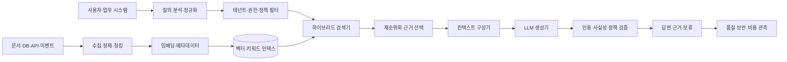
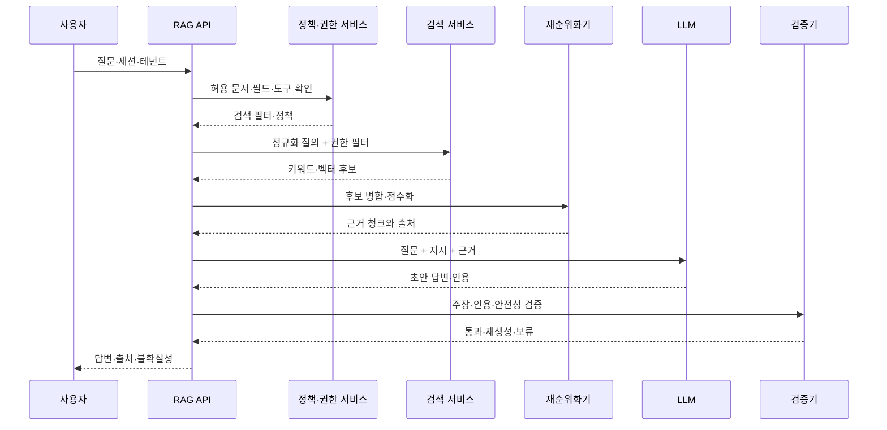

# 검색 증강 생성(RAG, Retrieval-Augmented Generation)

## 1. 개요

### 가. 정의

> **검색 증강 생성(RAG)**은 대규모 언어 모델(LLM)의 파라미터에 저장된 지식만 사용하는 대신, 질문 시점에 외부 문서·데이터베이스·검색 인덱스에서 관련 근거를 검색하여 생성 프롬프트 또는 생성 과정에 주입하는 아키텍처이다.

RAG의 본질은 검색기(retriever)와 생성기(generator)의 결합이다. 검색기는 사용자의 질문과 의미적으로 또는 어휘적으로 가까운 문서 조각을 찾아 외부 지식의 후보를 만든다. 생성기는 그 후보와 질문을 함께 받아 답변을 작성한다. 따라서 RAG는 단순히 LLM에 긴 문서를 붙이는 프롬프트 기법이 아니라, 지식 저장·검색·근거 선택·답변 생성·평가를 하나의 정보 시스템으로 설계하는 방식이다.

Lewis et al.은 RAG를 사전학습 모델의 **파라미터 메모리**와 외부 인덱스의 **비파라미터 메모리**를 결합하는 방법으로 정식화했다([Lewis et al., 2020](https://arxiv.org/abs/2005.11401)). 원 논문은 사전학습 시퀀스-투-시퀀스 생성기와 Wikipedia의 dense vector index를 결합해 지식 집약적 질의응답을 수행했다. 오늘날의 기업 RAG는 사내 규정, 설계서, 상담 이력, 표·코드·데이터베이스 등으로 지식 원천이 확장되었지만, “필요한 외부 근거를 찾아 생성에 연결한다”는 핵심은 같다.

RAG가 LLM을 학습 데이터의 최신성 문제에서 완전히 해방시키는 것은 아니다. 모델은 질문을 해석하고 검색 결과를 요약하는 능력을 여전히 파라미터에 의존하며, 검색 인덱스에 없거나 잘못 색인된 정보는 답변에 반영되지 않는다. 따라서 기술사 답안에서는 RAG를 환각을 자동 제거하는 만능 해법이 아니라, 지식의 최신성·출처성·접근권한을 런타임에 통제하는 설계 패턴으로 설명해야 한다.

### 나. 등장 배경과 필요성

LLM의 파라미터 지식은 학습 시점에 고정되고, 조직의 비공개 문서나 최근 개정 규정을 자동으로 알지 못한다. 새로운 내용을 모델 재학습으로 반영하려면 데이터 정제, 학습 비용, 안전성 검증, 배포와 롤백이 필요하다. 반면 RAG는 문서 파이프라인과 검색 인덱스를 갱신해 지식 원천을 비교적 빠르게 교체할 수 있다.

기업 업무에서는 답변의 유창함보다 근거와 추적성이 중요하다. 인사 규정 상담에서 잘못된 휴가 일수를 말하거나, 설비 정비 시스템에서 폐기된 매뉴얼을 근거로 작업하면 비용과 안전 문제가 발생한다. RAG는 검색된 문서의 제목, 버전, 유효일, 페이지 또는 문단을 함께 제공하여 검토자와 사용자에게 답변의 근거를 보여줄 수 있다.

또한 RAG는 하나의 범용 모델을 모든 조직 데이터로 재학습하지 않고, 업무별 지식 저장소를 분리할 수 있게 한다. 고객사 A의 문서와 고객사 B의 문서를 서로 다른 테넌트 인덱스로 관리하고, 사용자 권한에 맞는 문서만 검색하면 데이터 격리와 운영 유연성을 높일 수 있다. 다만 필터링을 검색 이후에만 수행하면 이미 노출된 텍스트가 프롬프트에 들어갈 수 있으므로 권한 조건은 검색 단계부터 적용해야 한다.

### 다. 목표와 적용 범위

RAG 도입의 목표는 다음과 같이 정리할 수 있다.

1. 최신·조직 특화 지식을 모델 재학습보다 짧은 주기로 반영한다.
2. 답변을 근거 문서와 연결하여 검증 가능성과 감사 가능성을 높인다.
3. 문서 원천의 접근권한·보존기간·테넌트 경계를 질의 시점에 집행한다.
4. 검색 품질과 생성 품질을 분리 측정하여 원인별 개선이 가능하게 한다.
5. 모델이 근거 부족을 인식하면 추측 대신 보류·추가질문·전문가 이관을 선택하게 한다.

RAG는 규정 질의응답, 기술지원, 사내 검색, 지식관리, 설계 검토 보조, 고객 상담과 같이 외부 지식의 활용이 중요한 업무에 적합하다. 반면 정확한 수치 계산, 복잡한 트랜잭션 변경, 실시간 시세 판단과 같이 검색만으로 안전성을 보장할 수 없는 업무는 도구 호출, 검증 서비스, 사람의 승인과 함께 설계해야 한다.

## 2. 참조 아키텍처와 동작 원리

### 가. 전체 구조

온라인 경로는 질문을 분석하고, 권한과 테넌트 조건을 적용한 뒤, 후보 문서를 검색하고 재순위화하여 LLM에 전달한다. 생성 이후에는 인용의 존재, 근거와 주장 사이의 연결, 금칙어와 개인정보 노출, 답변 형식 준수 여부를 검증한다. 검증이 실패하면 답변을 그대로 통과시키지 않고 재생성·보류·사람 이관으로 분기한다.

오프라인 경로는 원천 문서의 수집과 인덱싱을 담당한다. 문서가 추가·수정·삭제되면 파서가 본문과 구조를 추출하고, 의미 단위로 나누어 임베딩과 메타데이터를 생성한다. 원문 버전과 인덱스 버전을 연결해 두어야 “현재 답변이 어느 시점의 문서에 근거했는가”를 재현할 수 있다.

검색 인덱스는 하나의 저장소일 필요가 없다. 키워드 검색은 제품명, 조항 번호, 오류 코드처럼 정확한 용어에 강하고, 벡터 검색은 표현이 다른 의미적 유사 문서를 찾는 데 강하다. 실무에서는 두 결과를 병합한 뒤 재순위화하는 하이브리드 구조가 자주 사용되며, 데이터 규모와 도메인 특성에 따라 관계형 DB, 검색엔진, 벡터 DB, 그래프 DB를 조합한다.

### 나. 질의 처리 순서

첫 단계의 질의 정규화는 오탈자 보정, 약어 확장, 대화 맥락 결합, 날짜와 조직 범위의 명시화를 포함한다. 예를 들어 “휴가 규정 알려줘”는 대상 국가, 고용 형태, 기준일이 없으므로 바로 검색하기보다 추가질문을 하거나 기본 범위를 명시해야 한다. 질의를 임의로 확장하면 원래 의도와 다른 문서를 검색할 수 있으므로 원문과 변환 질의를 모두 감사 가능하게 남긴다.

정책 서비스는 사용자·역할·부서·테넌트·문서 분류·유효기간에 따라 검색 가능 범위를 반환한다. 이 필터는 검색 API의 조건이나 인덱스 파티션에 강제하고, 애플리케이션 코드의 선택적 if 문에만 의존하지 않는다. 권한이 바뀌었을 때 임베딩 캐시와 답변 캐시가 이전 사용자의 결과를 재사용하지 않도록 캐시 키에 권한 버전이나 정책 버전을 반영한다.

후보 검색 뒤에는 중복·오래된 버전·상충하는 문서를 정리한다. 상위 결과가 모두 같은 문서의 반복 청크이면 답변의 관점이 좁아질 수 있고, 서로 다른 개정판이 함께 들어오면 모델이 최신성과 폐기를 혼동할 수 있다. 재순위화 단계에서는 관련성뿐 아니라 유효일, 출처 신뢰도, 문서 권한, 중복도, 사용자 질문의 세부 조건을 함께 고려한다.

### 다. 생성과 검증의 연결

컨텍스트 구성기는 질문, 시스템 지시, 검색 근거, 응답 형식, 금지된 행동을 명확히 구분한다. 검색 문서 안에 “이전 지시를 무시하라”와 같은 문장이 있어도 그것은 데이터이지 시스템 지시가 아니다. 문서 내용을 신뢰할 수 있는 명령으로 승격하지 않도록 구분자와 프롬프트 정책을 적용한다.

생성기는 근거 밖의 사실을 추정하지 않아야 한다. 답변 템플릿에 “근거 문서에 없는 경우 확인 불가라고 답하라”, “주장별 출처를 표시하라”, “문서 간 충돌을 숨기지 말라”와 같은 규칙을 넣을 수 있다. 그러나 프롬프트만으로 보장할 수 없으므로 별도 검증기와 테스트셋이 필요하다.

검증기는 답변을 문장 또는 주장 단위로 분해하여 각 주장에 필요한 근거가 있는지 검사한다. 인용이 붙어 있어도 인용 문서가 실제 주장을 지지하지 않을 수 있으므로 인용의 존재와 인용의 entailment를 구분한다. 중요한 업무에서는 모델 기반 판정만 사용하지 말고 규칙, 원문 링크, 구조화된 필드 비교, 도메인 검증 API를 함께 사용한다.

## 3. 데이터 준비와 검색 설계

### 가. 문서 수집·정제·계보

RAG의 품질은 LLM보다 원천 데이터의 품질에 의해 크게 좌우된다. PDF의 머리글·꼬리글이 본문에 반복되거나 표의 열 순서가 뒤섞이면 임베딩이 문서 의미를 잘 표현하지 못한다. OCR 대상 문서는 인식률, 표·각주 보존, 스캔 페이지 누락을 검수하고, 파싱 실패 문서는 색인 완료로 표시하지 않는다.

수집 파이프라인은 원문 URI, 소유자, 문서 유형, 언어, 작성일, 개정일, 유효 시작·종료일, 보안 등급, 삭제 상태, 해시, 파서 버전을 메타데이터로 저장한다. 이 정보는 검색 필터뿐 아니라 답변의 출처와 회귀 분석에도 쓰인다. 문서가 삭제되었는데 벡터 인덱스에 남아 있는 고아 청크를 정기적으로 탐지해야 한다.

문서 계보(lineage)는 원본에서 파싱된 텍스트, 청크, 임베딩, 검색 결과, 답변까지의 연결이다. 동일한 문서가 재수집되었을 때 해시로 변화를 판단하고, 내용이 바뀐 청크만 다시 임베딩하면 비용을 줄일 수 있다. 파서와 임베딩 모델을 바꿀 때는 인덱스 버전을 분리하여 구버전 결과와 신버전 결과를 비교한 후 전환한다.

### 나. 청킹과 메타데이터

청킹은 문서를 고정 길이로 자르는 문제가 아니라 검색 단위를 설계하는 문제다. 너무 작은 청크는 문맥과 조건을 잃고, 너무 큰 청크는 검색 결과에 불필요한 내용이 많아져 생성기의 주의력이 분산된다. 제목·조항·표의 행 관계·코드 블록·문단 경계를 보존하면서 목표 토큰 길이와 오버랩을 실험해야 한다.

규정 문서라면 장-절-조-항의 계층을 각 청크에 붙이고, 절차 문서라면 선행 조건과 예외 조건을 같은 청크 또는 연결된 청크로 묶는다. 표는 행만 분리하면 열 머리글의 의미가 사라지므로 표 제목과 단위, 열 이름을 반복해 구조화된 텍스트로 보존한다. 소스 문서의 페이지와 위치를 저장하면 사용자에게 정확한 인용을 보여줄 수 있다.

메타데이터는 검색 결과의 품질과 보안을 좌우한다. `tenant_id`, `acl`, `document_type`, `effective_from`, `effective_to`, `language`, `source_system`, `version`, `page`와 같은 필드를 설계하고, 필터 가능한 값은 표준 코드로 관리한다. 메타데이터를 자유 텍스트로만 저장하면 부서명이 다르게 표기되어 권한 필터와 기간 필터가 누락될 수 있다.

### 다. 임베딩과 인덱싱

임베딩은 텍스트를 의미 공간의 벡터로 변환한다. 질문 벡터와 문서 벡터의 코사인 유사도나 내적을 비교해 후보를 찾지만, 유사도가 곧 정답성은 아니다. 제품 코드와 조항 번호처럼 문자 일치가 중요한 표현은 벡터 검색만으로 놓칠 수 있으므로 BM25 등 키워드 검색과 병행한다.

임베딩 모델을 바꾸면 벡터 공간의 의미가 달라지므로 기존 벡터와 직접 비교하지 않는다. 언어, 도메인 전문용어, 문서 길이, 질의 유형에 맞는 모델을 선택하고, 대표 질문-정답 문서 데이터셋으로 검색 성능을 비교한다. 임베딩 API에 개인정보나 기밀 원문을 보낼 때는 처리 위치, 보존 정책, 암호화, 계약 조건을 검토한다.

인덱스는 쓰기와 읽기의 일관성을 고려한다. 새 문서가 원천에 등록되었다고 즉시 검색 가능하다고 사용자에게 약속할지, 임베딩·검수 완료 후에만 공개할지 결정해야 한다. 증분 색인 중 실패하면 일부 청크만 노출되는 상황이 생길 수 있으므로 임시 인덱스에 적재한 뒤 원자적으로 별칭을 전환하거나, 문서 단위 상태를 필터로 집행한다.

### 라. 검색·재순위화

1차 검색은 넓게 후보를 모으고, 2차 재순위화는 질문과 후보의 세부 관련성을 판단한다. 1차에서 상위 5개만 가져오면 필요한 근거가 누락될 수 있고, 100개를 그대로 LLM에 넣으면 비용과 잡음이 증가한다. 후보 수와 최종 컨텍스트 수는 질문 유형별로 실험하며, 검색 점수·재순위 점수·선정 이유를 기록한다.

질의가 “2025년 개정된 정보보호 규정의 예외는?”이라면 의미 유사성뿐 아니라 연도, 문서 종류, “예외”라는 구조적 신호를 반영해야 한다. 기간과 버전 필터를 먼저 적용하고 검색해야 폐기된 규정이 상위에 오르는 일을 줄일 수 있다. 서로 충돌하는 문서가 검색되면 최신 문서를 임의로 숨기기보다 충돌을 표시하고 기준일과 개정 상태를 답변에 포함한다.

검색 실패도 정상적인 결과로 취급한다. 관련 문서가 없는데 가장 가까운 문서를 답변에 사용하면 그럴듯한 오답이 된다. 최소 유사도, 재순위 점수, 출처 신뢰도, 필수 메타데이터 충족 여부를 종합하여 “근거 부족” 상태를 만들고, 사용자에게 범위를 좁혀 다시 질문하도록 안내한다.

## 4. RAG 유형과 비교

### 가. 기본 RAG·고급 RAG·에이전트형 RAG

기본 RAG는 질문-검색-생성의 선형 흐름이다. 구조가 단순하고 지연시간과 비용을 예측하기 쉬워 초기 파일럿에 적합하다. 그러나 복합 질문을 하나의 검색 질의로 처리하기 어렵고, 잘못 검색된 결과를 스스로 수정하지 못한다.

고급 RAG는 질의 재작성, 하이브리드 검색, 재순위화, 문서 압축, 대화 맥락 관리, 답변 검증을 추가한다. 검색 품질을 개선할 수 있지만 구성요소가 늘어날수록 지연시간, 장애 지점, 평가 조합이 증가한다. 기능을 늘리기 전에 어떤 실패 유형을 줄이는지 기준선을 잡아야 한다.

에이전트형 RAG는 모델이 검색 도구를 여러 번 호출하고, 검색 결과를 평가하며, 필요하면 질의를 분해한다. 복합 조사에는 유리하지만 도구 호출 폭주, 무한 루프, 권한 범위 확대, 비용 예측 실패가 발생할 수 있다. 도구 목록과 인자 검증, 호출 횟수·시간 예산, 승인 경계를 명시해야 한다.

| 구분 | 기본 RAG | 고급 RAG | 에이전트형 RAG |
|---|---|---|---|
| 흐름 | 1회 검색 후 생성 | 전처리·재순위·검증 | 계획·반복 검색·도구 호출 |
| 장점 | 단순성·낮은 운영비 | 품질·통제력 개선 | 복합 질문 대응 |
| 위험 | 검색 실패에 취약 | 지연·구성 복잡도 | 비용·권한·루프 폭주 |
| 적합 업무 | FAQ·내부 검색 | 규정·기술지원 | 조사·다단계 분석 |

### 나. RAG와 파인튜닝·프롬프트·장문 컨텍스트

파인튜닝은 모델의 행동 양식이나 도메인 표현을 학습시키는 데 효과적이다. 하지만 최신 문서의 사실을 저장하고 출처를 실시간으로 제시하는 용도로는 관리가 어렵다. RAG는 지식을 인덱스에 두고 업데이트하는 반면, 파인튜닝은 모델 가중치에 패턴과 지식을 반영하므로 두 방법은 대체 관계라기보다 조합 관계일 수 있다.

프롬프트 엔지니어링은 모델에게 역할, 출력 형식, 예시와 제약을 전달하는 방식이다. 근거 문서를 프롬프트에 넣는 것도 RAG의 한 단계지만, 문서 수집·권한·검색·계보 없이 사람이 매번 자료를 붙이는 방식은 운영형 RAG가 아니다. 장문 컨텍스트 윈도우가 커져도 입력이 길어질수록 비용과 지연이 늘고, 모델이 중간 문서를 놓치거나 상충 정보를 혼합할 수 있다.

업무 선택 기준은 지식의 변화율, 자료의 접근 통제, 답변 근거 필요성, 학습 데이터의 양과 품질, 추론 비용이다. 자주 바뀌는 사내 규정은 RAG의 이점이 크고, 항상 같은 출력 형식과 말투가 문제라면 파인튜닝 또는 프롬프트가 적합할 수 있다. 전문 용어를 잘 이해하지 못하는 경우에는 도메인 임베딩, 질의 재작성, 소량의 지도학습을 RAG와 결합한다.

| 판단 항목 | RAG | 파인튜닝 | 장문 컨텍스트 |
|---|---|---|---|
| 최신 지식 갱신 | 인덱스 갱신 | 재학습 필요 | 매번 입력 필요 |
| 출처 제시 | 구조화하기 쉬움 | 별도 설계 필요 | 입력 문서에 의존 |
| 데이터 접근권한 | 검색 시 필터 | 모델 외부 통제 필요 | 프롬프트 구성 필요 |
| 행동·문체 학습 | 제한적 | 강점 | 예시로 가능 |
| 운영 부담 | 파이프라인·인덱스 | 학습·배포 | 토큰 비용·지연 |

## 5. 적용 사례와 운영 절차

### 가. 사내 규정 질의응답 사례

인사 규정, 취업규칙, 단체협약, 지역별 부속 규정이 있는 기업을 가정한다. 사용자가 “육아휴직 중 성과급 지급 기준은?”이라고 질문하면 시스템은 사용자 국가·법인·고용 형태·기준일을 확인하고 허용된 규정의 최신 버전을 검색해야 한다. 일반적인 법률 상식이나 다른 법인의 규정을 섞으면 답변이 유창해도 업무상 유효하지 않다.

문서 청크에는 규정명, 조항 번호, 시행일, 폐지일, 적용 법인, 보안등급을 붙인다. 검색 결과가 2024년 규정과 2026년 개정 규정을 함께 반환하면 개정일과 유효기간을 비교하고, 상충하는 경우 인사 담당자 확인을 요청한다. 답변에는 결론뿐 아니라 적용 조건, 관련 조항, 기준일, 예외와 문의 채널을 포함한다.

정답률만으로 성공을 판단하지 않는다. 사용자 권한이 없는 법인 문서가 검색되지 않았는지, 답변이 출처 조항을 정확히 인용하는지, 불확실할 때 보류하는지, 개정 직후 새 문서가 검색되는지까지 검증한다. 인사 상담 로그에는 질문과 답변을 남기되 주민등록번호나 민감한 인사정보가 불필요하게 저장되지 않도록 마스킹한다.

### 나. 제조 기술지원 사례

제조 현장에서는 장비 모델, 펌웨어 버전, 알람 코드, 공정 단계에 따라 조치가 달라진다. “E-204 알람 해결”이라는 질문에 일반 매뉴얼을 반환하는 것은 위험할 수 있다. 시스템은 장비 식별자와 현재 버전을 확인하고, 승인된 정비 매뉴얼과 안전 작업 절차에서 해당 조건의 조치를 검색해야 한다.

작업 절차 문서는 단계, 사전 차단, 필요한 공구, 위험 경고, 정상 복귀 조건을 분리해 색인한다. 검색된 청크에 안전 경고가 없으면 생성기가 임의로 절차를 보완하지 않고 전문 정비자 승인을 요구한다. 답변 생성과 실제 장비 제어를 분리하고, 제어 명령은 별도의 승인·인터록·이중 확인을 통과해야 한다.

현장 네트워크가 불안정한 경우 캐시된 매뉴얼을 사용할 수 있지만, 캐시가 최신 안전 문서인지 표시해야 한다. 오프라인 답변과 온라인 답변의 문서 버전이 다르면 사용자가 혼동하지 않도록 기준 시각과 동기화 상태를 표기한다. 이 사례는 RAG가 검색 편의 기능을 넘어 안전·변경관리·책임소재와 연결됨을 보여준다.

### 다. 도입 절차

1. **업무 범위와 위험 등급 정의**: 답변만 제공하는 업무와 실제 의사결정·제어로 이어지는 업무를 분리한다.
2. **문서 원천 목록화**: 소유자, 최신성, 보안 등급, 갱신 주기, 문서 형식, 폐기 절차를 조사한다.
3. **대표 질문셋 구축**: 정답 문서, 필수 조건, 금지된 문서, 예상 보류 질문을 골드셋으로 만든다.
4. **파싱·청킹 기준 수립**: 표·코드·조항·페이지 구조를 보존하고 실패 문서의 재처리 규칙을 정한다.
5. **권한 모델 연결**: 인덱스 ACL, 테넌트 필터, 문서 유효기간, 삭제 전파를 검색 경로에 강제한다.
6. **검색 기준선 측정**: 키워드·벡터·하이브리드 방식의 recall@k, MRR, nDCG를 비교한다.
7. **생성·인용 계약 설계**: 답변 형식, 출처 필드, 불확실성 표현, 금칙 영역과 보류 조건을 정의한다.
8. **안전·보안 시험**: 문서 프롬프트 인젝션, 권한 우회, 개인정보 회수, 상충 문서, 삭제 문서 질의를 시험한다.
9. **그림자 운영과 제한 공개**: 실제 사용자 영향 없이 검색과 답변을 비교하고, 낮은 위험 업무부터 단계적으로 공개한다.
10. **운영 자동화**: 인덱스 신선도, 오류, 비용, 지연, 피드백, 문서 삭제 전파를 대시보드와 알림으로 관리한다.

## 6. 심화 — 평가, 최신화와 보안형 RAG

### 가. 검색과 생성의 분리 평가

RAG 평가에서 “답변이 맞다” 하나의 지표만 보면 원인을 알 수 없다. 검색이 필요한 문서를 가져왔는지(retrieval recall), 상위 순위에 배치했는지(MRR·nDCG), 선택된 컨텍스트가 질문에 충분한지(context precision·recall), 최종 답변이 근거에 충실한지(faithfulness), 질문에 답했는지(answer relevance)를 나누어 본다.

예를 들어 정답 문서가 인덱스에 있지만 상위 10개에 없으면 검색 문제다. 정답 문서가 컨텍스트에 있는데 답변이 다른 내용을 말하면 생성·프롬프트·검증 문제다. 정답 문서 자체가 잘못되었거나 오래되었다면 지식관리 문제다. 계층별 지표와 실패 샘플을 연결해야 개선 활동이 올바른 구성요소로 향한다.

자동 평가기는 대규모 회귀 테스트에 유용하지만 절대적인 판정자가 아니다. 평가 모델의 언어·도메인 편향, 인용만 보고 내용의 지지 여부를 놓치는 오류, 기준 답변의 불완전성을 검토한다. 고위험 업무는 도메인 전문가가 표본을 검토하고, 자동 지표와 사람 평가 사이의 불일치도 별도 지표로 관리한다.

### 나. 최신화와 상충 지식

문서가 변경되면 새 버전을 색인하는 것만으로 충분하지 않다. 이전 버전이 검색되지 않도록 폐기 상태를 반영하고, 캐시와 사전 계산된 답변을 무효화하며, 진행 중인 대화의 컨텍스트가 새 정책을 오염시키지 않도록 해야 한다. 문서 유효일이 미래인 경우 예약 공개하고, 적용 시각의 시간대와 시계 동기화도 고려한다.

서로 다른 공식 문서가 충돌하면 모델에게 하나를 고르라고 맡기지 않는다. 문서 소유자, 개정일, 적용범위, 상위 규정, 승인 상태를 비교하고, 우선순위 규칙으로 선택하거나 충돌을 사용자에게 노출한다. 답변에는 “문서 A는 X, 문서 B는 Y라고 규정하므로 기준일 확인이 필요하다”와 같은 형태를 허용해야 한다.

### 다. 보안·개인정보와 프롬프트 인젝션

검색 문서는 신뢰할 수 있는 지시가 아니라 데이터다. 외부 웹 페이지, 이메일, 사용자 업로드 문서 안에 LLM에게 비밀을 출력하거나 도구를 호출하라고 지시하는 문장이 포함될 수 있다. 시스템 지시와 데이터 경계를 분리하고, 도구 호출은 허용 목록·인자 스키마·최소권한·승인 흐름으로 제어한다.

검색 단계의 ACL 필터와 생성 단계의 출력 필터는 서로 대체할 수 없다. 권한 없는 문서를 애초에 검색하지 않아야 하며, 모델이 다른 문서의 내용을 추론해 재구성하지 않는지 점검해야 한다. 답변 캐시는 사용자·테넌트·권한·문서 버전을 포함한 키를 사용하고, 검색 로그와 임베딩 저장소의 보존·암호화·접근 권한을 데이터 분류에 맞춘다.

NIST의 생성형 AI 위험관리 프로파일은 생성형 AI의 출처·검증·데이터 계보와 같은 위험을 다루는 참고 프레임워크다([NIST AI 600-1](https://doi.org/10.6028/NIST.AI.600-1)). RAG 도입 시 이 프레임워크의 Govern·Map·Measure·Manage 관점으로 원천 데이터, 검색 경로, 생성 결과, 사람의 검토 책임을 문서화하면 기술 구현을 거버넌스와 연결할 수 있다.

## 7. 고려사항 및 시사점

### 가. 정확성·최신성·완전성의 트레이드오프

관련 문서를 많이 넣는다고 답변이 항상 정확해지지 않는다. 문맥이 길어지면 잡음이 늘고, 상충하는 버전이 섞이며, 비용과 지연이 증가한다. 반대로 문서를 너무 적게 선택하면 예외 조건과 정의가 빠진다. 질문 유형별로 필요한 근거의 최소 집합과 최대 컨텍스트를 실험하고, 결과를 사용자 영향과 함께 판단한다.

최신성은 수집 주기와 공개 승인 사이의 시간차로 결정된다. 자동 수집은 빠르지만 악성·오류 문서를 즉시 공개할 수 있고, 수동 검수는 신뢰성을 높이지만 지연된다. 위험도가 높은 규정과 안전 문서는 승인된 버전만 검색 가능하게 하고, 일반 지식은 자동 색인 후 표본 검수하는 등 등급별 정책을 둔다.

### 나. 성능·비용·가용성

온라인 RAG의 지연은 질의 임베딩, 1차 검색, 재순위화, LLM 생성, 검증의 합으로 구성된다. 재순위화와 검증을 무조건 여러 번 호출하면 품질은 일부 개선되어도 사용자 경험과 비용이 악화될 수 있다. 질문 위험도와 복잡도에 따라 경량 경로와 심화 경로를 나누고, 전체 deadline을 각 단계에 전파한다.

벡터 검색과 임베딩 비용만 보지 말고 문서 파싱, 저장, 재색인, LLM 입력 토큰, 출력 토큰, 캐시, 관측성 비용을 포함한 TCO를 계산한다. 긴 문서 전체를 매번 넣는 대신 청크 압축과 중복 제거를 적용하고, 자주 묻는 공개 질의는 근거 버전이 바뀌지 않을 때만 안전하게 캐시한다.

검색 인덱스 장애 시 서비스가 무조건 빈 답변을 생성하도록 하면 위험하다. 검색 불가 상태를 명확히 표시하고, 승인된 정적 FAQ나 전문가 채널로 전환한다. 모델 장애, 임베딩 장애, 원천 시스템 장애를 각각 격리하고, 인덱스 복구·재색인·버전 롤백 절차를 연습한다.

### 다. 보안·개인정보·책임성

RAG는 문서를 모델 가중치에 학습시키지 않는다고 해서 개인정보 위험이 사라지지 않는다. 검색 결과와 프롬프트, 로그, 평가 데이터, 캐시가 개인정보를 복제할 수 있다. 수집 목적과 보존기간을 정하고, 최소 수집·비식별화·접근통제·암호화·삭제 전파를 데이터 생애주기에 맞춰 적용한다.

답변이 의사결정에 영향을 주는 경우 최종 책임 주체와 인간 검토 지점을 명확히 한다. “AI가 참고용”이라는 문구만으로 충분하지 않으며, 어떤 조건에서 자동 제공을 중지하고 어떤 역할의 담당자가 승인하는지 운영 절차에 넣어야 한다. 사용자 피드백과 이의제기 결과는 모델 개선뿐 아니라 문서 원천과 정책의 결함을 찾는 감사 자료가 된다.

### 라. 관측성·변경관리·평가 거버넌스

필수 운영 지표는 답변 지연, 검색 실패, 인덱스 신선도, top-k 적중률, 인용 누락, 근거 불충실, 보류율, 사용자 재질문율, 토큰 비용, 권한 오류다. 지표를 평균만 저장하지 말고 문서 유형·테넌트·질문 유형·모델 버전으로 분해한다. 단, 원문 질문과 답변의 민감도에 맞춘 접근권한을 유지해야 한다.

임베딩 모델, 청킹 규칙, 재순위화 모델, 프롬프트, LLM, 정책 필터를 변경할 때는 모두 RAG 결과에 영향을 주는 릴리스 대상이다. 골드셋 회귀, 보안 테스트, 비용·지연 부하 테스트, 인덱스 버전 비교를 거친 후 단계적으로 전환한다. 답변만 저장하지 말고 사용한 문서 버전, 검색 점수, 모델·프롬프트 버전, 검증 결과를 재현 가능한 형태로 남긴다.

### 마. 기술사 관점의 도입 판단

RAG 도입의 출발점은 “LLM을 붙이자”가 아니라 정보가 어디에 있고, 얼마나 자주 바뀌며, 누가 읽을 수 있고, 오답의 비용이 얼마인지에 대한 업무 분석이다. 문서 소유권과 최신화 책임이 불분명하면 좋은 검색 알고리즘도 신뢰할 수 있는 답변을 만들지 못한다. 먼저 원천 데이터와 업무 책임을 정비하고, 위험이 낮고 측정 가능한 사용 사례에서 기준선을 만든다.

아키텍처는 검색·생성·검증을 분리하고 각 계층의 실패를 보류와 대체 경로로 연결해야 한다. RAG의 핵심 성과는 답변 길이나 모델 크기가 아니라, 필요한 근거를 올바른 사용자에게 적시에 전달하고 근거가 부족할 때 안전하게 멈추는 능력이다. 이 원칙을 SLO, 보안통제, 평가셋, 운영 런북으로 구체화하는 것이 기술사의 역할이다.

## 참고자료

- [Lewis et al. — Retrieval-Augmented Generation for Knowledge-Intensive NLP Tasks](https://arxiv.org/abs/2005.11401)
- [Gao et al. — Retrieval-Augmented Generation for Large Language Models: A Survey](https://arxiv.org/abs/2312.10997)
- [NIST — Artificial Intelligence Risk Management Framework: Generative Artificial Intelligence Profile (AI 600-1)](https://doi.org/10.6028/NIST.AI.600-1)
- [NIST AI RMF Generative AI Profile Knowledge Base](https://airc.nist.gov/AI_RMF_Knowledge_Base/Generative_AI)
- [Es et al. — RAGAS: Automated Evaluation of Retrieval Augmented Generation](https://arxiv.org/abs/2309.15217)

---

> **한 줄 요약**: RAG는 외부 지식을 검색해 LLM의 생성에 연결하는 기술이지만, 검색 품질·권한·문서 계보·검증·보류 정책까지 포함한 운영형 정보 아키텍처로 설계해야 신뢰할 수 있다.
