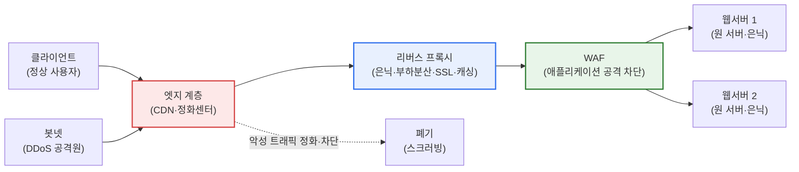
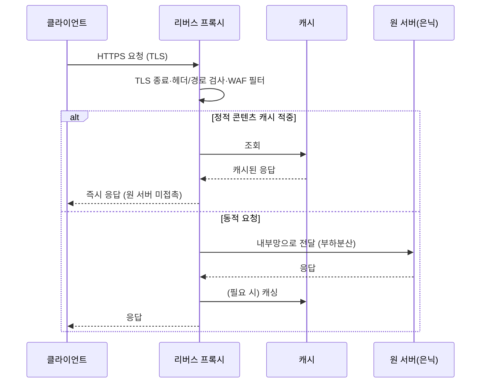
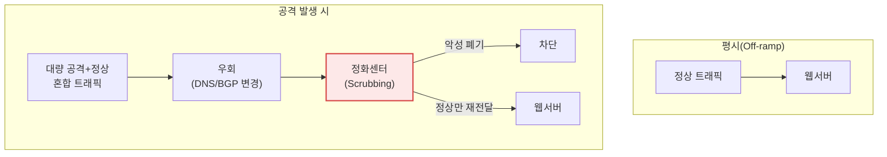

# 웹서버 보안 — 리버스 프록시와 DDoS 사이버대피소

## 1. 개요

### 가. 정의
> **리버스 프록시(Reverse Proxy)** 는 클라이언트와 실제 웹서버(원 서버, Origin) 사이에 위치하여 모든 요청을 대신 수신·검사·중계하고 응답을 되돌려 주는 서버 대리(server-side proxy)이며, **DDoS 사이버대피소(Cyber Shelter / Scrubbing Center)** 는 대규모 분산 서비스 거부 공격 발생 시 피해 조직의 트래픽을 정화센터로 우회시켜 악성 트래픽을 걸러낸 뒤 정상 트래픽만 원 서버로 전달하는 트래픽 정화 서비스이다.

웹서버 보안의 근본 발상은 "**서버를 직접 노출하지 말고, 앞단에 완충·정화 계층을 세우라**"는 것이다. 웹서버가 공인 IP로 인터넷에 직결되면 포트·배너·경로 구조·취약점이 그대로 공격 표면(attack surface)이 되고, 트래픽이 조금만 몰려도 자원이 고갈되어 서비스가 멈춘다. 리버스 프록시는 이 문제를 구조적으로 해소한다. 클라이언트는 프록시의 주소만 알 뿐 실제 서버의 위치·개수·내부 구조를 알 수 없으며(은닉), 프록시가 요청을 받아 인증·필터링·캐싱·부하분산을 수행한 뒤 뒤단으로 전달하므로, 원 서버는 신뢰된 내부망에서 보호된다.

DDoS는 성격이 다른 위협이다. 리버스 프록시가 애플리케이션 계층의 "질(質)"을 다룬다면, DDoS는 트래픽의 "양(量)"으로 서비스를 마비시킨다. 수만~수십만 대의 좀비 PC·IoT 봇넷이 초당 수백 Gbps에서 Tbps급 트래픽을 쏟아부으면, 어떤 리버스 프록시나 방화벽도 대역폭 자체가 포화되어 무력화된다. 이때는 개별 조직의 앞단 방어만으로 감당할 수 없으므로, 통신사·정부(예: 한국인터넷진흥원 KISA의 'DDoS 사이버대피소')·클라우드 사업자가 운영하는 대규모 정화센터로 트래픽을 우회시켜 대신 흡수·정화한다. 즉 리버스 프록시와 사이버대피소는 상호 배타적 기술이 아니라, **공격 표면 축소(평시)** 와 **대용량 흡수·정화(유사시)** 를 담당하는 상보적 계층이다.

### 나. 등장 배경과 필요성
웹은 조직의 얼굴이자 가장 노출된 자산이다. OWASP·SQLi·XSS 같은 애플리케이션 공격은 물론이고, 볼류메트릭(대역폭 고갈)·프로토콜(TCP SYN Flood)·애플리케이션(HTTP GET/POST Flood) 등 계층별 DDoS가 상시 위협이 된다. 특히 미라이(Mirai) 봇넷 사례(2016년, 최대 약 1.2Tbps로 DNS 제공사 Dyn을 마비)와 그 이후 IoT 기반 공격의 대형화, HTTP/2 Rapid Reset(CVE-2023-44487, 2023년 초당 수억 건 요청) 같은 신종 애플리케이션 DDoS는 "앞단 단일 방어"의 한계를 드러냈다. 이에 따라 ① 서버를 은닉·중계하는 리버스 프록시, ② 웹 공격을 걸러내는 WAF, ③ 대용량을 흡수하는 사이버대피소/CDN을 계층적으로 결합하는 **다층 방어(Defense in Depth)** 가 표준 운영 방식으로 자리 잡았다.

## 2. 전체 방어 구조 개관

먼저 웹서버 보안 계층 전체가 어떻게 맞물리는지 구조도로 조망한 뒤, 세부 요소를 프로세스 관점에서 살펴본다.

이 구조의 핵심은 **관문의 다단화**이다. 트래픽은 바깥에서 안으로 들어올수록 좁고 정제된 통로를 지난다. 엣지 계층(CDN·정화센터)이 대용량 볼류메트릭 공격을 1차로 흡수·폐기하고, 리버스 프록시가 서버를 은닉하며 부하를 분산하고, WAF가 애플리케이션 계층의 악성 요청을 차단한 뒤에야 비로소 원 서버에 도달한다. 각 계층은 자신이 가장 잘 막을 수 있는 위협에 특화되어 있어, 하나가 뚫려도 다음 계층이 방어를 이어 간다.

## 3. 리버스 프록시

### 가. 동작 원리
리버스 프록시는 "서버를 대리(代理)한다"는 점에서 클라이언트를 대리하는 포워드 프록시와 정반대다. 외부에서 보면 프록시가 곧 웹서버처럼 보이고, 실제 원 서버는 프록시 뒤에 숨는다. 대표 구현은 Nginx·HAProxy·Envoy·Apache(mod_proxy)이며, 클라우드에서는 AWS ALB, GCP Cloud Load Balancing 등이 같은 역할을 한다. 요청이 도착하면 프록시는 TLS를 종료(복호화)하고, 헤더·경로·메서드를 검사한 뒤, 정적 콘텐츠는 캐시로 즉답하고 동적 요청만 뒤단 서버로 라우팅한다.

### 나. 서버 은닉과 공격 표면 축소
리버스 프록시가 제공하는 가장 본질적 보안 효과는 **원 서버의 은닉**이다. 클라이언트는 프록시의 IP만 알 뿐, 원 서버의 실제 주소·개수·OS·미들웨어 버전을 알 수 없다. 공격자는 표적을 특정하기 어려워지고, 스캐닝·직접 취약점 공격의 난도가 크게 올라간다. 실무에서는 원 서버를 사설 IP 대역에 두고 방화벽에서 프록시로부터의 요청만 허용(화이트리스트)해, 우회 접속 자체를 원천 차단한다. 서버 배너·에러 페이지·응답 헤더(Server, X-Powered-By)를 프록시에서 제거하면 정보 노출도 줄어든다.

### 다. 부하 분산·성능·SSL 종료
리버스 프록시는 다수의 원 서버로 요청을 분배(라운드로빈·최소연결·IP 해시)하여 단일 서버 과부하를 방지하고, 한 서버가 죽으면 헬스체크로 감지해 자동 격리한다. 이는 가용성과 방어 능력을 동시에 높인다. 또한 TLS 종료(SSL Offloading)를 프록시가 전담하면 원 서버는 암복호화 연산 부담을 덜고, 인증서 관리도 한 곳으로 집중된다. 정적 콘텐츠 캐싱·gzip/Brotli 압축을 앞단에서 처리하면 원 서버 트래픽을 수십 퍼센트까지 줄일 수 있어, 그 자체로 완만한 부하성 공격에 대한 완충 역할을 한다.

### 라. 보안 필터링(WAF 연계)
리버스 프록시는 WAF(Web Application Firewall)와 결합해 SQL 인젝션·XSS·경로 탐색 같은 애플리케이션 공격을 시그니처·룰(예: OWASP ModSecurity Core Rule Set)로 걸러낸다. Rate Limiting(요청 속도 제한)·지역 차단(GeoIP)·봇 탐지도 프록시 계층에서 수행해, 애플리케이션 계층 DDoS(HTTP Flood)의 1차 완화를 담당한다.

| 기능 | 내용 | 보안 효과 |
|---|---|---|
| **서버 은닉** | 실제 서버 IP·구조·버전 은폐 | 공격 표면·정찰 난도↑ |
| **부하 분산** | 다중 서버 분배·헬스체크 격리 | 가용성·완충력↑ |
| **SSL 종료** | 앞단 암복호화·인증서 집중 | 연산 부담↓·관리 일원화 |
| **캐싱·압축** | 정적 콘텐츠 캐시·gzip/Brotli | 원 서버 부하 수십%↓ |
| **보안 필터링** | WAF 룰·Rate Limit·GeoIP·봇 탐지 | 애플리케이션 공격·L7 DDoS 완화 |

## 4. DDoS 사이버대피소

### 가. DDoS의 계층별 유형
DDoS는 공격 계층에 따라 성격과 방어법이 다르다. **볼류메트릭 공격**(UDP/ICMP Flood, DNS·NTP 증폭)은 대역폭 자체를 고갈시키며 초당 수백 Gbps~Tbps에 이른다. **프로토콜 공격**(SYN Flood, ACK Flood)은 서버·방화벽의 연결 상태 테이블을 소진시킨다. **애플리케이션 공격**(HTTP GET/POST Flood, Slowloris, HTTP/2 Rapid Reset)은 적은 대역폭으로도 정상 요청처럼 위장해 서버 자원을 고갈시켜 탐지가 가장 어렵다. 사이버대피소는 특히 개별 조직이 감당 불가능한 **볼류메트릭·프로토콜 공격의 대용량 흡수**에 강점이 있다.

### 나. 트래픽 우회·정화 원리
사이버대피소의 동작은 세 단계다. ① **우회(Diversion)**: 공격이 탐지되면 DNS 변경(도메인의 A 레코드를 대피소 IP로) 또는 BGP 라우팅 변경(공격 대상 IP 대역의 경로를 대피소로 광고)으로 트래픽을 정화센터로 유입시킨다. ② **정화(Scrubbing)**: 정화센터가 시그니처·행위 분석·평판(Reputation)·챌린지(예: JS/CAPTCHA)로 봇넷 트래픽을 식별해 폐기하고, 정상 트래픽만 남긴다. ③ **재전달(Re-injection)**: 정제된 정상 트래픽만 GRE 터널·전용회선 등으로 원 서버에 되돌려 보낸다.

### 다. 국내 사이버대피소와 운영 체계
국내에서는 KISA가 중소기업 등을 대상으로 'DDoS 사이버대피소'를 무료로 제공하며, 평시에 도메인을 사전 연동해 두었다가 공격 발생 시 트래픽을 대피소로 우회시켜 정화한다. 통신사(KT·SK브로드밴드 등)와 클라우드·CDN 사업자(Cloudflare, AWS Shield, Akamai Prolexic 등)도 상용 스크러빙 서비스를 운영한다. 핵심은 **사전 대비**다. 공격이 시작된 뒤 부랴부랴 연동하면 이미 서비스가 마비된 상태이므로, 평시에 DNS·BGP 연동, 화이트리스트, 정상 트래픽 임계치(baseline)를 미리 설정하고 모의훈련을 해 두어야 신속 전환이 가능하다.

| 구성 | 내용 | 관건 |
|---|---|---|
| **트래픽 우회** | DNS/BGP로 정화센터 유입 | 신속 전환(RTO 최소화) |
| **트래픽 정화** | 시그니처·행위·평판·챌린지 필터 | 오탐(정상 차단) 최소화 |
| **정상 재전달** | GRE 터널·전용회선 재주입 | 정상 사용자 지연 최소화 |
| **사전 연동** | 평시 baseline·화이트리스트 설정 | 훈련·연동 상시 유지 |

## 5. 심화 — 클라우드·CDN 통합 방어와 최신 동향

최근 방어의 무게중심은 온프레미스 장비에서 **클라우드·CDN 엣지**로 이동하고 있다. Cloudflare·Akamai·AWS(CloudFront+Shield Advanced)·Fastly 같은 사업자는 전 세계에 분산된 대규모 엣지 POP(Point of Presence)에서 리버스 프록시·WAF·DDoS 정화·CDN 캐싱을 **하나의 통합 서비스**로 제공한다. 트래픽이 사용자와 가까운 엣지에서 흡수·정화되므로, 대용량 볼류메트릭 공격이 원 서버 근처에 도달하기 전에 분산 처리된다. 사업자들은 수십 Tbps 규모의 정화 용량을 광고하며, 실제로 2023~2024년 HTTP/2 Rapid Reset(CVE-2023-44487) 계열 공격에서 초당 수억 건의 요청을 엣지에서 차단한 사례가 보고되었다(구체 수치는 사업자 공개자료 기준이며 시점에 따라 달라질 수 있다).

동시에 애플리케이션 계층 방어가 정교해지고 있다. AI·머신러닝 기반 이상 트래픽 탐지, 봇 관리(Bot Management)로 정상 봇(검색엔진)과 악성 봇을 구분, 그리고 **Zero Trust·SASE**와의 결합으로 "신뢰된 엣지에서만 원 서버 접근 허용"이 강화된다. 또한 원 서버 IP가 과거 DNS 이력·오설정으로 노출되어 엣지를 우회당하는 사고를 막기 위해, 원 서버 방화벽이 CDN/프록시 대역만 허용하도록 강제하는 '오리진 클로킹(Origin Cloaking)'이 모범 운영 사례로 자리 잡았다.

## 6. 고려사항 및 시사점 (기술사 관점)

1. **다층 방어의 조합과 계층별 역할 분담**: 단일 지점 방어는 반드시 뚫린다. 엣지(볼류메트릭 흡수)·리버스 프록시(은닉·부하분산)·WAF(애플리케이션 공격)·사이버대피소(대용량 정화)를 계층적으로 결합하되, 각 계층이 중복 없이 특화 위협을 맡도록 설계해야 한다. 이는 방어 심층화와 동시에 병목·비용 최적화의 문제다.

2. **평시 대비와 신속 전환(RTO 최소화)**: 사이버대피소·스크러빙은 공격 발생 후 우회 전환 속도가 곧 피해 규모를 좌우한다. 평시에 DNS TTL 단축, BGP 연동, 정상 트래픽 baseline·임계치, 화이트리스트를 준비하고 정기 모의훈련을 해야 한다. 탐지-우회-정화의 자동화(오케스트레이션)로 사람 개입 지연을 줄이는 것이 관건이다.

3. **오탐(False Positive)과 사용자 경험의 트레이드오프**: 정화 강도를 높이면 정상 사용자까지 챌린지·차단에 걸려 이탈한다. 반대로 느슨하면 공격이 새어 든다. 애플리케이션 특성(로그인·결제 트래픽 패턴)에 맞춰 룰을 튜닝하고, CAPTCHA·JS 챌린지의 사용자 마찰을 최소화하는 균형 설계가 필요하다.

4. **엣지 우회(Origin Exposure) 리스크 관리**: 아무리 CDN·프록시로 감싸도 원 서버 IP가 노출되면 공격자가 엣지를 건너뛰고 직접 타격한다. 원 서버 방화벽을 CDN/프록시 대역만 허용하도록 강제하고, 과거 DNS 이력·서브도메인·메일 서버를 통한 IP 유출 경로를 정기 점검해야 한다.

5. **비용·성능·주권(Sovereignty)의 균형**: 클라우드 통합 방어는 강력하지만 트래픽 비용·종속(Lock-in)·데이터 주권 이슈를 동반한다. 공공·금융처럼 데이터 국외 이전이 민감한 영역은 국내 정화센터·리버스 프록시 조합을, 글로벌 서비스는 CDN 엣지 방어를 선택하는 등 서비스 성격에 맞는 아키텍처 전략이 요구된다.

## 참고자료
- KISA 보호나라, DDoS 사이버대피소 서비스 안내: https://www.boho.or.kr/
- Cloudflare Learning Center, "What is a reverse proxy?": https://www.cloudflare.com/learning/cdn/glossary/reverse-proxy/
- Cloudflare, HTTP/2 Rapid Reset (CVE-2023-44487) 분석: https://blog.cloudflare.com/technical-breakdown-http2-rapid-reset-ddos-attack/
- OWASP ModSecurity Core Rule Set(CRS): https://coreruleset.org/
- AWS, "AWS Best Practices for DDoS Resiliency": https://docs.aws.amazon.com/whitepapers/latest/aws-best-practices-ddos-resiliency/

---

> **한 줄 요약**: 웹서버 보안은 *리버스 프록시로 원 서버를 은닉·보호(부하분산·SSL 종료·캐싱·WAF 필터링)* 하고, 대용량 DDoS는 *사이버대피소·스크러빙센터로 트래픽을 우회·정화(DNS/BGP 전환→봇넷 폐기→정상 재전달)* 하며, 엣지·CDN·Zero Trust와 결합한 다층 방어로 평시 공격 표면을 줄이고 유사시 대용량을 흡수해 안정적 서비스를 실현한다.
