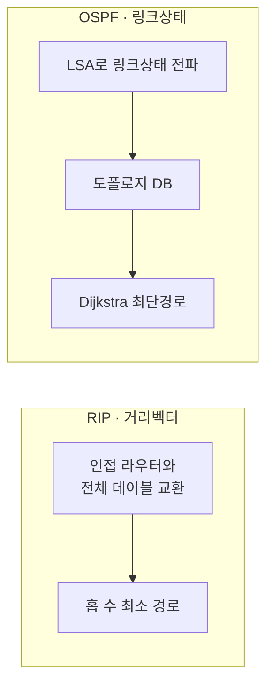

# RIP vs OSPF (라우팅 프로토콜 비교)

## 1. 개요

### 가. 정의
> **RIP**(Routing Information Protocol)은 목적지까지의 홉 수를 기준으로 경로를 정하는 **거리벡터(Distance Vector)**, **OSPF**(Open Shortest Path First)는 전체 토폴로지를 파악해 최단경로를 계산하는 **링크상태(Link State)** 방식의 대표적 IGP(내부 게이트웨이 프로토콜)이다.

두 프로토콜은 같은 목적(자율시스템 내부 경로 결정)을 정반대의 정보 모델로 푼다. RIP는 라우터가 자기 이웃이 알려준 거리 정보만 믿고 경로를 정하는 "**소문 기반**"이고, OSPF는 모든 라우터가 전체 지도를 공유한 뒤 각자 계산하는 "**지도 기반**"이다. 이 근본 차이가 수렴 속도·확장성·자원 사용의 모든 격차를 만든다.

### 나. 등장 배경 및 필요성
초기 소규모 망에서는 설정이 단순한 RIP로 충분했다. 그러나 RIP는 최대 15홉까지만 도달 가능(16=무한대)하다는 **규모 한계**와, 30초 주기로 테이블 전체를 주고받아 장애 전파가 느린 **수렴 지연** 때문에 대규모 망에서 라우팅 루프와 지연이 심각해졌다. 특히 링크 하나가 끊겼을 때 "이웃을 통해 우회할 수 있다"는 잘못된 정보가 서로 되먹임되며 홉 수가 서서히 증가하는 **카운트 투 인피니티(Count-to-Infinity)** 문제가 고질적이었다. 이를 극복하고 대규모·확장성 있는 라우팅을 제공하기 위해 링크상태 방식의 OSPF가 등장했다.

## 2. 동작 방식

RIP는 주기적으로 이웃과 라우팅 테이블 전체를 교환하고, 각 목적지에 대해 홉 수가 가장 적은 경로를 택한다(벨만-포드). 이 방식은 라우터가 전체 구조를 모른 채 이웃 정보에만 의존하므로 잘못된 정보가 퍼지기 쉽다. 반면 OSPF는 각 라우터가 자신의 링크 상태를 **LSA(Link State Advertisement)** 로 전체에 전파해, 모든 라우터가 동일한 **토폴로지 DB(지도)** 를 구성한 뒤 **다익스트라(SPF) 알고리즘**으로 각자 최단경로를 계산한다.

메트릭 차이도 본질적이다. RIP는 오직 **홉 수**만 보므로 1Gbps 3홉보다 10Mbps 2홉을 우선하는 비합리적 선택을 할 수 있는 반면, OSPF는 **대역폭 기반 Cost**를 쓰므로 실제 성능이 좋은 경로를 고른다.

## 3. 비교표

아래 표의 모든 차이는 결국 "이웃만 아는가, 전체를 아는가"에서 파생된다. 전체 토폴로지를 아는 OSPF는 장애 시 변경분(LSA)만 즉시 뿌려 빠르게 수렴하고 실제 대역폭으로 경로를 최적화하지만, 그만큼 계산·메모리 부담이 크다.

| 구분 | RIP | OSPF | 차이의 원인 |
|---|---|---|---|
| **알고리즘** | 거리벡터(Bellman-Ford) | 링크상태(Dijkstra/SPF) | 정보 모델 차이 |
| **메트릭** | 홉 수 | 대역폭 기반 Cost | 경로 최적성 |
| **최대 규모** | 15홉(16=무한) | 사실상 무제한(Area) | 루프 억제 방식 |
| **수렴 속도** | 느림(주기 교환) | 빠름(변경 시 즉시 LSA) | 갱신 방식 |
| **업데이트** | 30초 주기 전체 테이블 | 변경 시 이벤트 기반 증분 | 대역폭 효율 |
| **적용 규모** | 소규모 | 중·대규모 | 확장성 |
| **루프 방지** | Split Horizon·Hold-down | Area 계층 구조 | 구조적 접근 |

## 4. 루프 방지·안정화 기법

RIP는 전체 구조를 모르는 태생적 약점 탓에 루프 방지를 **여러 보조 기법**으로 땜질한다. 배운 경로를 그 방향으로 되돌려 광고하지 않는 **Split Horizon**, 끊긴 경로를 무한대로 광고해 빠르게 무효화하는 **Route Poisoning**, 변경 직후 일정 시간 갱신을 보류하는 **Hold-down**, 변경 즉시 알리는 **Triggered Update** 가 그것이다. 반면 OSPF는 애초에 전체 지도를 공유하므로 루프가 잘 생기지 않으며, 대규모에서는 **Area 계층**으로 LSA 전파 범위를 나누고 다중접속 구간에선 **DR/BDR**을 선출해 LSA 교환 폭증을 억제한다.

| 프로토콜 | 기법 |
|---|---|
| **RIP** | Split Horizon, Route Poisoning, Hold-down, Triggered Update |
| **OSPF** | Area 계층(Backbone Area 0), DR/BDR로 LSA 최소화 |

## 5. 고려사항 및 시사점
기술사 관점에서 선택 기준은 명확하다. 라우터 수가 적고 단순한 망에서는 설정·유지가 쉬운 RIP가 여전히 유효하지만, 확장성·빠른 수렴·경로 최적화가 필요하면 OSPF가 정답이다. 예컨대 캠퍼스·중견 기업망에서는 OSPF의 **Area 분할**로 확장성과 안정성을 확보하되, 모든 Area가 **Backbone Area 0**을 중심으로 연결되도록 설계하는 것이 정석이다. 다만 하나의 자율시스템 내부를 넘어 **서로 다른 조직(AS) 간**의 라우팅은 IGP가 아닌 경로벡터 방식의 **BGP(EGP)** 가 담당하므로, 실제 대규모 ISP 백본은 내부 OSPF와 AS 간 BGP를 조합해 운영한다. 즉 RIP·OSPF·BGP는 대체재가 아니라 **적용 계층이 다른 상호 보완 관계**로 이해해야 한다.

---

> **한 줄 요약**: RIP는 *이웃 정보에 의존하는 홉 수 기반 거리벡터로 단순하나 15홉·느린 수렴*, OSPF는 *전체 토폴로지 공유 + Dijkstra로 빠른 수렴·대역폭 최적·확장성(Area)* 을 제공해 대규모 망에 적합하며, AS 간은 BGP와 조합한다.
