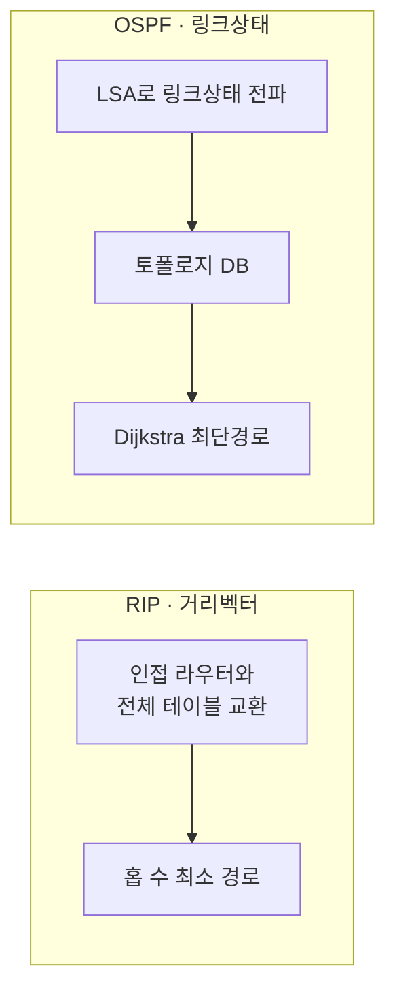

# RIP vs OSPF (라우팅 프로토콜 비교)

## 1. 개요

### 가. 정의
> **RIP**(Routing Information Protocol)은 홉 수 기준의 **거리벡터(Distance Vector)**, **OSPF**(Open Shortest Path First)는 링크 상태 기반 최단경로를 계산하는 **링크상태(Link State)** 방식의 대표적 IGP(내부 게이트웨이 프로토콜)이다.

### 나. 등장 배경
- RIP의 **확장성 한계(15홉)·느린 수렴** → OSPF로 대규모 네트워크 대응

## 2. 동작 방식

## 3. 비교표

| 구분 | RIP | OSPF |
|---|---|---|
| **알고리즘** | 거리벡터(Bellman-Ford) | 링크상태(Dijkstra/SPF) |
| **메트릭** | 홉 수(Hop Count) | 대역폭 기반 Cost |
| **최대 규모** | 15홉(16=무한) | 사실상 제한 없음(Area) |
| **수렴 속도** | 느림(주기적 전체 교환) | 빠름(변경 시 즉시 LSA) |
| **업데이트** | 30초 주기 전체 테이블 | 변경 시 이벤트 기반 |
| **대역폭 사용** | 비효율(브로드캐스트) | 효율(증분·멀티캐스트) |
| **적용 규모** | 소규모 | 중·대규모 |
| **루프 방지** | Split Horizon·Hold-down | Area 계층 구조 |

## 4. 루프 방지·안정화 기법

| 프로토콜 | 기법 |
|---|---|
| **RIP** | Split Horizon, Route Poisoning, Hold-down Timer, Triggered Update |
| **OSPF** | Area 계층(Backbone Area 0), DR/BDR로 LSA 최소화 |

## 5. 고려사항 및 시사점
- 소규모·단순 망은 RIP, 대규모·확장성 요구 시 OSPF 선택
- OSPF는 **Area 분할**로 확장성·안정성 확보(Backbone Area 0 중심)
- 대규모 ISP/AS 간에는 BGP(EGP)와 조합 운영

---

> **한 줄 요약**: RIP는 *홉 수 기반 거리벡터로 단순하나 15홉·느린 수렴*, OSPF는 *링크상태+Dijkstra로 빠른 수렴·확장성(Area)* 을 제공해 대규모 네트워크에 적합하다.
