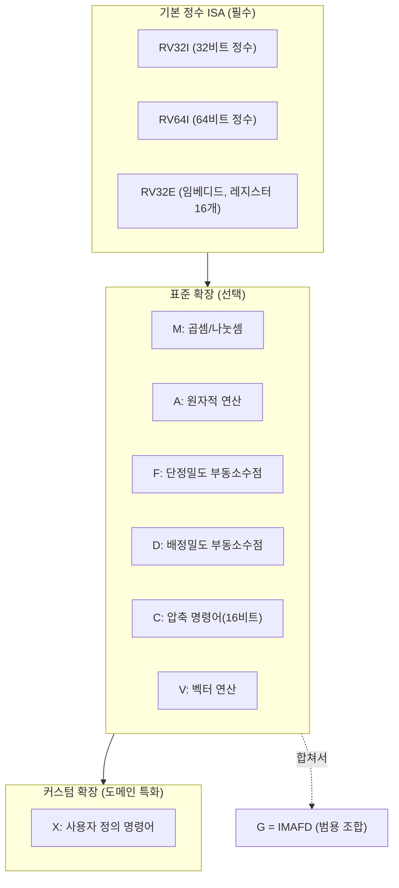
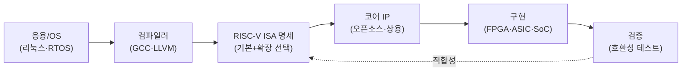

# RISC-V(개방형 명령어집합 아키텍처)

## 1. 개요

### 가. 정의
> **RISC-V**(리스크파이브)는 UC 버클리에서 시작되어 RISC-V International이 관리하는 **개방형(Royalty-free) 명령어집합 아키텍처(ISA, Instruction Set Architecture)** 로, 누구나 라이선스 비용 없이 프로세서를 설계·제조·판매할 수 있도록 표준화된 축소명령어집합(RISC) 기반 ISA다.

ISA는 소프트웨어와 하드웨어가 만나는 계약(Contract)이다. 컴파일러가 생성하는 기계어 명령의 종류·레지스터·주소지정 방식·예외 처리 규약을 규정하며, 이 계약이 안정적이어야 그 위에 컴파일러·운영체제·응용이 쌓인다. 문제는 지금까지 이 "계약서"가 x86(인텔·AMD)이나 Arm처럼 **특정 기업의 사유 자산**이었다는 점이다. 다른 기업이 호환 칩을 만들려면 막대한 라이선스료를 내거나 아예 접근이 불가능했다. RISC-V는 이 계약서 자체를 **공개 표준(오픈소스에 비유하면 '명세'가 오픈)** 으로 만들어, ISA를 특정 벤더가 아닌 공동체의 공유 자산으로 전환했다.

### 나. 등장 배경 및 필요성
RISC-V가 주목받는 배경에는 세 가지 흐름이 있다. 첫째, **라이선스 비용과 종속(Lock-in)의 부담**이다. Arm 코어를 쓰려면 아키텍처·코어 라이선스와 로열티가 필요하고, 설계 자유도도 제약된다. 스타트업·학계·특정 도메인 칩 개발자에게 이 진입장벽은 매우 높았다. 둘째, **도메인 특화 아키텍처(DSA, Domain-Specific Architecture)의 부상**이다. 무어의 법칙 둔화로 범용 CPU의 성능 향상이 한계에 이르자, AI·네트워킹·스토리지처럼 워크로드에 맞춘 맞춤형 가속기가 필요해졌는데, RISC-V는 기본 명령어에 **커스텀 명령어를 자유롭게 추가**할 수 있어 이 요구에 정확히 부합한다. 셋째, **기술 주권(Sovereignty)과 공급망 안정성**이다. 미·중 기술 갈등과 반도체 공급망 재편 속에서, 특정국·특정기업에 종속되지 않는 개방형 ISA는 국가·기업 차원의 전략적 대안으로 부상했다. 이러한 필요가 맞물려 RISC-V는 임베디드에서 데이터센터·자동차까지 빠르게 채택되고 있다.

## 2. 설계 철학과 아키텍처 구조

RISC-V의 핵심 설계 철학은 **작고 안정적인 기본 명령어집합(Base)** 위에 **선택적 확장(Extension)** 을 모듈처럼 얹는 것이다. 이는 "필요한 것만 골라 담는다"는 발상으로, 초소형 IoT 컨트롤러부터 서버급 프로세서까지 하나의 ISA 계열로 커버하게 한다.

기본 ISA는 정수 연산만 담은 **RV32I / RV64I**(각각 32·64비트)와, 레지스터 수를 줄인 초소형용 **RV32E** 로 나뉜다. 이 기본집합은 40여 개 명령으로 매우 작고, **한번 확정되면 영구히 고정(Frozen)** 되어 하위 호환을 보장한다. 여기에 **표준 확장**을 알파벳으로 붙인다. 곱셈·나눗셈(M), 원자적 연산(A), 부동소수점(F/D), 16비트 압축 명령(C) 등이며, 흔히 쓰는 조합인 IMAFD를 묶어 **G(General)** 로 표기한다. 예컨대 `RV64GC`는 "64비트 + 범용 + 압축"을 지원하는 프로세서를 뜻한다.

특히 중요한 것이 **커스텀 확장(X 확장)** 이다. 표준이 예약한 명령어 인코딩 공간을 활용해 설계자가 자신만의 명령을 추가할 수 있는데, 예를 들어 AI 추론 칩은 행렬곱 명령을, 암호 가속기는 AES 라운드 명령을 직접 정의해 성능·전력 효율을 크게 높인다. 이 확장성이 RISC-V를 단순한 "무료 Arm 대체재"가 아니라 **도메인 특화 컴퓨팅의 플랫폼**으로 만드는 핵심 차별점이다.

### 가. 특권 구조(Privileged Architecture)와 실행 모드
운영체제·하이퍼바이저가 동작하려면 ISA가 권한 계층을 규정해야 한다. RISC-V는 이를 별도의 **특권 아키텍처 명세**로 분리해 정의한다.

| 모드 | 약자 | 용도 |
|---|---|---|
| **Machine** | M | 최고 권한, 펌웨어·부트로더, 모든 구현 필수 |
| **Supervisor** | S | 운영체제 커널(리눅스 등), 가상메모리 관리 |
| **User** | U | 응용 프로그램 |
| **Hypervisor** | HS | 가상화 확장(H), 게스트 OS 운용 |

가장 단순한 마이크로컨트롤러는 **M 모드만** 두면 되고, 리눅스를 돌리는 응용프로세서는 M·S·U 세 모드를, 가상화가 필요한 서버는 여기에 H 확장을 더한다. 이처럼 필요한 특권 계층만 선택적으로 구현하는 구조가 RISC-V의 확장성 철학을 특권 영역에서도 관철한다. 부팅 시에는 M 모드의 펌웨어(OpenSBI 등)가 하드웨어를 초기화하고 상위 부트로더(U-Boot)·커널로 제어를 넘기는 **SBI(Supervisor Binary Interface)** 규약을 통해 OS 이식성을 확보한다.

## 3. 생태계와 개발 흐름

ISA만으로는 제품이 되지 않는다. 컴파일러·운영체제·검증도구·IP 코어가 함께 갖춰져야 실질적 생태계가 형성된다. RISC-V는 GCC·LLVM 컴파일러, 리눅스 커널, FreeRTOS/Zephyr 같은 RTOS를 이미 지원하며, 상용·오픈소스 코어 IP가 폭넓게 유통된다.

개발자는 목표 워크로드에 맞춰 **기본 + 필요한 확장 조합**을 고르고, 그에 맞는 코어 IP를 선택하거나 직접 설계한 뒤, FPGA로 검증하고 ASIC/SoC로 양산한다. 이때 서로 다른 확장 조합이 난립하면 소프트웨어 파편화가 생기므로, RISC-V International은 자주 쓰는 확장을 묶은 **프로파일(Profile, 예: RVA23)** 과 **플랫폼 규격**을 표준화해 "어느 리눅스 배포판이 어떤 RISC-V 칩에서든 동작"하도록 상호운용성을 보장한다. 대표적 오픈소스 코어로는 버클리의 Rocket·BOOM, 로우파워용 Ibex 등이 있으며, 상용에서는 SiFive·Andes 등이 IP를 공급한다.

## 4. 타 ISA와의 비교 및 적용 사례

RISC-V의 위치를 이해하려면 x86·Arm과의 차이를 **기술적 특성이 아니라 사업 모델의 차이**로 보는 것이 정확하다. x86은 인텔·AMD가 사실상 독점하는 CISC 계열로 PC·서버 시장에서 강력한 소프트웨어 자산을 갖지만 폐쇄적이다. Arm은 RISC 계열로 모바일을 장악했고 라이선스 사업으로 광범위한 생태계를 구축했으나, 여전히 로열티와 설계 제약이 따른다. RISC-V는 **ISA 자체가 무료·개방**이라는 점에서 근본적으로 다르며, 이것이 성숙도(소프트웨어·툴체인)의 열세를 감수하고서도 채택되는 이유다.

| 구분 | x86 | Arm | RISC-V |
|---|---|---|---|
| 계열 | CISC | RISC | RISC |
| 라이선스 | 폐쇄(사실상 독점) | 유료 라이선스·로열티 | **개방·무료** |
| 확장/커스텀 | 불가 | 제한적 | **자유(X 확장)** |
| 주 시장 | PC·서버 | 모바일·임베디드 | 임베디드→전 영역 확산 |
| 생태계 성숙도 | 매우 높음 | 높음 | 성장 중 |

실제 적용은 저전력 임베디드에서 먼저 확산되었다. 예컨대 대형 반도체 기업들이 SoC 내부의 **관리용 마이크로컨트롤러·스토리지 컨트롤러**를 RISC-V로 대체해 로열티를 절감했고, 웨스턴디지털은 자사 스토리지 제품에 자체 RISC-V 코어를 대량 적용하겠다고 밝힌 바 있다. AI 가속기 분야에서는 커스텀 벡터·행렬 명령을 얹은 RISC-V 제어 코어가 활용되며, 자동차·우주 등 신뢰성이 중요한 영역과 국가 주도 프로세서 개발 프로젝트에서도 채택이 늘고 있다. 다만 데스크톱·범용 서버처럼 **방대한 기존 소프트웨어 호환성**이 결정적인 시장에서는 아직 x86·Arm의 벽이 높아, 진입이 단계적으로 이루어지고 있다.

## 5. 심화: 최신 동향과 표준화 이슈

RISC-V의 최근 초점은 "임베디드용 틈새"에서 "응용프로세서·데이터센터급"으로 올라서기 위한 **표준 프로파일 정비**에 있다. 응용프로세서용 RVA22·RVA23 프로파일이 확정되며, 리눅스·안드로이드 등 상위 소프트웨어가 요구하는 확장(벡터 V, 가상화 H, 비트조작 B 등)을 필수로 묶어 파편화를 억제하고 있다. 또한 **벡터 확장(V)** 은 데이터 병렬 워크로드(AI 추론·미디어)에서 성능을 좌우하는 핵심으로, 길이 가변형(Vector-length agnostic) 설계를 채택해 동일 바이너리가 다양한 벡터 폭의 하드웨어에서 동작하도록 했다.

동시에 개방성에서 비롯되는 과제도 부각된다. **파편화(Fragmentation)** 위험은 확장을 자유롭게 조합할 수 있다는 장점의 이면으로, 프로파일·플랫폼 표준으로 제어하지 못하면 "같은 RISC-V인데 소프트웨어가 안 도는" 문제가 생긴다. 지정학적으로는 개방 ISA가 수출통제를 우회하는 통로가 될 수 있다는 우려와, 반대로 특정 진영에 종속되지 않는 중립 기반이라는 기대가 공존한다. 보안 측면에서는 커스텀 확장이 검증되지 않은 하드웨어 취약점을 유입시킬 수 있어, **신뢰실행환경(TEE)·물리적 공격 대응** 표준화가 진행 중이다.

## 6. 고려사항 및 시사점

기술사 관점에서 RISC-V 도입·전략 수립 시 다음을 종합적으로 판단해야 한다.

- **적용 전략(단계적 채택)**: 전면 전환보다 SoC 내부의 보조 코어·컨트롤러 등 **소프트웨어 호환성 부담이 적은 영역**부터 도입해 로열티를 절감하고 역량을 축적한 뒤, 응용프로세서·가속기로 확대하는 단계적 로드맵이 현실적이다.
- **트레이드오프(자유도 vs 성숙도)**: 확장·커스텀의 자유는 강력하지만, 툴체인·검증·소프트웨어 생태계의 성숙도는 x86·Arm에 아직 못 미친다. 개발·검증 비용과 절감되는 로열티·확보되는 차별화 가치를 정량 비교해 의사결정해야 한다.
- **파편화 관리**: 자체 커스텀 확장을 남발하면 소프트웨어 유지보수 비용이 급증한다. **표준 프로파일 준수**를 원칙으로 하고, 커스텀은 성능이 결정적인 핫스팟에 한정하는 거버넌스가 필요하다.
- **기술 주권·공급망 관점**: 개방 ISA는 특정 벤더 종속을 줄이는 전략적 수단이나, 실제 칩 제조는 여전히 파운드리·EDA·IP에 의존하므로 ISA 개방만으로 완전한 자립이 되지 않는다는 점을 냉정히 인식해야 한다.
- **전망**: 무어의 법칙 둔화와 도메인 특화 컴퓨팅 확산이라는 큰 흐름 위에서, RISC-V는 임베디드·AI 가속·자동차를 중심으로 채택이 가속될 전망이며, 프로파일 표준화가 진전될수록 응용프로세서·서버 영역으로의 확장도 본격화될 것으로 예상된다.

## 참고자료
- RISC-V International, "RISC-V Specifications", https://riscv.org/technical/specifications/
- RISC-V International, "RVA23 Profile", https://riscv.org/announcements/2024/10/risc-v-rva23-profile-is-now-ratified/

---
> **한 줄 요약**: RISC-V는 작고 고정된 기본 정수 ISA 위에 표준·커스텀 확장을 모듈처럼 얹는 개방형·무료 명령어집합으로, 라이선스 종속 탈피와 도메인 특화 컴퓨팅을 가능케 해 임베디드에서 AI·서버까지 확산되고 있는 전략적 아키텍처다.
