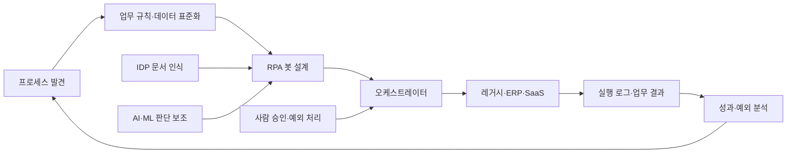
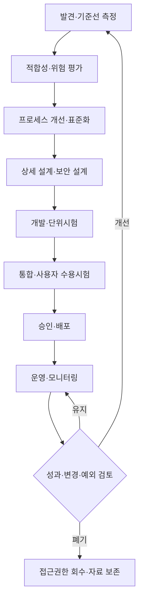

# RPA(로봇 프로세스 자동화)와 지능형 업무자동화(IPA)

## 1. 개요

### 가. 정의

> RPA(Robotic Process Automation)는 사람이 여러 업무 시스템의 화면·파일·API를 오가며 수행하던 반복 작업을 소프트웨어 로봇(bot)이 정해진 규칙에 따라 실행하도록 하는 자동화 방식이다.

> IPA(Intelligent Process Automation)는 RPA를 중심으로 프로세스 마이닝, IDP(Intelligent Document Processing), 인공지능·머신러닝, 자연어 처리와 오케스트레이션을 결합하여 인식·판단·실행·학습을 연결하는 업무자동화 체계이다.

RPA의 핵심은 사람을 흉내 내는 기술 자체가 아니라 업무 규칙을 실행 가능한 절차로 명시하고, 그 실행을 반복 가능하고 감사 가능한 형태로 만드는 데 있다.
따라서 화면의 좌표를 클릭하는 단순 매크로로만 이해하면 대상 업무가 바뀔 때 유지보수가 급격히 어려워진다.
업무의 입력, 규칙, 예외, 승인, 결과, 책임 주체를 먼저 정의한 뒤 로봇을 배치해야 한다.

RPA 봇은 일반적으로 애플리케이션의 사용자 인터페이스, 파일, 메일, 데이터베이스 또는 API를 통해 작업한다.
API가 안정적으로 제공되면 직접 연계가 화면 자동화보다 견고하지만, 오래된 레거시 시스템처럼 API가 없거나 변경이 어려운 경우에는 화면 자동화가 현실적인 보완 수단이 된다.
다만 화면 자동화는 레이아웃과 식별자 변경에 취약하므로 장기적인 목표는 표준 API와 이벤트 기반 연계로 이동해야 한다.

### 나. 등장 배경과 필요성

기업과 공공기관의 업무는 ERP, 그룹웨어, 전자결재, 고객관리, 세금·조달 시스템처럼 서로 다른 시스템에 분산되어 있다.
업무 담당자는 같은 고객번호와 금액을 여러 화면에 반복 입력하고, 첨부파일을 내려받아 이름을 바꾸고, 규칙에 맞지 않는 건을 다시 사람에게 전달한다.
이런 작업은 고부가가치 판단보다 대기·복사·검증에 시간을 쓰게 하며 입력 오류와 누락을 축적한다.

RPA는 기존 시스템을 즉시 교체하지 않고도 업무 흐름의 일부를 자동화한다는 점에서 레거시 현대화의 중간 전략이 될 수 있다.
그러나 자동화는 나쁜 프로세스를 빠르게 반복하는 위험도 갖는다.
수작업의 불필요한 승인, 중복 입력, 모호한 책임이 그대로 남으면 봇 수만 늘고 전체 처리 품질은 개선되지 않는다.
그러므로 프로세스 개선, 데이터 표준화, 시스템 연계라는 선행 과제와 RPA를 함께 설계해야 한다.

### 다. 목표와 기대효과

첫째, 반복 입력을 줄여 처리시간과 운영비를 낮춘다.
둘째, 동일한 규칙을 일관되게 적용하여 누락과 단순 입력 오류를 줄인다.
셋째, 모든 실행·예외·승인을 로그로 남겨 감사성과 추적성을 높인다.
넷째, 직원이 복사·대조 업무에서 벗어나 고객 응대와 예외 판단에 집중하도록 한다.
다섯째, 자동화 후보를 데이터로 발굴하고 성과를 지속적으로 측정하는 운영 체계를 만든다.

효과는 단순히 봇의 처리 건수로 평가해서는 안 된다.
실제 기준선은 사람이 걸리는 시간, 대기시간, 재작업률, 오류율, 예외율, 고객 영향, 통제 비용을 함께 측정해야 한다.
예를 들어 월 10,000건을 처리하는 업무에서 건당 4분이 줄어도 예외 검토가 새로 1분 발생한다면 순절감 시간은 4분이 아니다.
자동화 전후의 전체 가치사슬을 비교해야 투자 판단이 왜곡되지 않는다.

## 2. 핵심 개념과 범위

### 가. RPA의 구성요소

RPA는 개발 도구만으로 완성되지 않는다.
업무를 발견하고 설계하는 분석 영역, 봇 패키지를 만드는 개발 영역, 실행을 배분하는 제어 영역, 비밀정보와 권한을 관리하는 통제 영역이 함께 필요하다.

| 구성요소 | 주요 역할 | 기술사 관점의 관리 포인트 |
|---|---|---|
| 봇 개발 도구 | 작업 순서·조건·예외를 워크플로로 구현 | 재사용 컴포넌트, 형상관리, 코드 리뷰 |
| 실행 로봇 | attended 또는 unattended 방식으로 업무 수행 | 격리, 용량, 동시성, 장애 복구 |
| 오케스트레이터 | 배포·스케줄·큐·상태·권한을 중앙 관리 | 단일 장애점, 감사로그, 역할분리 |
| 자격증명 보관소 | 계정·토큰·인증서의 안전한 저장과 주입 | 하드코딩 금지, 회전, 최소권한 |
| 프로세스·업무 큐 | 건별 입력, 우선순위, 재시도, 수동 이관 관리 | 중복처리 방지, 멱등성, SLA |
| 모니터링 | 성공·실패·지연·예외와 자원 관찰 | 알림 기준, 원인 분석, KPI 연계 |

봇 개발 도구는 업무 규칙을 읽기 쉬운 흐름으로 표현하지만, 시각적이라는 이유만으로 품질이 보장되는 것은 아니다.
조건의 우선순위, 데이터 형식, 타임아웃, 재시도 횟수, 예외의 책임자를 명시해야 운영자가 의도를 재현할 수 있다.
실행 로봇은 사용자의 권한을 대신 행사하므로 일반 서버와 동일하게 패치·백업·접근통제를 적용해야 한다.

오케스트레이터는 중앙 제어실에 해당한다.
여기서 로봇의 예약 실행과 버전 배포, 작업 큐 분배, 실행 결과와 감사기록을 관리한다.
중앙화는 통제성과 가시성을 높이지만, 오케스트레이터 장애가 다수 봇의 실행을 막을 수 있으므로 이중화와 복구 절차를 설계해야 한다.

### 나. RPA와 IPA의 개념도

위 구조에서 프로세스 발견은 자동화할 일을 정하는 단계이고, 봇 설계는 발견된 업무를 통제 가능한 실행 단위로 바꾸는 단계이다.
실행 결과가 다시 발견·분석으로 돌아가야 자동화가 일회성 개발이 아니라 개선 순환이 된다.
IDP는 PDF·이미지·메일에서 구조화된 값을 추출하고, AI·ML은 분류나 예측을 보조한다.
그러나 모델의 확률적 결과를 곧바로 확정 처리로 사용하면 오류가 전파되므로 신뢰도 임계값과 사람 검토 경로가 필요하다.

### 다. RPA, IPA, BPM, API 연계의 구분

RPA는 기존 애플리케이션 위에서 사람의 상호작용을 소프트웨어로 대체하는 전술적 자동화에 가깝다.
BPM은 업무 규칙·조직·승인·상태를 프로세스 모델로 관리하는 운영 프레임이며, RPA는 그 일부 작업을 수행하는 실행 수단이 될 수 있다.
API 연계는 시스템이 제공하는 계약을 통해 데이터를 교환하므로 화면 변화에 덜 민감하고 장기 유지성이 높다.
IPA는 이러한 자동화 수단에 문서 이해와 AI 판단 보조를 결합한 상위 개념으로 설명할 수 있다.

| 구분 | RPA | BPM/워크플로 | API·서비스 연계 | IPA |
|---|---|---|---|---|
| 주된 대상 | 반복적인 태스크 | 전체 프로세스와 승인 | 시스템 간 데이터·기능 | 인식·판단·실행이 섞인 업무 |
| 판단 방식 | 명시 규칙 | 모델화된 규칙·상태 | 서비스 계약 | 규칙 + AI 보조 + 사람 판단 |
| 강점 | 빠른 도입, 레거시 대응 | 책임과 흐름의 표준화 | 견고성·성능·재사용성 | 비정형 입력과 복합 업무 대응 |
| 주요 한계 | 화면 변경·예외 증가 | 구축 범위와 변경 비용 | API 개발 선행 필요 | 설명가능성·편향·검증 부담 |

차이는 우열이 아니라 문제의 경계에서 생긴다.
화면 기반으로 여러 시스템을 연결해야 하고 업무 규칙이 안정적이면 RPA가 빠른 해법이다.
반대로 대량·고빈도 거래를 장기간 운영하고 시스템을 통제할 수 있다면 API 연계가 더 적합하다.
업무 전체의 승인과 책임을 바꾸려면 BPM을 중심에 두고 RPA를 주변 어댑터로 배치하는 편이 안전하다.

## 3. 자동화 대상 선정과 생명주기

### 가. 후보 발굴과 우선순위화

자동화 후보는 현업 인터뷰만으로 정하지 않고 프로세스 로그, 처리량, 업무시간, 오류·반려 기록을 함께 분석한다.
프로세스 마이닝은 실제 이벤트의 순서와 변형 경로를 보여 주어 문서상의 표준 절차와 실제 절차의 차이를 드러낸다.
태스크 마이닝은 개인의 화면 조작을 관찰할 수 있지만, 개인정보와 감시 오해를 줄이기 위한 목적·보관·접근 정책을 먼저 마련해야 한다.

좋은 초기 후보는 처리량이 많고 규칙이 명확하며 입력 형태가 안정적이고 예외가 적다.
반대로 사람의 협상, 창의적 판단, 조직 정책의 해석이 핵심인 업무는 완전 자동화보다 의사결정 지원을 우선 검토한다.
업무가 월말에만 몰리고 원천 데이터가 부정확하다면 봇 개발보다 데이터 품질과 일정 평준화가 먼저다.

우선순위는 기대 편익, 구현 난이도, 변화 위험, 규제 민감도, 재사용성을 점수화하여 결정한다.
예를 들어 편익 40%, 기술 용이성 25%, 통제 가능성 20%, 전략 적합성 15%로 가중치를 두고 5점 척도로 평가할 수 있다.
가중치는 조직의 목표에 따라 바뀌므로 절대적인 공식이 아니라 합의 가능한 의사결정 기록으로 활용해야 한다.

### 나. 자동화 생명주기

발견 단계에서는 현행 처리량과 성공·실패·예외 기준선을 기록한다.
설계 단계에서는 정상 흐름보다 예외 흐름을 먼저 그려야 한다.
입력 파일이 없거나 중복이면 어떻게 할지, 시스템이 느리거나 인증이 만료되면 어디까지 재시도할지, 사람이 언제 개입할지를 설계한다.

개발과 시험에서는 정상 데이터만 쓰지 말고 경계값, 인코딩 오류, 권한 부족, 중복 이벤트, 부분 성공을 재현한다.
운영 배포 전에는 업무 소유자와 보안·감사 담당자가 결과와 통제 증적을 확인해야 한다.
운영 중에는 단순 성공률뿐 아니라 예외 큐의 체류시간과 수동 전환율을 관리하고, 원천 시스템 변경이 감지되면 영향 분석을 수행한다.

### 다. 운영 모델과 책임

기업형 운영은 중앙 CoE(Center of Excellence)와 현업·IT의 연합 모델이 일반적이다.
CoE는 플랫폼 표준, 재사용 자산, 보안 기준, 개발 방법론과 교육을 관리한다.
현업은 프로세스의 목적과 예외 규칙을 소유하고, IT는 인프라·연계·배포·장애 대응을 담당한다.
감사·보안 조직은 위험 등급에 따른 승인과 로그 보존 기준을 제시한다.

RACI를 명확히 하지 않으면 봇이 실패했을 때 업무 담당자와 플랫폼 운영자가 서로 책임을 미룬다.
프로세스 소유자는 결과의 업무적 정확성을 책임지고, 봇 소유자는 자동화 로직과 변경 이력을 책임진다.
플랫폼 운영자는 실행 환경과 용량을 책임지며, 보안 담당자는 계정·권한·비밀정보·감사통제를 검증한다.

## 4. 기술 아키텍처와 구현 원리

### 가. 실행 방식

Attended RPA는 사용자가 작업을 시작하거나 승인하는 시점에 보조적으로 실행된다.
상담원이 고객 정보를 여러 화면에 입력할 때 조회·복사·검증을 맡기는 방식이 대표적이며, 사람이 실시간으로 예외를 판단한다.
이 방식은 통제가 쉬운 대신 사용자의 세션과 단말 상태에 영향을 받고 처리량 확장에 한계가 있다.

Unattended RPA는 중앙 스케줄러가 가상머신이나 컨테이너형 실행 환경에 봇을 배정한다.
대량 배치, 야간 대사, 정기 보고서 생성처럼 업무 규칙이 안정되고 사람의 즉시 개입이 적은 대상에 적합하다.
반면 권한이 큰 봇 계정이 여러 시스템을 자동으로 조작하므로 비밀정보·네트워크·실행 이미지의 격리가 필수다.

### 나. 데이터와 예외 처리

업무 큐의 각 항목에는 고유한 업무키, 입력 시각, 우선순위, 현재 상태, 재시도 횟수, 결과 코드가 있어야 한다.
고유키가 없으면 네트워크 재전송이나 스케줄러 재실행 때 동일 거래를 두 번 처리할 수 있다.
따라서 처리 단계는 가능하면 멱등적으로 만들고, 외부 시스템에 기록하기 전후의 상태를 저장해야 한다.

예외는 시스템 예외와 업무 예외로 나눈다.
연결 끊김·타임아웃·파일 잠금은 일정 횟수의 지수 백오프 재시도로 회복할 수 있지만, 금액 불일치·자격 요건 미충족은 반복해도 해결되지 않으므로 사람 검토 큐로 보낸다.
모든 예외를 재시도하면 장애를 증폭시키고 업무 큐를 막으므로 오류 분류와 격리 기준이 필요하다.

로그에는 입력·결정·출력의 흐름을 남기되 주민등록번호, 계좌번호, 건강정보 같은 민감정보를 그대로 남기지 않는다.
로그 상관관계 ID로 한 건의 처리 흐름을 추적하고, 원문 대신 마스킹·해시·토큰화 값을 사용한다.
보존기간과 열람권한도 업무 목적과 법적 요구에 맞게 제한한다.

### 다. 보안 통제

봇은 사람이 아니어도 조직 자산에 접근하는 비인간 주체다.
봇마다 고유 계정을 부여하고 공유 계정 사용을 피하며, 필요한 애플리케이션과 기능만 최소권한으로 허용한다.
자격증명은 코드·설정파일·로그에 저장하지 않고 전용 보관소에서 실행 시 주입하며, 퇴직·업무변경·사고 시 즉시 회수할 수 있어야 한다.

개발·시험·운영 환경을 분리하고 운영 데이터의 무단 복제를 금지한다.
봇 패키지에는 승인된 버전과 해시를 부여하고, 배포자는 개발자와 분리하여 변경 이중통제를 적용한다.
실행 이미지와 의존 라이브러리는 패치 상태를 점검하며, 외부 파일을 처리하는 봇은 악성 파일·매크로·압축폭탄에 대한 제한을 둔다.

AI가 포함된 IPA에서는 별도 위험이 발생한다.
문서 분류나 추출 결과가 틀릴 수 있고, 프롬프트·모델·학습 데이터 변경이 결과를 바꿀 수 있다.
모델 버전, 입력 출처, 신뢰도, 사람 승인 여부를 기록하고 낮은 신뢰도의 결과는 자동 확정하지 않는 인간-검토-내재화(HITL) 정책을 둔다.

## 5. 비교와 적용 사례

### 가. 화면 자동화와 API 자동화의 비교

화면 자동화는 레거시를 빠르게 연결하는 장점이 있다.
예를 들어 외부 공급업체의 오래된 클라이언트에 API가 없을 때 봇이 화면을 조작하면 시스템 교체를 기다리지 않고 업무를 개선할 수 있다.
그러나 버튼 위치와 팝업 문구가 바뀌면 실패할 수 있어 변경관리와 회귀시험 비용이 생긴다.

API 자동화는 계약된 필드와 오류 코드를 사용하므로 대량 처리와 재시도, 관찰성이 우수하다.
대신 API 개발·승인·버전관리라는 선행 투자가 필요하고, 내부 시스템을 변경할 권한이 없으면 단기간에 적용하기 어렵다.
따라서 단기에는 RPA로 병목을 완화하고, 장기에는 사용량과 장애 데이터를 근거로 API 연계로 전환하는 단계적 전략이 합리적이다.

### 나. 사례 1: 구매 청구서 대사

가상의 제조기업 A사는 매월 12,000건의 청구서를 접수하고 담당자가 PDF에서 금액을 읽어 ERP와 구매계약을 대조한다고 가정한다.
기존에는 건당 평균 5분이 걸려 총 1,000시간이 필요했고, 금액 불일치나 누락 건은 약 8%였다.
이 수치는 실제 기업 통계가 아니라 자동화 타당성 평가를 설명하기 위한 가정이다.

IPA는 메일 첨부파일을 수집하고 IDP로 공급업체·계약번호·금액을 추출한 뒤, RPA가 ERP와 계약 데이터를 조회하도록 설계한다.
신뢰도 98% 이상이고 금액이 계약 허용범위 안이면 자동 대사하고, 그 밖의 건은 원문과 근거 필드를 포함해 담당자 큐로 보낸다.
처리 전 파일 해시와 업무키를 저장하면 동일 문서의 중복 처리를 막을 수 있다.

가정상 자동 확정 80%가 건당 1분, 나머지 20%가 사람 검토로 건당 6분이면 총 소요시간은 12,000×0.8×1분 + 12,000×0.2×6분인 2,400분이다.
기준선 60,000분과 비교하면 순수 처리시간은 57,600분 줄지만, IDP 라이선스·운영·예외 검토 비용을 함께 차감해야 순편익이 된다.
성과지표는 시간 절감뿐 아니라 대사 정확도, 예외 큐의 평균 체류시간, 중복 방지율, 감사 증적 완전성으로 구성한다.

### 다. 사례 2: 공공 민원 접수 보조

가상의 공공기관 B는 하루 2,000건의 민원 이메일을 주제별 부서로 배분한다고 가정한다.
분류 모델은 제목·본문·첨부 유형을 이용해 후보 부서를 제시하고, RPA가 민원관리시스템에 접수번호와 메타데이터를 등록한다.
민감정보가 포함되거나 분류 신뢰도가 임계값 미만이면 자동 배분을 멈추고 담당자 확인을 요구한다.

이 사례의 핵심은 자동 처리율을 최대화하는 것이 아니다.
잘못된 부서로 배분하면 법정 처리기한과 시민의 권리 행사에 영향을 줄 수 있으므로, 설명 가능한 분류 근거와 이의 수정 경로를 보장해야 한다.
모델 업데이트 후에는 과거 표본으로 재현시험하고, 부서별 오분류율이 특정 유형에 편중되는지 점검한다.

RPA는 접수 화면 입력과 알림 전송을 담당하고, AI는 분류 후보를 생성하며, 사람은 권리·책임에 영향을 주는 예외를 승인한다.
이렇게 역할을 분리하면 자동화의 속도와 행정적 책임을 동시에 관리할 수 있다.

## 6. 심화: 엔터프라이즈 자동화의 거버넌스와 발전 방향

미국 GSA의 RPA 보안 절차는 봇을 네트워크와 대상 애플리케이션에 접근하는 일반 사용자처럼 다루고, attended와 unattended 실행 환경을 구분한다.
또한 AI·ML을 사용하는 봇은 별도 승인과 보안통제 검토가 필요하다는 방향을 제시한다.
이는 봇을 단순한 매크로가 아니라 권한을 가진 운영 주체로 보고 수명주기 통제를 적용해야 한다는 실무적 시사점을 준다.

GSA·Digital.gov의 RPA 자료는 프로그램 도입에서 명확한 계획, 협업, 프로세스 개선, 균형 잡힌 거버넌스와 목적에 맞는 기술 선택을 강조한다.
따라서 자동화 CoE는 도구 교육만 제공할 것이 아니라 후보 발굴, 위험 등급, 예외 설계, 성과 검증을 표준화해야 한다.

RPA의 발전은 단순 화면 조작의 확장이 아니라 프로세스 지능화로 이동한다.
프로세스 마이닝이 실제 흐름을 발견하고, IDP가 비정형 문서를 구조화하며, AI가 분류·예측을 보조하고, RPA 또는 API가 결과를 실행한다.
이 과정에서 모델과 규칙의 경계를 명확히 하지 않으면 책임 소재와 검증 방법이 모호해진다.

향후에는 이벤트 기반 연계와 API가 주 실행 경로가 되고 RPA는 레거시 접점과 사람 보조에 집중하는 하이브리드 구조가 바람직하다.
자동화 후보를 만들 때부터 API 전환 가능성, 데이터 표준화 수준, 시스템 변경 영향도를 함께 기록하면 임시 자동화가 구조적 기술부채로 굳는 것을 막을 수 있다.

## 7. 고려사항 및 시사점

### 가. 프로세스 재설계 우선

현재 절차를 그대로 봇으로 복제하기 전에 불필요한 승인과 중복 입력을 제거한다.
개선된 표준 프로세스와 예외 정의가 있어야 자동화 로직이 안정된다.

### 나. 보안·개인정보 보호

봇 계정은 최소권한·고유 식별·주기적 회수 원칙으로 관리한다.
민감정보는 처리 목적과 보존기간을 제한하고 로그·스크린샷·학습 데이터에서 마스킹한다.

### 다. 신뢰성과 복구

타임아웃·중복·부분 성공을 가정해 멱등성, 재시도, 보상 처리, 수동 전환을 설계한다.
오케스트레이터와 실행 환경의 장애 시 RTO·RPO, 큐 보존, 재처리 순서를 시험해야 한다.

### 라. AI 결합의 통제

모델 신뢰도와 오류 유형을 측정하고, 법적·재무적 영향을 갖는 결정에는 사람 승인을 둔다.
모델·프롬프트·데이터셋·규칙의 버전을 기록하여 결과가 왜 바뀌었는지 설명할 수 있어야 한다.

### 마. 운영성과와 경제성

자동화율만 목표로 삼지 말고 순 처리시간, 예외율, 재작업률, 품질, 사용자 만족, 통제 비용을 함께 본다.
파일럿 종료 기준과 폐기 기준을 미리 정하여 성과가 없는 봇이 계속 유지되지 않도록 한다.

### 바. 표준화와 기술부채

재사용 가능한 커넥터, 명명규칙, 오류코드, 로그 스키마, 테스트 데이터와 배포 파이프라인을 표준화한다.
화면 의존 봇은 API·이벤트·업무 서비스로 전환할 후보와 기한을 관리하여 자동화 포트폴리오의 장기 건전성을 확보한다.

### 사. 변화관리와 사람 중심 설계

봇 도입은 인력 감축만이 아니라 역할 재설계와 통제 책임의 변화다.
현업을 설계·검증·예외 처리에 참여시키고, 자동화 실패를 숨기지 않는 운영 문화를 만들어야 지속 가능한 성과가 나온다.

## 참고자료

- U.S. General Services Administration, *IT Security Procedural Guide: Robotic Process Automation (RPA)*: https://www.gsa.gov/system/files/Robotic-Process-Automation-%28RPA%29-Security-%5BCIO-IT-Security-19-97-Rev-3%5D-02-14-2023.pdf
- Digital.gov / GSA, *Guide to robotic process automation*: https://digitalgovernmenthub.org/library/guide-to-robotic-process-automation/
- IEEE, *IEEE Std 2755-2017 Guide for Terms and Concepts in Intelligent Process Automation*: https://standards.ieee.org/standard/2755-2017.html
- ACT-IAC, *RPA Product Survey Report*: https://www.actiac.org/system/files/RPA%20Product%20Survey%20Report_1.pdf

---

> **한 줄 요약**: RPA는 반복 업무를 실행하는 로봇이고, IPA는 프로세스 발견·문서 이해·AI 판단·사람 승인·자동 실행을 거버넌스와 함께 연결하는 업무 혁신 체계다.
